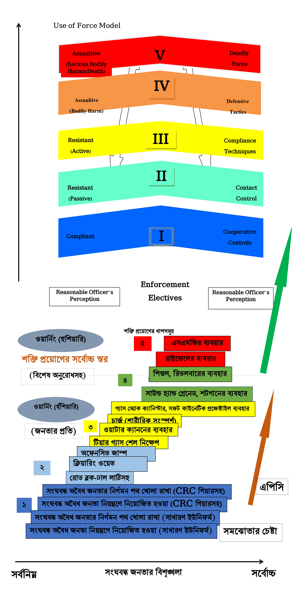
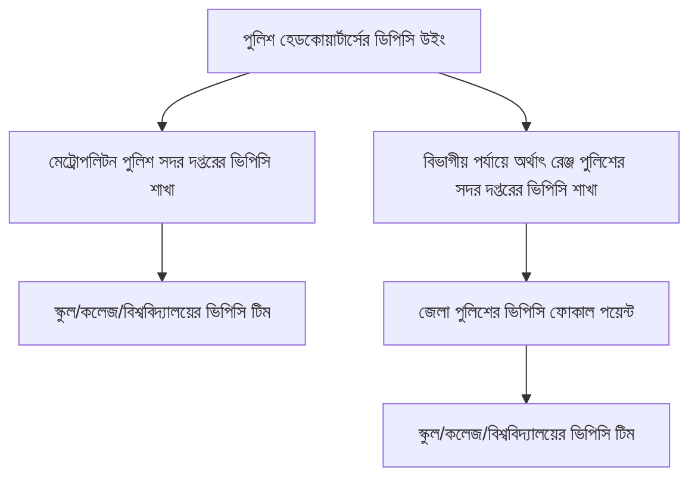
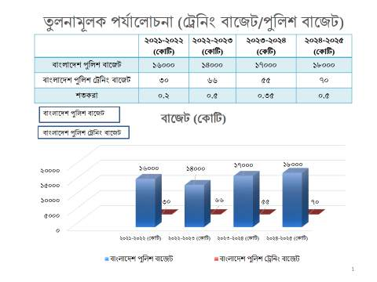

<!-- FRONT MATTER 1 -->
<section data-page="i">
Date ০৫/০৮/২০২৪
<blockquote>
<!-- line 1 -->মা, মিছিলে যাচ্ছি। আমি নিজেকে আর আটকিয়ে  
<!-- line 2 -->রাখতে পারলাম না। সরি আব্বুজান। তোমার কথা অমান্য  
<!-- line 3 -->কোরে বের হোলাম। স্বার্থপরের মতো ঘরে বোসে থাকতে  
<!-- line 4 -->পারলাম না। আমাদের ভাই রা আমাদের ভবিষ্যৎ প্রজন্মের  
<!-- line 5 -->জন্য কাফনের কাপড় মাথায় বেধে রাজপথে নেমে সংগ্রাম  
<!-- line 6 -->কোরে যাচ্ছে। অকাতরে নিজেদের জীবন বিষর্জন দিচ্ছে। একটি  
<!-- line 7 -->প্রতিবন্ধি কিশোর, ৭ বছরের বাচ্চা, ল্যাংরা মানুষ যদি সংগ্রামে  
<!-- line 8 -->নামতে পারে, তাহলে আমি কেনো বোসে থাকবো ঘড়ে। একদিন  
<!-- line 9 -->তো মরতে হবেই। তাই মৃত্যুর ভয় কোরে স্বার্থপরের মতো ঘরে  
<!-- line 10 -->বোসে না থেকে সংগ্রামে নেমে গুলি খেয়ে বীরের মতো মৃত্যুও  
<!-- line 11 -->অধিক শ্রেষ্ঠ। যে অন্যের জন্য নিজের জীবনকে বিলিয়ে দেয়  
<!-- line 12 -->সেই প্রকৃত মানুষ। আমি যদি বেচে না ফিরি তবে কষ্ট না  
<!-- line 13 --> পেয়ে গর্বিত হয়ো। জীবনের প্রতিটি ভুলের জন্য ক্ষমা চাই।   
 
<!-- line 14 --> <u>আনাস</u>
</blockquote>
</section>

<!-- FRONT MATTER 2 -->
<section data-page="ii">

</section>

<!-- FRONT MATTER 3 -->
<section data-page="iii">

# উৎসর্গ
চল্লিশের জুলাই-আগস্টের গণঅভ্যুত্থানে প্রাণ উৎসর্গকারী জুলাই শহীদ আনাসসহ অন্যান্য জুলাই শহীদ ও অসম সাহসী জুলাই যোদ্ধাদের উদ্দেশ্যে এই প্রতিবেদনটি আমরা উৎসর্গ করছি।

   

* পূর্বের পৃষ্ঠার চিঠিটি চব্বিশের জুলাই-আগস্টের গণঅভ্যুত্থানে নিহত শহীদ আনাসের মায়ের কাছে লেখা শেষ চিঠি।
</section>

<!-- FRONT MATTER 4 -->
<section data-page="iv">

**প্রকাশক** 
মুদ্রণ ও প্রকাশনা অধিদপ্তর

**প্রচ্ছদ** 
চব্বিশের জুলাই-আগস্টের গণঅভ্যুত্থানে ব্যবহৃত গ্রাফিতি চিত্র আলোকে

**বাঁধাই** 
মুদ্রণ ও প্রকাশনা অধিদপ্তর

**মুদ্রণ** 
মুদ্রণ ও প্রকাশনা অধিদপ্তর
</section>

<!-- FRONT MATTER 5 -->
<section data-page="v">

# মাননীয় প্রধান উপদেষ্টার শুভেচ্ছা বার্তা

<!-- line 1 -->২০২৪ সালের জুলাই-আগস্টের ছাত্রজনতার গণঅভ্যুত্থানের মধ্য দিয়ে বাংলাদেশের মানুষ একটি 
<!-- line 2 -->ফ্যাসিবাদী শাসনের অবসান ঘটিয়েছে। এই আন্দোলন সাফল্য লাভ করেছে এক অভূতপূর্ব জাতীয় ঐক্য 
<!-- line 3 -->গড়ে ওঠার মাধ্যমে। এই অভ্যুথানের একটি অন্যতম লক্ষ্য হচ্ছে দেশে এমন এক শাসন ব্যবস্থা গড়ে 
<!-- line 4 -->তোলা যেখানে সকলের অধিকার সুনিশ্চিত হবে, কোনও ব্যক্তি বা দল দেশের মানুষের জীবন ও দেশের 
<!-- line 5 -->সম্পদ নিয়ে ছিনিমিনি খেলতে পারবেনা, সকলের ভোট দেবার অধিকার আর কোনও দিন লুণ্ঠিত হবে 
<!-- line 6 -->না এবং নাগরিকদের সম্মতিতে দেশ পরিচালিত হবে। দেশ পরিচালনার এই পদ্ধতি তৈরি করতে হলে 
<!-- line 7 -->দরকার বিদ্যমান শাসন ব্যবস্থা এবং রাষ্ট্রীয় প্রতিষ্ঠানগুলোর সংস্কার।

<!-- line 8 -->জুলাই ২০২৪-এর গণঅভ্যুত্থানের বীর শহীদরা, যারা আহত হয়েছেন তাঁরা তাঁদের আত্মদানের মধ্য 
<!-- line 9 -->দিয়ে এই সংস্কারের দায়িত্ব আমাদের সকলের ওপরে অর্পণ করেছেন। সেই লক্ষ্য বাস্তবায়নের জন্যে 
<!-- line 10 -->১১টি সংস্কার কমিশন গঠন করা হয়েছে। এইসব কমিশনের সদস্যরা নিরলস পরিশ্রম করে সংস্কারের 
<!-- line 11 -->সুনির্দিষ্ট সুপারিশ করছেন। কমিশনগুলোর এইসব প্রতিবেদন মূল্যবান সম্পদ। এই সম্পদ বাংলাদেশের 
<!-- line 12 -->ইতিহাসে রক্ষিত হবে। এখান থেকে আমরা তাৎক্ষণিকভাবে কতটুকু গ্রহণ করবো, কোনটা কখন কাজে 
<!-- line 13 -->লাগাতে পারব, কীভাবে অগ্রসর হবো তা নির্ধারণের জন্যে দরকার দেশের সব মানুষের মধ্যে আলাপ-
<!-- line 14 -->আলোচনা। সে আলোচনাকে এগিয়ে নিয়ে যাওয়ার উদ্দেশ্যে প্রথম পর্যায়ে গঠিত সংবিধান, নির্বাচন 
<!-- line 15 -->ব্যবস্থা, দুর্নীতি দমন কমিশন, বিচার বিভাগ, জনপ্রশাসন এবং পুলিশের সংস্কার বিষয়ক কমিশনগুলোর 
<!-- line 16 -->প্রতিবেদনসমূহ প্রকাশ করা হল।

<!-- line 17 -->জুলাই অভ্যুত্থানে যারা আত্মাহুতি দিয়েছেন, তাঁদের স্বপ্ন ছিল একটা নতুন বাংলাদেশ গড়ে তোলা। এ-
<!-- line 18 -->দায়িত্ব পালনের প্রথম পদক্ষেপ হিসেবে এই সুপারিশমালা প্রস্তুত করা হয়েছে। এর বাস্তবায়নের মাধ্যমে 
<!-- line 19 -->নতুন বাংলাদেশ গড়ে উঠবে। এখন কর্মপরিকল্পনা প্রস্তুত করা এবং তা বাস্তবায়নের পথে অগ্রসর হতে 
<!-- line 20 -->হবে। আমাদের এই বাস্তবায়ন প্রক্রিয়া দ্রুত হোক এবং মসৃণ হোক এই কামনা করে এই সুপারিশমালা 
<!-- line 21 -->দেশবাসীর নিকট তুলে দিলাম। 

<b>প্রফেসর মুহাম্মদ ইউনূস</b> 
প্রধান উপদেষ্টা 
গণপ্রজাতন্ত্রী বাংলাদেশ সরকার
</section>

<!-- FRONT MATTER 6 -->
<section data-page="vi">

</section>

<!-- FRONT MATTER 7 -->
<section data-page="vii">

# মাননীয় কমিশন প্রধানের বাণী

গণতান্ত্রিক সমাজে পুলিশের ভূমিকা অত্যন্ত তাৎপর্যপূর্ণ। জনগণের নিরাপত্তা, আইন-শৃঙ্খলা রক্ষা এবং অপরাধ দমন পুলিশের অন্যতম প্রধান দায়িত্ব। একটি দক্ষ, জনবান্ধব এবং আধুনিক পুলিশ বাহিনী যে কোনো সমাজের অপরিহার্য অংশ। তবে, সাম্প্রতিক ২০২৪ সালের জুলাই-আগষ্টের গণঅভ্যুত্থানে অসংখ্য ছাত্র-জনতা ও পুলিশ হতাহত হওয়ায়  পুলিশের কর্মদক্ষতা এবং কার্যক্রম নিয়ে জনমনে নানা প্রশ্ন দেখা দিয়েছে। জনগণের মধ্যে পুলিশ সম্পর্কে একটি নেতিবাচক ধারণা তৈরি হয়েছে, যা অত্যন্ত উদ্বেগজনক। এই পরিস্থিতিতে, পুলিশ বাহিনীকে আধুনিক, জনমুখী এবং কার্যকর করে তোলার লক্ষ্যে একটি সংস্কার কমিশন গঠন করা হয়েছে।
৫ আগস্টের ছাত্র জনতার গণ বিপ্লব বাংলাদেশের ইতিহাসে একটি গুরুত্বপূর্ণ মাইলফলক। এই বিপ্লবের মধ্য দিয়ে জনগণের মধ্যে যে গভীর আকাঙ্ক্ষা তৈরি হয়েছে, তা একটি নতুন বাংলাদেশের স্বপ্ন দেখিয়েছে। এই গণ বিপ্লবের মূল চেতনা ছিল একটি ন্যায় ও সংবেদনশীল সমাজ প্রতিষ্ঠা করা, যেখানে প্রতিটি নাগরিকের অধিকার সুরক্ষিত থাকবে এবং আইনের শাসন প্রতিষ্ঠিত হবে। এই প্রেক্ষাপটে, পুলিশ সংস্কার কমিশনকে একটি অত্যন্ত গুরুত্বপূর্ণ দায়িত্ব দেওয়া হয়েছে।

অন্তবর্তীকালীন সরকারের অন্যতম সংস্কার উদ্যোগ হলো ‘পুলিশ সংস্কার কমিশন’ গঠন। অক্টোবর ২০২৪ থেকে নিরবিচ্ছিন্নভাবে ১৫ই জানুয়ারি ২০২৫ পর্যন্ত কমিশনের ১১ (এগার) জন সদস্য লিটারেচার রিভিউ, অংশীজনদের সাথে সরেজমিনে ও কমিশন কার্যালয়ে মতবিনিময়, জনমত জরীপে প্রাপ্ত তথ্য পর্যালোচনা এবং অন্যান্য সংস্কার কমিশনের সাথে সমন্বয় করে বিবেচ্য প্রতিবেদন ও সুপারিশ প্রণয়ন করেছেন। ভবিষ্যতে সিদ্ধান্ত গ্রহণে সহায়ক হতে পারে এমন সহায়ক তথ্যাদি পরিশিষ্ট আকারে এতদসংগে সংযুক্ত করা হয়েছে। 

কমিশনের কাজে স্বরাষ্ট্র মন্ত্রণালয় ও পুলিশ সদর দপ্তরকে  সার্বিক সহযোগিতার জন্য ধন্যবাদ ও কৃতজ্ঞতা জানাচ্ছি। এ কমিশনের চারজন কমিশন সদস্য নিজ দায়িত্বের অতিরিক্ত হিসেবে তাদের মূল্যবান সময় দিয়েছেন এবং গুরুত্বপূর্ণ অবদান রেখেছেন। তাদের সহ কমিশনের অন্যান্য সদস্যদের অক্লান্ত পরিশ্রম কমিশনের কার্যক্রমকে সফল করেছে। এজন্য সকলের প্রতি রইলো আন্তরিক ধন্যবাদ ও কৃতজ্ঞতা। এছাড়া UNODC, UNICEF, UNDP সহ অন্যান্য গুরুত্বপূর্ণ অংশীজন, বিশিষ্ট শিক্ষাবিদ ও গবেষকবৃন্দ এবং ছাত্র-ছাত্রীবৃন্দের মূল্যবান পরামর্শ এ প্রতিবেদনকে সমৃদ্ধ করেছে। অধিকন্তু, জাতিসংঘ শান্তিরক্ষী বাহিনীর শক্তি প্রয়োগের মানদন্ড ও নির্দেশনা সংক্রান্ত বিষয়ে ঢাকাস্থ জাতিসংঘের আঞ্চলিক প্রতিনিধি অফিসের সহযোগিতা উল্লেখযোগ্য। 

বিবেচ্য প্রতিবেদন সরকারের চলমান সংস্কারকে সফল করতে গুরুত্বপূর্ণ ভূমিকা রাখবে বলে আশা করছি। এ সাফল্যের পথ ধরে বাংলাদেশ একটি দক্ষ, মানবিক, যুগোপযোগী ও জনবান্ধব পুলিশ বাহিনী গঠন করবে এবং জনমুখী জনগণতান্ত্রিক ধারায় এগিয়ে যাবে।

<b>সফর রাজ হোসেন</b> 
কমিশন প্রধান 
পুলিশ সংস্কার কমিশন, এবং 
সাবেক সচিব
</section>

<!-- FRONT MATTER 8 -->
<section data-page="viii">

</section>

<!-- FRONT MATTER 9 -->
<section data-page="ix">

# পুলিশ সংস্কার কমিশন - সদস্যবৃন্দ

(জ্যেষ্ঠতার ক্রমানুসারে নয়)

**আবু মমতাজ সাদ উদ্দিন আহমেদ** 
সদস্য এবং, 
অতিরিক্ত সচিব, জননিরাপত্তা বিভাগ ও সদস্য সচিব

**মোহাম্মদ ইকবাল** 
সদস্য এবং, 
সাবেক অতিরিক্ত সচিব ও সাবেক মহাপরিচালক, মাদকদ্রব্য নিয়ন্ত্রণ অধিদপ্তর

**মোহাম্মদ হারুন চৌধুরী** 
সদস্য এবং, 
সাবেক বিভাগীয় কমিশনার (যুগ্মসচিব)

**শেখ মোঃ সাজ্জাত আলী** 
সদস্য এবং, 
সাবেক অতিরিক্ত পুলিশ মহাপরিদর্শক, বর্তমানে পুলিশ কমিশনার (ডিএমপি)

**মোঃ রফিকুল হাসান** 
সদস্য এবং, 
যুগ্মসচিব (ড্রাফটিং), লেজিসলেটিভ ও সংসদ বিষয়ক বিভাগ

**মোঃ গোলাম রসুল** 
সদস্য এবং, 
ডেপুটি ইন্সপেক্টর জেনারেল অফ পুলিশ, বর্তমানে এসবি প্রধান

**মোহাম্মদ আশফাকুল আলম** 
সদস্য এবং, 
কমান্ড্যান্ট ডিআইজি, পিটিসি টাঙ্গাইল

**শাহনাজ হুদা** 
সদস্য এবং, 
অধ্যাপক, আইন বিভাগ, ঢাকা বিশ্ববিদ্যালয়

**এ এস এম নাসিরউদ্দিন এলান** 
সদস্য এবং, 
মানবাধিকার কর্মী

**মোঃ জারিফ রহমান** 
সদস্য এবং, 
গবেষক, শিক্ষার্থী প্রতিনিধি

</section>

<!-- FRONT MATTER 10 -->
<section data-page="x">

</section>

<!-- FRONT MATTER 11 -->
<section data-page="xi">

</section>

<!-- FRONT MATTER 12 -->
<section data-page="xii">

</section>

<!-- PAGE 1 -->
<section data-page="1">

# নির্বাহী সারাংশ

২০২৪ সালের জুলাই-আগস্টে ছাত্র-জনতার ঐতিহাসিক গণঅভ্যুত্থানের প্রেক্ষাপটে বাংলাদেশ পুলিশকে একটি জনমুখী, জবাবদিহিমূলক, দক্ষ ও নিরপেক্ষ বাহিনী হিসেবে গড়ে তোলার লক্ষ্যে ৩ অক্টোবর ২০২৪ তারিখে স্বরাষ্ট্র মন্ত্রণালয়ের অবসরপ্রাপ্ত সচিব জনাব সফর রাজ হোসেন-এর নেতৃত্বে ৯ সদস্যবিশিষ্ট পুলিশ সংস্কার কমিশন গঠন করা হয়। কমিশনের কার্যক্রম আরও কার্যকর করতে পরবর্তীতে দুজন অতিরিক্ত সদস্যকে কো-অপ্ট করা হয়। সুপারিশমালা প্রণয়নের জন্য কমিশন প্রাথমিক (প্রাইমারি) ও মাধ্যমিক (সেকেন্ডারি)- উভয় ধরনের তথ্য সংগ্রহ করে। তথ্য সংগ্রহ প্রক্রিয়ায় মিক্সড মেথড পদ্ধতি অনুসরণ করা হয়, যার অংশ হিসেবে ‘কেমন পুলিশ চাই’ শীর্ষক একটি জাতীয় জরিপ পরিচালিত হয়। পাশাপাশি পুলিশের বিভিন্ন পর্যায়ের কর্মকর্তা, বিশ্ববিদ্যালয়ের শিক্ষক ও বিশেষজ্ঞ, পুলিশের নির্যাতনে ক্ষতিগ্রস্ত ভিকটিম, শিক্ষার্থী প্রতিনিধি, আন্তর্জাতিক উন্নয়ন সংস্থা, মাদকদ্রব্য নিয়ন্ত্রণ অধিদপ্তর, কারাগার কর্তৃপক্ষসহ সংশ্লিষ্ট বিভিন্ন অংশীজনের সঙ্গে মতবিনিময় সভার আয়োজন করা হয়। মাঠপর্যায়ের অভিজ্ঞতা অর্জনের জন্য কমিশন নরসিংদী জেলা কারাগার পরিদর্শন করে এবং সেখানে একটি মতবিনিময় সভায় অংশগ্রহণ করে। সেকেন্ডারি তথ্য সংগ্রহের ক্ষেত্রে জাতিসংঘের বিভিন্ন গাইডলাইন, পুলিশ হেডকোয়ার্টার প্রেরিত পুলিশিং সংক্রান্ত রিপোর্ট, জাতীয় পত্রিকা এবং বিভিন্ন গবেষণা প্রতিবেদন পর্যালোচনা করা হয়।

জুলাই-আগস্ট গণঅভ্যুত্থানে পুলিশ ও জনগণের মধ্যকার সম্পর্কে সৃষ্ট গভীর ক্ষত নিরাময়ের লক্ষ্যে বর্তমান পুলিশ সংস্কার কমিশন স্বল্পমেয়াদি, মধ্যমেয়াদি এবং দীর্ঘমেয়াদি সুপারিশমালা প্রণয়ন করেছে। আশা করা যায়, এসব সুপারিশ পুলিশ বাহিনীকে আরও জনবান্ধব ও জবাবদিহিমূলক হয়ে উঠতে সহযোগিতা করবে। কমিশন ১৫টি থিমেটিক বিষয়ের ওপর বিশেষ গুরুত্বারোপ করেছে, যার মধ্যে উল্লেখযোগ্য হলো—মানবাধিকার সুরক্ষা, বলপ্রয়োগ নীতি, নিরপেক্ষতা ও জবাবদিহিতা নিশ্চিতকরণ, বিদ্যমান আইনি কাঠামোর সংস্কার, অযাচিত হয়রানির (আটক/গ্রেপ্তার, তল্লাশি ও জিজ্ঞাসাবাদকেন্দ্রিক) অবসান, বিদ্যমান বিভিন্ন সেবার মানোন্নয়ন, দুর্নীতি প্রতিরোধ, প্রশিক্ষণ ও সক্ষমতা বৃদ্ধি, পুলিশের কর্মপরিবেশের উন্নয়ন এবং জনসম্পৃক্ত পুলিশিংয়ের প্রসার।

মানবাধিকার সুরক্ষার ক্ষেত্রে পুলিশ সংস্কার কমিশন জাতীয় মানবাধিকার কমিশনকে আইন প্রয়োগকারী সংস্থার সদস্যদের মানবাধিকার লঙ্ঘনের অভিযোগ তদন্তের পূর্ণ ক্ষমতা দেওয়ার সুপারিশ করছে। এছাড়া, মানবাধিকার লঙ্ঘনের অভিযোগ দ্রুত তদন্তের জন্য আইন প্রয়োগকারী সংস্থার প্রধান কার্যালয়ে মানবাধিকার সেল প্রতিষ্ঠা করার প্রস্তাব করা হয়েছে। একইসঙ্গে ভুক্তভোগী ও সাক্ষী সুরক্ষায় একটি সুরক্ষা আইন প্রণয়ন এবং র‍্যাবের অতীত কার্যক্রম পর্যালোচনা করে এর প্রয়োজনীয়তা পুনর্মূল্যায়নের ওপর গুরুত্বারোপ করা হয়েছে। পাশাপাশি, গণঅভ্যুত্থানের সময় পুলিশ কর্তৃক সংঘটিত হত্যাকাণ্ড ও হামলার ঘটনায় দায়ী ব্যক্তি ও পুলিশ সদস্যদের বিরুদ্ধে যথাযথ আইনি প্রক্রিয়ায় শাস্তিমূলক ব্যবস্থা নেওয়ার সুপারিশ করা হয়েছে। মব নিয়ন্ত্রণে পুলিশের বলপ্রয়োগনীতির ক্ষেত্রে, বর্তমান সংস্কার কমিশন পাঁচ ধাপের একটি বলপ্রয়োগ পরিকল্পনাকে আইনগত বৈধতা দেওয়ার সুপারিশ করেছে, যা ১৮৯৮ সালের ফৌজদারি কার্যবিধি, ১৮৬১ সালের পুলিশ আইন এবং ১৯৪৩ সালের বেঙ্গল পুলিশ রেগুলেশন্সের সঙ্গে সামঞ্জস্যপূর্ণ এবং জাতিসংঘ শান্তিরক্ষা বাহিনীর বলপ্রয়োগ নীতিমালার অনুসরণে সুবিন্যস্ত। এটি আধুনিক প্রযুক্তিগত কৌশল বিবেচনায় নিয়ে প্রণীত, যা ন্যূনতম ক্ষয়ক্ষতি ও প্রাণহানির ঝুঁকি এড়িয়ে আইন-শৃঙ্খলা রক্ষায় কার্যকর ভূমিকা রাখতে সহায়ক হবে।

পুলিশের নিরপেক্ষতা ও জবাবদিহিতা বৃদ্ধিকরণে একটি পৃথক পুলিশ কমিশন গঠনের জন্য পুলিশ হেডকোয়ার্টার্সের পক্ষ থেকে সুনির্দিষ্ট প্রস্তাব পাওয়া যায়। এছাড়া ‘কেমন পুলিশ চাই’ শীর্ষক জনমত জরিপসহ বিভিন্ন স্টেকহোল্ডার মিটিংয়েও পুলিশ কমিশন গঠনের প্রস্তাব উপস্থাপন করা হয়। সামগ্রিক অবস্থা বিবেচনায়, পুলিশ বাহিনীর কার্যক্রমকে জবাবদিহিতার আওতায় আনার জন্য পুলিশ কমিশন গঠনের বিষয়ে এ কমিশন নীতিগতভাবে ঐকমত্য পোষণ করে। তবে, বিবেচ্য কমিশনের গঠন-কাঠামো, কার্যাবলি ও পরিধি কেমন হবে, তা আরও বৃহত্তর পরিসরে আলোচনার মাধ্যমে নির্ধারণ করা সমীচীন হবে। অন্যদিকে ব্রিটিশ আমলে প্রণীত বিদ্যমান আইনি কাঠামো বিশেষ করে ১৮৬১ সালের পুলিশ আইন, ১৮৯৮ সালের ফৌজদারি কার্যবিধি এবং ১৯৪৩ সালের বেঙ্গল পুলিশ রেগুলেশন্স (পিআরবি) সংশোধন বা হালনাগাদের জন্য বর্তমান সংস্কার কমিশন সুপারিশ করেছে। এসব আইনে প্রয়োজনীয় সংশোধন বা সম্পূর্ণ নতুন আইন ও প্রবিধান প্রণয়নের মাধ্যমে পুলিশকে জনবান্ধব, জবাবদিহিমূলক ও মানবাধিকার সংরক্ষণে সক্ষম একটি বাহিনীতে পরিণত করার লক্ষ্যে এই সকল প্রস্তাবনা দেওয়া হয়েছে।

</section>

<!-- PAGE 2 -->
<section data-page="2">

পুলিশ কর্তৃক নির্যাতন ও হয়রানি রোধে সংস্কার কমিশন বেশ কিছু সুপারিশ প্রদান করেছে। কমিশন Civil Appeal No.53 of 2004-এ সুপ্রিম কোর্টের আপিল বিভাগ কর্তৃক প্রদত্ত নির্দেশনা [8 SCOB (2016) AD] পরিপূর্ণ ও যথাযথ বাস্তবায়নের সুপারিশ করেছে। কমিশনের সুপারিশে তল্লাশির সময় পুলিশ কর্মকর্তাদের পরিচয় প্রদানের বাধ্যবাধকতা অন্তর্ভুক্ত করা হয়েছে। পুলিশি সেবার মানোন্নয়নে কমিশন থানায় জিডি গ্রহণ বাধ্যতামূলক করা, তদন্ত ব্যয়ের জন্য বিশেষ বরাদ্দ প্রদান এবং ফৌজদারি মামলার জন্য বিশেষায়িত তদন্ত দল গঠনের সুপারিশ করেছে। ভেরিফিকেশন প্রক্রিয়ায় চাকরিপ্রার্থীর স্থায়ী ঠিকানা অনুসন্ধানের বাধ্যবাধকতা এবং রাজনৈতিক মতাদর্শ যাচাইয়ের প্রয়োজনীয়তা বাতিলের প্রস্তাব দেওয়া হয়েছে। শিক্ষাগত যোগ্যতা যাচাই নিয়োগকারী কর্তৃপক্ষের দায়িত্ব হবে এবং পুলিশ ভেরিফিকেশন সর্বোচ্চ ১ মাসের মধ্যে সম্পন্ন করতে হবে।

পুলিশের দুর্নীতি প্রতিরোধে কমিশন স্বল্পমেয়াদি উদ্যোগ হিসেবে ওয়াচডগ বা ওভারসাইট কমিটি এবং দীর্ঘমেয়াদি পরিকল্পনার জন্য বিশেষ টাস্কফোর্স গঠনের সুপারিশ করেছে। পুরস্কার প্রদানের বর্তমান কাঠামো পুনর্মূল্যায়ন, নিয়োগ প্রক্রিয়ায় স্বচ্ছতা প্রতিষ্ঠা এবং পদায়ন, বদলি ও পদোন্নতিতে সততা ও নিষ্ঠাকে অগ্রাধিকার দেওয়ার প্রস্তাব করা হয়েছে। পুলিশের প্রশিক্ষণের মানোন্নয়নে পদোন্নতি ও পদায়নে প্রশিক্ষণের ফলাফল বিবেচনা করা, প্রশিক্ষণার্থীর অর্জন এসিআরে প্রতিফলিত করা এবং অর্গানাইজড ক্রাইমের ক্ষেত্রে বিদেশি বিশেষজ্ঞদের দিয়ে ব্যবহারিক প্রশিক্ষণ নিশ্চিত করার সুপারিশ করা হয়েছে। প্রশিক্ষণপ্রাপ্ত সদস্যদের নির্দিষ্ট মেয়াদে প্রশিক্ষণ প্রতিষ্ঠান ও বিশেষায়িত ইউনিটে কাজ করা বাধ্যতামূলক করা, Standard Operating  Procedure (SOP) মেনে বলপ্রয়োগ এবং মানবাধিকার ও নৈতিকতার ওপর নিবিড় প্রশিক্ষণ অন্তর্ভুক্ত করা হয়েছে। জনসেবার মনোভাব ও আইনের প্রতি শ্রদ্ধাশীল থেকে দায়িত্ব পালনে প্রশিক্ষণের গুরুত্বারোপ করা হয়েছে। 

পুলিশের কল্যাণ ও কর্মপরিবেশ উন্নত করার জন্য তাদের স্বাস্থ্যসম্মত ও মানবিক কর্মপরিবেশ নিশ্চিত করা এবং অতিরিক্ত কাজের চাপ কমাতে নির্দিষ্ট কর্মঘণ্টা নির্ধারণের সুপারিশ করা হয়েছে। এছাড়া ফিটলিস্ট হালনাগাদ করে পুলিশ সুপার ও ভারপ্রাপ্ত কর্মকর্তা পদায়নের প্রক্রিয়া সুষ্ঠুভাবে পরিচালনা এবং কনস্টেবল ও এসআই পর্যায় থেকে ক্যারিয়ার প্ল্যানিং নিশ্চিত করতে বিভাগীয় পদোন্নতির নীতিমালা সংস্কারের প্রস্তাব দেওয়া হয়েছে। জনসেবা বৃদ্ধি ও পেশাদারিত্ব নিশ্চিত করতে নারী পুলিশের বর্তমান সংখ্যা ১৬৮০১ (আনুমানিক) থেকে বৃদ্ধি করে কমপক্ষে ২৯,২৪৮-এ উন্নীত করার জন্য অর্গানোগ্রামে নতুন পদ সৃষ্টির সুপারিশ করা হয়েছে। সর্বোপরি পুলিশের জনসম্পৃক্ততা বৃদ্ধির লক্ষ্যে টাউন হল সভা এবং শিক্ষার্থীদের কারিকুলামে পুলিশিং ও আইন সংক্রান্ত চর্চা অন্তর্ভুক্ত করে নাগরিক সচেতনতা বাড়ানোর প্রস্তাব দেওয়া হয়েছে। কমিউনিটি পুলিশিং ব্যবস্থাকে আরও শক্তিশালী করার পাশাপাশি থানাভিত্তিক মামলা কার্যক্রমের অগ্রগতি তথ্য জনগণের জন্য উন্মুক্ত করার মাধ্যমে স্বচ্ছতা ও জবাবদিহিতা নিশ্চিত করার সুপারিশ করা হয়েছে।

পুলিশের সংস্কার একটি দীর্ঘমেয়াদি ও চলমান প্রক্রিয়া। সে প্রক্রিয়ার অংশ হিসেবে বর্তমান সংস্কার কমিশন স্বল্পমেয়াদি, মধ্যমেয়াদি ও দীর্ঘমেয়াদি কিছু সুপারিশ প্রণয়ন করেছে, যা পুলিশকে জনগণের কাছে আসতে সহযোগিতা করবে। তবে কমিশনের প্রস্তাবগুলো বাস্তবায়নে রাজনৈতিক সদিচ্ছার বিকল্প নেই। এক্ষেত্রে রাজনৈতিক ঐকমত্য ও অঙ্গীকারের বিষয়টিও অত্যন্ত গুরুত্বপূর্ণ। আমরা আশা করি, রাজনৈতিক সদিচ্ছা ও জবাবদিহিতা নিশ্চিত করা গেলে, কমিশনের সুপারিশ বাস্তবায়নের মাধ্যমে একটি জনমুখী, জবাবদিহিমূলক, দক্ষ ও নিরপেক্ষ পুলিশি সেবাপ্রদানকারী প্রতিষ্ঠান গড়ে তোলা সম্ভব হবে।

</section>

<!-- PAGE 3 -->
<section data-page="3">

# ১। পুলিশ সংস্কার কমিশনের গঠন ও কাঠামো এবং সদস্যদের দায়িত্ব-কর্তব্য

## ১.১ পুলিশ সংস্কার কমিশনের গঠন ও কাঠামো:
গণপ্রজাতন্ত্রী বাংলাদেশ সরকার ০৩ অক্টোবর, ২০২৪ তারিখের প্রজ্ঞাপন এস.আর.ও নম্বর ৩৩০-আইন/২০২৪ দ্বারা দেশে জনমুখী, জবাবদিহিমূলক এবং দক্ষ ও নিরপেক্ষ পুলিশ বাহিনী গড়ে তোলার লক্ষ্যে সাবেক সচিব জনাব সফর রাজ হোসেনকে কমিশন প্রধান করে ০৯ (নয়) সদস্যবিশিষ্ট পুলিশ সংস্কার কমিশন গঠন করে। <b><u>(সংলগ্নী-১)</u></b>। পরবর্তীতে আরও ০২ (দুই) জন সদস্য কো-অপ্ট করা হয়। কমিশনের সদস্যদের বিবরণ নিম্নরূপ:
<table>
  <thead>
    <tr>
      <th>ক্র.</th>
      <th>নাম ও পদবি</th>
    </tr>
  </thead>
  <tbody>
    <tr>
      <td>১</td>
      <td>জনাব সফর রাজ হোসেন সাবেক সচিব ও কমিশন প্রধান</td>
    </tr>
    <tr>
      <td>২</td>
      <td>জনাব আবু মমতাজ সাদ উদ্দিন আহমেদ অতিরিক্ত সচিব, জননিরাপত্তা বিভাগ ও সদস্য সচিব</td>
    </tr>
    <tr>
      <td>৩</td>
      <td>জনাব মোহাম্মদ ইকবাল সাবেক অতিরিক্ত সচিব ও সাবেক মহাপরিচালক, মাদকদ্রব্য নিয়ন্ত্রণ অধিদপ্তর ও সদস্য</td>
    </tr>
    <tr>
      <td>৪</td>
      <td>জনাব মোহাম্মদ হারুন চৌধুরী সাবেক বিভাগীয় কমিশনার (যুগ্মসচিব) ও সদস্য</td>
    </tr>
    <tr>
      <td>৫</td>
      <td>জনাব শেখ মোঃ সাজ্জাত আলী সাবেক অতিরিক্ত পুলিশ মহাপরিদর্শক, বর্তমানে পুলিশ কমিশনার, ডিএমপি ও সদস্য</td>
    </tr>
    <tr>
      <td>৬</td>
      <td>জনাব মোঃ রফিকুল হাসান, যুগ্মসচিব (ড্রাফটিং) লেজিসলেটিভ ও সংসদ বিষয়ক বিভাগ ও সদস্য</td>
    </tr>
    <tr>
      <td>৭</td>
      <td>জনাব মোঃ গোলাম রসুল ডেপুটি ইন্সপেক্টর জেনারেল অব পুলিশ, বর্তমানে এসবি প্রধান ও সদস্য</td>
    </tr>
    <tr>
      <td>৮</td>
      <td>জনাব মোহাম্মদ আশফাকুল আলম কমান্ড্যান্ট (ডিআইজি), পিটিসি, টাঙ্গাইল ও সদস্য</td>
    </tr>
    <tr>
      <td>৯</td>
      <td>জনাব শাহনাজ হুদা অধ্যাপক, আইন বিভাগ, ঢাকা বিশ্ববিদ্যালয় ও সদস্য</td>
    </tr>
    <tr>
      <td>১০</td>
      <td>জনাব এ এস এম নাসিরউদ্দিন এলান মানবাধিকার কর্মী ও সদস্য</td>
    </tr>
    <tr>
      <td>১১</td>
      <td>জনাব মোঃ জারিফ রহমান গবেষক, শিক্ষার্থী প্রতিনিধি ও সদস্য</td>
    </tr>
  </tbody>
</table>

</section>

<!-- PAGE 4 -->
<section data-page="4">

## ১.২ কমিশন সদস্যদের দায়িত্ব ও কর্তব্য:
কমিশন সভায় আলোচনার মাধ্যমে কমিশন প্রধানের সার্বিক নির্দেশনা ও তত্ত্বাবধানে বিজ্ঞ সদস্যদের নিম্নরূপভাবে দায়িত্ব বণ্টন করা হয়:

১। কমিশন সদস্যদের প্রথম প্রস্তুতিমূলক সভা ০৬-১০-২০২৪ তারিখ অনুষ্ঠিত হয়। স্বরাষ্ট্র মন্ত্রণালয়ের অতিরিক্ত সচিব উন্নয়ন ও কমিশন সদস্য আবু মমতাজ সাদ উদ্দিন আহমেদকে সদস্য সচিবের দায়িত্ব প্রদান করে কমিশন সচিবালয় প্রতিষ্ঠা করা হয়। কমিশনকে সহযোগিতা প্রদানের জন্য স্বরাষ্ট্র মন্ত্রণালয়ের উপসচিব জাহাংগীর আলমকে সংযুক্ত করা হয়।

২। কমিশন সদস্য মোহাম্মদ হারুন চৌধুরী, অবসরপ্রাপ্ত (যুগ্মসচিব)-কে সার্বক্ষণিক কমিশনের বিভিন্ন তথ্য সংগ্রহ ও যোগাযোগ বিষয়ে কমিশন প্রধান এবং সদস্য সচিবকে অবহিত রাখার দায়িত্ব প্রদান করা হয়। তা ছাড়া তাকে কমিশনের পক্ষ থেকে ‘কেমন পুলিশ চাই’ জরিপ কর্মের পরিচালনার দায়িত্বও দেওয়া হয়। মোহাম্মদ ইকবাল, সাবেক অতিরিক্ত সচিব-কে কমিশনের যাবতীয় কার্যক্রমের পরিকল্পনা এবং পূর্ণাঙ্গ প্রতিবেদন প্রস্তুতের খসড়া প্রণয়নের দায়িত্ব দেওয়া হয়। কমিশনের ০৩ (তিন) জন পুলিশ সদস্য শেখ মোঃ সাজ্জাত আলী, বর্তমান ডিএমপি কমিশনার, মোঃ গোলাম রসুল, অতিরিক্ত আইজিপি (চলতি দায়িত্ব) ও এসবি প্রধান এবং মোহাম্মদ আশফাকুল আলম, কমান্ড্যান্ট (ডিআইজি), পুলিশ ট্রেনিং ইনস্টিটিউট। তাদেরকে পুলিশ সদর দপ্তর থেকে সংস্কারের লক্ষ্যে প্রয়োজনীয় তথ্য ও দলিলাদি সংগ্রহ এবং সরবরাহের দায়িত্ব প্রদান করা হয়। মোঃ রফিকুল হাসান, যুগ্মসচিব (ড্রাফটিং) লেজিসলেটিভ ও সংসদবিষয়ক বিভাগ, আইন, বিচার ও সংসদ বিষয়ক মন্ত্রণালয়কে প্রাথমিকভাবে আইন বিষয়ক বিভিন্ন তথ্য ও দলিলাদি সম্পর্কে কমিশনকে সাহায্য করার দায়িত্ব প্রদান করা হয়। 

কমিশন সদস্য শাহনাজ হুদা, অধ্যাপক, আইন বিভাগ, ঢাকা বিশ্ববিদ্যালয় এবং কমিশন সদস্য ও মানবাধিকার কর্মী নাসির উদ্দিন এলান-কে মানবাধিকার বিষয়ে যাবতীয় তথ্য ও গবেষণালব্ধ দলিলাদি সংগ্রহ ও সরবরাহের দায়িত্ব প্রদান করা হয়। কমিশনের শিক্ষার্থী প্রতিনিধি ও সদস্য মোঃ জারিফ রহমানকে শিক্ষার্থীদের দৃষ্টিভঙ্গি কমিশনে উত্থাপন করা এবং বিভিন্ন অংশীজনের সঙ্গে মতবিনিময় সভা আয়োজনের দায়িত্ব দেওয়া হয়। 
কমিশনের সকল কার্যক্রমে সকল সদস্য সার্বিকভাবে সহায়তা করেন এবং পারস্পরিক মতবিনিময়, ব্রেইন স্টর্মিং, অংশীজনদের সভা, মাঠ পরিদর্শন, ইত্যাদি যাবতীয় ক্ষেত্রে স্বতঃস্ফূর্ত অংশগ্রহণ করে কমিশনকে সহায়তা করেছে।

# ২। প্রেক্ষাপট: 
১৯৭১ সালের মুক্তিযুদ্ধে লাখো শহীদের রক্তের বিনিময়ে অর্জিত স্বাধীনতার পর বাংলাদেশের জনগণ একটি গণতান্ত্রিক, সমৃদ্ধ ও ন্যায়পরায়ণ রাষ্ট্র গড়ার স্বপ্ন দেখেছিল। কিন্তু বিভিন্ন রাজনৈতিক, অর্থনৈতিক ও সামাজিক চ্যালেঞ্জের কারণে সেই স্বপ্ন আজও পূর্ণতা পায়নি। স্বাধীনতার ঘোষণাপত্রে যে সাম্য, মানবিক মর্যাদা এবং সামাজিক ন্যায়বিচার প্রতিষ্ঠার অঙ্গীকার করা হয়েছিল, স্বার্থান্বেষী অপরাজনৈতিক চর্চা রাষ্ট্রকে তার বিপরীত পথে নিয়ে গেছে, এতে কোনো সন্দেহ নেই। বিশেষ করে সাম্প্রতিক বছরগুলোতে শাসকগোষ্ঠী যেভাবে রাষ্ট্রীয় প্রতিষ্ঠানগুলোকে নিজেদের স্বার্থে ব্যবহার করেছে, তা দেশের গণতান্ত্রিক ব্যবস্থাকে ধ্বংস করে ফেলেছে। এই প্রক্রিয়ার অংশ হিসেবেই বাংলাদেশ পুলিশ, যে প্রতিষ্ঠানের ওপর দেশের আইন-শৃঙ্খলা রক্ষা ও জনগণের নিরাপত্তা নিশ্চিত করার মতো পবিত্র দায়িত্ব ন্যস্ত, বিভিন্ন সময়ে দেশের জনগণের বিপক্ষে নিয়ে জুলুমকারির ভূমিকায় অবতীর্ণ করা হয়েছে।

বিশেষ করে, কিছু অসাধু রাজনীতিবিদ ক্ষমতা ধরে রাখতে পুলিশকে নাগরিকদের ওপর নজরদারি ও নিয়ন্ত্রণের হাতিয়ার হিসেবে ব্যবহার করেছে। একই সঙ্গে পুলিশের মধ্যে থাকা উচ্চাভিলাষী ও রাজনৈতিকভাবে পক্ষপাতদুষ্ট কিছু কর্মকর্তা এবং অধস্তন সদস্যরা সেই রাজনীতিবিদদের সঙ্গে যোগসাজশে পুলিশকে অপব্যবহারের পথ সুগম করেছে। তাদের নির্দেশে বিভিন্ন সমাবেশ, মিছিল এবং গণজমায়েতে অযাচিত পুলিশি হস্তক্ষেপের ঘটনা ঘটেছে। এছাড়াও সাম্প্রতিক বছরগুলোতে আইন-শৃঙ্খলা বাহিনীর অনেক সদস্যদের বিরুদ্ধে মানবাধিকারবিরোধী কার্যক্রমের অভিযোগ রয়েছে এবং অনেক অভিযোগ প্রমাণিত হয়েছে। এরই ধারাবাহিকতায় ২০২৪ সালের বৈষম্যবিরোধী আন্দোলনের সময়ও তৎকালীন সরকার-সমর্থিত কর্মকর্তারা এবং অনেক অধস্তন সদস্য ছাত্র-জনতার বিরুদ্ধে অবস্থান নেয় এবং মানবতাবিরোধী সহিংস বলপ্রয়োগ করে। এর ফলে পুলিশ একটি অকার্যকর ও অবিশ্বাস্য প্রতিষ্ঠানে পরিণত হয়েছে। মোটকথা, বিগত স্বৈরাচারী ও দুর্নীতিগ্রস্ত সরকার, তাদের পোষ্য ঊর্ধ্বতন কর্মকর্তাগণ, তাদের অনুগত মিডিয়া, এবং তথাকথিত বুদ্ধিজীবীদের একটি গোষ্ঠী জনগণের বিপক্ষে অবস্থান নিয়ে রাষ্ট্রকে একটি দমনমূলক প্রতিষ্ঠানে পরিণত করেছিল, সেখানে পুলিশ ও আইন-শৃঙ্খলা রক্ষাকারী বাহিনীকে নিপীড়নের হাতিয়ার হিসেবে ব্যবহার করা হয়েছে।

</section>

<!-- PAGE 5 -->
<section data-page="5">

তবে, ২০২৪ সালের ছাত্র-জনতার ঐতিহাসিক অভ্যুত্থান একটি নতুন, বৈষম্যহীন বাংলাদেশের স্বপ্ন দেখার সুযোগ করে দিয়েছে। এই অভ্যুত্থানের মাধ্যমে রাষ্ট্র ও নাগরিকদের মাঝে একটি সুস্থ ও ন্যায়নিষ্ঠ সম্পর্ক গড়ে তোলার পথ প্রশস্ত করেছে। এ লক্ষ্যে রাষ্ট্র কাঠামোর মধ্যে ইতিবাচক পরিবর্তন আনয়নের লক্ষ্যে যে ধাপগুলো অতিক্রম করা প্রয়োজন, তার মধ্যে অন্যতম গুরুত্বপূর্ণ ধাপ হলো পুলিশ বাহিনীর ও তাদের সেবার মানোন্নয়নে কার্যকর সংস্কার। বর্তমান অন্তর্বর্তী সরকার জনমুখী, জবাবদিহিমূলক, দক্ষ, নিরপেক্ষ এবং রাজনৈতিক প্রভাবমুক্ত পুলিশ বাহিনী গড়ে তোলার লক্ষ্য নিয়ে ‘পুলিশ সংস্কার কমিশন’ গঠন করেছে। পুলিশ ও জনগণের সম্পর্কের মধ্যে সৃষ্ট গভীর ফাটল মেরামতের উদ্দেশ্যে বলপ্রয়োগ পদ্ধতি থেকে শুরু করে মানবাধিকার, জনসম্পৃক্ততা, প্রশিক্ষণ, দক্ষতা উন্নয়ন, দুর্নীতি প্রতিরোধ ও জবাবদিহিতা বৃদ্ধির মতো বিষয়গুলোকে বিবেচনায় নিয়ে এই কমিশন টেকসই সংস্কারের প্রস্তাব প্রণয়ন করেছে। এছাড়াও, পুলিশ বাহিনীতে কর্মরত সদস্যদের পর্যাপ্ত সুযোগ-সুবিধার নিশ্চয়তা এবং তাদের মানসিক ও শারীরিক সুস্থতার জন্য সুপারিশ প্রণয়ন করেছে।

# ৩। বাংলাদেশে পুলিশের ক্রমবিকাশ; ১৭৯২ থেকে অদ্যাবধি সংস্কার উদ্যোগ:

## বাংলাদেশ পুলিশের সংস্কার: অতীত, বর্তমান এবং ভবিষ্যতের রূপরেখা

বাংলাদেশ পুলিশ বাহিনীর বর্তমান অবয়ব ও বিন্যাসের অধিকাংশই ব্রিটিশ উত্তরাধিকার থেকে পাওয়া। সম্রাট অশোকের শাসন আমলে ‘মনুসংহিতা’, বিশ্ব পরিব্রাজকদের ভ্রমণ কাহিনি, কৌটিল্যের ‘অর্থশাস্ত্র’, ইত্যাদির মাধ্যমে জানা যায় যে, সরকারবিরোধী তৎপরতা দমনের প্রয়োজনে গোয়েন্দাভিত্তিক তথ্য-উপাত্ত সংগ্রহের জন্যই মূলত আইন-শৃঙ্খলা বাহিনীর সৃষ্টি হয়েছিল। মুসলিম শাসনামল বিশেষত মুঘল আমলে সম্রাট আকবরের সময় ‘ফৌজদার’ শিরোনামে একটি স্বতন্ত্র প্রশাসনিক কাঠামো প্রতিষ্ঠা করা হয়। তার নিয়ন্ত্রণে জনগণের নিরাপত্তা বিধানের জন্য গঠিত বাহিনীর প্রধান ছিলেন ‘কোতোয়াল’। তার অধীনে তীরন্দাজ ও বরকন্দাজ বাহিনী পুলিশি ভূমিকা পালন করত। মাঝামাঝি স্তরে ‘থানাদার’ পদবিযুক্ত কর্মকর্তা নিয়োজিত ছিলেন যাকে বর্তমানে একটি থানার দায়িত্বপ্রাপ্ত ভারপ্রাপ্ত কর্মকর্তা ‘অফিসার ইনচার্জ’ হিসেবে তুলনা করা যায়।

মুঘল শাসনের একেবারে শেষ পর্যায়ে প্রশাসনিক যন্ত্র অকার্যকর হয়ে পড়ে। এই সময়ের তথা ইস্ট-ইন্ডিয়া কোম্পানিকে নিয়মিত রাজস্ব প্রদানকারী জমিদাররা নিজেদের জানমাল ও সম্পত্তি রক্ষার স্বার্থে পুলিশের বিকল্প হিসেবে সশস্ত্র বাহিনী নিযুক্ত করত। পুলিশ বাহিনীর বিকল্প হিসেবে তারা নিয়োজিত ছিল। এ ধরনের পুলিশি ব্যবস্থা ১৭৫৭ সাল অবধি বলবৎ ছিল। এই সময় থেকেই ব্রিটিশরাজ পুলিশ প্রশাসনে ব্যাপক সংস্কার সাধন করার উদ্যোগ গ্রহণ করে। সাধারণ জনগণসহ অন্যান্য উৎস থেকে কত বেশি রাজস্ব আদায় করা যাবে, সে উদ্দেশ্যেই এই ‍উদ্যোগ গ্রহণ করা হয়েছিল।
  
২। ব্রিটিশ শাসনামলে সিপাহি বিদ্রোহের প্রেক্ষাপটে ১৮৬১ সালে পুলিশ অ্যাক্ট জারি করা হয়। এটিই ছিল উপমহাদেশে পুলিশ নিয়ন্ত্রণ ও পরিচালনার প্রথম আইনগত ভিত্তি। পরবর্তীকালে পুলিশের কার্যক্রম যথাযথভাবে পরিচালনা ও প্রয়োজনীয় সংস্কারের জন্য বিভিন্ন নামে ১৯টি কমিটি ও কমিশন গঠিত হয়। প্রণীত হয়েছে ১৮৭২ সালের সাক্ষ্য আইন, ১৮৯৮ সালের ফৌজদারি কার্যবিধি, ১৯৪৩ সালের পুলিশ রেগুলেশনস অব বেঙ্গল (পিআরবি<a href="#ref1" id="ref1">1</a>); কিন্তু প্রকৃত বাস্তবে ১৮৬১ সালের পুলিশ আইনে যে স্পিরিট, তা এখনো বহাল আছে। তাই সামগ্রিকভাবে পুলিশ বাহিনীর কাঠামো, চর্চিত সংস্কৃতি এবং লালিত আদর্শ ও মূল্যবোধের কোনো পরিবর্তন হয়নি। ১৯৪৭ সালে পাকিস্তান রাষ্ট্রের প্রতিষ্ঠার পর পূর্ব পাকিস্তানে নিয়োজিত পুলিশ বাহিনীকে প্রথমে ইস্ট বেঙ্গল পুলিশ এবং পরবর্তী সময় ইস্ট পাকিস্তান পুলিশ হিসেবে নামকরণ করা হয়। এই পরিসরে বিভিন্ন কমিটি ও কমিশনের সুপারিশসমূহের নির্যাস কালানুক্রমিকভাবে নিম্নে উপস্থাপন করা হলো। 

</section>

<!-- PAGE 6 -->
<section data-page="6">

### ১৭৯২ থেকে অদ্যাবধি সংস্কার উদ্যোগ: উল্লেখযোগ্য সংস্কার উদ্যোগসমূহ 

#### (ক) বাংলা, বিহার ও ওড়িশার কালেক্টরশিপ পুলিশের জন্য প্রবিধান (১৭৯২): 
পনেরো বছর পর ব্রিটিশরা ১৭৭২ সালের ১৫ই আগস্ট দুই ধরনের আদালত প্রতিষ্ঠা করে, যথা: দেওয়ানি আদালত ও ফৌজদারি আদালত। উল্লেখ্য, এই সময়টা ছিল লর্ড কর্নওয়ালিশের শাসনামল। ওয়ারেন হেস্টিংস-এর পূর্বে লর্ড কর্নওয়ালিশ ক্ষমতায় এসে পাস করেন ‘রেগুলেশন ফর দি পুলিশ অব দি কালেক্টরশিপ ইন বেঙ্গল, বিহার অ্যান্ড ওড়িশা’। তিনি লক্ষ করলেন, পুলিশের অধস্তন কর্মচারীরা দুর্নীতিপরায়ণ, অদক্ষ এবং দমনপীড়নে অভ্যস্ত; পাশাপাশি, ঊর্ধ্বতন কর্মকর্তারা যেহেতু নানাবিধ দায়িত্বে নিয়োজিত থাকেন সেহেতু তাদের পক্ষে অধস্তন কর্মচারীদের নিয়মিতভাবে তদারকি করা সম্ভব হয়ে ওঠে না। এই পরিপ্রেক্ষিতে ১৭৯২ সাল জমিদারদের নিজ নিজ এলাকায় পুলিশ বাহিনীর দায়িত্ব থেকে অব্যাহতি দেওয়া হয়। জমিদারদের এলাকাগুলো পুলিশের এখতিয়ারভুক্ত করে বিভিন্ন অঞ্চলে বিভক্ত করার জন্য ম্যাজিস্ট্রেট নিয়োগ করা হয়। এসব অঞ্চলে দায়িত্বপ্রাপ্ত পুলিশ কর্মকর্তার পদবি ছিল ‘দারোগা’। পাইক, চৌকিদার এবং গ্রাম্য ওয়াচম্যানরা এই দারোগার অধীন ছিল। গভর্নর ইন কাউন্সিলের অনুমোদন ছাড়া কোনো দারোগাকে বরখাস্ত করা যেত না। 

#### (খ) বার্ডস কমিটি:
১৮১৮ সালে সামগ্রিকভাবে পুলিশ বাহিনীকে একটি দক্ষ প্রতিষ্ঠান হিসেবে গড়ে তোলার জন্য মি. বার্ডের নেতৃত্বে একটি কমিটি গঠন  হয় এবং উক্ত কমিটিকে একটি কর্মপরিকল্পনা প্রণয়নের দায়িত্ব প্রদান করা হয়। এই কমিটি পুলিশের অদক্ষতার দুটি প্রধান কারণ চিহ্নিত করে। প্রথমত অপর্যাপ্ত তদারকি এবং দ্বিতীয়ত অপর্যাপ্ত বেতনভাতা—এই দুইয়ের মিলিত প্রভাবে সমগ্র পুলিশ বাহিনী একাধারে দুর্নীতিগ্রস্ত এবং অন্যদিকে অযোগ্য হিসেবে পরিণত করেছে বলে অভিমত ব্যক্ত করে। এই কমিটির সুপারিশের ভিত্তিতে পরবর্তী সময় পুলিশ বাহিনীর সদস্যদের বেতনভাতা বৃদ্ধি করা হয়। সুপারিনটেনডেন্ট জেনারেল অব পুলিশ হেডকোয়ার্টার্সসহ ২৩ জন লোকাল (স্থানীয়) সুপারিনটেনডেন্ট এবং ৩২ জন সহকারী সুপারিনটেনডেন্ট এবং ৮৮৮ জন দারোগা ৪৪৪০ জন জমাদার এবং ৬৬৬০০ জন বরকন্দাজের পদ সৃষ্টি করা হয়। উল্লেখ্য, তখন অবিভক্ত বাংলা, বিহার ও ওড়িশায় থানার সংখ্যা ছিল ৮৮৮টি। এই সুপারিশের ভিত্তিতে প্রতিটি জেলায় পুলিশ সুপারের পদ সৃষ্টি করা হয়। বাংলা, বিহার ও ওড়িশা মতো এই বিশাল অঞ্চলে পুলিশ বাহিনীর জন্য এই স্বল্পসংখ্যক পুলিশ সদস্য কার্যকর কোনো প্রভাব রাখতে সক্ষম হননি। 

এই কমিটি উল্লেখ করে যে, অদক্ষতার মূল কারণ ছিল অপর্যাপ্ত তদারকি। অন্যদিকে থানাদারদের অপর্যাপ্ত বেতন তাদের দুর্নীতিগ্রস্ত হিসেবে গড়ে তুলেছিল। এই কমিটি পুরোনো চৌকিদারি ব্যবস্থাকে শক্তিশালী করার জন্য দৃঢ় চেষ্টা চালিয়েছিল এবং দারোগাদের বেতন বৃদ্ধি ও যথাযথ ভাতা প্রদানের সুপারিশ করেছিল। 

### ১৮৬১ থেকে অদ্যাবধি সংস্কার উদ্যোগ

#### (ক) এম, এইচ কোর্ট পুলিশ কমিশন (১৮৬০):
১৮৫৭ সালের সিপাহি বিদ্রোহের ভয়াবহতা পুলিশ বাহিনীকে ঢেলে সাজানোর বিষয়টি অনিবার্য করে তোলে। ১৮৬০ সালের আগস্ট মাসে এম, এইচ কোর্টের নেতৃত্বে ভারতীয় উপমহাদেশে প্রথম পুলিশ কমিশন গঠিত হয়। এই কমিশনের সুপারিশের ভিত্তিতেই প্রণীত হয় ১৮৬১ সালের পুলিশ আইন। আইনটি একই সঙ্গে বাংলা, বিহার ও ওড়িশায় বলবৎ হয়, যা এখনও বাংলাদেশে অনুসৃত হচ্ছে। এটিই মূলত বাংলাদেশ পুলিশের প্রাণভোমরা। লর্ড ক্যানিং এইচ, এম কোর্টকে এই কমিশনের চেয়ারম্যান নিযুক্ত করেন। এই কমিশন জনসাধারণের কাছে পুলিশের ভাবমূর্তি উন্নত করা, অপরাধ দমন ও প্রতিরোধ করা এবং তদন্তের মান এবং কমিশনের মান বৃদ্ধির ওপর বিশেষ গুরুত্বারোপ করেন। কমিশনের প্রতিবেদনটি কয়েকটি পরিবর্তনসহ অনুমোদিত হয়েছিল এবং ১৮৬১ সালের পুলিশ আইন হিসেবে পাস হয়েছিল (Act no. V of 1861)। ১৮৬১ সালের পুলিশ আইনের বিধান অনুসারে পুলিশের সুপারিনটেনডেন্টকে কেবল তার ঊর্ধ্বতন কর্তৃপক্ষ নয়, জেলা ম্যাজিস্ট্রেটেরও কাছে দায়বদ্ধ থাকতে হতো। এই ব্যবস্থা এক ধরনের দ্বৈতশাসনের অধীনে পুলিশকে ন্যস্ত করে এবং বেসামরিক প্রশাসনকে পুলিশের ওপর কর্তৃত্ব করার সুযোগ এনে দেয়। 

</section>

<!-- PAGE 7 -->
<section data-page="7">

এই কমিশনই সর্বপ্রথম ইউনিফর্মধারী সিভিল পুলিশের জন্ম দিয়েছিল, যা সামরিক বাহিনী থেকে সম্পূর্ণ আলাদা, জনজীবনে শান্তি রক্ষা এবং অপরাধ প্রতিরোধ ও শনাক্তকরণের জন্য সিভিল দায়িত্বে মোতায়েন করা হয়েছিল। পুলিশ বাহিনীকে তালিকাভুক্ত করা হয়েছিল এবং জেলাগুলোতে পুলিশ সুপারিনটেনডেন্টদের পুলিশ মহাপরিদর্শকের অধীনে রাখা হয়েছিল। কমিশনের নির্দেশনা ছিল যে, জেলার দায়িত্বে থাকা প্রধান ম্যাজিস্ট্রিয়াল অফিসার (তৎকালীন মাদ্রাজ এবং বোম্বে প্রেসিডেন্সিতে কালেক্টর এবং অন্য কিছু প্রদেশে ডেপুটি কমিশনার বলা হয়) জেলার পুলিশ প্রশাসনের প্রধান নিয়ন্ত্রক কর্মকর্তা হবেন এবং পুলিশ অফিসাররা তার কাছে এবং তার আদেশে পুলিশ নিয়ন্ত্রিত হবে।

#### (খ) ফ্রেজার পুলিশ কমিশন (১৯০২):
পুলিশ ট্রেনিং কলেজে সকল পুলিশ অফিসার এবং স্কুলে নিয়োগপ্রাপ্তদের প্রশিক্ষণের জন্য এই কমিশন গঠন করা হয়। ১৯২১ সালে ভারতীয় আধিকারিকদের সরাসরি ইম্পেরিয়াল সার্ভিসে নেওয়া হয়। কিন্তু ব্রিটিশ বংশোদ্ভূত পুলিশ অফিসার এবং স্থানীয় পুলিশের মধ্যে সর্বদা বৈষম্য বিরাজ করত। পুলিশি কাঠামোটি এমন ছিল যে, সিদ্ধান্ত গ্রহণের ক্ষমতা সর্বোচ্চ পদমর্যাদার ব্রিটিশদের ওপর ন্যস্ত ছিল এবং নিম্ন অধস্তনদের নিয়মিত পরিদর্শন এবং তদারকির মাধ্যমে খুব কঠোর পরিদর্শনের অধীনে রাখা হতো। 

#### (গ) হ্যাচ-বার্নওয়েল কমিটি (১৯৬৫):
এই কমিটি ঢাকা ও নারায়ণগঞ্জে পুলিশ বাহিনীর সংখ্যা বৃদ্ধির জন্য বিশেষভাবে সুপারিশ করে এবং পুলিশের সামগ্রিক দক্ষতা বৃদ্ধির জন্য বিভিন্ন পদক্ষেপের পরামর্শ দেয়; কিন্তু বাস্তবে উল্লেখযোগ্য কিছুই করা হয়নি। 

#### (ঘ) বিচারপতি জি. বি. কনস্ট্যান্টাইন কমিশন (১৯৬০-৬১):
পুলিশের সাংবিধানিক অবস্থান, পরিবহন ও লজিস্টিকের ক্ষেত্রে তাদের নিয়োগ, বেতন ও ভাতা এবং কিছু বিশেষায়িত পুলিশ যেমন পৌরসভা পুলিশ, গ্রাম পুলিশ, সশস্ত্র পুলিশ, রিজার্ভ পুলিশ এবং গ্রাম প্রতিরক্ষা দল গঠনের মতো বিস্তৃত বিষয়গুলোকে অন্তর্ভুক্ত করে ৭৯টি সুপারিশ করেছিল। এই কমিশন জনসাধারণ ও পুলিশের মধ্যে সম্পর্ক উন্নয়নের জন্যও পৃথক সুপারিশ করেছিল।

#### (ঙ) এ. ও. মিঠা পুলিশ কমিশন (১৯৬৯):
১৯৭১ সালে মেজর জেনারেল এ. ও. মিঠার নেতৃত্বে এ. ও. কমিশন গঠিত হয়। এই কমিশন পুলিশ বাহিনীর জন্য সম্পূর্ণ নিবেদিত একটি স্বতন্ত্র প্রশাসনিক উইং প্রতিষ্ঠার প্রস্তাব করে এবং পুলিশের ‘তদন্ত’ কার্যক্রমকে ‘প্রসিকিউশন’ কার্যক্রম থেকে সম্পূর্ণভাবে বিচ্ছিন্ন করার জোর সুপারিশ করে। পাশাপাশি, পুলিশ বাহিনীর প্রশিক্ষণের ক্ষেত্রে যে ধরনের ‘রেজিমেন্টেশন’ চালু আছে তা দ্রুত হ্রাস করার পক্ষে অভিমত ব্যক্ত করে। এই কমিশন নিয়োগ এবং বিদ্যমান ‘র‌্যাংক স্ট্রাকচার’ পরিবর্তনের পক্ষেও সুপারিশ করে। বাংলাদেশের স্বাধীনতা যুদ্ধের কারণে এই কমিশনের সুপারিশগুলো কার্যকর করা যায়নি। 

#### (চ) ফৌজদারি আইন সংস্কার কমিটি (১৯৮২):
কমিটির পর্যবেক্ষণে বলা হয়েছে, প্রসিকিউটিং অফিসার হিসেবে পুলিশের কোর্ট ইন্সপেক্টর এবং পুলিশের কোর্ট সাব-ইন্সপেক্টর গুণমান ও কর্মক্ষমতা কাঙ্ক্ষিত পর্যায়ে নেই। এই সত্যের পরিপ্রেক্ষিতে কমিটি দৃঢ়ভাবে মত দেয় যে খণ্ডকালীন পিপি’র, এপিপি’র মাধ্যমে মামলা পরিচালনা করার ফলে পুরো ব্যবস্থায় স্থবিরতা দেখা দিয়েছে। তাই পুলিশের কোর্ট ইন্সপেক্টর এবং পুলিশের কোর্ট সাব-ইন্সপেক্টরের পদ বিলুপ্ত করার সুপারিশ করে এবং চার শ্রেণির স্থায়ী সরকারি কর্মকর্তাদের নিয়ে একটি পৃথক ক্যাডার যেমন—(ক) পাবলিক প্রসিকিউটর, (খ) অতিরিক্ত পাবলিক প্রসিকিউটর, (গ) ডেপুটি পাবলিক প্রসিকিউটর এবং (ঘ) সহকারী পাবলিক প্রসিকিউটরের পদ সৃষ্টি করার সুপারিশ করেন। কমিটি প্রসিকিউটিং অফিসারদের বিভিন্ন বিষয় এবং বেতন-ভাতা নির্ধারণের জন্য প্রয়োজনীয় নির্দেশনা প্রদান করে। 

#### (ছ) ব্রিগেডিয়ার এনাম কমিটি (১৯৮৩):
এই কমিটির সুপারিশ অনুযায়ী সার্কেল ইন্সপেক্টর এবং অফিসার-ইন-চার্জের পদ যথাক্রমে এএসপি এবং ইন্সপেক্টর পদে উন্নীত করা হয়। তবে, এই কমিটি পুলিশের সংখ্যা কমানোর দিকে বেশি মনোযোগ দিয়েছে। 

#### (জ) বিচারপতি আমিনুর রহমান পুলিশ কমিশন (১৯৮৮-৮৯):
১৯৮৮ সালে বাংলাদেশ পুলিশকে আধুনিকীকরণের লক্ষ্যে বিচারপতি আমিনুর রহমানের নেতৃত্বে একটি পূর্ণাঙ্গ পুলিশ কমিশন গঠন করা হয়। এই কমিটি ৩২৮ পৃষ্ঠার বিশটি অধ্যায় সংবলিত একটি অত্যন্ত বিস্তৃত প্রতিবেদন, যা ছিল দুটি খণ্ডে বিভক্ত। দ্বিতীয় খণ্ডে সমস্ত রেফারেন্স উপকরণ এবং নথি রয়েছে, যা সংযুক্তি হিসেবে উল্লেখ করা হয়েছে। পুলিশ বাহিনীর মাধ্যমে প্রদত্ত সেবার গুণগত মান নিশ্চিত করার জন্য এই কমিশন প্রায় ২০০টি সুপারিশ 

</section>

<!-- PAGE 8 -->
<section data-page="8">

জমা দেয়। কমিশন স্পষ্টভাবে ঘোষণা করে যে, ‘পুলিশ বিভাগকে তার ত্রুটিগুলোর জন্য একমাত্র দায়বদ্ধ করা যাবে না’। এটি সরকার, পুলিশ এবং নাগরিকদের ভাগ করে নেওয়া  দরকার। এই কমিশন পুলিশ বাহিনী অকার্যকর হওয়ার পেছনে ৯টি প্রধান কারণ চিহ্নিত করে:<ol style="list-style-type:none;"><li>**১)** সাংগঠনিক কাঠামো অনুযায়ী পর্যাপ্ত সংখ্যক জনবলের অভাব;</li><li>**২)** যানবাহন, প্রয়োজনীয় অস্ত্র ও গোলাবারুদের অভাব;</li><li>**৩)** সামগ্রিকভাবে পুলিশ বাহিনীর নিজেদের মধ্যে আত্মবিশ্বাসের অভাব জনগণের কাছ থেকে প্রয়োজনীয় সহযোগিতা পাওয়ার জন্য যে ‍উদ্যোগ গ্রহণ প্রয়োজন সেটির অভাব, সর্বোপরি বিচারকগণের সঙ্গে পেশাগত আন্তরিক সম্পর্ক প্রতিষ্ঠায় ব্যর্থতা;</li><li>**৪)** ত্রুটিপূর্ণ নিয়োগ নীতি-প্রশিক্ষণ ও পদোন্নতির বিধি বিধান;</li><li>**৫)** সংঘটিত অপরাধ সঠিকভাবে রেকর্ড করে রাখায় গাফিলতি এবং অপরাধ সম্পর্কে ত্রুটিপূর্ণ অসত্য পরিসংখ্যান;</li><li>**৬)** দায়সারা গোছের অসন্তোষজনক তদন্ত শেষে অপরাধী বলে সাব্যস্ত ব্যক্তিবর্গের বিরুদ্ধে প্রসিকিউশন করা;</li><li>**৭)** পুলিশি দায়িত্ব পালনে অযাচিত হস্তক্ষেপ;</li><li>**৮)** পুলিশের মধ্যে ব্যাপক দুর্নীতি; এবং</li><li>**৯)** পুলিশ বাহিনীর মধ্যে কঠোর শৃঙ্খলা কার্যকর করার ক্ষেত্রে প্রয়োজনীয় তদারকি, তদন্ত ও নিয়ন্ত্রণের অভাব।</li></ol>

এই কমিশনের সুপারিশ অনুযায়ী পুলিশ সদর দপ্তরকে চারটি ভাগে বিভক্ত করার প্রস্তাব করা হয়। বিভক্তির বিন্যাস হবে নিম্নরূপ:<ol style="list-style-type:none;"><li>**১)** 	প্রশাসন ও অপারাশেন অধিদপ্তর</li><li>**২)** নিয়োগ, জনশক্তি, প্রশিক্ষণ ও গবেষণা অধিদপ্তর</li><li>**৩)** অর্থ, উন্নয়ন, ক্রয়/সংগ্রহ এবং সরবরাহ অধিদপ্তর</li><li>**৪)** অপরাধ ব্যবস্থাপনা অধিদপ্তর</li></ol>

পুলিশের মহাপরিদর্শক, ৩ জন অতিরিক্ত আইজিপি এবং ৪ জন ডিআইজির পাশাপাশি এসপি, এএসপি, সিভিলিয়ান ও অন্যান্য মিনিস্ট্রিয়াল স্টাফের সহায়তায় পুলিশ হেডকোয়ার্টার্সের প্রধান হিসেবে দায়িত্ব পালন করবেন। 

পুলিশ সদর দপ্তরের প্রস্তাবিত পুনর্গঠনে নিম্নলিখিত অতিরিক্ত কর্মী অন্তর্ভুক্ত রয়েছে: অতিরিক্ত আইজিপি-১, ডিআইজি-২, এআইজি, পরিচালক-৫, এবং অন্যান্য সম্পূরক কর্মী। কমিশন স্বরাষ্ট্র মন্ত্রণালয়ের মধ্যে একটি স্বতন্ত্র বিভাগ হিসেবে ‘পুলিশ বিভাগ’ প্রতিষ্ঠার সুপারিশ এবং উল্লেখ করে যে, প্রস্তাবিত বিভাগের সেক্রেটারি হিসেবে আইজিপি’র পক্ষে মন্ত্রণালয়ের মন্ত্রীর সঙ্গে সরাসরি যোগাযোগ করে বিভিন্ন বিষয়ে নিষেধাজ্ঞা, সিদ্ধান্ত, নির্দেশনা প্রদান করতে সহজতর হয়, সে বিষয়ে সুপারিশ করা হয়।

এই কমিশনের কাছে প্রতিভাত হয় যে, বিভিন্ন থানার আয়তন এবং জনসংখ্যা বিভিন্ন রকম। এই বাস্তবতা বিবেচনায় নিয়ে থানার এলাকাগুলো নির্ধারণ করা হয়নি। এই পরিপ্রেক্ষিতে কমিশন অতিরিক্ত ৬০টি মহকুমা/থানা স্থাপনের প্রস্তাব দেয়। 

কমিশন নিম্নলিখিত পদ্ধতিতে থানাগুলোর কর্মী বৃদ্ধির সুপারিশ করেছে: এক লাখ পর্যন্ত জনসংখ্যার থানাগুলোতে নির্দিষ্ট সময়ের জন্য বর্তমান কর্মী অব্যাহত থাকতে পারে। ১-২ লাখ জনসংখ্যার পুলিশ স্টেশনগুলোতে ইন্সপেক্টর (ওসি)-১, এসআই-৩, এএসআই-৩ এবং কনস্টেবল-৩০ এর ন্যূনতম জনবল থাকতে হবে এবং যেসব থানায় ১ লাখ থেকে ৪ লাখ জনসংখ্যা রয়েছে তাদের ইন্সপেক্টর (ওসি)-১, এসআই-৪, এএসআই-৪ এবং কনস্টেবল-৪০ এবং P.Ss। ৪ লাখ জনসংখ্যা এবং ইন্সপেক্টর (ওসি)-১, এসআই-৫, এএসআই-৫ এবং কনস্টেবল-৫০ এর ঊর্ধ্বে করার সুপারিশ করে। 

প্রতিটি মহকুমায় আইন-শৃঙ্খলা নিশ্চিত করার স্বার্থে কমিশন সুপারিশ করেছে যে, একজন গোয়েন্দা কর্মকর্তা (এসআই) স্থায়ীভাবে নিযুক্ত থাকতে হবে যিনি এসপি (জেলা বিশেষ শাখা)-এর নিয়ন্ত্রণে থানার ওসির সঙ্গে নিবিড় সমন্বয় সাধন করবেন। 

</section>

<!-- PAGE 9 -->
<section data-page="9">

কমিশন জোরালোভাবে সুপারিশ করে যে, অবিলম্বে সিআইডির আওতায় ড্রাগ কন্ট্রোল নামে একটি পৃথক বিভাগ চালু করা উচিত, যাতে অবৈধ মাদক পাচারকারী মোকাবিলায় পর্যাপ্ত প্রশিক্ষিত ও সুসজ্জিত কর্মী থাকতে হবে। এছাড়াও, কমিশন ব্যাংক জালিয়াতি, কর্মকর্তাদের দ্বারা জনসাধারণের অর্থের জালিয়াতি, মুদ্রা নোটের জালিয়াতি, স্বর্ণ চোরাচালান, বৈদেশিক মুদ্রা এবং নারী ও শিশুদের অবৈধ পাচারের মতো হোয়াইট-কালার অপরাধ মোকাবিলায় বিশেষ বিভাগ স্থাপনের পরামর্শ দেয়। কমিশন সুপারিশ করে যে, ডিএমপি এবং সিএমপির ট্র্যাফিক বিভাগে দুর্ঘটনা, নিবন্ধিত যানবাহনের সংখ্যা, ড্রাইভিং লাইসেন্স ইত্যাদি সম্পর্কিত নথির যথাযথ রক্ষণাবেক্ষণের জন্য কম্পিউটার সুবিধা থাকা উচিত। ‘পুলিশ জনগণের বন্ধু’ এই চেতনায় উদ্বুদ্ধ হওয়ার জন্য কমিশন বিশেষভাবে সুপারিশ করে।

প্রশিক্ষণার্থী ও সাধারণ জনগণের মধ্যে প্রশিক্ষণ প্রতিষ্ঠানের সুনাম বজায় রাখতে এবং কার্যকর প্রশিক্ষণ নিশ্চিত করতে একাডেমি ও প্রশিক্ষণ কেন্দ্রে পদের জন্য ব্যতিক্রমী গুণাবলিসম্পন্ন ব্যক্তিদের বেছে নেওয়া  উচিত। এই ব্যক্তিদের নিজ নিজ পদমর্যাদার শীর্ষ কর্মকর্তা হিসেবে স্বীকৃতি দেওয়া উচিত এবং ভবিষ্যতে পদোন্নতি বা বিদেশে প্রশিক্ষণের জন্য নির্বাচনের জন্য উপযুক্ত বলে বিবেচনা করা উচিত। সারা দেশে এই কমিশন পুলিশ কর্মকর্তাদের উন্নত প্রশিক্ষণ ও শিক্ষা প্রদানের জন্য একটি পুলিশ স্টাফ কলেজ গড়ে তোলার পক্ষে জোর সুপারিশ প্রদান করে। 

#### (ঝ) জনাব মাহমুদুল হাসান রিপোর্ট (১৯৮৯):
এই কমিটি জনবল ও রসদ সরবরাহের ক্ষেত্রে পুলিশ বাহিনীকে শক্তিশালী করার জন্য জোরালো তাগিদ প্রদান করে। এছাড়াও, এই কমিটি ডিআইজি এবং আরআরএফ-এর দপ্তরে নিযুক্ত জনশক্তির পাশাপাশি জেলা সদর দপ্তরে বিশেষ সশস্ত্র বাহিনীকে পুনর্গঠন করার প্রস্তাব দিয়েছে। (Range Reserve Force). দেশের প্রত্যন্ত অঞ্চলে কর্মরত থানা ও পুলিশ ফাঁড়ির জনবলের অবস্থাও কমিটি গুরুত্বের সঙ্গে পর্যালোচনা করেছে। তদানুসারে কমিশন প্রতিটি থানায় উপপরিদর্শকের সংখ্যা বৃদ্ধি এবং পরিদর্শকদের প্রতিস্থাপনের মাধ্যমে একজন এএসপিকে ভারপ্রাপ্ত কর্মকর্তা হিসেবে দায়িত্ব পালনের সুপারিশ করে। এই কমিটি পুলিশ সদর দপ্তর, মেট্রোপলিটন পুলিশ, সিআইডি এবং বিশেষ শাখার পুনর্গঠনের ওপর বিশেষ জোর দেয়। কমিটি, পুলিশ গোয়েন্দা, নৌ পুলিশ, হাইওয়ে পুলিশ চালু করারও আহ্বান জানিয়েছে। মজার বিষয় হলো, সকল সুপারিশ রাষ্ট্রপতি কর্তৃক অনুমোদিত হয়েছিল কিন্তু এরশাদ শাসনের পতনের কারণে বেশিরভাগ সুপারিশ বাস্তবায়ন করা যায়নি। 

#### (ঞ) ইউএনডিপি (UNDP) ও ডিএফআইডি (DFID) কর্তৃক গৃহীত পুলিশ সংস্কার (২০০৩-২০১৪):
জাতিসংঘ উন্নয়ন কর্মসূচি (ইউএনডিপি) ২০০৫ সালের শেষের দিকে পুলিশ সংস্কার কর্মসূচির প্রথম পর্যায় চালু করে এবং সেপ্টেম্বর ২০০৯ পর্যন্ত অব্যাহত থাকে। এরপরে দ্বিতীয় পর্যায় শুরু হয় এবং এটি ৩০ সেপ্টেম্বর ২০১৪ পর্যন্ত চলতে থাকে। পরবর্তী সময় ইউএনডিপি’র নেতৃত্বে ‌‌‘বাংলাদেশ পুলিশ শক্তিশালীকরণ’ শীর্ষক একটি প্রকল্প চালু করা হয়েছিল। প্রাথমিকভাবে এই প্রকল্পের মেয়াদ মাত্র তিন বছরের জন্য অনুমোদিত হয়। সিদ্ধান্ত নেওয়া হয় যে, এ প্রকল্পটি তিনটি পক্ষের সহযোগিতায় বাস্তবায়িত হবে, যথা: স্বরাষ্ট্র মন্ত্রণালয়, ইউএনডিপি এবং যুক্তরাজ্যের আন্তর্জাতিক উন্নয়ন বিভাগ (DFID)। এই প্রকল্পের লক্ষ্য ছিল নারী, শিশু ও দরিদ্রদের মতো তুলনামূলকভাবে পিছিয়ে থাকা জনগোষ্ঠীকে ন্যায়বিচার পাওয়ার সুযোগ উন্মুক্ত করা এবং নিম্নবর্ণিত ক্ষেত্রগুলোতে বাংলাদেশ পুলিশকে সহায়তা প্রদান করা:<ul><li>পুলিশের পেশাদারিত্ব বৃদ্ধি;</li><li>অপরাধ প্রতিরোধের জন্য জনসাধারণের সঙ্গে সুসম্পর্ক স্থাপন;</li><li>উন্নত বৈজ্ঞানিক তদন্ত;</li><li>বিদ্যমান সম্পদের সঠিক ব্যবহার;</li><li>মানবসম্পদ ব্যবস্থাপনা;</li><li>আধুনিক প্রশিক্ষণ পদ্ধতি এবং পন্থার ওপর যথাযথ জোর;</li><li>দুর্নীতি দমন; এবং</li><li>কর্মক্ষমতা পরিমাপ এবং তদারকি।</li></ul>

</section>

<!-- PAGE 10 -->
<section data-page="10">

ইউএনডিপি’র অর্থায়নে এই প্রকল্পের মাধ্যমে বেসরকারি উন্নয়ন সংস্থাগুলো (এনজিও) দরিদ্রদের আইনি সহায়তা প্রদান করেছে, মানব নিরাপত্তা সচেতনতা সম্পর্কিত কর্মসূচি প্রদান করেছে, মানব নিরাপত্তা সম্পর্কিত বেসরকারি আইন পরিবর্তনের জন্য সরকারের সঙ্গে পরামর্শ করেছে ইত্যাদি। এসব এনজিওর মধ্যে রয়েছে (ক) বাংলাদেশ লিগ্যাল এইড সার্ভিসেস ট্রাস্ট, (খ) আইন ও সালিশ কেন্দ্র, (গ) বাংলাদেশ জাতীয় মহিলা আইনজীবী সমিতি, (ঙ) অধিকার, এবং (চ) বাংলাদেশ মানবাধিকার বস্তাবায়ন সংস্থা। 

নিঃসন্দেহে, এই সংস্কার কর্মসূচিগুলো বাংলাদেশ পুলিশের উন্নতিতে অবদান রেখেছে, তবুও আরও কিছু গুরুত্বপূর্ণ ক্ষেত্র রয়েছে যা আরও সংস্কারের প্রয়োজন। সংস্কারের বিষয়গুলো হলো:<ul><li>আইন ও বিধিমালা সংশোধন</li><li>প্রাতিষ্ঠানিক সুশাসন প্রতিষ্ঠা</li><li>সক্ষমতা বৃদ্ধি</li><li>অবকাঠামোগত উন্নয়ন</li><li>সেবা সরবরাহের উন্নতি</li><li>দুর্নীতি দমন</li><li>পুলিশ ওয়েবসাইটের উন্নয়ন</li><li>কমিউনিটি পুলিশিং প্রতিষ্ঠা</li></ul>

#### খসড়া পুলিশ অধ্যাদেশ, ২০০৭
২০০৭ সালে তত্ত্বাবধায়ক সরকারের প্রাক্তন আইজিপি এ এস এম শাহজাহান, নয়জন কর্মরত পুলিশ কর্মকর্তা, প্রধান উপদেষ্টার কার্যালয়, আইন মন্ত্রণালয়, স্বরাষ্ট্র মন্ত্রণালয় এবং ইউএনডিপির প্রতিনিধিদের নেতৃত্বে ‘খসড়া বাংলাদেশ পুলিশ অধ্যাদেশ-২০০৭’ তৈরির জন্য একটি পুলিশ আইন খসড়া কমিটি গঠন করে। ২০০৭ সালের জানুয়ারি থেকে ২০০৮ সালের ডিসেম্বরের মধ্যে দুই বছরের রাষ্ট্রীয় জরুরি অবস্থার সময় ইউএনডিপি এবং বাংলাদেশ পুলিশ ১৮৬১ সালের পুরোনো পুলিশ আইন প্রতিস্থাপনের জন্য খসড়া পুলিশ অধ্যাদেশ, ২০০৭ প্রণয়ন করে। এই অধ্যাদেশ প্রণয়ন কমিটির নিকট প্রতিভাত হয় যে, বাংলাদেশে ৯৩৫টি আইন রয়েছে, যা প্রত্যক্ষ অথবা পরোক্ষভাবে পুলিশের কর্মকাণ্ডের সঙ্গে সম্পৃক্ত। তবে যে বিষয়টি সবচেয়ে বেশি প্রকট তা হলো কোন পরিস্থিতিতে পুলিশের কী ভূমিকা হবে, সে বিষয়ে কোনো নির্দিষ্ট নির্দেশনার/আইনের ধারার অনুপস্থিতি কিংবা একেবারেই নীরব থাকা। এক্ষেত্রে আইনের সুনির্দিষ্ট ধারা ও সঠিক নির্দেশনা থাকা অত্যাবশ্যক। জরুরি না, কোনোভাবে কাটিয়ে ওঠার চেষ্টা করেছে। তত্ত্বাবধায়ক সরকার, বাংলাদেশ পুলিশ এবং ইউএনডিপি ২০০৭ সালের খসড়া পুলিশ অধ্যাদেশটিতে পূর্ববর্তী আইনগুলোর গঠনমূলক দিকগুলোকে একত্রিত করার কাজটি গ্রহণ করেছিল। 

লক্ষণীয় যে, আমিনুর রহমান খান কমিশনের রিপোর্ট অনেক বেশি বিস্তৃত ও বাস্তবধর্মী ছিল। কিন্তু সেটি বাস্তবায়নের চেষ্টা না করে পরের বছর মাহমুদুল হাসান কমিটি গঠিত হয়। ইত্যবসরে পুলিশের প্রতি জনগণের প্রত্যাশা দেশীয় ও আন্তর্জাতিক পরিমণ্ডলে সময় পরিবর্তনের সঙ্গে সঙ্গে প্রশ্নবিদ্ধ হয়। নানা মহল থেকে পুলিশ বাহিনীর সংস্কার সাধনের তাগিদ প্রদান করা হয়েছে। কিন্তু আশ্চর্যের বিষয় হলো, সরকার, রাজনৈতিক নেতৃবৃন্দ কিংবা নীতিনির্ধারকেরা পুলিশ সংস্কারে এগিয়ে আসেনি। জাতিসংঘ উন্নয়ন কর্মসূচি (ইউএনডিপি)র উদ্যোগে শুরু হয় ‘পুলিশ সংস্কার কর্মসূচি’। এই কর্মসূচির মাধ্যমেই প্রণীত হয় বাংলাদেশ পুলিশ অধ্যাদেশ ২০০৭ (খসড়া)। এই অধ্যাদেশের শুরু থেকে শেষ পর্যন্ত  মানবাধিকার,  জনগণের অধিকার,  সংবিধান ও আইন অনুসারে কর্ম পরিচালন এবং জনগণের গণতান্ত্রিক প্রত্যাশা পূরণে পুলিশের দায়িত্ব, কর্তব্য, ভূমিকা বিস্তারিত বিধৃত ছিল। কিন্তু তদানীন্তন তত্ত্বাবধায়ক সরকারের অসংখ্য প্রস্তাব আওয়ামী লীগ সরকার কর্তৃক অনুমোদিত হলেও প্রস্তাবটি গৃহীত হয়নি। 

</section>

<!-- PAGE 11 -->
<section data-page="11">

# ৪। উদ্দেশ্য

## ৪.১ মানবাধিকার ও ন্যায়বিচার নিশ্চিত করতে পুলিশ বাহিনীর জন্য পরিকল্পনা/সংস্কার প্রস্তাব প্রণয়ন
মানবাধিকার ও ন্যায়বিচার নিশ্চিত করার লক্ষ্যে পুলিশ সংস্কার কমিশনের অন্যতম উদ্দেশ্য হচ্ছে পুলিশ বাহিনীর জন্য স্বল্প, মধ্য ও দীর্ঘমেয়াদি পরিকল্পনা প্রস্তাব করা। উদাহরণস্বরূপ, স্বল্প মেয়াদি পরিকল্পনার ক্ষেত্রে পুলিশ সদস্যদের জনগণের সঙ্গে সম্পর্ক উন্নয়ন ও জনসম্পৃক্ততা বৃদ্ধি, পুলিশ সদস্যদের শারীরিক ও মানসিক সুস্থতা, পুলিশের জবাবদিহিতা নিশ্চিতকরণ, বলপ্রয়োগের ক্ষেত্রে যথাযথ নিয়ম ও পদ্ধতি অনুসরণ, পুলিশ বাহিনীর সক্ষমতার বৃদ্ধি এবং পুলিশ সদস্যদের সার্বিক কাজের পরিবেশ উন্নতির প্রতি জোর দেওয়া হবে। 

মধ্যমেয়াদি প্রস্তাবগুলোর ক্ষেত্রে পুলিশ সংস্থা পুনর্গঠন, নিয়োগ ও পদোন্নতি ব্যবস্থা সংস্কার, জনবল নিয়োগ, পুলিশি সেবা সহজীকরণ, সংশ্লিষ্ট অন্যান্য বিভাগের সঙ্গে কাঠামোবদ্ধ সমন্বয়করণ ও আইন সংস্কারের মাধ্যমে পরিবর্তন আনার ব্যাপারে গুরুত্বারোপ করা হবে। দীর্ঘমেয়াদি প্রস্তাবগুলোর ক্ষেত্রে, ঔপনিবেশিককাল থেকে গড়ে ওঠা সংস্কৃতি ও ভাবমূর্তি থেকে পুলিশ বাহিনীকে বের করে আনতে যুগোপযোগী নীতিমালা প্রণয়ন, প্রযুক্তির ব্যবহার বৃদ্ধি ও স্বাধীন পুলিশ কমিশন গঠনের মাধ্যমে একটি দক্ষ ও জবাবদিহিযোগ্য পুলিশ বাহিনী গড়ার প্রতি জোর দেওয়া হবে। এই পরিকল্পনার মূল লক্ষ্য হলো পুলিশ বাহিনীকে আরও জনগণবান্ধব, দক্ষ ও জবাবদিহিযোগ্য করে তোলা।

## ৪.২  জননিরাপত্তা নিশ্চিত করা এবং পুলিশের প্রতি জনগণের আস্থা ফিরিয়ে আনা
ছাত্র-জনতার অভ্যুত্থান পরবর্তী সময়ে বাংলাদেশ পুলিশ সারাদেশে এক ধরনের ভাবমূর্তি সংকটে পড়েছে। একইসঙ্গে ব্যাপক বদলি কার্যক্রমের কারণে পুলিশের স্বাভাবিক কর্মপ্রক্রিয়াতেও একপ্রকার ছেদ পড়েছে। অন্যদিকে অভ্যুত্থান-পরবর্তী সময়ে নানা অনাকাঙ্ক্ষিত পরিস্থিতি দেশের সার্বিক আইন-শৃঙ্খলার ওপর প্রভাব ফেলেছে। এমতাবস্থায় জননিরাপত্তাকে সর্বাধিক গুরুত্ব দিয়ে পুলিশকে দ্রুততম সময়ের মধ্যে স্বাভাবিক কর্মপ্রক্রিয়ায় ফিরিয়ে নিয়ে আসা এবং পুলিশের ভাবমূর্তি উন্নয়নের মাধ্যমে পুলিশের প্রতি জনগণের আস্থা ফিরিয়ে আনার ব্যাপারে কার্যকর প্রস্তাব প্রণয়ন এই কমিশনের অন্যতম উদ্দেশ্য।

## ৪.৩ বিদ্যমান আইনি ও প্রাতিষ্ঠানিক অবকাঠামো হালনাগাদ করার সুনির্দিষ্ট প্রস্তাব প্রণয়ন করা

পুলিশের সঙ্গে জনগণের সম্পর্ককে আরও সৌহার্দ্যপূর্ণ করে গড়ে তুলতে বিদ্যমান ঔপনিবেশিক আইনি কাঠামো ও প্রাতিষ্ঠানিক অবকাঠামোকে পুনর্গঠনের বিকল্প নেই। এই প্রেক্ষাপটে বিদ্যমান আইনি কাঠামো, উন্নত দেশ ও আমাদের প্রতিবেশী দেশে বিদ্যমান বিভিন্ন গুড প্র্যাকটিস ও ইতোপূর্বে বাংলাদেশে যেসব সংস্কার উদ্যোগ নেওয়া হয়েছিল, সে সকল নথিপত্র রিভিউ করে সুনির্দিষ্ট প্রস্তাব প্রণয়ন করা হবে। একইসঙ্গে একবিংশ শতাব্দীর চাহিদা ও চ্যালেঞ্জ মোকাবিলায় পুলিশের সক্ষমতা বৃদ্ধি করতে প্রয়োজনীয় পরিকল্পনা ও পদক্ষেপের প্রস্তাব দেওয়া হবে। 

## ৪.৪  আইন-শৃঙ্খলা রক্ষাকারী বাহিনীর প্রাতিষ্ঠানিক সক্ষমতা বৃদ্ধি করার জন্য সংস্কারের সুপারিশ প্রণয়ন 
বাংলাদেশ পুলিশের প্রাতিষ্ঠানিক সক্ষমতা বৃদ্ধির জন্য অপরাধ তদন্ত পদ্ধতি, সনাতন ও ডিজিটাল ফরেনসিক কর্মদক্ষতা উন্নয়ন এবং প্রয়োজনীয় জনবল, সম্পদ ও প্রযুক্তির যৌক্তিক পুনর্বিন্যাস অত্যন্ত গুরুত্বপূর্ণ। এসব উদ্যোগের মূল লক্ষ্য হলো বাহিনীর কার্যক্রমকে আরও স্বচ্ছ, জবাবদিহিমূলক এবং নাগরিকবান্ধব করে তোলা। এই উদ্দেশ্য পূরণে সংস্কারমূলক কিছু গুরুত্বপূর্ণ সুপারিশ প্রণয়ন করা হয়েছে, যা আইন-শৃঙ্খলা রক্ষাকারী বাহিনীর সামগ্রিক দক্ষতা ও কার্যকারিতা বৃদ্ধি করবে।

# ৫। কমিশন কর্তৃক ব্যবহৃত পদ্ধতিসমূহ
## ৫.১ গবেষণা ও বিশ্লেষণ

পুলিশ সংস্কারের উদ্দেশ্যে কার্যকর প্রস্তাবনা প্রণয়নে বর্তমান কমিশন গবেষণাকে সর্বোচ্চ গুরুত্ব দিয়েছে। এই গবেষণায় গুণগত ও সংখ্যাগত উভয় ধরনের তথ্যকে একত্রিত করে একটি সম্পূর্ণ চিত্র উপস্থাপনের চেষ্টা করা হয়েছে। গুণগত তথ্য সংগ্রহের ক্ষেত্রে বিভিন্ন স্তরের মানুষের সরাসরি অভিজ্ঞতা ও দৃষ্টিভঙ্গি জানা গেছে। ফোকাস গ্রুপ ডিসকাশনের মাধ্যমে পুলিশ কর্মকর্তা, সাধারণ জনগণ, ভুক্তভোগী, বিশেষজ্ঞরা তাদের মতামত ও অভিজ্ঞতা শেয়ার করেছেন। এছাড়াও, পুলিশের বিদ্যমান নীতিমালা, আইন এবং বিভিন্ন গবেষণা প্রতিবেদন পর্যালোচনা করে একটি বিস্তারিত চিত্র তৈরি করা হয়েছে। এই গুণগত তথ্যগুলো পুলিশ সংস্কারের জন্য কী ধরনের পরিবর্তন প্রয়োজন তা বুঝতে সাহায্য করবে।

সংখ্যাগত তথ্য সংগ্রহের ক্ষেত্রে সাধারণ মানুষের বৃহৎ একটি নমুনার কাছে জরিপ পরিচালনা করা হয়েছে। এই জরিপের মাধ্যমে পুলিশের বিভিন্ন বিষয় নিয়ে জনমত জানা যাবে। যেমন, মানুষ পুলিশের কাজের প্রতি কতটা সন্তুষ্ট, কোন কোন ক্ষেত্রে পুলিশকে আরও উন্নতি করতে হবে, ইত্যাদি। এই সংখ্যাগত তথ্যগুলো গুণগত তথ্যের সঙ্গে মিলিয়ে একটি সুস্পষ্ট ও বিজ্ঞানভিত্তিক উপস্থাপনা তৈরি করা সম্ভব হবে। মোটকথা, এই গবেষণার লক্ষ্য হলো পুলিশ সংস্কারের জন্য সঠিক ও কার্যকরী প্রস্তাবনা তৈরি করা। প্রস্তাবনাগুলো যাতে সকলের জন্য গ্রহণযোগ্য হয় এবং দীর্ঘমেয়াদে পুলিশকে আরও জনবান্ধব ও দক্ষ করে তোলে, সেদিকে বিশেষভাবে লক্ষ রাখা হচ্ছে।

</section>

<!-- PAGE 12 -->
<section data-page="12">

## ৫.২ ‘কেমন পুলিশ চাই’ জনমত জরিপের ফলাফল বিশ্লেষণ ও মতামত

<h3>'কেমন পুলিশ চাই'</h3>

### জনমত জরিপের ফলাফল বিশ্লেষণ ও মতামত: 
পুলিশ সংস্কার কমিশনের সিদ্ধান্তের আলোকে বিগত ৩১-১০-২০২৪ ইং তারিখে ‘কেমন পুলিশ চাই’ উপপাদ্যের আওতায় একটি প্রশ্নমালা অনলাইনে প্রচার করা হয়। ব্যাপক প্রচারের জন্য সংবাদমাধ্যমে স্ক্রল প্রচার করা হয় এবং স্বরাষ্ট্র মন্ত্রণালয়ের নিজস্ব ওয়েবসাইটে প্রচারিত হয়। ১৫ নভেম্বর ২০২৪ইং তারিখের মধ্যে মতামত প্রেরণের অনুরোধের পরিপ্রেক্ষিতে উল্লিখিত সময় পর্যন্ত মোট ২৪,৪৪২ জন মতামত প্রদান করেছেন। মতামত গুগল ফরম্যাটে গৃহীত হয়েছে। 

### জরিপের সীমাবদ্ধতা: 
সময়স্বল্পতার কারণে জরিপ কাজটিকে পরিপূর্ণ গবেষণাধর্মী উদ্দেশ্য ও অবয়বে পরিচালনা করা সম্ভব হয়নি। যে কারণে উপাত্ত বিশ্লেষণে বিভিন্ন পরিসংখ্যানগত পদ্ধতি বা টুলস (Statistical measures and tools) ব্যবহার করা হয়নি। বরং পুলিশ বাহিনীর আচরণগত ও প্রাতিষ্ঠানিক পরিবর্তনে দ্রুত তথ্যজ্ঞাপক বাহন হিসাব কার্যকর পদ্ধতি গ্রহণ করা হয়েছে। আমাদের বিশ্লেষণে শতকরা হিসাব, পাইচার্ট (Pie chart) ও বার (Bar) ডায়াগ্রামে সীমাবদ্ধ রাখা হয়েছে। দ্বিতীয়ত জরিপকাজে বিভিন্ন বিধিবিধান ও বিগত সময়ের রাজনৈতিক অবস্থা, সমসাময়িক পটপরিবর্তন, ছাত্র আন্দোলন ইত্যাদি যাবতীয় বিষয়ে মোটামুটি স্বচ্ছ ধারণা থাকলে তা উত্তরদাতার জন্য সহায়ক হয় এবং অধিকন্তু কোনো তথ্য সংগ্রহকারী (data collector) নিয়োগ করে তথ্য সংগ্রহ করা সম্ভবপর হয়নি, তাই দরিদ্র জনগোষ্ঠী বা আমজনতার কাছে পৌঁছানো সম্ভব হয়নি। 

### তথ্য বিশ্লেষণ ও মতামত:
জরিপে প্রাপ্ত পরিসংখ্যানের আলোকে মতামত লিখন প্রাধান্য পেয়েছে। তবে কোনো কোনো ক্ষেত্রে পুলিশ সংস্কার কমিশনে আলোচনা ও গৃহীত সিদ্ধান্তের আলোকে সুপারিশ লিপিবদ্ধ করা হয়েছে। 

#### ১। বয়স
মোট রেসপন্স ২৪,৪৪২

<table>
  <thead>
    <tr>
      <th>বয়স</th>
      <th>রেসপন্স</th>
    </tr>
  </thead>
  <tbody>
    <tr>
      <td>১৮ বছর এর নিচে</td>
      <td>৩৪৮ (১.৪%)</td>
    </tr>
    <tr>
      <td>১৮ বছর - ২৪ বছর</td>
      <td>৫৬৮৮ (২৩.৩%)</td>
    </tr>
    <tr>
      <td>২৫ বছর - ৩৪ বছর</td>
      <td>১০৪২৭ (৪২.৭%)</td>
    </tr>
    <tr>
      <td>৩৫ বছর - ৪৪ বছর</td>
      <td>৫০৪৪ (২০.৬%)</td>
    </tr>
    <tr>
      <td>৪৫ বছর - ৫৪ বছর</td>
      <td>১৯৭২ (৮.১%)</td>
    </tr>
    <tr>
      <td>৫৫ বছর - ৬৫ বছর</td>
      <td>৭৫৪ (৩.১%)</td>
    </tr>
    <tr>
      <td>৬৫ বছরের উপরে</td>
      <td>২০৯ (০.৯%)</td>
    </tr>
  </tbody>
</table> 
  
**মতামত:** ২৪,৪৪২ জন উত্তরদাতার ক্ষেত্রে ১৮-৪৪ বছরে অন্তর্ভুক্ত ব্যক্তিই অধিক (৮৬.৬%)

</section>

<!-- PAGE 13 -->
<section data-page="13">

#### ২। লিঙ্গ
মোট রেসপন্স ২৪,৪৪২

<table>
  <thead>
    <tr>
      <th>লিঙ্গ</th>
      <th>রেসপন্স</th>
    </tr>
  </thead>
  <tbody>
    <tr>
      <td>পুরুষ</td>
      <td>২৩১৯১ (৯৪.৯%)</td>
    </tr>
    <tr>
      <td>মহিলা</td>
      <td>১২৫১ (৫.১%)</td>
    </tr>
    <tr>
      <td>অন্যান্য</td>
      <td>০ (০%)</td>
    </tr>
  </tbody>
</table>

#### ৩। পেশা
মোট রেসপন্স ২৪,৪৪২
<table>
  <thead>
    <tr>
      <th>পেশা</th>
      <th>রেসপন্স</th>
      <th>পেশা</th>
      <th>রেসপন্স</th>
    </tr>
  </thead>
  <tbody>
    <tr>
      <td>চাকরিজীবী</td>
      <td>৮৮৯৮ (৩৬.৪%)</td>
      <td>কৃষিবিদ</td>
      <td>৯৬ (০.৪%)</td>
    </tr>
    <tr>
      <td>অধ্যাপক/শিক্ষক</td>
      <td>১১৫৮ (৪.৭%)</td>
      <td>ব্যবসায়ী</td>
      <td>১৮৫৬ (৭.৬%)</td>
    </tr>
    <tr>
      <td>আইনজীবী</td>
      <td>২৬৭ (১.১%)</td>
      <td>এনজিওকর্মী</td>
      <td>২২৬ (০.৯%)</td>
    </tr>
    <tr>
      <td>সাংবাদিক</td>
      <td>২৫৫ (১.১%)</td>
      <td>প্রবাসী</td>
      <td>১০৪৫ (৪.৩%)</td>
    </tr>
    <tr>
      <td>ছাত্র</td>
      <td>৬৬৪৫ (২৭.২%)</td>
      <td>কৃষক</td>
      <td>৮৫ (০.৩%)</td>
    </tr>
    <tr>
      <td>চিকিৎসক</td>
      <td>৪৫০ (১.৮%)</td>
      <td>শ্রমজীবী</td>
      <td>২৮৮ (১.২%)</td>
    </tr>
    <tr>
      <td>ইঞ্জিনিয়ার</td>
      <td>১৭৩৭ (৭.১%)</td>
      <td>অন্যান্য</td>
      <td>১৪৩৬ (৫.৯%)</td>
    </tr>
  </tbody>
</table>

**মতামত:** উত্তরদাতাদের পেশাভিত্তিক ১৪টি বিভাগে সর্বোচ্চ চাকরিজীবি (৩৬.৪%), পরবর্তীতে ছাত্র (২৭.২%) ও ব্যবসায়ী (৭.৬%) ও ৭.১% ইঞ্জিনিয়ারের অংশগ্রহণ প্রণিধানযোগ্য।

</section>

<!-- PAGE 14 -->
<section data-page="14">

#### ৪। জেলা: 
মোট রেসপন্স ২৪,৪৪২

<table>
  <thead>
    <tr>
      <th>জেলা</th>
      <th>রেসপন্স</th>
      <th>জেলা</th>
      <th>রেসপন্স</th>
      <th>জেলা</th>
      <th>রেসপন্স</th>
      <th>জেলা</th>
      <th>রেসপন্স</th>
    </tr>
  </thead>
  <tbody>
    <tr>
      <td>কক্সবাজার</td>
      <td>৩৩৭ (১.৪%)</td>
      <td>গাজীপুর</td>
      <td>৫৭৭ (২.৪%)</td>
      <td>ঝালকাঠি</td>
      <td>১৫৪ (০.৬%)</td>
      <td>নরসিংদী</td>
      <td>৩৩৬ (১.৪%)</td>
    </tr>
    <tr>
      <td>কিশোরগঞ্জ</td>
      <td>৩৮৫ (১.৬%)</td>
      <td>গোপালগঞ্জ</td>
      <td>১৫৪ (০.৬%)</td>
      <td>ঝিনাইদহ</td>
      <td>১৯২ (০.৮%)</td>
      <td>নাটোর</td>
      <td>১৯০ (০.৮%)</td>
    </tr>
    <tr>
      <td>কুড়িগ্রাম</td>
      <td>২৯৩ (১.২%)</td>
      <td>চট্টগ্রাম</td>
      <td>১৮৩৮ (৭.৫%)</td>
      <td>টাঙ্গাইল</td>
      <td>৪৪১ (১.৮%)</td>
      <td>নারায়ণগঞ্জ</td>
      <td>৪০১ (১.৬%)</td>
    </tr>
    <tr>
      <td>কুমিল্লা</td>
      <td>১২২৮ (৫.০%)</td>
      <td>চাঁদপুর</td>
      <td>৫৪৩ (২.২%)</td>
      <td>ঠাকুরগাঁও</td>
      <td>১৫৭ (০.৬%)</td>
      <td>নীলফামারী</td>
      <td>২১০ (০.৯%)</td>
    </tr>
    <tr>
      <td>কুষ্টিয়া</td>
      <td>৩০৩ (১.২%)</td>
      <td>চাঁপাইনবাবগঞ্জ</td>
      <td>১৭০ (০.৭%)</td>
      <td>ঢাকা</td>
      <td>৪৯৬৮ (২০.৩%)</td>
      <td>নেত্রকোনা</td>
      <td>২২১ (০.৯%)</td>
    </tr>
    <tr>
      <td>খাগড়াছড়ি</td>
      <td>৮২ (০.৩%)</td>
      <td>চুয়াডাঙ্গা</td>
      <td>১৫৩ (০.৬%)</td>
      <td>দিনাজপুর</td>
      <td>৩৩৯ (১.৪%)</td>
      <td>নোয়াখালী</td>
      <td>৬৪৯ (২.৭%)</td>
    </tr>
    <tr>
      <td>খুলনা</td>
      <td>৫৫৮ (২.৩%)</td>
      <td>জয়পুরহাট</td>
      <td>১১৭ (০.৫%)</td>
      <td>নওগাঁ</td>
      <td>২৫৪ (১.০%)</td>
      <td>পঞ্চগড়</td>
      <td>১০০ (০.৪%)</td>
    </tr>
    <tr>
      <td>গাইবান্ধা</td>
      <td>২৮৫ (১.২%)</td>
      <td>জামালপুর</td>
      <td>২৭৮ (১.১%)</td>
      <td>নড়াইল</td>
      <td>১১১ (০.৫%)</td>
      <td>পটুয়াখালী</td>
      <td>২৩৯ (১.০%)</td>
    </tr>
    <tr>
      <td>পাবনা</td>
      <td>৩০৭ (১.৩%)</td>
      <td>বান্দরবান</td>
      <td>৩১ (০.১%)</td>
      <td>মেহেরপুর</td>
      <td>৬০ (০.২%)</td>
      <td>লালমনিরহাট</td>
      <td>১২৮ (০.৫%)</td>
    </tr>
    <tr>
      <td>পিরোজপুর</td>
      <td>২০৩ (০.৮%)</td>
      <td>ব্রাহ্মণবাড়িয়া</td>
      <td>৬১৭ (২.৫%)</td>
      <td>মৌলভীবাজার</td>
      <td>১৭৬ (০.৭%)</td>
      <td>শরীয়তপুর</td>
      <td>১৬১ (০.৭%)</td>
    </tr>
    <tr>
      <td>ফরিদপুর</td>
      <td>২৪১ (১.০%)</td>
      <td>ভোলা</td>
      <td>২৪১ (১.০%)</td>
      <td>যশোর</td>
      <td>৪০০ (১.৬%)</td>
      <td>শেরপুর</td>
      <td>১১৩ (০.৫%)</td>
    </tr>
    <tr>
      <td>ফেনী</td>
      <td>৩৭৯ (১.৬%)</td>
      <td>ময়মনসিংহ</td>
      <td>৫৭৬ (২.৪%)</td>
      <td>রংপুর</td>
      <td>৩৯৩ (১.৬%)</td>
      <td>সাতক্ষীরা</td>
      <td>২৬৪ (১.১%)</td>
    </tr>
    <tr>
      <td>বগুড়া</td>
      <td>৪৯৭ (২.০%)</td>
      <td>মাগুরা</td>
      <td>১১০ (০.৫%)</td>
      <td>রাঙামাটি</td>
      <td>৫৯ (০.২%)</td>
      <td>সিরাজগঞ্জ</td>
      <td>৩৪২ (১.৪%)</td>
    </tr>
    <tr>
      <td>বরগুনা</td>
      <td>১৩৪ (০.৫%)</td>
      <td>মাদারীপুর</td>
      <td>১৫১ (০.৬%)</td>
      <td>রাজবাড়ী</td>
      <td>১৩৫ (০.৬%)</td>
      <td>সিলেট</td>
      <td>৪৯২ (২.০%)</td>
    </tr>
    <tr>
      <td>বরিশাল</td>
      <td>৪৫৮ (১.৯%)</td>
      <td>মানিকগঞ্জ</td>
      <td>১৪৫ (০.৬%)</td>
      <td>রাজশাহী</td>
      <td>৩৪০ (১.৪%)</td>
      <td>সুনামগঞ্জ</td>
      <td>১৭৭ (০.৭%)</td>
    </tr>
    <tr>
      <td>বাগেরহাট</td>
      <td>১৯৪ (০.৮%)</td>
      <td>মুন্সিগঞ্জ</td>
      <td>১৭০ (০.৭%)</td>
      <td>লক্ষ্মীপুর</td>
      <td>৩১৮ (১.৩%)</td>
      <td>হবিগঞ্জ</td>
      <td>১৬৭ (০.৭%)</td>
    </tr>
  </tbody>
</table>

**মতামত:** উত্তরদাতাদের ঢাকা জেলার সর্বাধিক। পরবর্তীতে রয়েছে চট্টগ্রাম ও কুমিল্লা।

</section>

<!-- PAGE 15 -->
<section data-page="15">

#### ৫। সংস্কারের মাধ্যমে কেমন পুলিশ দেখতে চান? (উত্তর একাধিক হতে পারে)
মোট রেসপন্স ২৪,৪৪২

<table>
  <thead>
    <tr>
      <th>উত্তর</th>
      <th>রেসপন্স</th>
    </tr>
  </thead>
  <tbody>
    <tr>
      <td>জনবান্ধব</td>
      <td>১৮৩৭৫ (৭৫.২%)</td>
    </tr>
    <tr>
      <td>জবাবদিহিমূলক</td>
      <td>১৯২৫৭ (৭৮.৮%)</td>
    </tr>
    <tr>
      <td>রাজনৈতিক প্রভাবমুক্ত</td>
      <td>২১৬৭২ (৮৮.৭%)</td>
    </tr>
    <tr>
      <td>দুর্নীতিমুক্ত</td>
      <td>২০৫৩৬ (৮৪%)</td>
    </tr>
    <tr>
      <td>দক্ষ ও আধুনিক</td>
      <td>১৮৩৩৬ (৭৫%)</td>
    </tr>
    <tr>
      <td>মানবাধিকারের প্রতি শ্রদ্ধাশীল</td>
      <td>১৭১২৬ (৭০.১%)</td>
    </tr>
    <tr>
      <td>নিরপেক্ষ ও আইনের শাসনে অনুগত</td>
      <td>২১০৬২ (৮৬.২%)</td>
    </tr>
  </tbody>
</table>

**মতামত:** সংস্কারের মাধ্যমে কেমন পুলিশ চান জানতে চাওয়া হলে সর্বাধিক মতামত পড়েছে দুটি ক্ষেত্রে: ১ম অবস্থানে রাজনৈতিক প্রভাবমুক্ত ও ২য় অবস্থানে আইনের প্রতি অনুগত/নিরপেক্ষ পুলিশ, তৃতীয় অবস্থানে রয়েছে দুর্নীতিমুক্ত পুলিশ।

#### ৬। কোন কোন ক্ষেত্রে সংস্কার খুব জরুরি মনে করেন? (উত্তর একাধিক হতে পারে)
মোট রেসপন্স ২৪,৪৪২

<table>
  <thead>
    <tr>
      <th>উত্তর</th>
      <th>রেসপন্স</th>
    </tr>
  </thead>
  <tbody>
    <tr>
      <td>বিদ্যমান পুলিশ আইন ও বিধিবিধান পরিবর্তন করে যুগোপযুগী করা উচিত।</td>
      <td>১৬৮৭৬ (৬৯%)</td>
    </tr>
    <tr>
      <td>পুলিশকে রাজনৈতিক উদ্দেশ্য বাস্তবায়নে ব্যবহার করা বন্ধ করতে হবে।</td>
      <td>২১৮৭৪ (৮৯.৫%)</td>
    </tr>
    <tr>
      <td>পুলিশ-ম্যাজিস্ট্রেট সম্পর্ক উন্নয়নের মাধ্যমে জেলা পর্যায়ে কার্যকরী একটি আইন-শৃঙ্খলা নিয়ন্ত্রণ ব্যবস্থা গড়ে তোলা উচিত।</td>
      <td>১১৪৪১ (৪৬.৮%)</td>
    </tr>
    <tr>
      <td>পুলিশ কর্তৃক বলপূর্বক গুম করা, বিচার বহির্ভূত হত্যাকান্ডের মতো মানবাধিকা লঙ্গনকে দ্রুত জবাবদিহির আওতায় আনতে হবে।</td>
      <td>১৮৩০৮ (৭৪.৯%)</td>
    </tr>
    <tr>
      <td>পুলিশের কাজকর্মের জবাবদিহিতা নিশ্চিত করতে জাতীয় ও স্থানীয় পর্যায়ে সকলের জন্য উন্মৃক্ত স্থায়ী অভিযোগ কমিশন স্থাপন জরুরি।</td>
      <td>১৭৬৭৩ (৭২.৩%)</td>
    </tr>
    <tr>
      <td>সাইবার ক্রাইমসহ বিভিন্ন নিত্যনতুন অপরাধ সনাক্তকরণ ও দমনে বাংলাদেশ পুলিশকে বিভিন্ন উন্নত প্রশিক্ষণ দিয়ে দক্ষ করে গড়ে তোলা প্রয়োজন।</td>
      <td>১৫৪৭৯ (৬৩.৩%)</td>
    </tr>
    <tr>
      <td>অধ:স্তন পর্যায়ে পুলিশ সদস্যদের বেতনভাতা ও অন্যান্য সুযোগসুবিধা যুক্তিসঙ্গতভাবে বৃদ্ধি করা প্রয়োজন।</td>
      <td>১৪৯৮৩ (৬১.৩%)</td>
    </tr>
    <tr>
      <td>ক্ষমতার অপব্যবহারের মাধ্যমে পুলিশের দুর্নীতি বন্ধের কার্যকর প্রশাসনিক ও বিধিগত ব্যবস্থা গ্রহণ প্রয়োজন।</td>
      <td>১৯০৩৮ (৭৭.৯%)</td>
    </tr>
  </tbody>
</table>

**মতামত:** পুলিশকে রাজনৈতিক উদ্দেশ্যে ব্যবহারের অবসান চায় ৮৯.৫% উত্তরদাতা। ক্ষমতার অপব্যবহার করে পুলিশের দুর্নীতি বন্ধ চায় ৭৭.৯% উত্তরদাতা। গুম, বিচারবহির্ভূত হত্যাকাণ্ডকে মানবাধিকারের চরম লঙ্ঘন বিবেচনায় অপরাধী পুলিশকে জবাবদিহি ও শাস্তির আওতায় আনার পক্ষে মত দিয়েছে ৭৪.৯% উত্তরদাতা।

</section>

<!-- PAGE 16 -->
<section data-page="16">

#### ৭। বিগত কর্তৃত্ববাদী সরকারের আমলে পুলিশ কর্তৃক ‘গায়েবি/ভুয়া মামলা’ দিয়ে বিরোধী দলমত দমন করে আইনের অপব্যবহারের অপসংস্কৃতি চালু হয়েছে। আইনের অপব্যবহার রোধকল্পে আপনি কি মামলা রুজুর ক্ষেত্রে ফৌজদারি কার্যবিধি ১৮৯৮ এর সংশ্লিষ্ট ধারাটির সংস্কার চান?     
মোট রেসপন্স ২৪,৪৪২

<table>
  <thead>
    <tr>
      <th>উত্তর</th>
      <th>রেসপন্স (টোটাল রেসপন্স ২৪,৪৪২ জন)</th>
    </tr>
  </thead>
  <tbody>
    <tr>
      <td>হ্যাঁ</td>
      <td>২৩২১৬ (৯৫.০%)</td>
    </tr>
    <tr>
      <td>না</td>
      <td>১২২৬ (৫.০%)</td>
    </tr>
  </tbody>
</table>

**মতামত:** ভুয়া বা গায়েবি মামলার অপসংস্কৃতির সংস্কার চান শতকরা ৯৫ ভাগ উত্তরদাতা।
 
এক্ষেত্রে কমিশন দ্বারা পরিচালিত আলোচনা সভাগুলো থেকে অজ্ঞাতনামা আসামিদের নামে মামলা দেওয়ার চর্চা যতদূর সম্ভব পরিহার করার ব্যাপারে জোর দেওয়া হয়েছে। কোনো পুলিশ সদস্য যদি উদ্দেশ্যপ্রণোদিত হয়ে কাউকে এই মামলায় হয়রানি করা হয়, তাহলে তার বিরুদ্ধে আইনানুগ ব্যবস্থা নিতে হবে।

#### ৮।  উত্তর হ্যাঁ হলে কেমন সংস্কার চান? (উত্তর একাধিক হতে পারে)
মোট রেসপন্স ২৩,০৭৭

<table>
  <thead>
    <tr>
      <th>উত্তর</th>
      <th>রেসপন্স</th>
    </tr>
  </thead>
  <tbody>
    <tr>
     <td>একটি নির্দিষ্ট সংখ্যার বেশি আসামির বিরুদ্ধে কোনো সংঘবদ্ধ অপরাধের অভিযোগে এফআইআর (FIR) রুজু করার পূর্বে থানার ওসি কর্তৃক তথ্য যাচাই পদ্ধতি রাখার বিষয়ে আইনগত দিক পরীক্ষা করে দেখা যেতে পারে।</td>
      <td>১৫৯৬০ (৬৯.২%)</td>
    </tr>
    <tr>
      <td>এফআইআর বহির্ভূত কাউকে মামলাভুক্ত করতে আদালতে আবেদন করার ক্ষেত্রে অবশ্যই তদন্তকারী কর্মকর্তাকে সিডি (CD) বা কেস ডায়রিসহ পেশ করতে হবে।</td>
      <td>১৫০৮৪ (৬৫.৪%)</td>
    </tr>
    <tr>
      <td>মৃত ব্যক্তি, অনিবাসী ব্যক্তি বা নিরপরাধ ব্যক্তির নামে অভিযোগপত্র প্রদান প্রমাণিত হলে সংশ্লিষ্ট তদন্তকারী কর্মকর্তার আইনগত ব্যবস্থা গ্রহণের বিধান বিধিবদ্ধ করা যেতে পারে।</td>
      <td>১৭১৮১ (৭৪.৫%)</td>
    </tr>
    <tr>
      <td>এ ধরনের ভূঁয়া 'ফৌজদারি মামলা রুজুর ক্ষেত্রে পুলিশ কর্তৃক ভয়ভীতি দেখিয়ে আর্থিক লেনদেন বা অনুরূপ দেনদরবার প্রতিরোধে মেট্রোপলিটন পুলিশ কমিশনার/পুলিশ সুপারের কার্যালয়ে অভিযোগ দায়েরের ব্যবস্থা রাখা যায়।</td>
      <td>১৮৭৯১ (৮১.৯%)</td>
    </tr>
  </tbody>
</table>

**মতামত:** ভুয়া বা গায়েবি মামলার ভয়ভীতির মাধ্যমে আর্থিক লেনদেন বন্ধে কার্যকর ব্যবস্থা চায় ৮১.৯% উত্তরদাতা এক্ষেত্রে মৃতব্যক্তি, অনিবাসী বা নিরপরাধ ব্যক্তির নামে অভিযোগ দায়েরের বিরুদ্ধে আইনগত ব্যবস্থা চায় ৭৪.৫%। তবে সংশ্লিষ্ট আইনের ধারা সংস্কার করে থানার ওসির কাছে প্রাক-যাচাইয়ের আইনগত ক্ষমতা প্রদান সমর্থন করেছেন ৬৯.২%। তিনটি ক্ষেত্রেই সংস্কার হিসেবে প্রণিধানযোগ্য বিবেচনা করা যায়।

</section>

<!-- PAGE 17 -->
<section data-page="17">

#### ৯। পুলিশের বিরুদ্ধে বিক্ষোভ মিছিল মোকাবিলা ও বিরোধী দলমত দমনে মাত্রাতিরিক্ত বলপ্রয়োগসহ মানবাধিকার লঙ্ঘনের গুরুতর অভিযোগ উত্থাপিত হয়েছে। মানবাধিকার সুরক্ষায় আপনার পরামর্শ কী? (উত্তর একাধিক হতে পারে)
মোট রেসপন্স ২৪,৪৪২

<table>
  <thead>
    <tr>
      <th>উত্তর</th>
      <th>রেসপন্স</th>
    </tr>
  </thead>
  <tbody>
    <tr>
      <td>আন্তর্জাতিক মানবাধিকার সনদের নির্দেশাবলি যথাযথ অনুসরণের জন্য পুলিশ প্রবিধানমালায় বিধান অন্তর্ভুক্ত করা যায়।</td>
      <td>১৬৮০৬ (৬৮.৮%)</td>
    </tr>
    <tr>
      <td>পুলিশকে মানবাধিকার বিষয়ে নিয়মিত প্রশিক্ষণের ব্যবস্থা চালু রাখতে হবে।</td>
      <td>১৬৫৫২ (৬৭.৭%)</td>
    </tr>
    <tr>
      <td>মানবাধিকার লঙ্ঘনের অপরাধকে ফৌজদারি অপরাধ গণ্য করে বিধান জারি করা প্রয়োজন।</td>
      <td>১৭৪৭৬ (৭১.৫%)</td>
    </tr>
    <tr>
      <td>বার্ষিক কর্মমূল্যায়ন প্রতিবেদনে সংশ্লিষ্ট পুলিশ সদস্যের মানবাধিকার বিষয়ে অর্জিত স্কোর 'পুরস্কার বা তিরস্কারে' অন্তর্ভুক্ত করা সমীচীন হবে।</td>
      <td>১৬৬৮৭ (৬৮.৩%)</td>
    </tr>
  </tbody>
</table>

**মতামত:** বিক্ষোভ মিছিল মোকাবিলা ও বিরোধী দলমত দমনে মাত্রাতিরিক্ত বল প্রয়োগ করে মানবাধিকার লঙ্ঘন ফৌজদারি অপরাধ বিবেচনায় সংশ্লিষ্ট পুলিশ সদস্যের বিরুদ্ধে ৭১.৫% (প্রায়) উত্তরদাতা শাস্তি চায়। অন্যদিকে ৬৮.৮% উত্তরদাতা আন্তর্জাতিক মানবাধিকার নির্দেশনা অন্তর্ভুক্ত করে প্রতিস্থাপিত প্রমিত পদ্ধতি (SOP) অনুসরণকে প্রবিধানভুক্ত করার পক্ষে মত দিয়েছেন। তাছাড়া মানবাধিকারের প্রতি শ্রদ্ধাশীল ও অনুগত পুলিশ সদস্যকে উৎসাহিত করতে বার্ষিক কর্মমূল্যায়নে পুরস্কার ও তিরস্কারের ব্যবস্থা রাখার পক্ষে ৬৮.২৭% সমর্থন করেছেন। **যেহেতু মানবাধিকার বিষয়টি বর্তমান প্রেক্ষাপটে একটি স্পর্শকাতর ও সহানুভূতিপ্রবণ বিষয় হিসেবে গুরুত্ব পাচ্ছে, তাই মানবাধিকার লঙ্ঘনজনিত অপরাধের শাস্তি সাধারণ নাগরিকের চেয়ে ইউনিফর্মধারী পুলিশ বাহিনীর জন্য দ্বিগুণ নির্ধারণ করে আইনভুক্ত করার জন্য জোর সুপারিশ করা যায়।**

#### ১০। ‘শান্তিপূর্ণভাবে রাস্তাঘাট বা জনচলাচলে বিঘ্ন না ঘটিয়ে সভাসমাবেশ আয়োজনের ক্ষেত্রে মেট্রোপলিটন এলাকায় পুলিশ কমিশনারের পূর্ব অনুমতি গ্রহণে বর্তমানে যে বাধ্যবাধকতা চালু রয়েছে তা নাগরিকের সাংবিধানিক অধিকার খর্ব করে’ আপনি কি এই প্রত্যয়ের সঙ্গে একমত? (যেকোন একটি)
মোট রেসপন্স ২৪,৪৪২

<table>
  <thead>
    <tr>
      <th>উত্তর</th>
      <th>রেসপন্স</th>
    </tr>
  </thead>
  <tbody>
    <tr>
      <td>জোরালোভাবে একমত</td>
      <td>৭০০৩ (২৮.৭%)</td>
    </tr>
    <tr>
      <td>একমত</td>
      <td>৫৬২৫ (২৩.১%)</td>
    </tr>
    <tr>
      <td>নিশ্চিত না/জানিনা</td>
      <td>২৬৫১ (১০.৮%)</td>
    </tr>
    <tr>
      <td>তেমন খর্ব করে না</td>
      <td>৪১৯০ (১৭.১%)</td>
    </tr>
    <tr>
      <td>মোটেও একমত নই</td>
      <td>৪৯৭৩ (২০.৩%)</td>
    </tr>
  </tbody>
<table>

</section>

<!-- PAGE 18 -->
<section data-page="18">

#### ১১। দেশে গণতান্ত্রিক পরিবেশ বিকাশে সভাসমাবেশ করার অধিকার সমুন্নত রাখতে আপনি কি বর্তমানে প্রচলিত ৬ নং প্রশ্নে উল্লিখিত বিধানটির সংস্কার চান? 
মোট রেসপন্স ২৪,৪৪২

<table>
  <thead>
    <tr>
      <th>উত্তর</th>
      <th>রেসপন্স</th>
    </tr>
  </thead>
  <tbody>
    <tr>
      <td>হ্যাঁ</td>
      <td>১৭৪১১ (৭১.২%)</td>
    </tr>
    <tr>
      <td>না</td>
      <td>৭০৩১ (২৮.৮%)</td>
    </tr>
  </tbody>
</table> 

**মতামত:** (১০ ও ১১নং ক্রমিক) সভাসমাবেশ আয়োজনে মেট্রোপলিটন পুলিশ কমিশনের পূর্বানুমতি গ্রহণকে মৌলিক অধিকার পরিপন্থি মনে করেন ৫১.৮% উত্তরদাতা। অন্যদিকে প্রত্যয়টির সঙ্গে সম্পূর্ণ একমত নন ৩৭.৪%। ১০.৮% উত্তরদাতা এ বিষয়ে অনিশ্চিত বা দ্বিধান্বিত। একটি বিষয় স্পষ্ট যে, সংবিধানের ৩৭নং অনুচ্ছেদে সভাসমাবেশ আয়োজন মতপ্রকাশের মৌলিক অধিকার স্বীকৃত হয়েছে। তবে ঢাকা মেট্রোপলিটন আইন ১৯৭৬ এর ২৯নং ধারা অনুযায়ী পুলিশ কমিশনারকে অনুরূপ সমাবেশ জনস্বার্থে সর্বোচ্চ ৩০ দিন স্থগিত করার ক্ষমতা দেওয়া হয়েছে। কিন্তু আয়োজনে পূর্বানুমতি গ্রহণের বিষয়টি সেখানে উল্লেখ নেই। দেশে গণতান্ত্রিক পরিবেশ বিকাশে ৭১.২ ভাগ উত্তরদাতা বিধানটির পরিবর্তন চান। বিষয়টি বিবেচনার জন্য সুপারিশ করা যায়।

#### ১২। ফৌজদারি কার্যবিধি ১৮৯৮ এর ৫৪ ধারায় পুলিশকে প্রদত্ত বিনা ওয়ারেন্টে গ্রেপ্তারের ক্ষমতাকে কি  আপনি একটি সহজে অপব্যবহারযোগ্য আইনের বিধান মনে করেন? 

মোট রেসপন্স ২৪,৪৪২ 

<table>
  <thead>
    <tr>
      <th>উত্তর</th>
      <th>রেসপন্স</th>
    </tr>
  </thead>
  <tbody>
    <tr>
      <td>হ্যাঁ</td>
      <td>২০১৬৯ (৮২.৫%)</td>
    </tr>
    <tr>
      <td>না</td>
      <td>৪২৭৩ (১৭.৫%)</td>
    </tr>
  </tbody>
</table>

#### ১৩। উত্তর হ্যাঁ হলে আপনি আইনটির কেমন সংস্কার চান? (যেকোন একটি টিক (√) দিন)
মোট রেসপন্স ২৪,৪৪২

<table>
  <thead>
    <tr>
      <th>উত্তর</th>
      <th>রেসপন্স</th>
    </tr>
  </thead>
  <tbody>
    <tr>
      <td>আইনের ধারাটি সংস্কার করে যুগোপযোগী করা যায়।</td>
      <td>১০০০৩ (৪৬.২%)</td>
    </tr>
    <tr>
      <td>এ ধারায় প্রদত্ত ক্ষমতার অপব্যবহার রোধকল্পে বিভিন্ন সময়ে উচ্চ আদালতের নির্দেশনা বাস্তবায়ন করা জরুরি</td>
      <td>৩০৪৮ (১৪.১%)</td>
    </tr>
    <tr>
      <td>গণতান্ত্রিক সমাজের মূল্যবোধ সুসংহত রেখে ক্ষমতার অপব্যবহার রোধে উচ্চ আদালতের সুপারিশমতে ৫৪ ধারার বিধান সংশোধন করা যায়।</td>
      <td>৮৫৮৬ (৩৯.৭%)</td>
    </tr>
  </tbody>
<table>

</section>

<!-- PAGE 19 -->
<section data-page="19">

**মতামত:** (১২ ও ১৩নং ক্রমিক) উত্তরদাতাদের শতকরা ৮২.৫% ফৌজদারি কার্যবিধির ৫৪ ধরা বিধানকে সহজে অপব্যবহারযোগ্য আইনের বিধান মনে করেন। উত্তরদাতাদের ৪৬.২% ধারাটি যুগোপযুগী সংস্কার চান। ঔপনিবেশিক আমলে প্রণীত ৫৪ ধারায় বিধান যুগোপযুগী করার অর্থ গণতান্ত্রিক মূল্যবোধ সমুন্নত রেখে বিজ্ঞানসম্মত জীবনমাত্রার সুফলযুক্ত ব্যবস্থা। এক্ষেত্রে ৩৯.৭% উচ্চ আদালতের সুপারিশমতে ৫৪ ধারায় বিধান সংশোধনের পক্ষে মত দিয়েছেন। দুটি মতামতই প্রণিধানযোগ্য।

#### ১৪। ফৌজদারি কার্যবিধি ১৮৯৮ এর ১৬৭ ধারায় পুলিশ হেফাজতে বা রিমান্ডে (Remand) আসামিকে জিজ্ঞাসাবাদের সময় নির্যাতন ও মানবাধিকার লঙ্ঘনের অভিযোগ রয়েছে। কখনো কখনো পুলিশ হেফাজতে আসামি বা সন্দেহভাজন আটক ব্যক্তিকে নির্যাতন ও হেফাজত মৃত্যু নিয়ে জনমনে ব্যাপক সমালোচনা ও ক্ষোভ সঞ্চারিত হয়। আপনি কি আইনের ধারাটি সংস্কার চান? 
মোট রেসপন্স ২৪,৪৪২

#### ১৫। উত্তর হ্যাঁ হলে পুলিশ কর্তৃক রিমান্ডে আসামি বা আটক ব্যক্তিকে জিজ্ঞাসাবাদের সময় ক্ষমতার অপব্যবহার রোধকল্পে কী ব্যবস্থা গ্রহণ ফলপ্রসূ বলে মনে করেন? (উত্তর একাধিক হতে পারে)
মোট রেসপন্স: ২২,৬৮১

**মতামত:** (১৪ ও ১৫ ক্রমিক) ফৌজদারি কার্যবিধির ১৬৭ ধারায় পুলিশ হেফাজতে বা রিমান্ডে আসামীকে জিজ্ঞাসাবাদের ধারাটি সংশোধন/সংস্কার চান ৯১.৭% উত্তরদাতা। তন্মধ্যে ৮০.৯% উত্তরদাতা নারী আসামিকে যথেষ্ঠ শালীনতার সঙ্গে নারী পুলিশের উপস্থিতিতে জিজ্ঞাসাবাদের পক্ষে মতামত দিয়েছে। আটক ব্যক্তিকে জিজ্ঞাসাবাদের জন্য প্রতি থানায় স্বচ্ছ কাচের ঘেরাটোপ ব্যবস্থাসংবলিত আলাদা জিজ্ঞাসাবাদ কক্ষ থাকার পক্ষে দ্বিতীয় সর্বাধিক ৮০.২% মতামত এসেছে। রিমান্ড সংক্রান্ত মাননীয় হাইকোর্ট বিভাগের নির্দেশনায় (রিট মামলা নং ৩৮০৬, ১৯৯৮ সন) এ মতামতগুলো প্রদত্ত হয়েছে যা বাস্তবায়ন জরুরি। 

#### ১৬। ইদানীং দেখা যাচ্ছে যে, রাতের বেলায় বিভিন্ন আইন-শৃঙ্খলা বাহিনীর সদস্যরা কখনো সাদা পোশাকে অথবা কখনো ইউনিফর্ম পরিহিত অবস্থায় গৃহ তল্লাশি করছে। তাদের কাছে প্রায়ই কোনো সার্চ ওয়ারেন্ট বা তল্লাশি পরোয়ানা থাকে না। কখনো আটক ব্যক্তিকে ধরে নিয়ে গেলে আনুষ্ঠানিকভাবে স্বীকার করা হয় না। এগুলো বলপূর্বক গুম বা অন্তর্ধানের সহায়ক কার্যক্রম। এমন নাজুক পরিস্থিতি উত্তরণে আপনার পরামর্শ কি? (উত্তর একাধিক হতে পারে)
মোট রেসপন্স: ২৪,৪৪২

**মতামত:** তল্লাশির সময় পরিচয় দিতে অস্বীকার করলে বা বিনা সার্চ ওয়ারেন্টে তল্লাশি করতে চাইলে তার প্রতিকারে একটি কার্যকর কল সার্ভিস চালুর পক্ষে সর্বাধিক ৮৭% উত্তরদাতা মত দিয়েছেন। সেই সঙ্গে আরও দুটি বিষয়ে তারা ব্যবস্থা চান। (১) অভিযানের সময় জিপিএস ট্র্যাকিং সিস্টেম ও ভিডিও রেকর্ডিং ডিভাইসসহ পোশাক পরিধানের ওপর জোর দিয়েছেন (৭৭.৪%) (২) রাতের বেলায় গৃহ তল্লাশি করার ক্ষেত্রে ম্যাজিস্ট্রেট বা স্থানীয় সরকারের প্রতিনিধি বা গণ্যমান্য ব্যক্তির উপস্থিতি অপরিহার্য চায় ৭৫% উত্তরদাতা। জনমত জরিপে প্রাপ্ত মতামত অন্তর্ভুক্ত করে প্রবিধানমালা জারির ব্যবস্থা সুপারিশ করা যায়। 

#### ১৭। বাংলাদেশ পুলিশ বিভিন্ন ধরনের গণমুখী সেবা কার্যক্রম বাস্তবায়ন করে থাকে। নিচের তালিকা বর্ণিত কার্যক্রম বিষয়ে আপনার  মূল্যায়ন কর্মসূচি নবায়ন ও মান উন্নয়নে সহায়তা করবে। সকল বক্স পূরণ করুন।

**(I) ৯৯৯ জরুরি কল সার্ভিস** 
মোট রেসপন্স: ২৪,৪৪২

</section>

<!-- PAGE 21 -->
<section data-page="21">

**(II) অনলাইন পুলিশ ক্লিয়ারেন্স** 
মোট রেসপন্স: ২৪,৪৪২

**(III) ভিকটিম সাপোর্ট সেন্টার** 
মোট রেসপন্স: ২৪,৪৪২

**(IV) কমিউনিটি ও বিটপুলিশিং কার্যক্রম** 
মোট রেসপন্স: ২৪,৪৪২

</section>

<!-- PAGE 22 -->
<section data-page="22">

**(V) থানায় অনলাইন জিডি করার কার্যক্রম** 
মোট রেসপন্স: ২৪,৪৪২

**(VI) নারী, শিশু, বয়স্ক, প্রতিবন্ধী ডেস্ক** 
মোট রেসপন্স: ২৪,৪৪২

**(VII) সাইবার ক্রাইম সংক্রান্তে মহিলা হেল্প লাইন** 
মোট রেসপন্স: ২৪,৪৪২

</section>

<!-- PAGE 23 -->
<section data-page="23">

**(VIII) ই-ট্রাফিকিং প্রসিকিউশন** 
মোট রেসপন্স: ২৪,৪৪২

**মতামত:** পুলিশ কর্তৃক পরিচালিত কিছু জনবান্ধব সেবামূলক কর্মসূচি দীর্ঘদিন থেকে পরিচালিত হয়ে আসছে। তন্মধ্যে ১৪নং প্রশ্নে ৮টি চলমান পরিচিত কর্মসূচি সম্পর্কে জনমত জানতে চাওয়া হয়। প্রাপ্ত তথ্য বিশ্লেষণে সহজে অনুমান করা যায় যে, হাতেগোনা ১/২ টি কর্মসূচি ছাড়া বাকিগুলোর কার্যক্রম সন্তোষজনক নয় অথবা তাদের কাজকর্ম জনমতে তেমন ইতিবাচক কোনো প্রভাব ফেলতে পারেনি। পর্যালোচনায় দেখা যায়, ৯৯৯ জরুরি কল সার্ভিসটি ৫৬% উত্তরদাতা সন্তোষজনক জানিয়েছে। এটি বহুল প্রচারিত একটি সেবা কার্যক্রম। অথচ ৪৩.৪% উত্তরদাতা সন্তোষজনক নয় বা অবগত নয় বলে জানিয়েছে। 

**অনলাইন পুলিশ ক্লিয়ারেন্স:** এটি তেমন জনমনে প্রভাব ফেলতে পারেনি। সেবাটির উন্নতির জন্যে প্রয়োজনীয় ব্যবস্থা গ্রহণ জরুরি। 

**ভিকটিম সাপোর্ট সেন্টার:** মাত্র ২৬.৭% উত্তরদাতা এ সবোটির কার্যক্রম সন্তোষজনক জানিয়েছে। উন্নতির জন্য প্রয়োজনীয় ব্যবস্থা গ্রহণ জরুরি। 

**কমিউনিটি ও বিট পুলিশিং কার্যক্রম:** কার্যক্রম সন্তোষজনক নয় ৪৫.৮% উত্তরদাতা জানিয়েছে। উন্নতিকল্পে ব্যবস্থা গ্রহণ জরুরি। 

**অনলাইন জিডি কার্যক্রম:** অতিপ্রয়োজনীয় একটি সেবা কার্যক্রম। এখানেও ৪৪.৯% উত্তরদাতা সন্তোষজনক নয় জানিয়েছে। 

**নারী, শিশু, বয়স্ক, প্রতিবন্ধী ডেস্ক:** কার্যক্রমটির বিষয়ে অসন্তষ্টি বেশি। অথচ খুবই প্রয়োজনীয় একটি ডেস্ক। তবে এটি মূলত পরিচালিত হয় শিশু ও মহিলাবিষয়ক মন্ত্রণালয়ের আওতাধীন যেখানে পুলিশ সম্পৃক্ত। সেবাকাজে উন্নতি খুবই কাঙ্ক্ষিত। 

**সাইবার ক্রাইম সংক্রান্তে মহিলা হেল্প লাইন:** সাইবার বুলিং ও সাইবার ক্রাইম সংক্রান্তে ভুক্তভোগী মেয়েদের প্রতিকারের জন্য এটি অনলাইন ব্যবস্থা। তবে কার্যক্রম সন্তোষজনক নয়। ৭২.১% উত্তরদাতা সন্তোষজনক নয় বা অবগত নয় বলে জানিয়েছেন। অতি জরুরি একটি সেবা কার্যক্রমের উন্নতি প্রয়োজন। 

**ই-ট্রাফিকিং প্রসিকিউশন:** এ সেবা কার্যক্রমটিও সন্তোষজনক নয়। 

**মোদ্দাকথা,** পুলিশের সেবাধর্মী কার্যক্রমের যথেষ্ট উন্নতি প্রয়োজন। আরও আন্তরিক ও নিষ্ঠার সঙ্গে জনবান্ধব পুলিশিং-এর জন্য জোর প্রচেষ্টা ও প্রচার প্রয়োজন। পুলিশকে সেবাধর্মী ও জনবান্ধব হিসেবে প্রতিষ্ঠা করার লক্ষ্যে দ্রুত উল্লিখিত কর্মসূচিগুলো তথ্য মন্ত্রণালয়ের সহায়তায় পুলিশ সদর দপ্তরের কার্যকর মনিটরিংয়ের মাধ্যমে বহুল প্রচারসহ গতিসঞ্চার করা অপরিহার্য। 

#### ১৮। পুলিশের বিরুদ্ধে মানবাধিকার লঙ্ঘনসহ ক্ষমতার অপব্যবহারের অভিযোগ তদন্ত কীভাবে করা যুক্তিসঙ্গত বলে মনে করেন?    (যেকোন একটি টিক (√) দিন)
মোট রেসপন্স: ২৪,৪৪২

</section>

<!-- PAGE 24 -->
<section data-page="24">

<table>
  <thead>
    <tr>
      <th>উত্তর</th>
      <th>রেসপন্স</th>
    </tr>
  </thead>
  <tbody>
    <tr>
      <td>সম্পূর্ণ স্বাধীন একটি সংগঠনের মাধ্যমে তদন্ত করা যায়</td>
      <td>১৪৬৬১ (৬০.০%)</td>
    </tr>
    <tr>
      <td>মাননীয় হাইকোর্ট বিভাগের একজন অবসরপ্রাপ্ত বিচারপতির নেতৃত্বে গঠিত স্থায়ী তদন্তকমিশনের মাধ্যমে তদন্তের ব্যবস্থা নেওয়া যায়</td>
      <td>৪৮৯৫ (২০.০%)</td>
    </tr>
    <tr>
      <td>জাতীয় মানবাধিকার কমিশন আইন ২০০৯-এর সংশ্লিষ্ট ধারা সংশোধন করে এ ধরনের অভিযোগ তদন্তে জাতীয় মানবাধিকার কমিশনকেই ক্ষমতার্পণ করা যায়।</td>
      <td>৪৮৮৬ (২০.০%)</td>
    </tr>
  </tbody>
</table> 

**মতামত:** পুলিশের বিরুদ্ধে মানবাধিকার লঙ্ঘনের অভিযোগ তদন্তের জন্য ৬০% উত্তরদাতা একটি স্বাধীন সংগঠনের মাধ্যমে তদন্তের পক্ষে মতামত দিয়েছে। বর্তমানে পুলিশের বিরুদ্ধে এ ধরনের অভিযোগ তদন্তে স্বাধীন কোনো সংগঠন নেই। জাতীয় মানবাধিকার কমিশন আইন ২০০৯ এর ১৮ নং ধারায় পুলিশ তথা আইন-শৃঙ্খলা বাহিনীর বিরুদ্ধে এমন অভিযোগ তদন্তে কমিশনকে নিবৃত্ত রাখা হয়েছে। জরিপে বাদবাকি ৪০% উত্তরদাতা সমান দু’ভাগে বিভক্ত হয়েছেন। এক অংশ মনে করেন, মাননীয় হাইকোর্ট বিভাগের একজন অবসরপ্রাপ্ত বিচারপতির নেতৃত্বে একটি স্থায়ী তদন্ত কমিশনের মাধ্যমে পুলিশের বিরুদ্ধে মানবাধিকার লঙ্ঘনের অভিযোগ তদন্ত করতে পারেন। অপর অংশ মানবাধিকার কমিশনকেই আইন সংশোধনের মাধ্যমে ক্ষমতার্পণের পক্ষে মতামত ব্যক্ত করেছেন। 

যেহেতু মানবাধিকার লঙ্ঘন একটি স্পর্শকাতর বিষয়, তাই এটিকে বিশেষ গুরুত্বারোপ করা এখন সময়ের দাবি। কমিশন এক্ষেত্রে জাতীয় মানবাধিকার কমিশনকে ক্ষমতাপর্ণসহ একটি স্থায়ী তদন্ত কমিশন গঠনের পক্ষে সুপারিশ করেছে। তবে তদন্ত কমিশনের গঠন ও এখতিয়ার এবং জাতীয় মানবাধিকার কমিশনের এখতিয়ার সুস্পষ্টভাবে আইনের মাধ্যমে নির্ধারণ করার পক্ষে মতামত প্রদান ও সুপারিশ করা যায়। 

#### ১৯। পুলিশকে জবাবদিহিমূলক করার লক্ষ্যে এবং বিভন্ন স্বার্থান্বেষী মহলের প্রভাবমুক্ত রাখতে কোন ব্যবস্থা গ্রহণ আবশ্যক মনে করেন? (যেকোন একটি টিক (√) দিন)
মোট রেসপন্স: ২৪,৪৪২

<table>
  <thead>
    <tr>
      <th>উত্তর</th>
      <th>রেসপন্স</th>
    </tr>
  </thead>
  <tbody>
    <tr>
      <td>সাংবিধানিক কাঠামোর আওতায় একটি স্বাধীন ‘পুলিশ ন্যায়পাল’ প্রতিষ্ঠা করা যায়</td>
      <td>১০০৪৪ (৪১.১%)</td>
    </tr>
    <tr>
      <td>পুলিশের জন্য আলাদা একটি নিয়ন্ত্রণকারী সংস্থা বা কমিশন গঠন করা যায়</td>
      <td>১৪৩৯৮ (৫৮.৯%)</td>
    </tr>
  </tbody>
</table> 

**মতামত:** পুলিশকে জবাবদিহি ও বিভিন্ন প্রভাবমুক্ত রাখার লক্ষ্যে একটি নিয়ন্ত্রণকারী সংস্থা বা কমিশনের পক্ষে ৫৮.৯% উত্তরদাতা মতামত দিয়েছেন। অন্যদিকে সাংবিধানিক কাঠামোর আওতায় পুলিশের জন্য স্বাধীন ন্যায়পাল প্রতিষ্ঠার পক্ষে ৪১.১% মতামত দিয়েছেন। এ বিষয়ে পুলিশ কমিশন বা পুলিশ ন্যায়পাল প্রতিষ্ঠা কোনটি যুগোপযোগী ও জনস্বার্থে অধিক ফলপ্রসূ ও কাম্য, তা বিবেচনার পূর্বে পুলিশ কমিশন গঠন, ক্ষমতা ও এখতিয়ার কী হবে এবং কীভাবে বাস্তবায়নযোগ্য তা বিবেচনা এবং ইতোমধ্যে বিভিন্ন দেশে অনুরূপ কমিশন গঠনের অভিজ্ঞতার আলোকে যাচাই-বাছাই করে এ কমিশন থেকে একটি মতামত প্রণয়ন করা যেতে পারে। 

</section>

<!-- PAGE 25 -->
<section data-page="25">

#### বিশেষ বিশ্লেষণ: 
প্রশ্নমালার ৮, ১২, ৩১ ক্রমিকে ব্যক্তিগত মতামত প্রদানের বিষয়গুলো পদ্ধতিগতভাবে বিশ্লেষণ করা সম্ভবপর হয়নি। যেহেতু অধিকাংশ উত্তরদাতা প্রশ্নের সঙ্গে সামঞ্জস্য রেখে উত্তর দেননি। তাছাড়া এত অধিকসংখ্যক উত্তরদাতার বিভিন্নমুখী বক্তব্য লিপিবদ্ধ করার মতো ফরম্যাট পরিবর্তন করে তথ্যবদ্ধ করা সময়সাপেক্ষ। তবে বিষয়গুলো নিয়ে কমিশন সভায় দ্বৈবচয়ন করে আলোচনা করা যেতে পারে।

## ৫.৩ সিভিল সোসাইটির ব্যক্তি, প্রতিষ্ঠান ও বিভিন্ন অংশীজনের সঙ্গে মতবিনিময় সভা ও মাঠ পরিদর্শন বিষয়াদি:
পুলিশ সংস্কারের মতো জটিল ও গুরুত্বপূর্ণ একটি প্রক্রিয়ায় সফলতা অর্জনের জন্য সকল স্তরের মানুষের অংশগ্রহণ ও মতামত জানা অপরিহার্য। এই গবেষণায় সিভিল সোসাইটি সংগঠন, সরকারি কর্মকর্তা, পুলিশ কর্মী এবং সমাজের বিভিন্ন শ্রেণির মানুষকে জড়িত করা হয়েছে। ইতোমধ্যে সমাজের বিভিন্ন স্তরের জনগণের মতামত জানার জন্য “কেমন পুলিশ চাই” শিরোনামে এই কমিশন কর্তৃক একটি অনলাইন জনমত জরিপ পরিচালিত হয়েছে। জরিপের ফলাফল অনুচ্ছেদ ৫.২ এ উপস্থাপিত হয়েছে। 

কমিশন কর্তৃক এপর্যন্ত বিভিন্ন ব্যক্তি, প্রতিষ্ঠানসহ কিছু আন্তর্জাতিক সংস্থার সঙ্গে উল্লেখযোগ্য সংখ্যক আলোচনা সভা/বৈঠক অনুষ্ঠিত হয়েছে।  এর মাধ্যমে পুলিশ সংস্কারের প্রতিটি দিককে বিশ্লেষণ করে সুস্পষ্ট ও বহুমুখী একটি চিত্র তৈরি করা সম্ভব হয়েছে। বিভিন্ন অংশীদারের মতামত, অভিজ্ঞতা ও দৃষ্টিভঙ্গি একত্রিত করে পুলিশ সংস্কারের জন্য কার্যকরী সুপারিশমালা প্রস্তুত করা সম্ভব হয়েছে। নিম্নে কমিশন কর্তৃক বিভিন্ন অংশীজনের সঙ্গে মতবিনিময় সভার একটি তালিকা পেশ করা হলো:

### পুলিশ সংস্কার কমিশনের সঙ্গে বিভিন্ন অংশীজন/স্টেকহোল্ডার/প্রতিষ্ঠানের মতবিনিময় সভার তালিকা:
<table>
  <thead>
    <tr>
      <th>নং</th>
      <th>অংশীজন/স্টেকহোল্ডার/প্রতিষ্ঠানের নাম</th>
      <th>তারিখ ও সময়</th>
      <th>স্থান</th>
    </tr>
  </thead>
  <tbody>
    <tr>
      <td>০১</td>
      <td>UNDP প্রতিনিধি দলের সঙ্গে পুলিশ সংস্কার কমিশনের মতবিনিময় সভা</td>
      <td>০৬/১০/২০২৪, সকাল ১১.৩০ টা</td>
      <td>স্বরাষ্ট্র মন্ত্রণালয়, বাংলাদেশ সচিবালয়, ঢাকা</td>
    </tr>
    <tr>
      <td>০২</td>
      <td>পুলিশ সদর দপ্তরে পুলিশ কর্মকর্তাদের সঙ্গে পুলিশ সংস্কার কমিশনের মতবিনিময় সভা</td>
      <td>১৫/১০/২০২৪, সকাল ১০.০০ টা</td>
      <td>পুলিশ হেডকোয়ার্টার্স, ঢাকা</td>
    </tr>
    <tr>
      <td>০৩</td>
      <td>CID প্রতিনিধি দলের সঙ্গে পুলিশ সংস্কার কমিশনের মতবিনিময় সভা</td>
      <td>১৭/১০/২০২৪, সকাল ১০.০০ টা</td>
      <td>১২ তলা কনফারেন্স রুম, সিআইডি সদর দপ্তর</td>
    </tr>
    <tr>
      <td>০৪</td>
      <td>UNODC প্রতিনিধি দলের সঙ্গে পুলিশ সংস্কার কমিশনের মতবিনিময় সভা</td>
      <td>২৪/১০/২০২৪</td>
      <td>স্বরাষ্ট্র মন্ত্রণালয়, বাংলাদেশ সচিবালয়, ঢাকা</td>
    </tr>
    <tr>
      <td>০৫</td>
      <td>UN প্রতিনিধি দলের সঙ্গে পুলিশ সংস্কার কমিশনের মতবিনিময় সভা</td>
      <td>৩০/১০/২০২৪, বিকাল ০৩.০০ টা</td>
      <td>স্বরাষ্ট্র মন্ত্রণালয়, বাংলাদেশ সচিবালয়, ঢাকা</td>
    </tr>
    <tr>
      <td>০৬</td>
      <td>মাননীয় প্রধান উপদেষ্টার সঙ্গে বিভিন্ন কমিশনের মতবিনিময় সভা</td>
      <td>১২/১১/২০২৪, সকাল ১১.০০ টা</td>
      <td>প্রধান উপদেষ্টার কার্যালয়, তেজগাঁও, ঢাকা</td>
    </tr>
    <tr>
      <td>০৭</td>
      <td>মাননীয় স্বরাষ্ট্র উপদেষ্টার সঙ্গে পুলিশ সংস্কার কমিশনের মতবিনিময় সভা</td>
      <td>১৮/১১/২০২৪ বিকাল ০৩.০০ টা</td>
      <td>স্বরাষ্ট্র মন্ত্রণালয়, বাংলাদেশ সচিবালয়, ঢাকা</td>
    </tr>
    <tr>
      <td>০৮</td>
      <td>কনস্টেবল/নায়ক/এএসআই সদস্যদের সঙ্গে পুলিশ সংস্কার কমিশনের মতবিনিময় সভা</td>
      <td>১৯/১১/২০২৪, সকাল ১০.০০ টা</td>
      <td>পুলিশ হেডকোয়ার্টার্স, ঢাকা</td>
    </tr>
    <tr>
      <td>০৯</td>
      <td>এসআই/সার্জেন্ট/ট্রাফিক ইন্সপেক্টর/ইন্সপেক্টর সদস্যদের সঙ্গে পুলিশ সংস্কার কমিশনের মতবিনিময় সভা</td>
      <td>১৯/১১/২০২৪, সকাল ১১.৩০ টা</td>
      <td>পুলিশ হেডকোয়ার্টার্স, ঢাকা</td>
    </tr>
  </tbody>
</table>

</section>

<!-- PAGE 26 -->
<section data-page="26">

<table>
  <thead>
    <tr>
      <th>নং</th>
      <th>অংশীজন/স্টেকহোল্ডার/প্রতিষ্ঠানের নাম</th>
      <th>তারিখ ও সময়</th>
      <th>স্থান</th>
    </tr>
  </thead>
  <tbody>
    <tr>
      <td>১০</td>
      <td>US Department of the State’s Bureau of International Narcotics and Law Enforcement (INL) ও তাঁর সফরসঙ্গীদের সঙ্গে পুলিশ সংস্কার কমিশনের মতবিনিময় সভা</td>
      <td>১৯/১১/২০২৪, বিকাল ০৩.০০ টা</td>
      <td>পুলিশ হেডকোয়ার্টার্স, ঢাকা</td>
    </tr>
    <tr>
      <td>১১</td>
      <td>মাননীয় ভূমি উপদেষ্টার সঙ্গে পুলিশ সংস্কার কমিশনের মতবিনিময় সভা</td>
      <td>২৬/১১/২০২৪, বিকাল ০৩.০০ টা</td>
      <td>সম্মেলন কক্ষ, ভূমি মন্ত্রণালয়</td>
    </tr>
    <tr>
      <td>১২</td>
      <td>Resident Representative of UNDP ও তাঁর সফরসঙ্গীদের সঙ্গে পুলিশ সংস্কার কমিশন প্রধানের মতবিনিময় সভা</td>
      <td>০৫/১২/২০২৪, সকাল ১১.০০ টা</td>
      <td>আন্তর্জাতিক মাতৃভাষা ইনস্টিটিউট, সেগুনবাগিচা, ঢাকা</td>
    </tr>
    <tr>
      <td>১৩</td>
      <td>মহাপরিচালক, মাদকদ্রব্য নিয়ন্ত্রণ অধিদপ্তর, ঢাকা এর সঙ্গে পুলিশ সংস্কার কমিশনের মতবিনিময় সভা</td>
      <td>০৮/১২/২০২৪, সকাল ১০.৩০ টা</td>
      <td>আন্তর্জাতিক মাতৃভাষা ইনস্টিটিউট, সেগুনবাগিচা, ঢাকা</td>
    </tr>
    <tr>
      <td>১৪</td>
      <td>কারা মহাপরিদর্শক, কারা অধিদপ্তর, ঢাকা এর সঙ্গে পুলিশ সংস্কার কমিশনের মতবিনিময় সভা</td>
      <td>০৮/১২/২০২৪, সকাল ১১.৩০ টা</td>
      <td>আন্তর্জাতিক মাতৃভাষা ইনস্টিটিউট, সেগুনবাগিচা, ঢাকা</td>
    </tr>
    <tr>
      <td>১৫</td>
      <td>নরসিংদী জেলখানা পরিদর্শন ও মতবিনিময় সভা</td>
      <td>০৯/১২/২০২৪, বেলা ১১.৩০ টা</td>
      <td>জেলা কারাগার, নরসিংদী</td>
    </tr>
    <tr>
      <td>১৬</td>
      <td>নরসিংদী জেলার আইন-শৃঙ্খলা কমিটির (জেলার সকল উপজেলা নির্বাহী অফিসারসহ) সঙ্গে মতবিনিময় সভা</td>
      <td>০৯/১২/২০২৪, বেলা ১২.৩০ টা</td>
      <td>সম্মেলন কক্ষ, জেলা প্রশাসকের কার্যালয়, নরসিংদী</td>
    </tr>
    <tr>
      <td>১৭</td>
      <td>পুলিশ সংস্কার কমিশনের সঙ্গে একটি বিশেষজ্ঞ/শিক্ষাবিদ দলের মতবিনিময় সভা</td>
      <td>১২/১২/২০২৪, সকাল ১০.৩০ টা</td>
      <td>আন্তর্জাতিক মাতৃভাষা ইনস্টিটিউট, সেগুনবাগিচা, ঢাকা</td>
    </tr>
    <tr>
      <td>১৮</td>
      <td>পুলিশ সংস্কার কমিশনের সঙ্গে United Nations High Commissioner for Refugees (UNCHR) দলের সঙ্গে মতবিনিময় সভা</td>
      <td>১২/১২/২০২৪, বিকাল ০৩.০০ টা</td>
      <td>আন্তর্জাতিক মাতৃভাষা ইনস্টিটিউট, সেগুনবাগিচা, ঢাকা</td>
    </tr>
    <tr>
      <td>১৯</td>
      <td>পুলিশ সংস্কার কমিশনের সঙ্গে বিগত ১৫ বছরে পুলিশি নির্যাতনে বিভিন্নভাবে ক্ষতিগ্রস্ত ও তাদের পরিবার (নির্যাতিত ও গুমের শিকার) এবং জুলাই-আগস্টে ছাত্র-জনতার আন্দোলনে পুলিশের গুলিতে শহীদ পরিবারের সদস্যদের সঙ্গে মতবিনিময় সভান্নি</td>
      <td>১৫/১২/২০২৪, সকাল ১০.৩০ টা</td>
      <td>আন্তর্জাতিক মাতৃভাষা ইনস্টিটিউট, সেগুনবাগিচা, ঢাকা</td>
    </tr>
    <tr>
      <td>২০</td>
      <td>পুলিশ সংস্কার কমিশনের সঙ্গে ছাত্র প্রতিনিধিদের মতবিনিময় সভা</td>
      <td>১৭/১২/২০২৪, সকাল ১০.৩০ টা</td>
      <td>আন্তর্জাতিক মাতৃভাষা ইনস্টিটিউট, সেগুনবাগিচা, ঢাকা</td>
    </tr>
    <tr>
      <td>২১</td>
      <td>মাননীয় স্বরাষ্ট্র উপদেষ্টার বিশেষ সহকারীর সঙ্গে পুলিশ সংস্কার কমিশনের মতবিনিময় সভা</td>
      <td>১৯/১২/২০২৪, সকাল ০৩.০০ টা</td>
      <td>স্বরাষ্ট্র মন্ত্রণালয়, বাংলাদেশ সচিবালয়, ঢাকা</td>
    </tr>
    <tr>
      <td>২২</td>
      <td>পুলিশ সংস্কার কমিশনের সঙ্গে পুলিশ উইমেন্স নেটওয়ার্কের (বিপিডব্লিউএন) পুলিশ সংস্কার কমিশন এর মতবিনিময় সভা</td>
      <td>২২/১২/২০২৪, সকাল ১০.০০ টা</td>
      <td>আন্তর্জাতিক মাতৃভাষা ইনস্টিটিউট, সেগুনবাগিচা, ঢাকা</td>
    </tr>
    <tr>
      <td>২৩</td>
      <td>পুলিশ সংস্কার কমিশনের সঙ্গে বাংলাদেশ পুলিশ সার্ভিস অ্যাসেসিয়েশন এর মতবিনিময় সভা</td>
      <td>২২/১২/২০২৪, সকাল ১২.৩০ টা</td>
      <td>আন্তর্জাতিক মাতৃভাষা ইনস্টিটিউট, সেগুনবাগিচা, ঢাকা</td>
    </tr>
    <tr>
      <td>২৪</td>
      <td>নারীবিষয়ক সংস্কার কমিশনের সঙ্গে পুলিশ সংস্কার কমিশনের মতবিনিময় সভা</td>
      <td>২৯/১২/২০২৪, সকাল ১০.০০ টা</td>
      <td>আন্তর্জাতিক মাতৃভাষা ইনস্টিটিউট, সেগুনবাগিচা, ঢাকা</td>
    </tr>
    <tr>
      <td>২৫</td>
      <td>পুলিশ সংস্কার কমিশনের সঙ্গে ছাত্র-শিক্ষক প্রতিনিধিদের মতবিনিময় সভা</td>
      <td>০৬/১/২০২৫, সকাল ৩.০০ টা</td>
      <td>আন্তর্জাতিক মাতৃভাষা ইনস্টিটিউট, সেগুনবাগিচা, ঢাকা</td>
    </tr>
  </tbody>
</table>

মাঠ পরিদর্শন: কমিশন ৯ ডিসেম্বর, ২০২৪ তারিখ সোমবার নরসিংদী সাব-জেল পরিদর্শন করে। কমিশন জেল কোড-এর বিধান অনুযায়ী জেল অভ্যন্তরে প্রবেশ করেনি। জেল কম্পাউন্ডের বহিরাগমনে জেলা প্রশাসক ও পুলিশ সুপারসহ জেলার গণপূর্ত বিভাগের নির্বাহী প্রকৌশলী পরিদর্শনের সময় উপস্থিত ছিলেন। এবং দুপুরে জেলা প্রশাসক নরসিংদীর সম্মেলন কক্ষে জেলা আইন-শৃঙ্খলা কমিটির সদস্য ও সুধীজনদের সঙ্গে মতবিনিময় করেন।

</section>

<!-- PAGE 27 -->
<section data-page="27">

### মাদক অপরাধ দমনে নিয়োজিত সংস্থাসমূহের কার্যক্রম মনিটরিং
মাদকদ্রব্য নিয়ন্ত্রণ অধিদপ্তরের মহাপরিচালক ও ঊর্ধ্বতন কর্মকর্তাদের সঙ্গে বিগত ০৮/১২/২০২৪ তারিখে কমিশন কার্যালয়ে একটি মতবিনিময় সভা অনুষ্ঠিত হয়। সভায় বিস্তারিত আলোচনান্তে নিম্নলিখিত কার্যক্রমের মনিটরিং জোরদার করার জন্য সিদ্ধান্ত গৃহীত হয়।

#### ১। মাদক অপরাধ দমনে নিয়োজিত সংস্থাসমূহের জন্য একটি সমন্বিত সফটওয়্যার বা ডাটাবেজ তৈরিকরণ 
বাংলাদেশে মাদকদ্রব্য নিয়ন্ত্রণের ক্ষেত্রে মাদকদ্রব্য নিয়ন্ত্রণ অধিদপ্তর নোডাল এজেন্সি হিসেবে কাজ করে। তবে মাদক নিয়ন্ত্রণ আইন, ২০১৮ এর বিধান মোতাবেক মাদকদ্রব্য নিয়ন্ত্রণ অধিদপ্তরের পাশাপাশি বাংলাদেশে পুলিশ, বর্ডার গার্ড বাংলাদেশ, বাংলাদেশ কোস্টগার্ড, কাস্টমসের কর্মকর্তাগণ মাদক অপরাধ দমনে ক্ষমতাপ্রাপ্ত। মাদকদ্রব্য নিয়ন্ত্রণে নিয়োজিত উপরে বর্ণিত সংস্থাসমূহের মধ্যে বিদ্যমান সমন্বয় বৃদ্ধি করা প্রয়োজন। এক্ষেত্রে সকল সংস্থা কর্তৃক দায়েরকৃত মামলা, গ্রেপ্তারকৃত আসামি ও জব্দকৃত আলামতের তথ্যসহ সার্বিক তথ্য প্রাপ্তি ও এ সংক্রান্ত কার্যক্রম সম্পর্কে দ্রুত অবগতির জন্য একটি সমন্বিত সফটওয়্যার তৈরি করা প্রয়োজন। এ ধরনের সফটওয়্যার তৈরি করা সম্ভব হলে এক ক্লিকেই সকল সংস্থার মামলা, আসামি ও আলামত সম্পর্কে একটি পূর্ণাঙ্গ চিত্র পাওয়া যাবে। এতে তথ্য প্রাপ্তি, প্রয়োজনীয় তথ্য সরবরাহে সময় ও খরচ হ্রাস পাবে। পাশাপাশি দেশের মাদক অপরাধের গতি-প্রকৃতি সম্পর্কে ধারণা লাভ করে তা সমাধানকল্পে পরবর্তী করণীয় নির্ধারণ করা সহজ হবে। এ সফটওয়্যার তৈরি করা হলে আন্তঃসংস্থার গোয়েন্দা তথ্য সরবরাহপূর্বক মাদককারবারিদের আইনের আওতায় আনা যাবে। বর্ণিতাবস্থায় মাদকদ্রব্য নিয়ন্ত্রণে নিয়োজিত উল্লিখিত সংস্থাসমূহের মধ্যে যথাযথ সমন্বয় সাধনের লক্ষ্যে একটি সমন্বিত সফটওয়্যার তৈরি করার সুপারিশ করা হলো।

#### ২। বাংলাদেশ পুলিশের ক্রিমিনাল ডাটা ম্যানেজমেন্ট সিস্টেম (CDMS) সফটওয়্যারে মাদকদ্রব্য অধিদপ্তরের কর্মকর্তাগণের প্রবেশাধিকার প্রদান বা বিকল্পে মাদকদ্রব্য নিয়ন্ত্রণ অধিদপ্তরের নিজস্ব (CDMS) তৈরি ও সময় সময় জনগণের প্রবেশাধিকার প্রদান। 
বাংলাদেশে মাদকদ্রব্য নিয়ন্ত্রণের ক্ষেত্রে মাদকদ্রব্য নিয়ন্ত্রণ অধিদপ্তর নোডাল এজেন্সি হিসেবে কাজ করে। তবে মাদক নিয়ন্ত্রণ আইন, ২০১৮ এর বিধান মোতাবেক মাদকদ্রব্য নিয়ন্ত্রণ অধিদপ্তরের পাশাপাশি বাংলাদেশে পুলিশ, বর্ডার গার্ড বাংলাদেশ, বাংলাদেশ কোস্টগার্ড, কাস্টমসের কর্মকর্তাগণ মাদক অপরাধ দমনে ক্ষমতাপ্রাপ্ত। এ সকল সংস্থা কর্তৃক বছরে লাখখানেক (২০২১ সালে ৯৩১৯০ টি, ২০২২ সালে ১০০৩২১ টি ২০২৩ সালে ৯৭২৪১ টি ও ২০২৪ সালের নভেম্বর পর্যন্ত ৬২৪৮৪ টি) মাদক মামলা দায়ের করা হয়। সম্প্রতি মাঠ পর্যায় থেকে বিভিন্ন সূত্রে জানা যায় যে বিজ্ঞ আদালতে মাদক মামলার চার্জশিট প্রদানের ক্ষেত্রে CDMS-এ এন্ট্রি দিতে হয়। কিন্তু অধিদপ্তরের কর্মকর্তাগণের CDMS এ প্রবেশাধিকার না থাকায় থানার ভারপ্রাপ্ত কর্মকর্তার নিকট হাজির হতে হয় এবং সংশ্লিষ্ট থানার ভারপ্রাপ্ত কর্মকর্তার আইডি ও পাসওয়ার্ড ব্যবহার করে গ্রেপ্তারকৃত আসামির তথ্য CDMS-এ এন্ট্রি দেওয়া হয়। তবে থানার ভারপ্রাপ্ত কর্মকর্তার আইডি ও পাসওয়ার্ড ব্যবহার করে গ্রেপ্তারকৃত আসামীর তথ্য CDMS-এ এন্ট্রি দিলেও মাদকদ্রব্য নিয়ন্ত্রণ অধিদপ্তরের কর্মকর্তা/কর্মচারী কর্তৃক দায়েরকৃত মামলার বাদীর নাম ও পদবি এন্ট্রি দেওয়া সম্ভব হয় না। কারণ CDMS-এ অধিদপ্তরের কর্মকর্তাদের নাম ও পদবী এন্ট্রি দেওয়ার কোনো অপশন নেই। আবার অভিযোগপত্র জমা দেওয়ার সময় সংশ্লিষ্ট থানার ভারপ্রাপ্ত কর্মকর্তার আইডি ও পাসওয়ার্ড ব্যবহার করে চার্জশিটের সফট কপি CDMS-এ আপলোড করলে তদন্তকারী কর্মকর্তা হিসেবে অধিদপ্তরের তদন্তকারী কর্মকর্তার নাম ও পদবীর পরিবর্তে সংশ্লিষ্ট থানার অফিসার ইনচার্জের নামে চার্জশিট এন্ট্রি হয়। এ ক্ষেত্রে সংশ্লিষ্ট থানার কর্মকর্তাদের সঙ্গে আলোচনা করে জানা যায় CDMS-এ অধিদপ্তরের কর্মকর্তাদের নামে আইডি ও পাসওয়ার্ড না থাকায় এ সমস্যা তৈরি হচ্ছে। উল্লেখ্য, বিজ্ঞ আদালতের সঙ্গে CDMS-এর সংযোগ থাকায় অধিদপ্তর কর্তৃক দায়েরকৃত মামলার বাদী ও তদন্তকারী কর্মকর্তার নাম-পদবি এন্ট্রি না হওয়ায় বিজ্ঞ আদালতে আসামি সোপর্দকরণ এবং চার্জশিট দাখিলে জটিলতা তৈরি হচ্ছে। এছাড়া, CDMS-এ মাদকদ্রব্য নিয়ন্তণ অধিদপ্তরের এক্সেস না থাকায় গ্রেপ্তারকৃত আসামির পিসি/পিআর তাৎক্ষণিকভাবে যাচাই করে মামলার এজাহারের সঙ্গে সংযুক্ত করা যায় না। সার্বিক বিবেচনায় বাংলাদেশ পুলিশের CDMS সফটওয়্যারে অধিদপ্তরের কর্মকর্তাগণের প্রবেশাধিকার নিশ্চিত হলে এ জটিলতার নিরসন হবে এবং মাদক অপরাধ দমন কার্যক্রম আরও বেগবান হবে। বর্ণিতাবস্থায় মাদকদ্রব্য নিয়ন্ত্রণ অধিদপ্তরের উপপরিচালক/সহকারী পরিচালক, জেলা কার্যালয়/মেট্রো কার্যালয়/বিশেষ জোন/বিভাগীয় গোয়েন্দা কার্যালয়ের অনুকূলে একটি ইউজার আইডি ও পাসওয়ার্ড প্রদান তথা বাংলাদেশ পুলিশের CDMS সফটওয়্যারে প্রবেশাধিকার প্রদানের জন্য প্রয়োজনীয় ব্যবস্থা গ্রহণের সুপারিশ করা হলো।

### সুপারিশ:
<ol style="list-style-type:none;"><li>১। মাদক অপরাধ দমনে নিয়োজিত সংস্থাসমূহের জন্য একটি সমন্বিত সফটওয়্যার বা ডাটাবেজ তৈরীকরণের সুপারিশ করা হলো।</li><li>২। বাংলাদেশ পুলিশের ক্রিমিনাল ডাটা ম্যানেজমেন্ট সিস্টেম (CDMS) সফটওয়্যারে মাদকদ্রব্য অধিদপ্তরের কর্মকর্তাগণের প্রবেশাধিকার প্রদান বা বিকল্পে মাদকদ্রব্য নিয়ন্ত্রণ অধিদপ্তরের নিজস্ব (CDMS) তৈরি ও সময় সময় জনগণের প্রবেশাধিকার প্রদানের সুপারিশ করা হলো।</li></ol>

</section>

<!-- PAGE 28 -->
<section data-page="28">

# ৬। কমিশন কর্তৃক বিবেচ্য বিষয়াদি:
## ৬.১ ।  আইনি ও প্রবিধানিক:  পুলিশ আইন, ১৮৬১সহ ফৌজদারি কার্যবিধি, ১৮৯৮, পিআরবি, ১৯৪৩ ও বিদ্যমান আইন-প্রবিধানের পুনর্নিরীক্ষণ ও হালনাগাদকরণ প্রস্তাব: 

<b><u>(বিস্তারিত প্রস্তাব সংলগ্নী ০২)</u></b>:

ব্রিটিশ আমলে প্রণীত কিছু কিছু আইন ও প্রবিধান যুগের প্রয়োজনে সংস্কার/হালনাগাদ করা জরুরি হয়ে পড়েছে। কমিশনে নিম্নলিখিত আইনগুলো নিয়ে বিস্তারিত আলাপ-আলোচনার পরিপ্রেক্ষিতে তা যুগোপযোগী করার জন্য সুপারিশ করছে।
<ol style="list-style-type:none;"><li>১। পুলিশ আইন, ১৮৬১; পুলিশকে জনবান্ধব ও জনগণের কাছে জবাবদিহিমূলক বাহিনী/প্রতিষ্ঠানে পরিণত করার জন্য এই আইনের প্রয়োজনীয় পরিবর্তন/পরিমার্জন অথবা নতুন আইন প্রণয়ন করা যেতে পারে।</li><li>২। ফৌজদারি কার্যবিধি, ১৮৯৮; বলপ্রয়োগ ও মানবাধিকার সুরক্ষায় এ আইনের প্রয়োজনীয় পরিবর্তনের সুপারিশ করা হলো।</li><li>৩। পি আর বি, ১৯৪৩; জনবান্ধব ও জবাবদিহিমূলক পুলিশ বাহিনী গঠনে এ প্রবিধানমালায় সংশ্লিষ্ট ক্ষেত্রে পরিবর্তন/পরিমার্জন অথবা নতুন প্রবিধানমালা প্রণয়ন করা যেতে পারে।</li></ol>

## ৬.২। পুলিশ সদস্যদের জন্য শারীরিক ও মানসিক স্বাস্থ্য, ছুটি, পেনশন সরলীকরণ, ঝুঁকি ভাতা/আর্থিক প্রণোদনা: <b><u>(বিস্তারিত তথ্যাদি প্রস্তাবনাসহ সংলগ্নী -০৩ দ্রষ্টব্য):</u></b>

### <u>পুলিশ সদস্যদের জন্য শারীরিক ও মানসিক স্বাস্থ্য, ছুটি, পেনশন সরলীকরণ, ঝুঁকি ভাতা/আর্থিক প্রণোদনা নিশ্চিত করার প্রয়োজনীয়তা</u>

পুলিশ সদস্যরা সমাজের নিরাপত্তা এবং আইন-শৃঙ্খলা রক্ষার দায়িত্ব পালন করেন, যা শারীরিক ও মানসিক স্বাস্থ্যের জন্য চ্যালেঞ্জিং এবং প্রতি পদে পদে আছে ঝুঁকি। তাদের এই গুরুত্বপূর্ণ ভূমিকা সঠিকভাবে পালনের জন্য শারীরিক এবং মানসিক স্বাস্থ্য, আবাসন, পর্যাপ্ত ছুটি, পেনশন সহজীকরণ এবং আর্থিক প্রণোদনা নিশ্চিত করা অপরিহার্য। পুলিশ সদস্যদের শারীরিক ও মানসিক স্বাস্থ্য সুরক্ষিত রাখা অত্যন্ত গুরুত্বপূর্ণ, কারণ তারা প্রতিদিন বিভিন্ন সংকটময় পরিস্থিতির মুখোমুখি হন। তাদের স্বাস্থ্যহীনতা তাদের কর্মক্ষমতা এবং জনগণের সুরক্ষায় বাধা সৃষ্টি করতে পারে। উপযুক্ত আবাসন ব্যবস্থা নিশ্চিত করা প্রয়োজন, যাতে তারা স্বাস্থ্যসম্মত, নিরাপদ এবং আরামদায়ক পরিবেশে বসবাস করতে পারেন। এটি তাদের পরিবারকে সুরক্ষিত রাখতে এবং মানসিক চাপ কমাতে সাহায্য করে। উপযুক্ত ছুটি ও বিশ্রামের সুযোগ পুলিশ সদস্যদের পুনরুজ্জীবিত হতে সাহায্য করে, যা তাদের কাজের প্রতি মনোযোগ এবং নিষ্ঠা বাড়ায়।  ঝুঁকিভাতা, আর্থিক প্রণোদনা পুলিশ সদস্যদের কর্মক্ষেত্রে সুরক্ষা প্রদান করে, যা তাদের আইনানুগ দায়িত্ব পালনের একটি সহায়ক পরিবেশ নিশ্চিত করে। সুতরাং এইসব বিষয় নিশ্চিত করা হলে পুলিশ বাহিনী আরও কার্যকর ও সক্ষম হয়ে উঠবে, যা সমগ্র সমাজের নিরাপত্তা উন্নয়নের সহায়তা করবে। 

**সামগ্রিক বিষয় পর্যালোচনা করে নিন্মোক্ত প্রস্তাবনাসমূহ সুপারিশ করা হলো**

#### ১। পুলিশ সদস্যদের স্বাস্থ্য: 
<ul><li>নিয়মিত ব্যবধানে পুলিশ সদস্যদের শারীরিক ও মানসিক স্বাস্থ্য পরীক্ষা নিশ্চিত করতে হবে। পরীক্ষার ভিত্তিতে তাদের প্রয়োজনীয় চিকিৎসার ব্যবস্থা করতে হবে।</li><li>পুলিশের সকল বড় বড় ইউনিটে প্রশিক্ষিত মনোবিজ্ঞানীদের দ্বারা কাউন্সেলিং সেবা প্রদানের জন্য কাউন্সেলিং সেন্টার স্থাপন করতে হবে।</li><li>প্রস্তাবিত পুলিশ মেডিকেল সার্ভিসের আওতায় সকল পুলিশ সদস্য ও তাদের পরিবারের সদস্যদের বিনামূল্যে যাবতীয় চিকিৎসার ব্যবস্থা নিশ্চিত করতে হবে।</li></ul>

</section>

<!-- PAGE 29 -->
<section data-page="29">

<ul><li><b>পুলিশ সদস্যদের ডোপ ও সাইকোলজিক্যাল টেস্ট নিশ্চিতকরণ:</b> পুলিশ সদস্যদের নিয়মিত ডোপ টেস্ট এবং সাইকোলজিকাল টেস্টের আওতায় আনা অত্যন্ত গুরুত্বপূর্ণ, কারণ আইন-শৃঙ্খলা রক্ষাকারী বাহিনীর সদস্যদের মানসিক ও শারীরিক সুস্থতা নিশ্চিত করা তাদের পেশাগত দক্ষতা এবং দায়িত্ব পালনের ক্ষেত্রে একটি অপরিহার্য শর্ত। মাদকাসক্তি একজন পুলিশ সদস্যের বিচার-বিবেচনা, সিদ্ধান্ত গ্রহণের ক্ষমতা এবং আচরণকে প্রভাবিত করতে পারে, যা জনগণের নিরাপত্তা ও আইনের সুশাসনে নেতিবাচক প্রভাব ফেলে। একইভাবে, মানসিক চাপ বা অস্থিরতা তাদের পেশাগত পারফরম্যান্সে বিঘ্ন ঘটাতে পারে এবং কখনো কখনো এটি হিংসাত্মক বা অনৈতিক আচরণের দিকে নিয়ে যেতে পারে। ডোপ টেস্টের মাধ্যমে মাদকাসক্তি শনাক্ত করা গেলে প্রয়োজনীয় পুনর্বাসন এবং সঠিক ব্যবস্থাপনার ব্যবস্থা নেওয়া সম্ভব হবে। সাইকোলজিকাল টেস্ট একজন সদস্যের মানসিক স্বাস্থ্য মূল্যায়ন করে কর্মক্ষেত্রে চাপ মোকাবিলা এবং দায়িত্ব পালনের জন্য প্রস্তুত কিনা তা নিশ্চিত করবে। এ ধরনের নিয়মিত পরীক্ষা শুধুমাত্র সদস্যদের ব্যক্তিগত ও পেশাগত জীবন উন্নত করবে না, বরং পুলিশ বাহিনীর প্রতি জনগণের আস্থা বৃদ্ধিতেও সহায়ক হবে।</li></ul>

**সুপারিশ:** পুলিশ সদস্যদের নিয়মিত ডোপ টেস্টের ও সাইকোলজিকাল টেস্টের আওতায় আনতে হবে।

#### ২। কর্মপরিবেশের উন্নতি: 
<ul><li>পুলিশ লাইনস, থানা পুলিশ ক্যাম্প, ব্যারাকে সর্বত্র স্বাস্থ্যসম্মত ও মানবিক কর্মপরিবেশ সৃষ্টি করতে হবে।</li><li>অতিরিক্ত কাজের চাপ কমানোর জন্য তাদের কর্মঘণ্টা সুনির্দিষ্ট রাখতে হবে।</li><li>স্ট্রেস ম্যানেজমেন্টের অংশ হিসেবে পুলিশ সদস্যদের তাদের পরিবারের সঙ্গে যোগাযোগ ও মেলামেশার সুযোগ দিতে হবে।</li><li>মাঝেমধ্যে বিনোদনমূলক কার্যক্রম গ্রহণের মাধ্যমে তাদের মধ্যে কর্মস্পৃহা ও সতেজতা তৈরি করতে হবে।</li><li>প্রতিটি থানায় আগত মহিলা (ভিকটিম/আটক) এবং কর্মরত মহিলা পুলিশ সদস্যদের জন্য চেঞ্জিং/ড্রেসিং/ব্রেস্ট ফিডিং কর্নারের ব্যবস্থা রাখতে হবে।</li><li>কনস্টেবল থেকে সাব-ইন্সপেক্টর পর্যন্ত সকল পুলিশ সদস্যের জন্য সর্বজনীনভাবে ফ্রেশমানির ব্যবস্থা করা।</li></ul>

#### ৩। অবকাঠামো উন্নয়ন:
<ul><li>পুলিশ লাইন্স, থানা, ক্যাম্প ইত্যাদি অবস্থানে কনস্টেবল পর্যায়ের পুলিশ সদস্যদের জন্য শতভাগ/পর্যাপ্ত সংখ্যক ডরমিটরি/কোয়ার্টারের ব্যবস্থা নিশ্চিত করতে হবে।</li><li>ডরমিটরিতে নারী, পুরুষের স্বাস্থ্যসম্মত আবাসন সুবিধা (নারী, পুরুষের আলাদা বিশ্রামাগার, শৌচাগার, পৃথক ডাইনিং রুমের ব্যবস্থা) নিশ্চিত করতে হবে।</li><li>আউটসোর্সিংয়ের ভিত্তিতে ট্রাফিক পুলিশের জন্য বিশেষত মহিলা পুলিশ সদস্যদের জন্য মোবাইল টয়লেটের ব্যবস্থা নিশ্চিত করতে হবে।</li></ul> 

#### ৪। প্রশিক্ষণ:
<ul><li>পুলিশ সদস্যদের নিয়মিত প্রশিক্ষণের পাশাপাশি তাদের মানবাধিকার বিষয়াদির ওপরে জাতীয় ও আন্তর্জাতিক মানবাধিকার নীতিমালার সঙ্গে পরিচয় করাতে হবে।</li><li>তাদের মানবিক মূল্যবোধে উজ্জিবীত করার জন্য এবং ধর্মীয় নৈতিকতা শিক্ষা দিতে পৃথক প্রশিক্ষণ মডিউল হিসেবে অন্তর্ভুক্ত করতে হবে।</li><li>বলপ্রয়োগে অনুমোদিত Standard Operating Procedure (SOP) অনুসরণের জন্য নিয়মিত প্রশিক্ষণ দিতে হবে।</li><li>বৈধ এবং অবৈধ আদেশ প্রতিপালনের বিষয়ে প্রশিক্ষণে সম্যক ধারণা দিতে হবে।</li><li>প্রতিটি পুলিশ সদস্য জনগণের সেবক এবং বন্ধু এই মনোভাব প্রশিক্ষণের মাধ্যমে তাদের মধ্যে জাগ্রত করতে হবে।</li></ul>

</section>

<!-- PAGE 30 -->
<section data-page="30">

#### ৫। ছুটি:
<ul><li>কনস্টেবল এবং সমমানের পুলিশ সদস্যদের কাজের ব্যাপকতা, পরিধি ও সময়কাল বিবেচনা করে তাদের জন্য একটি পৃথক ছুটি গ্রহণ এবং ভোগের অনুশাসন/নীতিমালা সরকার বিবেচনা করতে পারেন।</li><li>পুলিশ ব্যারাকে অতিরিক্ত কাজের চাপে থাকা পুলিশ সদস্যদের মানসিক চাপ হ্রাস করার জন্য তাদের বছরে ০১ বার ভাতাসহ নির্দিষ্ট মেয়াদের ছুটিভোগ বাধ্যতামূলক করা উচিত।</li></ul>
 
#### ৬। পুলিশের পুরস্কার কাঠামোর স্বচ্ছতা ও পুনর্মূল্যায়ন:
পুলিশের পুরস্কার প্রদান কাঠামো পুনর্মূল্যায়ন করা অত্যন্ত জরুরি, কারণ বর্তমান কাঠামো সুনির্দিষ্ট মানদণ্ডের ভিত্তিতে গঠিত নয় এবং বিভিন্নভাবে প্রভাবিত হয়। ফলস্বরূপ, এ কাঠামোকে কেন্দ্র করে অপব্যবহারের অভিযোগ প্রায়ই উঠে আসে। গুম সংক্রান্ত কমিশন অব ইনকোয়ারির তদন্তে উঠে এসেছে যে, অনেক অসৎ কর্মকর্তা পুরস্কার (যেমন, মেডেল, ভাতা, বিপিএম/পিপিএম বা এককালীন অর্থ) পাওয়ার জন্য মিথ্যা মামলা, সাজানো অভিযান এবং নির্যাতনের মাধ্যমে জোরপূর্বক স্বীকারোক্তি আদায় করেছেন।

এ ধরনের অনির্দিষ্ট ও প্রভাবিত পুরস্কার কাঠামো শুধুমাত্র কর্মকর্তাদের অনৈতিক আচরণকে উসকে দেয় না, বরং নিরপরাধ ও দরিদ্র মানুষদেরও এর শিকার বানায়। এর ফলে অনেকের জীবনে গভীর নেতিবাচক প্রভাব পড়ে—তাদের জীবন, সম্মান ও আর্থিক নিরাপত্তা ক্ষতিগ্রস্ত হয়। বিশেষ করে বিগত স্বৈরশাসনের সময় এই কাঠামো রাজনৈতিক প্রতিপক্ষ দমন এবং ভিন্নমত দমনের হাতিয়ার হিসেবে ব্যবহৃত হয়েছে। সাজানো মামলা এবং মিথ্যা অভিযোগের মাধ্যমে অসংখ্য নিরপরাধ মানুষকে হয়রানি করা হয়েছে, যা আইনশৃঙ্খলা রক্ষাকারী বাহিনীর প্রতি জনগণের আস্থা কমিয়ে দিয়েছে এবং বিচারব্যবস্থার প্রতি নেতিবাচক বার্তা প্রেরণ করেছে।

তাই, পুরস্কার কাঠামো পুনর্গঠনের মাধ্যমে এমন একটি সিস্টেম নিশ্চিত করা প্রয়োজন, যা সঠিক ও নিরপেক্ষ তদন্তের ভিত্তিতে পুরস্কার প্রদান করে। এ ক্ষেত্রে স্বচ্ছতা ও জবাবদিহিতা নিশ্চিত করা অত্যন্ত গুরুত্বপূর্ণ, যাতে পুরস্কার ব্যবস্থা প্রকৃত কর্মদক্ষতা এবং নৈতিকতার স্বীকৃতিতে পরিণত হয়।

**সুপারিশ:** পুলিশের বর্তমান পুরস্কার কাঠামোকে পুনর্মূল্যায়ন করতে হবে। বর্তমান ব্যবস্থামতে তাদের বিভিন্ন কাজে প্রণোদনা ও উৎসাহ দিতে বিভিন্ন পুরস্কার (মেডেল ও ভাতা/বিপিএম/পিপিএম অন্যান্য) দেওয়া হয়। বর্তমান কাঠামোতে সুনির্দিষ্ট কোনো মানদণ্ড নেই এবং পুরো প্রক্রিয়াটি প্রভাবমুক্ত নয়। এই সুযোগের অপব্যবহারের অভিযোগ রয়েছে। এতদ্‌সংক্রান্ত নিয়মকানুন ও বিধিমালা যথাযথভাবে যাচাই-বাছাই করা প্রয়োজন।

#### ৭। পুলিশ মেডিকেল সার্ভিস গঠন:                                                                         <u><b>বিস্তারিত সংলগ্নি ০৪ দ্রষ্টব্য</b></u>
পুলিশের জন্য একটি পরিপূর্ণ মেডিকেল সার্ভিসের প্রস্তাব করা হচ্ছে এতে নিযুক্ত চিকিৎসক এবং কর্মচারীগণের জন্য কেন্দ্রীয় পুলিশ হাসপাতালসহ সারা দেশে পুলিশের বিভিন্ন ইউনিট হাসাপাতাল, জেলা হাসপাতাল, বিভাগীয় হাসপাতালসমূহকে গণনায় নিয়ে একটি পরিপূর্ণ সার্ভিস ক্যারিয়ার গড়ে তোলা সম্ভব। পৃথিবীর বিভিন্ন দেশ যেমন: ভারত, শ্রীলংকা, ফিলিপাইন, সংযুক্ত আরব আমিরাতসহ অন্যান্য দেশে পুলিশের জন্য আলাদা মেডিকেল সার্ভিসের ব্যবস্থা রয়েছে। বর্তমানে বাংলাদেশ পুলিশের রাজারবাগ কেন্দ্রীয় পুলিশ হাসপাতালটি জনবল ও কার্যক্রমে কিছুটা উন্নত থাকলেও অন্যান্য হাসপাতালগুলো তেমন প্রণিধানযোগ্য চিকিৎসা ব্যবস্থা নেই। 

পুলিশ মেডিকেল সার্ভিস গঠিত হলে প্রশিক্ষিত পেশাদারি পুলিশ সদস্যদের ব্যবহার করে বিভিন্ন দুর্যোগ মোকাবেলায় স্থানীয়ভাবে তাৎক্ষণিক সেবা প্রদান করা সম্ভব হবে এবং প্রয়োজনে প্রাকৃতিক দুর্যোগ মোকাবিলায় মাঠ পর্যায়ে **‘ফিল্ড মেডিকেল ক্যাম্প’** স্থাপনও সম্ভবপর হবে। **সার্ভিসভুক্ত প্রত্যেক সদস্যকে পুলিশের পোশাকসহ র‍্যাংক ও ব্যাচ প্রদান করতে হবে।** 

## ৬.৩। মানবধিকার ও আইনের শাসন:

পুলিশ রাষ্ট্রের অপরাধ বিচার ব্যবস্থার একটি গুরুত্বপূর্ণ অংশ। পুলিশ এবং অন্যান্য আইন প্রয়োগকারী সংস্থার মাধ্যমে রাষ্ট্র আইন শৃঙ্খলা রক্ষা করে এবং নাগরিকদের মানবাধিকার সুরক্ষিত রাখতে কাজ করে। এ কাজে কখনও কখনও শক্তি প্রয়োগের প্রয়োজন হয় বটে, তবে সেটা আইনসিদ্ধ সীমার মধ্যে রাখা জরুরি। এই দ্বন্দ্বটি জাতীয় ও আন্তর্জাতিক আইন ও নিয়ম দ্বারা নিয়ন্ত্রণ করা সম্ভব।

</section>

<!-- PAGE 31 -->
<section data-page="31">

বাংলাদেশ পুলিশের নাগরিক সনদ অনুযায়ী তাদের লক্ষ্য হলো- সকল নাগরিককে নিরাপত্তা সেবা প্রদান করা এবং বসবাস ও কর্মোপযোগী নিরাপদ বাংলাদেশ গড়ে তোলা।<a href="#ref2" id="ref2">2</a> তাদের প্রধান উদ্দেশ্যের মধ্যে রয়েছে:
<ul><li>আইনের শাসন সমুন্নত রাখা;</li><li>সকল নাগরিকের নিরাপত্তা সুনিশ্চিত করা।</li></ul>

নাগরিকদের সঙ্গে সম্পৃক্ততার ক্ষেত্রে বাংলাদেশ পুলিশের উদ্দেশ্যের মধ্যে অন্তর্ভুক্ত করা হয়েছে:
<ul><li>জনগণের অংশীদারীত্বের (Community Partnership) ভিত্তিতে সামাজিক শান্তি রক্ষা</li><li>জনগণকে সুরক্ষা, সাহায্য ও সেবা প্রদান এবং আশ্বস্তকরণ;</li><li>সমব্যথী, বিনম্র এবং ধৈর্যশীল হওয়া।<a href="#ref3" id="ref3">3</a></li></ul> 
বাংলাদেশ পুলিশকে জনগণের জন্য এমন একটি নিরাপদ ও সুরক্ষিত পরিবেশ গড়ে তোলার লক্ষ্যে কাজ করতে হবে যেখানে মানবাধিকার ও ন্যায়বিচার পাওয়ার অধিকারসহ আইনের শাসন সুরক্ষিত থাকবে। এই লক্ষ্যে পুলিশ সদস্যদের দক্ষতা ও ইতিবাচক ইচ্ছাশক্তি বৃদ্ধির ওপর গুরুত্বারোপ করতে হবে, যা গণপ্রজাতন্ত্রী বাংলাদেশের সংবিধানের চেতনা এবং সার্বজনীন মানবাধিকারের নীতির সঙ্গে সামঞ্জস্যপূর্ণ হবে।<a href="#ref4" id="ref4">4</a>

মানবাধিকার হলো এমন ধরনের মৌলিক অধিকারসমূহ, যা একজন মানুষ শুধু মানুষ হিসেবে জন্ম গ্রহণের কারণেই লাভের অধিকারী হয়। এই অধিকার সার্বজনীন এবং সবার জন্য সমান। মানবাধিকার প্রাকৃতিক বা আইনগত অধিকার হতে পারে, অথবা স্থানীয়, আঞ্চলিক, জাতীয় কিংবা আন্তর্জাতিক আইনের মাধ্যমেও প্রতিষ্ঠিত হতে পারে।<a href="#ref5" id="ref5">5</a>

আজকের দিনে পুলিশের জবাবদিহিতা একটি গুরুত্বপূর্ণ বিষয়। উন্নত বলপ্রয়োগের ক্ষমতা এবং বৈজ্ঞানিক ও প্রযুক্তিগত সরঞ্জাম থাকার কারণে তাদের আরও কঠোর জবাবদিহিতার আওতায় আনয়ন করা এখন অত্যন্ত জরুরি হয়ে পড়েছে। কিন্তু সাম্প্রতিককালে বাংলাদেশ পুলিশের বিদ্যমান জবাবদিহিতার ব্যবস্থাটি কেবল অকার্যকরই হয় নাই, বরং এটি জনগণের আস্থাও হারিয়েছে।<a href="#ref6" id="ref6">6</a>

বর্তমানে এমন অনেক আইন, নিয়ম ও নির্দেশনা বলবৎ রয়েছে, যা স্পষ্টভাবে পুলিশের ক্ষমতার সীমা ও তাদের জবাবদিহিতার জায়গা নির্ধারণ করে দিয়েছে। একইসঙ্গে মানবাধিকার রক্ষার জন্য তাদের ওপর কঠোর নির্দেশনাও জারি করা হয়েছে। কিন্তু তারপরও পুলিশ প্রায়শই নাগরিকদের মানবাধিকার লঙ্ঘনের অভিযোগে অভিযুক্ত হচ্ছে। এর ফলে পুলিশের ওপর জনগণের বিশ্বাস ও আস্থা কমে গেছে, এবং জনগণের বন্ধু হিসেবে বিবেচিত হওয়ার পরিবর্তে পুলিশ এখন তাদের প্রতিপক্ষ হয়ে গেছে। জানমাল রক্ষা এবং জনসেবা পুলিশের মূলনীতি হলেও, সেটি অর্থহীন হয়ে পড়ে যখন জনগণই তাদের শত্রু হিসেবে গণ্য করে এবং ভয় পায়। ২০২৪ সালের জুলাই-আগস্ট মাসের ছাত্র-জনতার আন্দোলনে পুলিশের ভূমিকা এই বিষয়টিকে আরও স্পষ্ট করে দিয়েছে।

দেশের সর্বোচ্চ আইন সংবিধানসহ বিদ্যমান অন্যান্য আইনে স্পষ্টভাবেই বিচারবহির্ভূত হত্যাকাণ্ড, নির্যাতন এবং বেআইনি গ্রেপ্তার নিষিদ্ধ করেছে।

**গণপ্রজাতন্ত্রী বাংলাদেশের সংবিধানের তৃতীয় ভাগের বিভিন্ন অনুচ্ছেদে মৌলিক অধিকার তথা মানবাধিকারের নিশ্চয়তা প্রদান করা হয়েছে:**

<blockquote><b>২৭। আইনের দৃষ্টিতে সমতা- </b> সকল নাগরিক আইনের দৃষ্টিতে সমান এবং আইনের সমান আশ্রয় লাভের অধিকারী।</blockquote>
<blockquote><b>৩১। আইনের আশ্রয় লাভের অধিকার- </b> আইনের আশ্রয়লাভ এবং আইনানুযায়ী ও কেবল আইনানুযায়ী ব্যবহারলাভ যে কোনো স্থানে অবস্থানরত প্রত্যেক নাগরিকের এবং সাময়িকভাবে বাংলাদেশে অবস্থানরত অপরাপর ব্যক্তির অবিচ্ছেদ্য অধিকার এবং বিশেষতঃ আইনানুযায়ী ব্যতীত এমন কোনো ব্যবস্থা গ্রহণ করা যাইবে না, যাহাতে কোনো ব্যক্তির জীবন, স্বাধীনতা, দেহ, সুনাম বা সম্পত্তির হানি ঘটে।</blockquote>

</section>

<!-- PAGE 32 -->
<section data-page="32">

<blockquote><b>৩২। জীবন ও ব্যক্তি-স্বাধীনতার অধিকার-রক্ষণ।- </b> আইনানুযায়ী ব্যতীত জীবন ও ব্যক্তিস্বাধীনতা হইতে কোনো ব্যক্তিকে বঞ্চিত করা যাইবে না।</blockquote>
<blockquote><b>৩৩। গ্রেপ্তার ও আটক সম্পর্কে রক্ষাকবচ।- </b> <ol style="list-style-type:none;"><li>(১) গ্রেপ্তারকৃত কোন ব্যক্তিকে যথাসম্ভব শীঘ্র গ্রেপ্তারের কারণ জ্ঞাপন না করিয়া প্রহরায় আটক রাখা যাইবে না এবং উক্ত ব্যক্তিকে তাঁহার মনোনীত আইনজীবীর সহিত পরামর্শের ও তাঁহার দ্বারা আত্মপক্ষ-সমর্থনের অধিকার হইতে বঞ্চিত করা যাইবে না।</li><li>(২) গ্রেপ্তারকৃত ও প্রহরায় আটক প্রত্যেক ব্যক্তিকে নিকটতম ম্যাজিস্ট্রেটের সম্মুখে গ্রেপ্তারের চব্বিশ ঘণ্টার মধ্যে (গ্রেপ্তারের স্থান হইতে ম্যাজিস্ট্রেটের আদালতে আনয়নের জন্য প্রয়োজনীয় সময় ব্যতিরেকে) হাজির করা হইবে এবং ম্যাজিস্ট্রেটের আদেশ ব্যতীত তাঁহাকে তদতিরিক্তকাল প্রহরায় আটক রাখা যাইবে না।</li></ol></blockquote>
<blockquote><b>৩৫। বিচার ও দণ্ড সম্পর্কে রক্ষণ।- </b> <ol style="list-style-type:none;"><li>(৪) কোনো অপরাধের দায়ে অভিযুক্ত ব্যক্তিকে নিজের বিরুদ্ধে সাক্ষ্য দিতে বাধ্য করা যাইবে না।</li><li>(৫) কোনো ব্যক্তিকে যন্ত্রণা দেওয়া যাইবে না কিংবা নিষ্ঠুর, অমানুষিক বা লাঞ্ছনাকর দণ্ড দেওয়া যাইবে না কিংবা কাহারও সহিত অনুরূপ ব্যবহার করা যাইবে না।</li></ol></blockquote>

### মানবাধিকার সুরক্ষায় বাংলাদেশের আন্তর্জাতিক দায়বদ্ধতা 

জাতিসংঘের সদস্য রাষ্ট্র হিসেবে বাংলাদেশ Universal Declaration of Human Rights (UDHR) মেনে চলতে বাধ্য, যার অনুচ্ছেদ ৫-এ বলা হয়েছে যে, “কোনও ব্যক্তিকে নির্যাতন বা নিষ্ঠুর, অমানবিক বা অবমাননাকর আচরণ বা শাস্তির সম্মুখীন করা যাবে না”। বাংলাদেশ International Covenant on Civil and Political Rights (ICCPR) এরও সদস্য-রাষ্ট্র, যার অনুচ্ছেদ ৭ এ উল্লেখ রয়েছে যে, “কোনও ব্যক্তিকে নির্যাতন বা নিষ্ঠুর, অমানবিক বা অবমাননাকর আচরণ বা শাস্তির সম্মুখীন করা যাবে না”। এছাড়াও বাংলাদেশ ICCPR, UNCAT এবং ICPPED এর সদস্য রাষ্ট্র (পরবর্তীতে আলোচিত)।

### জাতীয় মানবধিকার কমিশন

২০০৭ সালে “জাতীয় মানবাধিকার কমিশন অধ্যাদেশ, ২০০৭” এর অধীনে জাতীয় মানবাধিকার কমিশন প্রতিষ্ঠিত হয়। পরবর্তীতে জাতীয় মানবাধিকার কমিশন আইন, ২০০৯ প্রণীত হলে বর্তমানে উক্ত আইনের অধীনে কমিশন পরিচালিত হচ্ছে। এই আইনের প্রস্তাবনায় উল্লেখ করা হয়েছে যে, কমিশনের লক্ষ্য হলো বাংলাদেশের জনগণের সংবিধান দ্বারা প্রদত্ত অধিকারসমূহ রক্ষা, উন্নীতকরণ এবং নিশ্চিত করা। 
 
জাতিসংঘের সংশ্লিষ্ট সংস্থার রিপোর্ট অনুযায়ী বাংলাদেশ জাতীয় মানবাধিকার কমিশন এখনো ক্যাটাগরি বি তালিকাভুক্ত রয়েছে, যা এর কার্যক্রম এবং কমিশন প্রতিষ্ঠাকারী আইনের কিছু দুর্বলতা এবং ঘাটতির কারণে হয়েছে। প্রথম থেকে এর কাঠামো এবং আর্থিক কার্যাবলি সরকারের নিয়ন্ত্রণাধীন রয়ে গেছে। কমিশনের বেশিরভাগ কমিশনার এবং উচ্চপদস্থ কর্মকর্তারা সরকার কর্তৃক মনোনীত হন, যেখানে বাইরের পরামর্শ বা নাগরিক সমাজের সম্পৃক্ততা থাকে না।  

জাতীয় মানবাধিকার কমিশন উহার আইনের অধীনে আইন প্রয়োগকারী সংস্থা ও উহার সদস্যদের বিরুদ্ধে অভিযোগ সরাসরি তদন্ত করতে পারে না, যদিও এসব সংস্থার বিরুদ্ধে নিয়মিতভাবে গুরুতর মানবাধিকার লঙ্ঘনের অভিযোগ, যেমন বিচার বহির্ভূত হত্যা, গুম, ইত্যাদি সম্পর্কে অভিযোগ রয়েছে। উল্লেখ্য, সংবিধান এবং বিদ্যমান আইন অনুযায়ী অত্যাচার এবং অন্যান্য নিষ্ঠুর, অমানবিক বা অপমানজনক আচরণ বা শাস্তি নিষিদ্ধ। স্থানীয় এবং আন্তর্জাতিক মানবাধিকার সংগঠন এবং গণমাধ্যমের প্রতিবেদন হতে দেখা যায় যে, গোয়েন্দা সংস্থা, পুলিশ এবং আইন প্রয়োগকারী সংস্থাগুলোর সঙ্গে যুক্ত সদস্যরা প্রায়ই এ ধরনের কার্যকলাপে যুক্ত হয়। আইনে একজন ম্যাজিস্ট্রেটকে সন্দেহভাজন ব্যক্তিকে জিজ্ঞাসাবাদের জন্য হেফাজতে, যা ‘রিমান্ড’ নামে পরিচিত, প্রেরণের ক্ষমতা দেওয়া হয়েছে। এই সময়ে আইনজীবীর উপস্থিতি ছাড়াই সন্দেহভাজন ব্যক্তিকে জিজ্ঞাসাবাদ করা যায়। মানবাধিকার সংস্থাগুলোর অভিযোগ রয়েছে যে, রিমান্ড চলাকালীন সময়ে বহু নির্যাতনের ঘটনা ঘটে।  

জাতীয় মানবাধিকার কমিশন আইন, ২০০৯ এর ১৮ ধারা অনুযায়ী শৃঙ্খলা বাহিনী কর্তৃক মানবাধিকার লঙ্ঘনের অভিযোগের ক্ষেত্রে অনুসরণীয় পদ্ধতি নিম্নরূপ:

</section>

<!-- PAGE 33 -->
<section data-page="33">

<blockquote>১৮। শৃঙ্খলা বাহিনীর ক্ষেত্রে অনুসরণীয় পদ্ধতি।-<ol style="list-style-type:none;"><li>(১) এই আইনের অন্যান্য বিধানে যাহা কিছুই থাকুক না কেন, শৃঙ্খলা বাহিনীর বা ইহার সদস্যের বিরুদ্ধে মানবাধিকার লঙ্ঘনের অভিযোগের ক্ষেত্রে কমিশন নিজ উদ্যোগে বা কোনো দরখাস্তের ভিত্তিতে সরকারের নিকট হইতে প্রতিবেদন চাহিতে পারিবে।</li><li>(২) উপধারা (১) এর অধীন প্রতিবেদন চাওয়া হইলে সরকার সংশ্লিষ্ট বিষয়ে কমিশনের নিকট একটি প্রতিবেদন দাখিল করিবে।</li><li>(৩) উপধারা (২) এর অধীন প্রতিবেদন প্রাপ্তির পর কমিশন,<ol style="list-style-type:none;"><li>(ক) সন্তুষ্ট হইলে, এই বিষয়ে আর কোনো উদ্যোগ গ্রহণ করিবে না;</li><li>(খ) প্রয়োজন মনে করিলে সংশ্লিষ্ট বিষয়ে করণীয় সম্পর্কে সরকারের নিকট সুপারিশ পেশ করিতে পারিবে।</li></ol></li><li>(৪) উপধারা (৩) এর অধীন কমিশনের নিকট হইতে কোনো সুপারিশ প্রাপ্ত হইলে উক্তরূপ সুপারিশপ্রাপ্ত হইবার ছয় মাসের মধ্যে সরকার ইহার গৃহীত কার্যক্রম সম্পর্কে লিখিতভাবে কমিশনকে অবহিত করিবে।</li><li>(৫) উপধারা (৪) এর অধীন প্রতিবেদন প্রাপ্তির পর কমিশন উক্ত প্রতিবেদনের অনুলিপি অভিযোগকারী বা ক্ষেত্রমত, তাহার প্রতিনিধির নিকট সরবরাহ করিবে।</li></ol></blockquote>

২০১৭ সালে বাংলাদেশ সম্পর্কে চূড়ান্ত পর্যবেক্ষণে জাতিসংঘ মানবাধিকার কমিটি বাংলাদেশের জাতীয় মানবাধিকার কমিশনের ম্যান্ডেট প্রসারিত করার এবং রাষ্ট্রের সামরিক ও নিরাপত্তা সংস্থাসমূহের দ্বারা সংঘটিত অভিযোগসহ সকল মানবাধিকার লঙ্ঘনের অভিযোগ তদন্ত করার অনুমতি দেওয়ার আহ্বান জানায়। জাতীয় মানবাধিকার কমিশন আইনে প্রদত্ত ক্ষমতার সীমাবদ্ধতার জন্য কমিশন অনেক ক্ষেত্রেই আইন প্রয়োগকারী সংস্থার সদস্য কর্তৃক মানবাধিকার লঙ্ঘনের অভিযোগ তদন্ত ও প্রয়োজনীয় ব্যবস্থা গ্রহণ করতে পারে না। 

**সুপারিশ:** 
আইন প্রয়োগকারী সংস্থার সদস্য কর্তৃক মানবাধিকার লঙ্ঘনের অভিযোগ তদন্ত করার জন্য সরাসরি সমস্ত পদক্ষেপ নেওয়ার ক্ষমতা জাতীয় মানবাধিকার কমিশনের ওপর ন্যস্ত করার জন্য সুপারিশ করা হলো। পাশাপাশি, যদি কোনো আইন প্রয়োগকারী সংস্থার দ্বারা বা তাদের প্ররোচনায় মানবাধিকার লঙ্ঘনের কোনো অভিযোগ উত্থাপিত হয়, তাহলে সংশ্লিষ্ট সংস্থা প্রধান নিজেই যাতে তদন্তের নির্দেশ প্রদান করতে পারেন, সেইলক্ষ্যে সংশ্লিষ্ট আইন প্রয়োগকারী সংস্থার প্রধান কার্যালয়েও একটি মানবাধিকার সেল রাখার প্রস্তাব করা হলো।

### ভিকটিম ও সাক্ষী সুরক্ষা আইন
বর্তমানে ভিকটিম ও সাক্ষীদের অপরাধীদের ভয়ভীতি বা প্রভাব থেকে সুরক্ষা দেওয়ার জন্য কার্যকর আইনি কাঠামোর অভাব রয়েছে। ভিকটিম ও সাক্ষী সুরক্ষার জন্য একটি আইন প্রণয়ন জনবান্ধব পুলিশিং নিশ্চিত করার ক্ষেত্রে গুরুত্বপূর্ণ পদক্ষেপ হবে। এই আইন ভিকটিম ও সাক্ষীদের আইনি সুরক্ষা ও গোপনীয়তার অধিকার নিশ্চিত করবে। এতে অপরাধীদের বিচার নিশ্চিত করা সহজ হবে, যা অপরাধ দমনে কার্যকর ভূমিকা রাখবে।

এই আইনের মাধ্যমে পুলিশ বাহিনীর দায়িত্ব আরও সুস্পষ্ট এবং জবাবদিহিতার আওতায় আনা সম্ভব হবে। পুলিশ ভিকটিম ও সাক্ষীদের সুরক্ষায় সক্রিয় ভূমিকা পালন করতে এবং জনগণের আস্থা অর্জন করতে পারবে। এটি পুলিশের সঙ্গে জনগণের ইতিবাচক সম্পর্ক গড়ে তুলবে। ভিকটিম ও সাক্ষী সুরক্ষায় আইন জনবান্ধব পুলিশিংয়ের একটি মডেল প্রতিষ্ঠার পাশাপাশি একটি ন্যায়বিচারভিত্তিক সমাজ গঠনে সহায়ক হবে।

</section>

<!-- PAGE 34 -->
<section data-page="34">

**সুপারিশ:** ভিকটিম ও সাক্ষী সুরক্ষার জন্য একটি আইন প্রণয়ন করা উচিত, যা জনবান্ধব পুলিশিং নিশ্চিত করতে সহায়ক হবে।

### জনবান্ধব পুলিশ ব্যবস্থা গঠনে র‍্যাবের প্রয়োজনীয়তার পুনর্মূল্যায়ন:
গত ১৫ বছরে আইন-শৃঙ্খলা রক্ষাকারী বাহিনীর বিরুদ্ধে মানবাধিকার লঙ্ঘনের অভিযোগগুলোর মধ্যে একটি বড় অংশ র‍্যাপিড অ্যাকশন ব্যাটালিয়ন (র‍্যাব)-এর সংশ্লিষ্টতার প্রতি ইঙ্গিত করে। বিচারবহির্ভূত হত্যাকাণ্ড, গুম, নির্যাতন এবং বেআইনি গ্রেপ্তারের মতো গুরুতর অভিযোগের কারণে র‍্যাব দেশীয় মানবাধিকার সংগঠনগুলোর তীব্র সমালোচনার মুখে পড়েছে। পাশাপাশি আন্তর্জাতিক অঙ্গনেও এর কার্যক্রম ব্যাপকভাবে বিতর্কিত হয়েছে, এবং কিছু ক্ষেত্রে এর ওপর নিষেধাজ্ঞা আরোপ করা হয়েছে।

এই প্রেক্ষাপটে, ২০০৩ সালে যে প্রয়োজনের ভিত্তিতে র‍্যাব প্রতিষ্ঠিত হয়েছিল, তা ২০২৫ সালে এসে নতুন করে মূল্যায়ন করা অত্যন্ত গুরুত্বপূর্ণ। বর্তমান বাস্তবতায় র‍্যাবের কার্যক্রমের পরিধি, এর বিরুদ্ধে উত্থাপিত মানবাধিকার লঙ্ঘনের অভিযোগ এবং এর সার্বিক প্রয়োজনীয়তা গভীরভাবে পুনর্বিবেচনা করা উচিত। এই প্রক্রিয়া শুধুমাত্র আইন-শৃঙ্খলা বাহিনীর জবাবদিহিতা নিশ্চিত করবে না, বরং আন্তর্জাতিক অঙ্গনে বাংলাদেশের ভাবমূর্তি সুসংহত করতেও গুরুত্বপূর্ণ ভূমিকা রাখবে। 

**সুপারিশ:** পুলিশের জবাবদিহিতা নিশ্চিত করতে এবং জনবান্ধব পুলিশ ব্যবস্থা গড়ে তুলতে, র‍্যাবের অতীত কার্যক্রম ও মানবাধিকার লঙ্ঘনের অভিযোগ পর্যালোচনা করে এর প্রয়োজনীয়তা পুনর্মূল্যায়ন করা জরুরি।

### গণঅভ্যুত্থানের ঘটনায় পুলিশের জবাবদিহিতা নিশ্চিতকরণ
জুলাই-আগস্ট গণঅভ্যুত্থানের সময় ছাত্র-জনতাকে হত্যা ও আহত করার ঘটনায় দোষী পুলিশ সদস্য এবং তাদের নির্দেশদাতাদের যথাযথ বিচার নিশ্চিত করা অত্যন্ত প্রয়োজন, কারণ এটি কেবল আইনের শাসন প্রতিষ্ঠার জন্য নয়, বরং জনগণের আস্থা পুনরুদ্ধার এবং পুলিশের প্রতি ইতিবাচক মনোভাব গঠনের জন্য অপরিহার্য। গণঅভ্যুত্থানের সময় ঘটে যাওয়া সহিংসতা জনগণের মনে পুলিশের বিরুদ্ধে ক্ষোভ ও অবিশ্বাস তৈরি করেছে, যা দীর্ঘমেয়াদে পুলিশ-জনসম্পর্কের ওপর নেতিবাচক প্রভাব ফেলবে। দোষীদের শাস্তি নিশ্চিত করা না হলে এটি ক্ষমতার অপব্যবহারের বৈধতা দেওয়ার সমান হবে, যা ভবিষ্যতে আরও দমনমূলক আচরণের পথ প্রশস্ত করতে পারে। সঠিক বিচার প্রক্রিয়ার মাধ্যমে দোষীদের শাস্তি প্রদান করলে এটি ভবিষ্যতে এ ধরনের ঘটনা প্রতিরোধে একটি দৃষ্টান্ত স্থাপন করবে এবং পুলিশ বাহিনীর মধ্যে দায়িত্বশীলতা ও জবাবদিহিতার সংস্কৃতি তৈরি করবে। একইসঙ্গে, এই পদক্ষেপ জনগণের কাছে একটি বার্তা দেবে যে রাষ্ট্র তার নাগরিকদের সুরক্ষা দিতে এবং অন্যায় প্রতিরোধ করতে প্রতিশ্রুতিবদ্ধ। এটি পুলিশকে সত্যিকার অর্থে জনবান্ধব হয়ে উঠতে সহায়তা করবে।

**সুপারিশ:** জুলাই-আগস্ট গণঅভ্যুত্থানের সময় ছাত্র-জনতাকে হত্যা ও আহত করার জন্য দোষী পুলিশ সদস্য ও তাদের যথাযথ আইনি প্রক্রিয়ায় শাস্তি নিশ্চিত করতে হবে।

### বন্দিদের পরিবহন ও হাজতের পরিবেশ উন্নয়ন
বন্দিদের জেলহাজত, কোর্ট হাজত এবং কোর্টে আনা-নেওয়ার সময় ব্যবহৃত যানবাহনের আধুনিকায়ন ও পরিচ্ছন্নতার মান উন্নয়ন অত্যন্ত গুরুত্বপূর্ণ। বর্তমান সময়ে ব্যবহৃত যানবাহনগুলো অনেক সময় অপ্রতুল, অস্বাস্থ্যকর এবং প্রয়োজনীয় সুবিধার অভাবে বন্দিদের শারীরিক ও মানসিক স্বাস্থ্য এবং নিরাপত্তার জন্য ঝুঁকি সৃষ্টি করে। এ লক্ষ্যে, বন্দিদের পরিবহনের জন্য আধুনিক ও নিরাপদ, মানবিক সেবার সুবিধা যুক্ত যানবাহন সংগ্রহ করা প্রয়োজন, যেখানে পর্যাপ্ত বসার ব্যবস্থা এবং নিরাপত্তা সংক্রান্ত প্রযুক্তি সংযোজিত থাকবে। পাশাপাশি, যানবাহনগুলোর নিয়মিত পরিষ্কার-পরিচ্ছন্নতা বজায় রাখা এবং বন্দিদের জন্য সুস্থ ও মানবিক পরিবেশ নিশ্চিত করা অপরিহার্য। একই সঙ্গে, জেলহাজতের পরিবেশকে আরও উন্নত, পরিচ্ছন্ন এবং মানবিক করা অত্যন্ত জরুরি, যা বন্দিদের মানসিক স্বাস্থ্য ও মর্যাদাপূর্ণ জীবনযাপনে সহায়তা করবে। এই উদ্যোগগুলো বাস্তবায়িত হলে দেশের ফৌজদারি বিচারিক ব্যবস্থার প্রতি আস্থা বাড়াবে এবং বন্দিদের মৌলিক মানবাধিকারের প্রতি শ্রদ্ধা নিশ্চিত করবে।

**সুপারিশ:** পুলিশের তত্ত্বাবধানে থানাহাজত ও কোর্ট হাজতের পরিষ্কার-পরিচ্ছন্নতা এবং বন্দিদের কোর্ট থেকে আনা-নেওয়ার সময় ব্যবহারকারী যানবাহনগুলোতে মানবিক সেবার মান উন্নয়নের লক্ষ্যে পরিচ্ছন্নতাসহ অন্যান্য সুযোগ-সুবিধা বৃদ্ধির সুপারিশ করা হলো। 

</section>

<!-- PAGE 35 -->
<section data-page="35">

## ৬.৪। বিচারবহির্ভূত কর্মকাণ্ড, নির্যাতন এবং বেআইনি গ্রেপ্তার:
জোরপূর্বক গুম করা মানবাধিকারের গুরুতর লঙ্ঘন, যা বিগত সরকারের আমলে দেশে মানবাধিকারের একটি প্রধান সমস্যা ছিল। International Convention for the Protection of All Persons from Enforced Disappearance (ICPPED) জোরপূর্বক গুম করার ঘটনাকে অপরাধ হিসেবে গণ্য করে এ ধরনের কর্মকাণ্ডকে ‘মানবতার বিরুদ্ধে অপরাধ’ হিসেবে বিবেচনা করেছে। ICPPED হলো জোরপূর্বক গুমের বিষয়ে প্রথম আইনগত বাধ্যতামূলক আন্তর্জাতিক কনভেনশন, যার বিধানানুযায়ী এর সদস্য-রাষ্ট্রসমূহ অপরাধটিকে দণ্ডনীয় অপরাধ হিসেবে ঘোষণা করতে, তদন্ত করতে এবং অপরাধীদের শাস্তি প্রদান করতে বাধ্য। উল্লেখ্য, বাংলাদেশ সম্প্রতি ICPPED এর সদস্য হয়েছে। 

আন্তর্জাতিক কভেন্যান্ট, কনভেনশন, ইত্যাদি কার্যকর করতে সদস্য-রাষ্টের আইন প্রণয়নের প্রয়োজন হয়। বাংলাদেশের সর্বোচ্চ আইন সংবিধান ছাড়াও নির্যাতন ও নিষ্ঠুরতা সম্পর্কিত আইনগত বিধি-বিধান বিদ্যমান অনেক আইনেই রয়েছে। ১৮৬০ সালের দণ্ডবিধির একাধিক ধারায় বিবেচ্য অপরাধসমূহে দণ্ডারোপের বিধান রয়েছে। এর মধ্যে ধারা ৩২৩, ৩২৪, ৩৪০, ৩৫২ ও ৫০৬ প্রণিধানযোগ্য। 

পুলিশ আইন, ১৮৬১ এর ২৯ ধারা অনুযায়ী কোনো পুলিশ কর্মকর্তা যদি কোনো ব্যক্তিকে তার হেফাজতে রেখে অবৈধভাবে শারীরিক নির্যাতন করে, তবে সে ম্যাজিস্ট্রেট কর্তৃক দোষী সাব্যস্ত হলে, তাকে জরিমানা হিসেবে সর্বোচ্চ তিন মাসের বেতন অথবা সর্বোচ্চ তিন মাসের জন্য কায়িক শ্রমসহ অথবা কায়িক শ্রম ব্যতীত কারাদণ্ড, অথবা উভয় প্রকার দণ্ড প্রদান করা যাবে। পিআরবি’র ৩২ নম্বর প্রবিধিতে বিধান রয়েছে যে, পুলিশ কর্মকর্তাদের স্থানীয় সরকারের সদস্যদের সঙ্গে সৌজন্যমূলক সম্পর্ক বজায় রাখতে হবে এবং অপরাধ প্রতিরোধ ও সনাক্তকরণ সম্পর্কিত সকল বিষয়ে তাদের সহায়তা যাচনা করতে হবে।  

পিআরবি’র ৩৩ নম্বর প্রবিধিতে পুলিশকে জনসাধারণের সঙ্গে সুসম্পর্ক বজায় রেখে দায়িত্ব পালন করতে নিম্নরূপ বিধান রাখা হয়েছে:
<ol style="list-style-type:none;"><li>(ক)	পুলিশ বাহিনী সফলভাবে কাজ করতে পারবেনা, যদি না তারা জনসাধারণের শ্রদ্ধা ও সহানুভূতি অর্জন করে এবং তাদের সহযোগিতা লাভ করে। কাজেই সকল পদমর্যাদার পুলিশ সদস্যকে দৃঢ়ভাবে কর্তব্য পালনের সময় সকল শ্রেণির মানুষের প্রতি সহনশীলতা, সভ্যতা এবং সৌজন্যতা প্রদর্শন করতে হবে। উচ্চপদস্থ কর্মকর্তারা শুধু নিজেরাই এরূপ নির্দেশনা মেনে চলবেন না, বরং সবসময় অধীনস্তদের এই মর্মে প্রভাবিত করবেন যে, কর্তব্য পালনের সময় যেন তারা যতটা সম্ভব কম বিরোধে জড়িয়ে পড়েন।</li>
<li>(খ)	অমার্জিত ব্যবহার, কঠোরতা ও নিষ্ঠুরতা নিষিদ্ধ; এবং এইরূপ কোনো অপরাধী নজরে এলে ঊর্দ্ধতন কর্মকর্তা তাৎক্ষণিকভাবে শাস্তি প্রদানের ব্যবস্থা গ্রহণ করবেন।</li>
<li>(গ)	এমন কোনো কর্মকর্তাকে পদোন্নতির জন্য সুপারিশ করা উচিত হবে না, যিনি স্বভাবজাতভাবে ওপরে উল্লিখিত নির্দেশনাসমূহ উপেক্ষা করেন।</li></ol>

বাংলাদেশে Convention against Torture and other Cruel, Inhuman or Degrading Treatment or Punishment (UNCAT) এর সদস্য রাষ্ট্র। সে কারণে উক্ত Convention কার্যকারিতা প্রদানে আইনি বিধান করার লক্ষ্যে “নির্যাতন এবং হেফাজতে মৃত্যু (নিবারণ) আইন, ২০১৩ (২০১৩ সনের ৫০ নং আইন) প্রণয়ন করা হয়। এই আইনে সরাসরি নির্যাতন এবং হেফাজতে মৃত্যু সম্পর্কিত বিচারবহির্ভূত কার্যকলাপের বিরুদ্ধে প্রয়োজনীয় বিধান করা হয়েছে। এ প্রসঙ্গে উল্লেখ করা প্রাসঙ্গিক হবে যে, যন্ত্রণাদায়ক কিংবা নিষ্ঠুর, অমানুষিক বা লাঞ্ছনাকর দণ্ড প্রদানের বিরুদ্ধে বাংলাদেশের সংবিধানের অনুচ্ছেদ ৩৫(৫) এ সুস্পষ্ট বিধান রয়েছে। 

২০১৩ সনের ৫০ নং আইনের ২ ধারায়, অন্যান্যের মধ্যে, “আইন প্রয়োগকারী সংস্থা”, “নির্যাতন” ও “হেফাজতে মৃত্যু”-কে নিম্নরূপে সংজ্ঞায়িত করা হয়েছে:

</section>

<!-- PAGE 36 -->
<section data-page="36">

<blockquote><ol style="list-style-type:none;"><li>২(৪) <b>“আইন প্রয়োগকারী সংস্থা”</b> অর্থ পুলিশ, র‌্যাপিড অ্যাকশন ব্যাটালিয়ন, বর্ডার গার্ড বাংলাদেশ, কাস্টমস, ইমিগ্রেশন, অপরাধ তদন্ত বিভাগ (সিআইডি), বিশেষ শাখা, গোয়েন্দা শাখা, আনসার ভিডিপি ও কোস্টগার্ডসহ দেশে আইন প্রয়োগ ও বলবৎকারী সরকারি কোন সংস্থা।</li>

<li>২(৬) <b>“নির্যাতন”</b> অর্থ কষ্ট হয় এমন ধরনের শারীরিক ও মানসিক নির্যাতন; এতদ্‌ব্যতীত—
<ol style="list-style-type:none;"><li>(ক) কোনো ব্যক্তি বা অপর কোনো ব্যক্তির নিকট হইতে তথ্য অথবা স্বীকারোক্তি আদায়ে;</li>
<li>(খ) সন্দেহভাজন অথবা অপরাধী কোনো ব্যক্তিকে শাস্তি প্রদানে;</li>
<li>(গ) কোনো ব্যক্তি অথবা তাহার মাধ্যমে অপর কোনো ব্যক্তিকে ভয়ভীতি দেখানো;</li>
<li>(ঘ) বৈষম্যের ভিত্তিতে কারও প্ররোচনা বা উস্কানি, কারও সম্মতিক্রমে অথবা নিজ ক্ষমতাবলে কোনো সরকারি কর্মকর্তা অথবা সরকারি ক্ষমতাবলে—</li></ol>

এইরূপ কর্মসাধনও নির্যাতন হিসেবে গণ্য হইবে।</li>

<li>২(৭) <b>“হেফাজতে মৃত্যু”</b> অর্থ সরকারি কোনো কর্মকর্তার হেফাজতে কোনো ব্যক্তির মৃত্যু; এ ছাড়াও হেফাজতে মৃত্যু বলিতে অবৈধ আটকাদেশ, আইন প্রয়োগকারী সংস্থা কর্তৃক গ্রেপ্তারকালে কোনো ব্যক্তির মৃত্যুকেও নির্দেশ করিবে; কোনো মামলায় সাক্ষী হউক বা না হউক জিজ্ঞাসাবাদকালে মৃত্যুও হেফাজতে মৃত্যুর অন্তর্ভুক্ত হইবে।</li></ol></blockquote>

“আইন প্রয়োগকারী সংস্থা” এর সংজ্ঞায় এমন কিছু সংস্থার নাম অনুপস্থিত, যাদের বিরুদ্ধেও মানবাধিকার লঙ্ঘনের অভিযোগ রয়েছে। কাজেই সংজ্ঞাটিকে প্রসারিত করে উহাতে ঔষধ প্রশাসন অধিদপ্তর, কারা কর্তৃপক্ষ, দুর্নীতি দমন কমিশন ও মাদকদ্রব্য নিয়ন্ত্রণ অধিদপ্তরসহ সংশ্লিষ্ট অন্যান্য আইন প্রয়োগকারী সংস্থাকেও অন্তর্ভুক্ত করা সমীচীন।

নির্যাতন এবং অন্যান্য নিষ্ঠুর, অমানবিক বা অমর্যাদাকর আচরণ অথবা শাস্তির সঙ্গে জড়িত কোনো ব্যক্তি যাতে কোনো অজুহাতেই দায়মুক্তি না পায় সেই বিষয়টি বিবেচনায় নিয়ে ২০১৩ সনের ৫০ নং আইন এর ১২ ধারায় নিম্নরূপ একটি বিশেষ বিধানও রাখা হয়েছে:
       
<blockquote>১২। <b>যুদ্ধ অথবা অন্য ধরনের অজুহাত অগ্রহণযোগ্য।</b>- এই আইনের অধীনে কৃত কোন অপরাধ যুদ্ধাবস্থা, যুদ্ধের হুমকি, অভ্যন্তরীণ রাজনৈতিক অস্থিতিশীলতা অথবা জরুরি অবস্থায়; অথবা ঊর্ধ্বতন কর্মকর্তা বা সরকারি কর্তৃপক্ষের আদেশে করা হইয়াছে এরূপ অজুহাত অগ্রহণযোগ্য হইবে।</blockquote>

## ৬.৫। বিনা পরোয়ানায় গ্রেপ্তার এবং রিমান্ড:

ফৌজদারি কার্যবিধি, ১৮৯৮ এর ৫৪ ধারার ক্ষমতাবলে পুলিশ যে কোনো ব্যক্তিকে বিনা পরোয়ানায় গ্রেপ্তার এবং ১৬৭ ধারার ক্ষমতাবলে জিজ্ঞাসাবাদের জন্য হেফাজতে আটক রাখতে পারে। এই দু’টি ধারার অপব্যবহার মৌলিক অধিকার তথা মানবাধিকার লঙ্ঘনের অন্যতম কারণ। জনগণের দৃষ্টিতে এখন রিমান্ড মানেই শারীরিক নির্যাতন। ধারণা করা হয় যে, জোরপূর্বক অপরাধ স্বীকার করানোর জন্যই রিমান্ডে এধরনের নির্যাতন করা হয়ে থাকে।<a href="#ref7" id="ref7">7</a> বিভিন্ন লেখক এবং মানবাধিকার কর্মীরা এটাও বলছেন যে, বাংলাদেশ পুলিশ তাদের “ঘুষ চেইন” বজায় রাখার জন্যও এ ধরনের নির্যাতন করে ঘুষ আদায় করে থাকে এবং এই চেইনটি কনস্টেবল থেকে শুরু করে কমান্ড চেইনের শীর্ষ পর্যায় পর্যন্ত বিস্তৃত।<a href="#ref8" id="ref8">8</a> উল্লেখ্য, এ ধরনের নির্যাতন সংবিধানের অনুচ্ছেদ ৩৫(৫) এর সুস্পষ্ট লঙ্ঘন। রিমান্ডে নির্যাতনের মাত্রা কখনও কখনও এমন পর্যায়ে পৌঁছে যে, এতে আসামির মৃত্যু পর্যন্তও ঘটে থাকে। বিভিন্ন মিডিয়া রিপোর্ট থেকে সংগৃহীত তথ্য হতে আইন ও সালিশ কেন্দ্রের ডকুমেন্টেশন ইউনিট ২০২৪ সালের জানুয়ারি থেকে অক্টোবর পর্যন্ত সময়ে কারাগারে ৫৯ জনের মৃত্যুর খবর প্রকাশ করেছে।<a href="#ref9" id="ref9">9</a>

</section>

<!-- PAGE 37 -->
<section data-page="37">

বিনা পরোয়ানায় গ্রেপ্তার এবং রিমান্ডে নিয়ে জিজ্ঞাসাবাদের নামে নিষ্ঠুর ও অমানবিক শারীরিক নির্যাতনের বিষয়ে পুলিশের বিরুদ্ধে মানুষের অভিযোগ দীর্ঘদিনের। তবে ফ্যাসিস্ট আওয়ামী লীগ সরকারের বিগত ১৬ বছরের শাসনামলে পুলিশ কর্তৃক ফৌজদারি কার্যবিধির উক্ত ধারা দুটির অপব্যবহারের মাত্রা সর্বোচ্চ সীমা অতিক্রম করেছিল। রাজনৈতিক কারণে কেবল হয়রানির উদ্দেশ্যে পুলিশ উক্ত সময়ে উদ্দেশ্যমূলকভাবে পরোয়ানা ছাড়াই হাজার হাজার বিরোধীদলীয় নেতাকর্মী ও ভিন্নমতাবলম্বীদের গ্রেপ্তার করেছে এবং গ্রেপ্তারকৃতদের সরকারের আজ্ঞাবহ নিম্ন আদালতের মাধ্যমে যুক্তিহীন ও অসংখ্য দিনের জন্য রিমান্ডে নিয়েছে। অধিকতর তদন্তের জন্য রিমান্ডের কথা বলা হলেও রিমান্ডে নিয়ে মূলত আসামিদেরকে শারীরিক ও মানসিক নির্যাতন চালানো হয়েছে। এরূপ নির্যাতনে বহু মানুষকে পঙ্গুত্ববরণ, এমনকি মৃত্যুবরণও করতে হয়েছে।

উল্লেখ্য, ১৯৯৮ সালে রাজধানীর সিদ্ধেশ্বরী এলাকা থেকে পুলিশ বেসরকারি ইনডিপেনডেন্ট ইউনিভার্সিটির ছাত্র শামীম রেজা রুবেলকে ৫৪ ধারায় গ্রেপ্তার করে এবং পুলিশের হেফাজতে নির্যাতনের শিকার হয়ে তাঁর মৃত্যু হয়। একই সময়ে পুলিশ হেফাজতে আরও কয়েকটি মৃত্যুর ঘটনা ঘটে। পুলিশ হেফাজতে রুবেলের মৃত্যুর পর বিভিন্ন মহলের দাবির প্রেক্ষিতে তৎকালীন সরকার বিচারপতি হাবিবুর রহমান খানের নেতৃত্বে একটি বিচার বিভাগীয় তদন্ত কমিশন গঠন করলে উক্ত কমিটির প্রতিবেদনে ফৌজদারি কার্যবিধির ৫৪ ও ১৬৭ ধারা সংশোধনের পক্ষে ১১ দফা সুপারিশ করা হয়। কিন্তু সুপারিশসমূহ বাস্তবায়িত না হওয়ায় বাংলাদেশ লিগ্যাল এইড অ্যান্ড সার্ভিসেস ট্রাস্ট (ব্লাস্ট)সহ অন্যরা হাইকোর্ট বিভাগে রিট আবেদন করে (Writ Petition No. 3806 of 1998)।

চূড়ান্ত শুনানি শেষে ২০০৩ সালের ৭ এপ্রিল বিচারপতি মো. হামিদুল হক এবং বিচারপতি সালমা মাসুদ চৌধুরীর সমন্বয়ে গঠিত হাইকোর্ট বেঞ্চ উক্ত রিট মামলার রায় ঘোষণা করেন। রায়ে ছয় মাসের মধ্যে ফৌজদারি কার্যবিধির ৫৪ ও ১৬৭ ধারা সংশোধনের জন্য সাত দফা সুপারিশ প্রদান করা হয় এবং একই সঙ্গে অবিলম্বে বাস্তবায়নের জন্য নিম্নরূপ ১৫ দফা নির্দেশনা প্রদান করা হয়।<a href="#ref10" id="ref10">10</a>

<blockquote><ol type="1"><li>No police officer shall arrest a person under section 54 of the Code for the purpose of detaining him under section 3 of the Special Power Act, 1974.</li>
<li>A police officer shall disclose his identity and if demanded shall show his identity card to the person arrested and to the persons present at the time of arrest.</li>
<li>He shall record the reasons for the arrest and other particulars as mentioned in recommendation A (3)(b) in separate for the arrest and other particulars as mentioned in recommendation A (3)(b) in a separate register till a special diary is prescribed.</li>
<li>If he finds any marks of injury on the person arrested, he shall record the reasons for such injury and shall take the person to the nearest hospital or Government doctor for treatment and shall obtain a certificate from the attending doctor.</li>
<li>He shall furnish the reason for arrest to the person arrested within three hours of bringing him in the police station.</li>
<li>If the person is not arrested from his residence or place of business he shall inform the arrested relation of the person over phone, if any, or through a messenger within one hour of bringing him in the police station.</li>
<li>He shall allow the person arrested to consult a lawyer of his choice if he so desires or to meet any of his nearest relation.</li>
<li>When such person is produced before the nearest Magistrate under section 61, the police officer shall state in his forwarding letter under section 167 (1) of the Code as to why the investigation could not be completed within twenty four hours why he considers that the accusation or the information against that person is well-founded. He shall also transmit copy of the relevant entries in the case diary B.P. Form 38 to the same Magistrate.</li><li>If the Magistrate is satisfied on consideration of the reasons stated in the forwarding letter as to whether the accusation or the information is well-funded (<i>sic</i>) and that there are materials in the case diary for detaining the person in custody, the Magistrate shall pass an order for further detention in jail. Otherwise, he shall release the person forthwith.</li></blockquote>

</section>

<!-- PAGE 38 -->
<section data-page="38">

<blockquote><ol type="1" start="10"><li>If the Magistrate releases a person on the ground that the accusation or the information against the person produced before him is not well-founded and there are no materials in the case diary against that person, he shall and there are no materials in the case diary against that person, he shall proceed under section 190(1)(c) of the Code against that police officer who arrested the person without warrant for committing offence under section 220 of the Penal Code.</li>
<li>If the Magistrate passes an order for further detention in jail, the Investigating officer shall interrogate the accused if necessary for the purpose of investigation in a room in the jail till the room as mentioned in recommendation B(2)(b)11 is constructed.</li>
<li>In the application for taking the accused in police custody for interrogation, the investigating officer shall state reasons as mentioned in recommendation B(2)(c).</li>
<li>If the Magistrate authorizes detention in police custody he shall follow the recommendation contained in recommendation B(2)(c)(d)  and B(3)(b)(c)(d).</li>
<li>The police officer of the police station who arrests a person under section 54 or the Investigating officer who takes a person in police custody or the jailor of the jail as the case may be shall at once inform the nearest Magistrate as recommended in recommendation B(3)(e) of the death of any person who dies in custody.</li>
<li>A Magistrate shall inquire into the death of a person in police custody or in jail as recommended and recommendation C(1) immediately after receiving information of such death.</li></ol></blockquote>

তৎকালীন সরকার ২০০৪ সালে হাইকোর্টের উপরোল্লিখিত রায়ের বিরুদ্ধে আপিল করে (Civil Appeal No. 53 of 2004)। দীর্ঘদিন পর শুনানি শেষে আপিল বিভাগ ২০১৬ সালের ২৪ মে উক্ত আপিল মামলার রায় ঘোষণা করে। প্রধান বিচারপতি সুরেন্দ্র কুমার সিনহার নেতৃত্বে আপিল বিভাগের চার সদস্যের বেঞ্চ আপিলটি খারিজ করে হাইকোর্ট বিভাগের রায়টি কিছু পরিবর্তনসহ বহাল রাখেন। 

আপিল বিভাগের রায়ে আইন-শৃঙ্খলা রক্ষাকারী বাহিনীর জন্য ৭ দফা দায়িত্ব ও কর্তব্য নির্ধারণ করে উক্ত বাহিনীর জন্য ১০ দফা এবং ম্যাজিস্ট্রেট, বিচারক ও ট্রাইব্যুনারের জন্য ৯ দফা নির্দেশনা প্রদান করে।<a href="#ref12" id="ref12">12</a>

<blockquote><b>Responsibilities of Law Enforcing Agencies:</b>

<ol type="I"><li>Law enforcement agencies shall at all times fulfill the duty imposed upon them by law, by serving the community and by protecting all persons against illegal acts, consistent with the high degree of responsibility required by their profession.</li>
<li>In the performance of their duty, law enforcement agencies shall respect and protect human dignity and maintain and uphold the human rights of all persons.</li>
<li>Law enforcement agencies may use force only when strictly necessary and to the extent required for the performance of their duty.</li>
<li>No law enforcement agencies shall inflict, instigate or tolerate any act of torture or other cruel, inhuman or degrading treatment or punishment, nor shall any law enforcement agencies invoke superior orders or exceptional circumstances such as a state of war or a threat of war, a threat to national security, internal political instability or any other public emergency as a justification of torture or other cruel, inhuman or degrading treatment or punishment.</li>
<li>The law enforcing agencies must not only respect but also protect the rights guaranteed to each citizen by the constitution.</li>
<li>Human life being the most precious resource, the law enforcing agencies will place its highest priority on the protection of human life and dignity.</li>
<li>The Primary mission of the law enforcing agencies being the prevention of crime, it is better to prevent a crime than to the resources into motion after a crime has been committed.</li></ol></blockquote>

</section>

<!-- PAGE 39 -->
<section data-page="39">

<blockquote><b>Guide lines for the Law Enforcement Agencies:</b> 

<ol type="i"><li>A member law enforcement officer making the arrest of any person shall prepare a memorandum of arrest immediately after the arrest and such officer shall obtain the signature of the arrestee with the date and time of arrest in the said memorandum.</li>
<li>A member law enforcement officer who arrests a person must intimate to a nearest relative of the arrestee and in the absence of his relative, to a friend to be suggested by the arrestee, as soon as practicable but not later than 12(twelve) hours of such arrest notifying the time and place of arrest and the place in custody.</li>
<li>An entry must be made in the diary as to the ground of arrest and name of the person who informed the law enforcing officer to arrest the person or made the complaint along with his address and shall also disclose the names and particulars of the relative or the friend, as the case may be, to whom information is given about the arrest and the particulars of the law enforcing officer in whose custody the arrestee is staying.</li>
<li>Registration of a case against the arrested person is sine-qua-non for seeking the detention of the arrestee either to the law enforcing officer’s custody or in the judicial custody under section 167(2) of the Code. (v) No law enforcing officer shall arrest a person under section 54 of the Code for the purpose of detaining him under section 3 of the Special Powers Act, 1974.</li>
<li>A law enforcing officer shall disclose his identity and if demanded, shall show his identity card to the person arrested and to the persons present at the time of arrest.</li>
<li>If the law enforcing officer find, any marks of injury on the person arrested, he shall record the reasons for such injury and shall take the person to the nearest hospital for treatment and shall obtain a certificate from the attending doctor.</li>
<li>If the person is not arrested from his residence or place of business, the law enforcing officer shall inform the nearest relation of the person in writing within 12 (twelve) hours of bringing the arrestee in the police station.</li>
<li>The law enforcing officer shall allow the person arrested to consult a lawyer of his choice if he so desires or to meet any of his nearest relation.</li>
<li>When any person is produced before the nearest Magistrate under section 61 of the Code, the law enforcing officer shall state in his forwarding letter under section 167(1) of the Code as to why the investigation cannot be completed within twenty four hours, why he considers that the accusation or the information against that person is well founded. He shall also transmit copy of the relevant entries in the case diary B.P.Form 38 to the Magistrate.</li></ol>

<b>Guidelines to the Magistrates, Judges and Tribunals having power to take cognizance of an offence:</b>

<ol type="a"><li>If a person is produced by the law enforcing agency with a prayer for his detention in any custody, without producing a copy of the entries in the diary as per section 167(2) of the Code, the Magistrate or the Court, Tribunal, as the case may be, shall release him in accordance with section 169 of the Code on taking a bond from him.</li>
<li>If a law enforcing officer seeks an arrested person to be shown arrested in a particular case, who is already in custody, such Magistrate or Judge or Tribunal shall not allow such prayer unless the accused/arrestee is produced before him with a copy of the entries in the diary relating to such case and if that the prayer for shown arrested is not well founded and baseless, he shall reject the prayer.</li></blockquote>

</section>

<!-- PAGE 40 -->
<section data-page="40">

<blockquote><ol type="a" start="3"><li>On the fulfillment of the above conditions, if the investigation of the case cannot be concluded within 15 days of the detention of the arrested person as required under section 167(2) and if the case is exclusively triable by a court of Sessions or Tribunal, the Magistrate may send such accused person on remand under section 344 of the Code for a term not exceeding 15 days at a time.</li>
<li>If the Magistrate is satisfied on consideration of the reasons stated in the forwarding letter and the case diary that the accusation or the information is well founded and that there are materials in the case diary for detaining the person in custody, the Magistrate shall pass an order for further detention in such custody as he deems fit and proper, until legislative measure is taken as mentioned above.</li>
<li>The Magistrate shall not make an order of detention of a person in the judicial custody if the police forwarding report disclose that the arrest has been made for the purpose of putting the arrestee in the preventive detention.</li>
<li>It shall be the duty of the Magistrate/Tribunal, before whom the accused person is produced, to satisfy that these requirements have been complied with before making any order relating to such accused person under section 167 of the Code.</li>
<li>If the Magistrate has reason to believe that any member of law enforcing agency or any officer who has legal authority to commit a person in confinement has acted contrary to law the Magistrate shall proceed against such officer under section 220 of the Penal Code.</li>
<li>Whenever a law enforcing officer takes an accused person in his custody on remand, it is his responsibility to produce such accused person in court upon expiry of the period of remand and if it is found from the police report or otherwise that the arrested person is dead, the Magistrate shall direct for the examination of the victim by a medical board, and in the event of burial of the victim, he shall direct exhumation of the dead body for fresh medical examination by a medical board, and if the report of the board reveals that the death is homicidal in nature, he shall take cognizance of the offence punishable under section 15 of Hefajate Mrittu (Nibaran) Ain, 2013 against such officer and the officer in-charge of the respective police station or commanding officer of such officer in whose custody the death of the accused person took place.</li>
<li>If there are materials or information to a Magistrate that a person has been subjected to ‘Nirjatan’ or died in custody within the meaning of section 2 of the Nirjatan and Hefajate Mrittu (Nibaran) Ain, 2013, shall refer the victim to the nearest doctor in case of ‘Nirjatan’ and to a medical board in case of death for ascertaining the injury or the cause of death, as the case may be, and if the medical evidence reveals that the person detained has been tortured or died due to torture, the Magistrate shall take cognizance of the offence suo-moto under section 190(1)(c) of the Code without awaiting the filing of a case under sections 4 and 5 and proceed in accordance with law.</li></ol></blockquote>

রাষ্ট্রপক্ষ পরবর্তীতে Civil Appeal No. 53 of 2004-তে আপিল বিভাগ প্রদত্ত রায়টি পুনর্বিবেচনার জন্য আবেদন করে (Civil Review Petition No. 41 of 2007), যা নিষ্পত্তির অপেক্ষায় রয়েছে। উল্লেখ্য, ফৌজদারি কার্যবিধির ৫৪ ও ১৬৭ ধারার অপব্যবহার রোধে করা রিট মামলায় (Writ Petition No. 3806 of 1998) হাইকোর্ট বিভাগের দেওয়া রায় আপিল বিভাগ পুঙ্খানুপুঙ্খভাবে বিশ্লেষণ করে আইন-শৃঙ্খলা রক্ষাকারী বাহিনী এবং ম্যাজিস্ট্রেট, বিচারক ও ট্রাইব্যুনালের জন্য উপরোল্লিখিত দায়-দায়িত্ব নির্ধারণ করে প্রয়োজনীয় নির্দেশনা প্রদান করেছে। নির্দেশনাগুলো যথাযথভাবে বাস্তবায়ন করা গেলে সংশ্লিষ্ট সংস্থাগুলো জবাবদিহিতার আওতায় আসবে এবং ফৌজদারি কার্যবিধির উক্ত ধারা দুটির অপব্যবহারও হ্রাস পাবে। তাই রাষ্ট্রপক্ষ কর্তৃক আপিল বিভাগের রায় পুনর্বিবেচনার আবেদনটি দ্রুত নিষ্পত্তির উদ্যোগ গ্রহণ করে উহার আলোকে ব্যবস্থা গ্রহণ করা সমীচীন হবে। যদিও সংবিধান অনুযায়ী সুপ্রিম কোর্টের রায়ের বাধ্যতামূলক কার্যকরতা রয়েছে তথাপি, সংশ্লিষ্ট নির্দেশনাসমূহ বিধিবন্ধ করার জন্য আপিল বিভাগের রায়ের আলোকে, প্রয়োজনে, ফৌজদারি কার্যবিধিসহ সংশ্লিষ্ট আইন ও বিধি-প্রবিধান সংশোধন করা যেতে পারে।

</section>

<!-- PAGE 41 -->
<section data-page="41">

## ৬.৬। মিডিয়া ট্রায়াল:

আইন-শৃঙ্খলা রক্ষাকারী বাহিনীগুলো প্রায়শই গ্রেপ্তারের পর অভিযুক্ত ব্যক্তিকে গণমাধ্যমের সামনে এমনভাবে উপস্থাপন করে থাকে বা তাদের ছবি ও পরিচয় প্রচার করে থাকে এবং তথাকথিত জব্দকৃত জিনিসপত্র সাজিয়ে রেখে এমনভাবে উপস্থাপন করে থাকে ও বর্ণনা তুলে ধরে, যাতে বিচারের আগেই সংশ্লিষ্ট ব্যক্তি সমাজের চোখে দোষী হিসেবে চিহ্নিত হয়ে যান। অনেক সময় অনেকের ক্ষেত্রে নানারকম আপত্তিকর বিশেষণও ব্যবহার হয়। এরূপ ক্ষেত্রে গ্রেপ্তারকৃত ব্যক্তিকে আত্মপক্ষ সমর্থনের সুযোগ দেওয়া হয়না। এতে যে সম্মানহানি ঘটে তা আর কোনো কিছুর দ্বারা পূরণ হয় না। এমনকি, পরবর্তীতে আদালত কর্তৃক নির্দোষ প্রমাণিত হলেও তা পুনরুদ্ধার হয় না। ফলশ্রুতিতে সংশ্লিষ্ট ব্যক্তি এবং তার পরিবারকে পরবর্তীতে নানারকম অসম্মান ও অপমানের ভিতর দিয়ে যেতে হয়। নারীদের জন্য এটা হয় আরও বিব্রতকর ও অপমানজনক। বিষয়টি কেবল মানহানিকরই নয়, মানবাধিকারেরও সুস্পষ্ট লঙ্ঘন। এ ধরনের কর্মকাণ্ড বন্ধে বিভিন্ন সময়ে উচ্চ আদালতের নিষেধাজ্ঞা সত্ত্বেও এগুলো এখনো পুরোপুরি বন্ধ হয়নি। 

গণপ্রজাতন্ত্রী বাংলাদেশের সংবিধানের তৃতীয় ভাগে নাগরিকদেরকে যে সকল মৌলিক অধিকারের নিশ্চয়তা প্রদান করা হয়েছে, তন্মধ্যে ৩২ অনুচ্ছেদে আইনানুযায়ী ব্যতীত জীবন ও ব্যক্তিস্বাধীনতা হতে কোনো ব্যক্তিকে বঞ্চিত না করার কথা বলা হয়েছে। এক্ষেত্রে জীবনের অধিকার অর্থ সম্মানজনক জীবনকে বোঝানো হয়েছে। কিন্তু গ্রেপ্তারপরবর্তী সময়ে গণমাধ্যমে উপস্থাপনের সময় অভিযুক্তকে যেভাবে অসম্মানজনকভাবে উপস্থাপন করা হয়, তা উক্ত বিধানের পরিপন্থি। ৩৫ অনুচ্ছেদে- কোনো ব্যক্তিকে যন্ত্রণা না দেয়, কিংবা নিষ্ঠুর, অমানুষিক বা লাঞ্ছনাকর দণ্ড না দেওয়া কিংবা কারও সঙ্গে অনুরূপ ব্যবহার না করার কথা বলা হয়েছে। কিন্তু গ্রেপ্তার পরবর্তী সময়ে গণমাধ্যমে উপস্থাপনের সময় অভিযুক্তকে যেভাবে অসম্মানজনকভাবে উপস্থাপন করা হয়, তাতে তার মানবিক মর্যাদা ভূলুণ্ঠিত হয়। ৩৫(৪) অনুচ্ছেদে- অপরাধের দায়ে অভিযুক্ত ব্যক্তিকে নিজের বিরুদ্ধে সাক্ষ্য দিতে বাধ্য না করার কথা বলা হয়েছে। কিন্তু অনেক সময় গ্রেপ্তারপরবর্তী সময়ে গ্রেপ্তারকৃত ব্যক্তিকে গণমাধ্যমে উপস্থাপন করে কৃত অপরাধের বিস্তারিত বর্ণনা দিতে বাধ্য করা হয়, যা উক্ত বিধানের পরিপন্থি।

বিচার করার এখতিয়ার কেবল আদালতের। যতক্ষণ পর্যন্ত উপযুক্ত আদালত কর্তৃক একজন অভিযুক্ত ব্যক্তি বিচার প্রক্রিয়া শেষে সাক্ষ্য প্রমাণের ভিত্তিতে দোষী সাব্যস্ত না হচ্ছে ততক্ষণ পর্যন্ত চূড়ান্তভাবে বলা যায় না যে, তিনি প্রকৃত অপরাধী বা তার দ্বারাই অপরাধ সংঘটিত হয়েছে। তাই অভিযুক্ত কোনো ব্যক্তিকে গ্রেপ্তারের পরে বিচারের আগেই যদি পুলিশ মিডিয়ায় ঘোষণা দিয়ে বলে যে, তিনি অপরাধ করেছেন, তাহলে বিচারের প্রয়োজনীয়তা অর্থহীন হয়ে যায়। কাজেই মৌলিক অধিকার লংঘন করে গণমাধ্যমের সামনে গ্রেপ্তারকৃত ব্যক্তিকে উপস্থাপনের সংস্কৃতি থেকে আইন-শৃঙ্খলা রক্ষাকারী বাহিনীকে অবশ্যই রেরিয়ে আসতে হবে।

**সুপারিশ:**
বিচার প্রক্রিয়ায় সাক্ষ্য প্রমাণের ভিত্তিতে চূড়ান্তভাবে দোষী সাব্যস্ত না হওয়া পর্যন্ত মিডিয়ার সামনে কাউকে অপরাধী হিসেবে উপস্থাপন করা যাবে না।

## ৬.৭। বল প্রয়োগ (use of force): 
### ৬.৭.১	বলপ্রয়োগ (use of force)
বলপ্রয়োগ আইন-শৃঙ্খলা রক্ষাকারী বাহিনীর সদস্যগণের একটি গুরত্বপূর্ণ কিন্তু অনাকাঙ্ক্ষিত কাজ। আইন-শৃঙ্খলা পরিস্থিতি স্বাভাবিক রাখা এবং নিজেদের ও জনগণের জানমাল ও সম্পত্তি রক্ষার্থে আইনের বিধান মেনে শক্তি প্রয়োগ করতে হবে। এই ক্ষমতা প্রয়োগ করার সময় শক্তি প্রয়োগের ধাপসমূহ যথাযথভাবে অনুসরণ করা আবশ্যক। কিন্তু এই শক্তি প্রয়োগের ধাপসমূহ সম্পর্কে সম্যক ধারণা না থাকলে অনেক সময়ই আইনের ব্যত্যয় পরিলক্ষিত হয় যা অনাকাঙ্ক্ষিত ও অনভিপ্রেত পরিস্থিতির সৃষ্টি করে। 
	বলপ্রয়োগ বলতে আইন-শৃঙ্খলা পরিস্থিতি স্বাভাবিক রাখা এবং নিজেদের ও জনগণের জানমাল ও সম্পত্তি রক্ষার্থে আইনের বিধান মেনে প্রয়োজনে সর্বনিম্ন শক্তি ব্যবহার করাকে বোঝায়। এক্ষেত্রে জনগণকে প্রয়োজনীয় সতর্কবাণী প্রদানের পরও জনসাধারণকে বেআইনি সমাবেশ সরিয়ে নিতে সম্মত করাতে ব্যর্থ হলে আইন-শৃঙ্খলা রক্ষার্থে শক্তি প্রয়োগ করা জরুরি হয়ে পড়ে।  
<blockquote>“Police use physical force to the extent necessary to secure observance of the law or to restore order only when the exercise of persuasion, advice and warning is found to be insufficient.” <footer>- Sir Robert Peel, <cite>Principles of Law Enforcement</cite></footer></blockquote>

</section>

<!-- PAGE 42 -->
<section data-page="42">

### ৬.৭.২.	গ্র্যাজুয়েশন ইউজ অব ফোর্স (Graduation Use of Force):
#### ৬.৭.২.১	 উদ্দেশ্য:
বল প্রয়োগের উদ্দেশ্য বিবেচনার ক্ষেত্রে জরুরি পারিপার্শ্বিক অবস্থা, আইন-শৃঙ্খলা রক্ষাকারী বাহিনীর সদস্য সংখ্যা ও অবৈধ জনতার অনুপাত, উপযুক্ত উপায় ইত্যাদি গুরুত্ব পাবে। উপস্থিত দলবদ্ধ জনতার ক্ষোভ প্রশমিত করা এবং নিবারক শক্তি প্রয়োগের মাধ্যমে তাদের আক্রমণের মাত্রা হ্রাস করা বা প্রতিহত করা বলপ্রয়োগের মুখ্য উদ্দেশ্য। আইনশৃঙ্খলা পরিস্থিতির উন্নয়নের নামে কোনো অবস্থায় রাজনৈতিক বা অন্য কোনো অভিপ্রায় বাস্তবায়নের জন্য বলপ্রয়োগ করা যাবে না। এভাবে অভিন্ন উদ্দেশ্য সাধনে জড়ো হওয়া অবৈধ জনতাকে সফল হতে না দেওয়া ও তাদের যেকোনো ধরনের জানমালের ক্ষয়ক্ষতি সাধনে বিরত রাখা এবং তাদেরকে সর্বাবস্থায় নিরাপদ দূরত্বে রাখা হচ্ছে বলপ্রয়োগের মূল লক্ষ্য।
 
**বলপ্রয়োগের মাধ্যমে দাঙ্গা বা বিক্ষোভ দমনে আইনসিদ্ধ মৌলিক নির্দেশনা:**

জনসমাবেশ, বিক্ষোভ, দাঙ্গা বা উচ্ছৃঙ্খল জনতা কর্তৃক শান্তি-শৃঙ্খলা ভঙ্গের প্রচেষ্টা রোধ ও জননিরাপত্তা সুরক্ষায় নিয়োজিত ম্যাজিস্ট্রেট, পুলিশ বা অন্যান্য আইন-শৃঙ্খলাবাহিনীর জন্য করণীয় নিয়ে মৌলিক নির্দেশনাগুলো নিম্নরূপ:-
<ol style="list-style-type:none;"><li>(ক) জনসমাবেশ যদি নিরস্ত্র থাকে বা কোনো অপরাধজনক অস্ত্রশস্ত্রে সজ্জিত না থাকে তবে নিয়োজিত পুলিশ বাহিনী <b>পিআরবি-এর ১৪৭ঘ প্রবিধির</b> প্রতিপালন করে অনুমোদিত বেতের লাঠি বহন করবে। তবে পরিস্থিতি বিবেচনায় ক্ষুদ্রতম পর্যায়ে উক্ত <b>প্রবিধানমালার ৮৯ প্রবিধিমতে</b> অনুমোদিত আগ্নেয়াস্ত্র বহন করতে পারে।</li> 
<li>(খ) <b>ফৌজদারি কার্যবিধির ১২৭ ধারার</b> আলোকে যেকোনো নির্বাহী ম্যাজিস্ট্রেট বা থানার ভারপ্রাপ্ত কর্মকর্তা কোনো বেআইনি সমাবেশ সরিয়ে নিতে আদেশ দিতে পারেন। যদি জনতার সমাবেশ ছত্রভঙ্গ না হয় বা না করার দৃঢ়তা দেখায় তবে শুধুমাত্র নিম্নোক্ত ক্ষেত্রেই আগ্নেয়াস্ত্র ব্যবহারের অনুমতি দেওয়া যায় <b>(পিআরবি’র ১৫৩ প্রবিধি) (পুলিশ আইন ১৮৬১ ধারা৩০-৩০এ)</b>
<ol style="list-style-type:none;"><li>(১) উশৃঙ্খল ও বেআইনি সমাবেশ ছত্রভঙ্গ করার জন্য <b>(ফৌজদারি কার্যবিধি’র ১২৭-১২৮ ধারা)</b></li>
<li>(২) আত্মরক্ষা ও সম্পত্তি রক্ষার অধিকার প্রয়োগ করার জন্য <b>(দন্ডবিধির ৯৬-৯৭ ধারা)</b></li>
<li>(৩) কোনো বিশেষ পরিস্থিতিতে গ্রেপ্তার কার্যকর করার জন্য <b>(ফৌজদারি কার্যবিধির ৪৬ ধারা)</b></li></ol></li> 
<li>(গ) <b>ম্যাজিস্ট্রেটের উপস্থিতি</b>
<ol style="list-style-type:none;"><li>(১) <b>পিআরবি’র প্রবিধি ১৫১:</b> ম্যাজিস্ট্রেট যখন উপস্থিত থাকবেন তিনি হবেন মুখ্য নির্দেশদাতা । কখন বলপ্রয়োগ করতে হবে এবং গুলিবর্ষণ আদেশ দিতে হবে সেজন্য তিনিই দায়ী থাকবেন।</li>
<li>(২) <b>পিআরবি’র প্রবিধি ১৫৩গ (২)</b> মতে গুলিবর্ষণের পূর্বে <b>‘সতর্কবাণী’</b> প্রদান করবেন।</li>
<li>(৩) গুলিচালনা শুরু ও গুলিচালনা বন্ধের নির্দেশ তিনিই দিবেন। <b>(পিআরবি’র প্রবিধি ১৫৫)</b></li>
<li>(৪) বলপ্রয়োগের মাত্রা এমন হতে হবে যাতে ক্ষয়ক্ষতি ন্যূনতম পর্যায়ে রাখা নিশ্চিত হয় (পিআরবি’র প্রবিধি ১৫৩-১৫৪)</li>
<li><b>(৫) তবে পুলিশ বাহিনীর অবস্থান, বলপ্রয়োগের কার্যকর কৌশল নির্ধারণে ম্যাজিস্ট্রেট কোনো হস্তক্ষেপ করতে পারবেন না।</b></li></ol></li>  
<li>(ঘ) মেট্রোপলিটন এলাকায় পুলিশ কমিশনার বা তার ক্ষমতাপ্রাপ্ত অধস্তন কর্মকর্তা বলপ্রয়োগের নির্দেশ দেবেন। <b>(ফৌজদারি কার্যবিধির ১২৯ ধারা)</b></li> 
<li>(ঙ) মেট্রোপলিটন এলাকায় দাঙ্গা দমনে নিয়োজিত সামরিক বাহিনী পুলিশ কমিশনার বা ম্যাজিস্ট্রেটের নির্দেশনায় বলপ্রয়োগ করবে। <b>(ফৌজদারি কার্যবিধির ১২৯ ধারা)</b></li> 
<li>(চ) দাঙ্গা ও গোলযোগ দমনে এবং শান্তিশৃঙ্খলা পুনরুদ্ধারে বিশেষ সশস্ত্র বাহিনী মোতায়েনের প্রয়োজনীয়তা দেখা দিলে জেলা ম্যাজিস্ট্রেটের সঙ্গে পুলিশ সুপারের আলোচনা করা সমুচিত হবে। এক্ষেত্রে বিশেষ সশস্ত্র বাহিনী (Special Armed Force) বা বাংলাদেশ সশস্ত্র বাহিনী নিয়োজিত হলে সেক্ষেত্রে ঐ বাহিনীর সঙ্গে ম্যাজিস্ট্রেট সংযুক্ত থাকা বাঞ্ছনীয়। <b>(পিআরবি’র প্রবিধি ১৪৬)</b></li></ol>

</section>

<!-- PAGE 43 -->
<section data-page="43">

#### ৬.৭.২.২. বলপ্রয়োগের জন্য ব্যবহৃত ৫টি ধাপ:
**১৮৯৮ সনের ফৌজদারি আইন, ১৮৬১ সালের পুলিশ আইন, ১৯৪৩ সনের বেঙ্গল পুলিশ রেগুলেশন্স (পিআরবি)’র যথাযথ অনুসরণ করে এবং সেসঙ্গে সময়ের বিস্তর ব্যবধানে আধুনিক বিশ্বে উচ্ছৃঙ্খল জনতাকে ছত্রভঙ্গ করতে যে সকল প্রযুক্তিগত কৌশল ব্যবহার করা হয় তা বিবেচনায় নিয়ে বাাংলাদেশ পুলিশ কর্তৃক ০৫ (পাঁচ) ধাপে বল প্রয়োগের একটি পরিকল্পনা প্রণয়ন করা হয়েছে। এ নিয়ে পুলিশ সংস্কার কমিশনে বিস্তর আলোচনা হয়েছে। বিষয়টি ধর্তব্যে নিয়ে কমিশনের প্রণীত ধাপগুলোকে জাতিসংঘ শান্তিরক্ষা বাহিনী কর্তৃক বল প্রয়োগের জন্য নির্ধারিত নীতিমালা অনুসরণ করে সুবিন্যস্ত করা হয়েছে। এজন্য UNITED NATIONS COMMISSION FOR HUMAN RIGHTS (UNCHR), UNITED NATIONS DEVELOPMENT PROGRAMME (UNDP), UNITED NATIONS OFFICE ON DRUGS AND CRIME (UNODC) সহ আন্তর্জাতিক সংশ্লিষ্ট সংস্থার সঙ্গে যোগাযোগ করা হয়েছে। এই পদ্ধতি আইন-শৃঙ্খলা বাহিনীর অনুসরণের জন্য আইনগত বৈধতা দিয়ে প্রতিপালনের জন্য কমিশন মধ্যমেয়াদি ব্যবস্থা হিসেবে সুপারিশ করছে।  এতে ন্যূনতম ক্ষতি নিশ্চিত করা সম্ভব হবে, এমনকি কোনো প্রাণহানির ঝুঁকিও এড়িয়ে চলা সম্ভপর হবে।**

**স্তর-১ শারীরিক সংস্পর্শ ব্যতীত অবৈধ জনতাকে বাধা প্রদান (পিআরবি ও জাতিসংঘ মানদণ্ড):**

সংঘবদ্ধ জনতা আইনশৃঙ্খলা রক্ষাকারী সার্ভিসের সদস্যগণের সঙ্গে সহযোগিতার মনোভাব নিয়ে শান্তিপূর্ণভাবে জড়ো হতে থাকলে সাধারণ ইউনিফর্মে পুলিশ সদস্যদের এমনভাবে নিয়োজিত করতে হবে, যাতে উপস্থিত জনসাধারণ নিরাপদ বোধ করেন। সংঘবদ্ধ জনতা মিছিল, সমাবেশ বা শান্তিপূর্ণ বিক্ষোভ প্রদর্শন করার প্রবণতা দেখালে পুলিশ সদস্যরা নিরাপদে দৃশ্যমানভাবে নিয়োজিত হবেন, যাতে মিছিল-সমাবেশে অংশগ্রহণকারী জনতাকে অবৈধ ঘোষণা করা হলে এবং ছত্রভঙ্গ হওয়ার আহ্বান জানালে, তারা যেন সহজতম পথে সেই স্থান ত্যাগ করতে পারেন। এই স্তরে পুলিশের উপস্থিতিতে মিছিল-সমাবেশ করা জনতা ও চতুর্পার্শ্বের সাধারণ জনগণ নিরাপদ বোধ করেন এবং অবৈধ উদ্দেশ্য সাধনে জড়ো হওয়া জনতার ওপর মনস্তাত্ত্বিক চাপ সৃষ্টি হয়। এই পর্যায়ে পুলিশ সদস্যদের সঙ্গে মিছিল, সমাবেশে অংশগ্রহণকারী জনতার কোনো শারীরিক সংস্পর্শ হয় না এবং কোন বিশেষ Crowd Control Techniques জনতার ওপর প্রয়োগ করতে হয় না। পুলিশ কর্তৃক সংঘবদ্ধ জনতাকে অবৈধ ঘোষণা করা হলে তারা যদি ছত্রভঙ্গ না হয়ে অধিক শক্তি সঞ্চয় করতে থাকে তবে পুলিশ সদস্যরা Crowd Control Gear যথা: Steel Helmet, Bullet Proof Jacket, Leg Guard, Arms Guard, Thigh Guard, Gas Musk ইত্যাদি পরিধান করবেন এবং জনতার গতিবিধির উপর তীক্ষ্ণ নজর রাখবেন।

**স্তর-২ নিরাপদ দূরত্ব বজায় রাখা (পিআরবি ও জাতিসংঘ মানদন্ড):**

এই পর্যায়ে জড়ো হওয়া জনতাকে পুলিশ কর্তৃক বেআইনি ঘোষণা করা হলেও তারা ছত্রভঙ্গ না হওয়ার প্রবণতা দেখায়। অবৈধ জনতা পুলিশ সদস্যদের ক্লোজ কন্টাক্টে আসে বা আসার চেষ্টা করে। সংঘবদ্ধ জনতা নিয়ন্ত্রণে অংশগ্রহণকারী পুলিশ সদস্যরা Road Block, Clearing Wave, Offensive Jump কৌশল প্রয়োগ করার মাধ্যমে জনতার সঙ্গে নিজেদের নিরাপদ দূরত্ব সৃষ্টি করে (পিআরবি ১৫২(২) শারীরিক ইনজুরির পরিমাণ কমিয়ে আনেন ও নির্দিষ্ট পরিমাণ জায়গা অবৈধ জনতার দখলমুক্ত করে নিজেদের আওতায় নিয়ে আসেন (পুলিশ আইন, ১৮৬১ এর ধারা ৩০, ৩০এ; ফৌজদারি কার্যবিধি, ১৮৯৮ এর ধারা ১২৭, ১২৮; দন্ডবিধি ১৮৬০ এর ধারা ১৪৪; পিআরবি’র ১৯৪৩ প্রবিধি ১৪৩, ১৪৪,  ১৫২(২))।

**স্তর-৩ বিভিন্ন কৌশল প্রয়োগ করে অবৈধ জনতাকে নিয়ন্ত্রণ করা (পিআরবি ও জাতিসংঘ মানদণ্ড):**

বারংবার সমঝোতার চেষ্টা ও সতর্কবাণী উচ্চারণ করার পরও বেআইনি সমাবেশের জনতা সংঘবদ্ধ থাকলে এবং ছত্রভঙ্গ হওয়ার প্রবণতা না দেখিয়ে কোন উদ্দেশ্য হাসিলের জন্য নিম্নোক্ত পরিস্থিতির সৃষ্টি করলে:

<ol style="list-style-type:none;"><li>ক) সমাবেশ ও মিছিলের স্থান বা চলাচলের পথ আইনসঙ্গতভাবে নিয়ন্ত্রণ করার পরও যদি অনুমোদনহীন এলাকা সমাবেশ বা মিছিল করে অতিক্রম করে, যার ফলে সাধারণ মানুষের জানমাল ও সম্পত্তি ক্ষতিগ্রস্ত হতে পারে;</li><li>খ) বেআইনি ঘোষিত সমাবেশকে ছত্রভঙ্গ হওয়ার আহ্বান জানানোর পরও স্থান ত্যাগ না করলে;</li><li>গ) কোনো এলাকায় প্রবেশ নিয়ন্ত্রণে রোড ব্লক, চেক পয়েন্ট বা নিরাপত্তা বেষ্টনী গঠন করা হলে জনতা যদি অবৈধভাবে সেখানে জোরপূর্বক প্রবেশের চেষ্টা করে;</li></ol>

</section>

<!-- PAGE 44 -->
<section data-page="44">

<ol style="list-style-type:none;"><li>ঘ) কোনো গ্রেপ্তারকৃত বা আটক অপরাধীদের পলায়ন প্রতিরোধ বা তাদের ছাড়িয়ে নেওয়ার জন্য উচ্ছৃঙ্খল জনতা আক্রমণ, ইত্যাদি করলে Cordon, Clearing Wave, Baton Charge ইত্যাদি কৌশল প্রয়োগ করে এবং গ্যাস স্প্রে, সাউন্ড হ্যান্ড গ্রেনেড, জলকামান, গ্যাস/স্মোক ক্যানিস্টার ও লঞ্চার, হ্যান্ড স্টান ক্যানিস্টার, সফট কাইনেটিক প্রজেক্টাইল লঞ্চার, পেপার স্প্রে, শটগান, ইলেকট্রিক পিস্তল (TASER Gun) প্রভৃতি ব্যবহার করে অবৈধ জনতাকে ছত্রভঙ্গ বা নিয়ন্ত্রণ করতে হয়। এই পর্যায়ে অবৈধ জনতাকে সক্রিয়ভাবে বাধা দিতে হয় এবং তাদের পক্ষ থেকে চাপের সম্মুখীন হতে হয়। প্রয়োজনে পরিস্থিতি বিবেচনায় Front, Lateral ও Ambush Arrest Technique অনুসরণ করে দলনেতা ও অন্যান্য গোলযোগে উস্কানিদাতা অবৈধ জনতাকে গ্রেপ্তার করতে হবে।</li></ol>

**স্তর-৪ প্রাণঘাতী বা ব্যক্তিগত আগ্নেয়াস্ত্রের ব্যবহার (পিআরবি ও জাতিসংঘ মানদন্ড):**

বিভিন্ন কৌশলে শক্তি প্রয়োগ করেও অবৈধ জনতা ছত্রভঙ্গ না হলে বরং আরও সংঘটিত হওয়ার প্রবণতা দেখিয়ে মারমুখী আচরণ করলে ব্যাপক ভাংচুরের ঘটনা ঘটালে এবং পুলিশ ও সাধারণ জনগণকে আঘাত করে আহত করলে কমান্ডার তাঁর সদস্যদেরসহ আড় (Cover) নেবেন। Water Cannon, APC ইত্যাদি ব্যবহারের মাধ্যমে Specific Skills প্রয়োগ করে পরিস্থিতি নিজেদের নিয়ন্ত্রণে রাখবেন। প্রয়োজনে উপযুক্ত কর্তৃপক্ষের অনুমতিসাপেক্ষে Shot Gun, Sound Grenade, Individual Fire Arms নির্দিষ্ট টার্গেটে ব্যবহারের মাধ্যমে উচ্ছৃঙ্খল জনতাকে নিবৃত্ত করার চেষ্টা করবেন। এই পর্যায়ে অবৈধ উচ্ছৃঙ্খল জনতার আক্রমণের কারণে জনগণের স্বাভাবিক জীবনযাত্রা ব্যাহত হয়, শারীরিক ক্ষতির মুখোমুখি হতে হয় এবং কমান্ডার ও পুলিশ সদস্যদের এই পরিস্থিতিতে সর্বোচ্চ সহনশীলতার পরিচয় দিতে হয়। কেউ আহত হলে কমান্ডার সঙ্গে সঙ্গেই অন্য সকল কৌশল বন্ধ রেখে অ্যাম্বুলেন্সে আহত সদস্যদের Casualty Evacuation এর ব্যবস্থা করবেন। 

এই স্তরে আত্মরক্ষামূলক কৌশল অবলম্বন করতে হবে। জনতার ওপর গুলিবর্ষণের নিদের্শকে একটি চরম ব্যবস্থা হিসাবে গণ্য করতে হবে এবং কেবলমাত্র পুলিশ সদস্যদের বা ব্যক্তির আত্মরক্ষা বা সম্পত্তি রক্ষার অধিকার প্রয়োগের জন্য প্রযোজ্য হবে (পিআরবি’র প্রবিধি ১৫৩(ক), (খ), (গ))। তবে যে পরিস্থিতি ব্যক্তিগত আত্মরক্ষার অধিকার প্রয়োগে বাধ্য করেছে তা প্রমাণ করার দায়িত্ব আগ্নেয়াস্ত্র ব্যবহারকারীর ওপর বর্তায় (সাক্ষ্য আইন, ১৮৭২ এর ধারা ১০৫; পিআরবি’র প্রবিধি ১৫৩(খ))। 

**স্তর- ৫ দলগত আগ্নেয়াস্ত্রের ব্যবহার (পিআরবি ও জাতিসংঘ মানদণ্ড):** 

বেআইনি সমাবেশের দলনেতা ও অন্যান্য সদস্যদের সঙ্গে পরিস্থিতি শান্ত করার জন্য সমঝোতার চেষ্টা করে ব্যর্থ হলে এবং বারংবার সতর্কবাণী উচ্চারণ করার পরও পরিস্থিতি স্বাভাবিক না হলে বরং অবৈধ ঘোষিত জনতা নতুন শক্তি সঞ্চয় করে নিম্নোক্ত পরিস্থিতির সৃষ্টি করলে:

<ol style="list-style-type:none;"><li>৫(ক).	যাতে দেহের বা সম্পত্তি সম্পর্কিত ব্যক্তিগত আত্মরক্ষার অধিকার ক্ষুণ্ন হয় (১৮৬০ সালের পেনাল কোডের ১০০, ১০৩ ধারা)। যথা:<ol style="list-style-type:none;"><li>১) এরূপ আক্রমণ যা এমন যুক্তিসঙ্গত আতঙ্ক সৃষ্টি করে যে প্রকারান্তরে মৃত্যু বা গুরুতর আঘাতই হবে অনুরূপ আক্রমণের পরিণতি;</li><li>২) সাধারণ মানুষ বা পুলিশ সদস্যদের অপহরণ বা আটকের অভিপ্রায়ে আক্রমণ;</li><li>৩) গুরুতর প্রকৃতির অপরাধ সংঘটন প্রতিরোধ করার জন্য যার ফলশ্রুতিতে মৃত্যু পর্যন্ত ঘটতে পারে;</li><li>৪) বাসগৃহ বা সম্পত্তি সংরক্ষণের স্থানরূপে ব্যবহৃত হয় এমন ইমারত, ভবনে অগ্নিসংযোগ করে ক্ষতিসাধন করলে;</li><li>৫) ব্যাপক জ্বালাও-পোড়াও করে তাণ্ডবলীলা চালিয়ে সাধারণ মানুষ ও পুলিশ সদস্যদের হতাহত করলে ও জানমালের মারাত্মক ক্ষতিসাধন করলে ইত্যাদি।</li></ol></li><li>৫ (খ). বেআইনি জনসমাবেশ ছত্রভঙ্গ করতে ক্রাউড কন্ট্রোল টেকনিকের বিভিন্ন কৌশল অবলম্বন করে ব্যর্থ হলে যখন জানমাল ও সম্পত্তি রক্ষার জন্য অপরিহার্য হয়ে পড়ে তখন চরম ব্যবস্থা হিসেবে যথাযথ কর্তৃপক্ষের অনুমতিসাপেক্ষে দক্ষ শ্যুটার দিয়ে নির্দিষ্ট লক্ষ্যে Collective Fire Arms ব্যবহার করিয়ে আক্রমণকারীকে প্রতিহত করার জন্য গুরুতর আঘাত এমনকি মৃত্যু পর্যন্ত ঘটানো যেতে পারে। দেহ বা সম্পত্তি সম্পর্কিত ব্যক্তিগত আত্মরক্ষার অধিকার যুক্তিযুক্ত আতঙ্ক সৃষ্টি হওয়ার সঙ্গে সঙ্গে আরম্ভ হয় এবং যতক্ষণ আতঙ্ক অব্যাহত থাকে ততক্ষণ বলবৎ থাকে। তবে কখনোই এই সশস্ত্র শক্তি প্রয়োগ প্রয়োজনের অতিরিক্ত আরোপ করা যাবে না এবং অবৈধ জনতা ও আক্রমণকারীরা ছত্রভঙ্গ হওয়ার প্রবণতা দেখালেই শক্তি প্রয়োগের মাত্রা কমিয়ে আনতে হবে। এই পর্যায়ে পরিস্থিতি নিয়ন্ত্রণে প্রয়োজনে প্যারা মিলিটারি ও অন্যান্য ফোর্সের সাহায্য গ্রহণ করতে হবে।</li></ol>

</section>

<!-- PAGE 45 -->
<section data-page="45">

### ৬.৭.৩.	শক্তি প্রয়োগের মূলনীতিসমূহ (Basic Principles of the Use of Force)
#### ৬.৭.৩.১. সমানুপাতিকতা/সামঞ্জস্য বিধান (Proportionality):

<ul><li>শক্তি প্রয়োগের মাত্রা আইনসম্মত উদ্দেশ্য বাস্তবায়নে ঝুঁকি বা বিপদের আশঙ্কার সঙ্গে সামঞ্জস্যপূর্ণ হতে হবে।</li><li>পরিস্থিতি সামাল দেওয়ার জন্য প্রয়োজনীয় সর্বনিম্ন শক্তি প্রয়োগ করা যাবে।</li><li>জরুরি প্রয়োজনে সর্বনিম্ন শক্তি প্রয়োগ করা যাবে এবং সর্বনিম্ন ক্ষতি করা যাবে।</li></ul>

#### ৬.৭.৩.২. বৈধতা (Legality):
<ul><li>কেবল আইনসম্মত উদ্দেশ্য বাস্তবায়নের জন্য শক্তি প্রয়োগ করা যাবে।</li><li>বেআইনি শক্তি প্রয়োগের জন্য কোনো ব্যতিক্রম বা ওজর আপত্তি গ্রহণযোগ্য হবে না।</li></ul>

#### ৬.৭.৩.৩. জবাবদিহিতা (Accountability):
<ul><li>শক্তি প্রয়োগের সকল ঘটনা যথাযথ কর্তৃপক্ষ বরাবর রিপোর্ট করতে হবে এবং তা ঊর্ধ্বতন কর্তৃপক্ষ কর্তৃক যাচাই ও অনুসন্ধান করতে হবে।</li><li>ঊর্ধ্বতন কর্তৃপক্ষ যথাযথ আইনগত ব্যবস্থা গ্রহণে ব্যর্থ হলে তাকে দায়দায়িত্ব বহন করতে হবে।</li><li>ঊর্ধ্বতনের অবৈধ আদেশকে শক্তি প্রয়োগের আইনসম্মত বৈধতা হিসেবে ব্যবহার করা যাবে না।</li><li>আগ্নেয়াস্ত্রের যথেচ্ছ ব্যবহার কঠোরভাবে নিষিদ্ধ করতে হবে।</li></ul>

#### ৬.৭.৩.৪. প্রয়োজনীয়তা (Necessity):
<ul><li>প্রথমে অহিংস বা অনাক্রমণাত্মক বিভিন্ন কৌশল প্রয়োগ করে পরিস্থিতি নিয়ন্ত্রণ করতে হবে। যথা: Cordon, Clearing, Wave, Baton and Soft Empty Hand Control-Arrest and Control Tactics, Handcuffs Restraints etc.</li><li>কেবল জরুরি প্রয়োজনীয় পরিস্থিতিতে সর্বনিম্ন শক্তি প্রয়োগ করা যাবে।</li><li>প্রত্যেক ধাপেই সর্বোচ্চ সংযম প্রদর্শন করতে হবে।</li><li>শক্তি প্রয়োগ প্রয়োজনের অতিরিক্ত আরোপ করা যাবে না এবং অবৈধ জনতা ছত্রভঙ্গ হওয়ার প্রবণতা দেখালেই শক্তি প্রয়োগের মাত্রা যুক্তিসঙ্গতভাবে কমিয়ে আনতে হবে।</li></ul>

### ৬.৭.৪. শক্তি প্রয়োগ কার্যক্রমের সময় লক্ষণীয় বিষয়সমূহ:
#### ৬.৭.৪.১. নেগোশিয়েশন (Negotiation):
আইনশৃঙ্খলা পরিস্থিতি স্বাভাবিক রাখার জন্য বেআইনি সমাবেশের দলনেতাদের সঙ্গে কমান্ডার প্রতিটি পর্যায়েই সমঝোতামূলক আলোচনা চালিয়ে যাবেন।

#### ৬.৭.৪.২. ইন্টেলিজেন্স কালেকশন (Intelligence Collection):
সংঘবদ্ধ অবৈধ জনতার ওপর ফোর্স অ্যাপ্লাই করার পূর্বে কমান্ডার ছদ্মবেশে তাঁর নিজের কিছু লোককে জনতার সঙ্গে মিশিয়ে বা সাধারণ এলাকাবাসীকে অবৈধ জনতার সঙ্গে মিশিয়ে মিছিলকারীদের অভিপ্রায়, প্রস্তুতি ইত্যাদি সম্পর্কে আগাম তথ্য সংগ্রহের জন্য নিয়োজিত করবেন। অন্যান্য গোয়েন্দা ও সাহায্যকারী সংস্থার সঙ্গে সময়ে সময়ে যোগাযোগ রক্ষা করেও কমান্ডার তথ্য সংগ্রহ করবেন।

</section>

<!-- PAGE 46 -->
<section data-page="46">
                          
#### ৬.৭.৪.৩. ওয়ার্নিং (Warnings) / সতর্কবাণী / হুঁশিয়ারি উচ্চারণ [(পিআরবি’র প্রবিধি-১৫১(৪), ১৫৩ (গ)(২), ১৫৪(ক), ২৫২)]:
শক্তি প্রয়োগের পূর্বে প্রতিটি ধাপেই কমান্ডার সংঘবদ্ধ জনতার উদ্দেশ্যে সতর্কবাণী উচ্চারণ করবেন এবং ছত্রভঙ্গ হওয়ার জন্য যুক্তিসঙ্গত সময় দেবেন। ভুল বোঝাবুঝি এড়ানোর জন্য ওয়ার্নিং অবশ্যই পরিষ্কার কিন্তু সংক্ষিপ্ত ভাষায় দিতে হবে। এ ধরনের সতর্কবাণী এলাকার নেতৃস্থানীয় ব্যক্তি, কারখানার মালিক, অধ্যক্ষ, অফিস প্রধান অন্যান্য ব্যক্তির মাধ্যমে প্রদান করা উত্তম এবং এটি বারংবার উচ্চারণ করতে হবে। 

ফায়ার আর্মস দ্বারা ওয়ার্নিং শট পরিস্থিতি শান্ত না করে অনেক সময়ই জটিল করে তোলে বিধায় তা পরিহার করা শ্রেয় [(পিআরবি’র প্রবিধি ১৫৫(খ))]। বিশেষ প্রয়োজনে কমান্ডারের নির্দেশনা সাপেক্ষে সাউন্ড হ্যান্ড গ্রেনেড বা অন্য কোনো উপায়ে ওয়ার্নিং দেওয়া যেতে পারে। 

#### ৬.৭.৪.৪. বল প্রয়োগের দর্শন:
পুলিশ অফিসার অবৈধ জনতাকে ছত্রভঙ্গ করার জন্য সর্বাবস্থায় বুদ্ধি বিবেচনাপ্রসূত প্রয়োজনীয় সর্বনিম্ন শক্তি প্রয়োগ করবেন [(পিআরবি’র প্রবিধি ১৫৩, ১৫৪(গ) (ঘ), ১৫৫(গ) (ঘ)]।
     
#### ৬.৭.৪.৫. Escalation (এসক্যালেশন) এবং De-escalation (ডি-এসক্যালেশন) of Force:
<ul><li>অবৈধ জনতার আক্রমণের মাত্রা বৃদ্ধির ফলে আইন-শৃঙ্খলা পরিস্থিতি ক্রমাবনতিশীল হলে পুলিশ সদস্যরাও বল প্রয়োগের মাত্রা যুক্তিসঙ্গতভাবে বৃদ্ধি করবেন।</li><li>অবৈধ জনতা আক্রমণের মাত্রা হ্রাস করলে বা ছত্রভঙ্গ হওয়ার প্রবণতা দেখালে দলনেতা পুলিশ অফিসারের দায়িত্ব হবে তাঁর টিমের সদস্যদেরসহ বল প্রয়োগের মাত্রা কমিয়ে দেওয়া বা বন্ধ করা। [(পিআরবি’র প্রবিধি-১৫৫(ঘ)]।</li><li>প্রয়োজন অনুসারে যুক্তিসঙ্গত বল প্রয়োগের মাত্রা হ্রাস বা বন্ধ করতে ব্যর্থ হলে, সংশ্লিষ্ট পুলিশ সদস্যদের ওপর আইনশৃঙ্খলা পরিস্থিতি অবনতির দায়িত্ব বর্তাবে এবং তাদের বিরুদ্ধে আইনগত ব্যবস্থা গ্রহণ করা হবে।</li></ul>
বল প্রয়োগ কেবলমাত্র তখনই করা যেতে পারে যখন যুক্তিযুক্তভাবে আইনসঙ্গত ক্ষেত্র তৈরি হয় (পরিস্থিতি অবহিতকরণপূর্বক যথাযথ কর্তৃপক্ষের অনুমতিসাপেক্ষে) এবং কখনই প্রয়োজনাতিরিক্ত শক্তি আরোপ করা যাবে না [(ফৌজদারি কার্যবিধির ধারা-১৩০(২); পিআরবি’র প্রবিধি-১৫৫(গ)]। ক্রাউড কন্ট্রোলে অংশগ্রহণকারী প্রত্যেক পুলিশ অফিসারের পূর্ব হতে মানসিক প্রস্তুতি গ্রহণ ও কৌশল অবলম্বন করা আবশ্যক। অবিরাম শক্তি প্রয়োগের বিষয়টি মাথায় রেখে প্রস্তুতিমূলক পদক্ষেপ গ্রহণ করতে হবে এবং অত্যন্ত ধৈর্য ও সহনশীল থেকে অবৈধ জনতার আক্রমণের সঙ্গে সঙ্গতিপূর্ণ কৌশল অবলম্বন করতে হবে। কিছুতেই আবেগের বহিঃপ্রকাশ ঘটানো যাবে না।

#### ৬.৭.৪.৬. শক্তি প্রয়োগ:
সংঘবদ্ধ অবৈধ জনতাকে উপলব্ধি করাতে হবে যে ইউনিট হতে সামগ্রিকভাবে শক্তি প্রয়োগ করা হচ্ছে, কেউ ব্যক্তিগতভাবে করছে না। মনে রাখতে হবে, ‘শক্তি ব্যবহার করার চেয়ে প্রদর্শন করা সব সময়ই প্রশংসনীয়।’

### ৬.৭.৫. শক্তি প্রয়োগকালে দৈহিক আঘাতের স্থানসমূহ / (Strike Body Zones on the Use of Force):
শক্তি প্রয়োগের প্রয়োজনে আইনের বিধানসাপেক্ষে অবাধ্য অপরাধীদের দেহের বিভিন্ন অংশে ব্যাটন বা অন্য কোনো উপায়ে নিয়ন্ত্রিত সর্বনিম্ন আঘাত করা যাবে।

</section>

<!-- PAGE 47 -->
<section data-page="47">

<ul style="list-style-type:'➢ ';"><li>লাল অংশ: মাথা, গলা ও গলা হতে শ্বাসনালির মধ্যচ্ছদা পর্যন্ত, ঘাড়, মেরুদণ্ড এবং কুঁচকি ও নাভির অব্যবহিত নিচের প্রাইভেট পার্টস অংশে আঘাত পুরোপুরি নিষিদ্ধ।</li><li>হলুদ অংশ: গলার নিচ থেকে কোমর পর্যন্ত অংশে সামনে পেছনে নিয়ন্ত্রিত আঘাত করা যাবে। দুই হাতের কবজি ও কনুই এবং দুই পায়ের হাঁটু ও গোড়ালি অংশে নিয়ন্ত্রিত আঘাত করা যাবে।</li><li>সবুজ অংশ: স্কন্ধ, হাত (কবজি ও কনুই ব্যতীত), কোমরের পশ্চাৎভাগ ও কুঁচকির নিচে পায়ের অংশে (হাঁটু ও গোড়ালি অংশ ব্যতীত) প্রয়োজনমতো আঘাত করা যাবে।</li></ul>

### ৬.৭.৬. শক্তি প্রয়োগের পর গৃহীতব্য কার্যব্যবস্থা:
শক্তি প্রয়োগের মাধ্যমে বিশৃঙ্খল পরিস্থিতি নিয়ন্ত্রণে আনার পর জনশৃঙ্খলা নিয়ন্ত্রণে নিয়োজিত আইন প্রয়োগকারী সংস্থার সদস্যদের দায়িত্বের সমাপ্তি ঘটে না। শক্তি প্রয়োগের ফলে অবৈধ জনতাসহ সাধারণের অনেকেই শারীরিকভাবে জখমপ্রাপ্ত হয়ে থাকেন এবং এমনকি প্রাণহানির ঘটনাও ঘটে থাকে। পিআরবি’র প্রবিধি ১৫৬ মতে, জনশৃঙ্খলা নিয়ন্ত্রণে নিয়োজিত বাহিনীর অধিনায়ক শক্তি প্রয়োগের মাধ্যমে জনশৃঙ্খলা নিয়ন্ত্রণে আনার পর পরই তার দলের জন্য ইস্যুকৃত ও ব্যবহৃত অস্ত্র গোলাবারুদের সংখ্যা মিলিয়ে নেবেন। সম্ভবপর দ্রুততম সময়ে তিনি ঘটনা সংক্রান্তে প্রতিবেদন তৈরি করে সংশ্লিষ্ট কর্তৃপক্ষের কাছে প্রেরণ করবেন। এ ছাড়া আইনে উল্লিখিত অপরাপর দায়িত্বও তাকে সতর্কতার সঙ্গে পালন করতে হবে।

#### ৬.৭.৬.১. শক্তি প্রয়োগের পর গৃহীতব্য কার্যব্যবস্থা সংক্রান্ত আইনগত বিধিবিধান:
**ক) পিআরবি’র প্রবিধান ১৫৬:**

পুলিশ কর্তৃক আগ্নেয়াস্ত্র ব্যবহারের পর যে কার্যক্রম গ্রহণ করতে হবে:

কোনো বেআইনি জনতার বিরুদ্ধে বা একটি ক্ষুদ্র দলের অথবা ব্যক্তিবিশেষের বিরুদ্ধে পুলিশ যখন আগ্নেয়াস্ত্র ব্যবহার করে তখন নিম্নলিখিত কার্যক্রম গ্রহণ করতে হবে। যথা:

<ol style="list-style-type:none;"><li>(ক) অধিনায়ক পুলিশ অফিসার যত শীঘ্র সম্ভব মৃতদেহগুলো (যদি থাকে) মর্গে এবং আহতদের হাসপাতালে প্রেরণ করবেন।</li><li>(খ) তিনি গুলির খোসাগুলো সংগ্রহ করার ব্যবস্থা করবেন ও ইস্যুকৃত রাউন্ডের সংখ্যার সঙ্গে মিলিয়ে দেখবেন।</li><li>(গ) অনুচ্ছেদ ক) এর অধীনে কার্যক্রম গৃহীত হওয়ার সঙ্গে সঙ্গেই যদি ম্যাজিস্ট্রেট উপস্থিত থাকেন তবে তিনি এবং অধিনায়ক পুলিশ অফিসার প্রথমে—<ol style="list-style-type:none;"><li>(১) ঘটনা সম্পর্কে একটি সংক্ষিপ্ত অথচ নিখুঁত প্রতিবেদন এবং তারপর,</li><li>(২) ব্যবহৃত ও ইস্যুকৃত গুলির সংখ্যাসহ ঘটনার সব প্রাসঙ্গিক বিষয়ের একটি নিখুঁত ও বিস্তারিত বিবরণ প্রস্তুত করবেন।</li></ol></li><li>(ঘ) সংক্ষিপ্ত প্রতিবেদনের বিস্তারিত বিবরণ দ্রুত পাঠাতে হবে:<ol style="list-style-type:none;"><li>(১) যদি একজন ম্যাজিস্ট্রেট উপস্থিত থাকেন, তিনি জেলা ম্যাজিস্ট্রেটকে, পুলিশ সুপারকে, বিভাগীয় কমিশনারকে এবং স্বরাষ্ট্র সচিবকে অনুরূপ প্রতিবেদন পাঠাবেন এবং মেট্রোপলিটন এলাকার ক্ষেত্রে প্রতিবেদনটি পুলিশ কমিশনার, আইজিপি ও স্বরাষ্ট্র সচিবকে প্রেরণ করতে হবে।</li><li>(২) জেলা ম্যাজিস্ট্রেট, পুলিশ সুপার, ডেপুটি ইন্সপেক্টর জেনারেল এবং ইন্সপেক্টর জেনারেলকে অধিনায়ক পুলিশ অফিসার কর্তৃক প্রতিবেদন প্রেরণ করতে হবে।</li></ol></li></ol>

#### ৬.৭.৬.২. পুলিশ কর্তৃক আগ্নেয়াস্ত্র ব্যবহার সম্পর্কে নির্বাহী তদন্ত (পিআরবি’র প্রবিধি ১৫৭):
<ol style="list-style-type:none;"><li>(ক) যখনই পুলিশ আগ্নেয়াস্ত্র ব্যবহার করে থাকে, তখনই গুলিবর্ষণ যুক্তিসঙ্গত হয়েছে কি না এবং এ প্রবিধানসমূহ যথাযথভাবে প্রতিপালিত হয়েছে কি না তা নির্ধারণের জন্য যত তাড়াতাড়ি সম্ভব নিম্নোক্ত কর্মকতাদের দিয়ে পূর্ণাঙ্গ নির্বাহী তদন্ত করতে হবে।<ol style="list-style-type:none;"><li>(১) যদি একজন জেলা ম্যাজিস্ট্রেট, একজন অতিরিক্ত জেলা ম্যাজিস্ট্রেট, একজন পুলিশ সুপার, একজন অতিরিক্ত পুলিশ সুপার গুলিবর্ষণের সঙ্গে জড়িত থাকেন, তবে কমিশনার কর্তৃক তদন্ত হবে।</li></ol></li></ol>

</section>

<!-- PAGE 48 -->
<section data-page="48">

<ol style="list-style-type:none;"><li><ol style="list-style-type:none;"><li>(২) যদি একজন নির্বাহী ম্যাজিস্ট্রেট ও সহকারী পুলিশ সুপার গুলিবর্ষণের সঙ্গে জড়িত থাকেন, তবে জেলা ম্যাজিস্ট্রেট বা অতিরিক্ত জেলা ম্যাজিস্ট্রেট কর্তৃক তদন্ত হবে।</li><li>(৩) অন্যান্য ক্ষেত্রে জেলা ম্যাজিস্ট্রেট, অতিরিক্ত জেলা ম্যাজিস্ট্রেট, ম্যাজিস্ট্রেট অথবা জেলা ম্যাজিস্ট্রেট কর্তৃক মনোনীত একজন ম্যাজিস্ট্রেট তদন্ত করবেন।</li></ol></li><li>(খ) যদি কমিশনার বা জেলা ম্যাজিস্ট্রেট নির্দেশ দেন বা রেঞ্জের ডেপুটি ইন্সপেক্টর জেনারেল বা সংশ্লিষ্ট জেলার পুলিশ সুপার ইচ্ছা করেন তবে ঘটনার সঙ্গে জড়িত পুলিশ অফিসারের থেকে ঊর্ধ্বতন পদমর্যাদার অফিসার এবং পুলিশ ইন্সপেক্টরের পদের নিচে নয় এমন একজন পুলিশ অফিসার উক্ত তদন্তের সঙ্গে সংযুক্ত থাকবেন। এরূপ অফিসার সাক্ষীদের জবানবন্দি গ্রহণের বা পরীক্ষা করার অধিকারী হবেন এবং ঘটনা সম্পর্কে তার মতামত ম্যাজিস্ট্রেট বা কমিশনারের প্রতিবেদনের সঙ্গে যুক্ত হবে।</li><li>(গ) ফৌজদারি কার্যবিধির অধীনে পুলিশ বা ম্যাজিস্ট্রেট কর্তৃক তদন্ত অনুষ্ঠিত হলেও উল্লিখিত নির্বাহী তদন্ত হবে সম্পূর্ণ স্বাধীন। কিন্তু তদন্তে লিপিবদ্ধকৃত সাক্ষ্যপ্রমাণ আলোচ্য তদন্তে ব্যবহার করা যাবে।</li><li>(ঘ) ঘটনাস্থলে উপস্থিত ম্যাজিস্ট্রেট ও অধিনায়ক পুলিশ অফসার কর্তৃক প্রস্তুতকৃত প্রতিবেদনটি অনুসন্ধানকারী অফিসারের কাছে পেশ করতে হবে।</li><li>(ঙ) তদন্তের সময় কোনো পক্ষের আইনজীবী কর্তৃক প্রতিনিধিত্ব অনুমোদিত হবে না। তবে কোনো পুলিশ অফিসারের আচরণ যদি বিচার্য বিষয় হয় তবে সে পুলিশ অফিসারকে প্রশ্ন করা ও সাক্ষীদের জেরা করা এবং মৌখিক বা লিখিতভাবে বিবৃতি প্রদানের অনুমতি দেওয়া যাবে।</li><li>(চ) অনুসন্ধান শেষ হওয়ার পর অনুসন্ধানকারী অফিসার যথাযথ কর্তৃপক্ষের মাধ্যমে সরকারের কাছে একটি প্রতিবেদন প্রেরণ করবেন এবং ইন্সপেক্টর জেনারেলের কাছে পেশ করার জন্য প্রতিবেদনের একটি অনুলিপি পুলিশ সুপার বা রেঞ্জের ডেপুটি ইন্সপেক্টর জেনারেলের কাছে হস্তান্তর করবেন।</li></ol>

বিঃ দ্রঃ মেট্রোপলিটন এলাকার জন্য মেট্রোপলিটন পুলিশ আইন প্রযোজ্য।

**তথ্যসূত্র:** 
<ul><li>ফৌজদারি কার্যবিধির ধারা ৪৬, ৫০, ১২৭-১৩২</li><li>দণ্ডবিধির ধারা ৯৬-১০৬, ১৪৪, ১৪৫</li><li>পিআরবি’র প্রবিধি ১৩৩-১৫৮</li><li>পুলিশ আইনের ধারা ৩০, ৩০এ, ৩১</li><li>ইন-সার্ভিস ট্রেনিং ম্যানুয়াল, ট্রেনিং ডাইরেক্টরেট, পুলিশ হেডকোয়ার্টার্স, ঢাকা</li><li>মেট্রোপলিটন পুলিশ আইনসমূহ</li><li>Sir Robert Peel, `Principles of Law Enforcement`</li><li>Directives on Detention, Searches and Use of Force for Mambers of Formed Police Units on Assignment With UNAC, 13 January 2016, DPKO</li><li>DPKO Police on Graduation Use of Force of Police Units in United Nations Peacekeeping Operations</li><li>DPKO Policy (revised) on Function and Organization of Formed Police Units in United Nations Peacekeeping Operations Ref 2016.10;</li><li>Guidelines on Police Command in Units in United Nations Peacekeeping Operations and Special Political Missions, Ref 2015.14;</li><li>United Nations Basic Principles on the Use of Force and Firearms by Law Enforcement Officials, 7 September 2016</li><li>“Use of Force” United Nations Standard Public Order Management and Basic Police Techniques Manual, 1st Edition, November 2009
Use of Force Model</li></ul>

</section>

<!-- PAGE 49 -->
<section data-page="49">

<!-- PAGE 50 -->
<section data-page="50">

</section>
</section>

<!-- PAGE 51 -->
<section data-page="51">

## ৬.৮। পুলিশে সদস্যদের বিরুদ্ধে অভিযোগ এবং বিভাগীয় মামলা ব্যবস্থাপনা :

### বাংলাদেশ পুলিশের জবাবদিহিতা নিশ্চিতে ডিসিপ্লিন অ্যান্ড প্রফেশনাল স্ট্যান্ডার্ড (ডিঅ্যান্ডপিএস) এর ভূমিকা

পুলিশ কেবল একটি ফোর্স নয়, বরং একটি সেবাধর্মী প্রতিষ্ঠান, যার মূল উদ্দেশ্য হচ্ছে জনকল্যাণ, মানবাধিকার প্রতিষ্ঠা ও ব্যক্তির মর্যাদার প্রতি সম্মান প্রদর্শনপূর্বক কার্যকর জবাবদিহিতার আওতায় আইন-শৃঙ্খলা রক্ষা এবং জননিরাপত্তা নিশ্চিত করা। এই লক্ষ্যে পুলিশের নির্দিষ্ট কিছু দৃষ্টিভঙ্গি ও ওভারসাইট মেকানিজম থাকা জরুরি, যা জনপ্রত্যাশা অনুযায়ী জনসেবা নিশ্চিত করার পাশাপাশি পুলিশকে তার অর্পিত দায়িত্ব সঠিকভাবে পালনের সক্ষমতা দিয়ে থাকে। 

একটি পেশাদার, মানবিক, কার্যকর ও দক্ষ পুলিশিং ব্যবস্থা যে কোনো স্বাধীন এবং গণতান্ত্রিক সমাজের ভিত্তি। পুলিশের বিরুদ্ধে আনীত অভিযোগ ব্যবস্থাপনা গণতান্ত্রিক ও জবাবদিহিতামূলক পুলিশি সেবা নিশ্চিতকল্পে অত্যন্ত গুরুত্বপূর্ণ নিয়ামক হিসেবে পরিগণিত। এরূপ কার্যকরী ও স্বতন্ত্র নজরদারি পদ্ধতি বা পর্যবেক্ষণ ব্যবস্থা পুলিশের বিরুদ্ধে আনীত অসদাচরণ ও দায়িত্বে অবহেলাসহ অন্যান্য অভিযোগ সঠিকভাবে ও দ্রুততার সঙ্গে তদন্তপূর্বক নিষ্পত্তি করতে পারে। এটি শুধু অভিযোগকারী ব্যক্তির জন্যই নয়, বরং সমগ্র জাতির জন্য সুফল বয়ে আনে। একজন পুলিশ সদস্য আচরণবিধি লঙ্ঘন করলে তার বিরুদ্ধে আনীত অভিযোগ গুরুত্বের সঙ্গে তদন্ত করে তা শাস্তির আওতায় আনা প্রয়োজন। কার্যকর অভিযোগ ব্যবস্থাপনা পুলিশকে জবাবদিহিতার আওতায় রাখার মাধ্যমে জনসন্তুষ্টি নিশ্চিত করতে গুরুত্বপূর্ণ ভূমিকা পালন করে। 

যে কোনো কার্যকর অভিযোগ ব্যবস্থাপনার লক্ষ্য হচ্ছে-
<ul><li>জনসাধারণের প্রতি পুলিশের জবাবদিহিতা নিশ্চিত করা</li><li>পুলিশের অভ্যন্তরীণ শৃঙ্খলা, নৈতিকতা ও দায়িত্বশীলতা বৃদ্ধি করা</li><li>আইন-শৃঙ্খলা রক্ষায় পুলিশ কর্তৃক ক্ষমতার অপব্যবহার, বিশেষ করে অতিরিক্ত বলপ্রয়োগ রোধ করা</li><li>অভিযোগকারীদের উদ্বেগ, অভিযোগ প্রকাশের সুযোগ দিয়ে ন্যায়বিচার প্রাপ্তি নিশ্চিত করা</li><li>পুলিশী কার্যক্রমে দুর্নীতি প্রতিরোধ করা</li><li>অভ্যন্তরীণ অনুসন্ধান ও তদন্তের গুণগত মান উন্নত করা</li><li>পুলিশ সদস্যদের এই মর্মে আশ্বস্ত করা যে, শাস্তি প্রযোজ্য তাই প্রয়োগ করা হচ্ছে অর্থাৎ শাস্তিমূলক প্রক্রিয়ায় স্বচ্ছতা নিশ্চিত করা।</li><li>জনসাধারণ ও পুলিশের মধ্যকার যোগাযোগ উন্নত করার মাধ্যমে পারস্পরিক সম্পর্ক সুসংহত করা</li><li>পুলিশের দলীয়করণ ও রাজনীতিকরণের বিরুদ্ধে সুরক্ষা প্রদান করা।</li></ul>

পুলিশের বিরুদ্ধে অভিযোগ দাখিল ব্যবস্থা হতে হবে এমন যা সবার জন্য উন্মুক্ত, সহজলভ্য এবং ভুক্তভোগীদের জন্য কার্যকর প্রতিকার নিশ্চিত করে। বর্তমানে আইন-শৃঙ্খলা রক্ষাকারী বাহিনী হিসেবে পুলিশ সার্ভিসের ব্যাপকতা যেমন বেড়েছে, তেমনি পুলিশি সেবায় জবাবদিহিতা, স্বচ্ছতা, দায়বদ্ধতা এবং মানবাধিকারের প্রতি শ্রদ্ধা প্রদর্শনের প্রত্যাশাও বেড়েছে। 

পুলিশের সকল পর্যায়ের কর্মকর্তা/কর্মচারীদের শৃঙ্খলা ভঙ্গ, দুর্নীতি, ক্ষমতার অপব্যবহার, অনিয়ম ও অবৈধ কার্যকলাপের তথ্য সংগ্রহ ও অনুসন্ধানের মাধ্যমে সুশৃঙ্খল, পেশাদার ও জনবান্ধব পুলিশি সেবা নিশ্চিত করার উদ্দেশ্যে ৩০ আগস্ট, ১৯৭৭ তারিখে ‘সিকিউরিটি সেল’ গঠন করা হয়। ২০১২ সালে সিকিউরিটি সেলকে ‘ডিসিপ্লিন অ্যান্ড প্রফেশনাল স্ট্যান্ডার্ড’ নামকরণ করা হয়। এই সামগ্রিক কার্যক্রমকে সুষ্ঠু পরিচালনার সুবিধার্থে ০৭ মে ২০২৪ তারিখে  ডিঅ্যান্ডপিএস-১ ও ডিঅ্যান্ডপিএস-২ নামে দুটি শাখায় বিভক্ত করা হয় এবং তাদের পরিচালনার জন্য যথাক্রমে একজন ডিআইজি ও একজন এআইজিকে দায়িত্ব প্রদান করা হয়।  

পুলিশ সদস্যদের বিরুদ্ধে উত্থাপিত অভিযোগ বিভিন্ন সূত্র থেকে পুলিশ হেডকোয়ার্টার্সে প্রাপ্তির পর তা প্রাথমিক যাচাই-বাছাই করে অনুসন্ধানের প্রয়োজনীয়তা আছে মর্মে প্রতীয়মান হলে তা প্রাথমিক অনুসন্ধানের জন্য (একক অথবা যৌথ) বিভিন্ন ইউনিটে প্রেরণ করা হয়। অনুসন্ধান শেষে প্রেরিত প্রতিবেদন পর্যালোচনান্তে অভিযোগ প্রমাণিত না হলে তা যথাযথ কর্তৃপক্ষের আদেশে নথিভুক্ত করা হয় এবং প্রমাণিত হলে বিভাগীয় ব্যবস্থা গ্রহণের জন্য কনস্টেবল হতে এসআই/সার্জেন্ট ও নন-পুলিশ সদস্যদের ক্ষেত্রে সংশ্লিষ্ট ইউনিট, ইন্সপেক্টরদের ক্ষেত্রে পুলিশ হেডকোয়ার্টার্সের পার্সোনেল ম্যানেজমেন্ট-২ শাখায় (ডিএমপি’র ইন্সপেক্টর হলে ডিএমপি’তে) এবং 

</section>

<!-- PAGE 52 -->
<section data-page="52">

এএসপি থেকে তদূর্ধ্ব কর্মকর্তার ক্ষেত্রে পার্সোনেল ম্যানেজমেন্ট-১ তথা স্বরাষ্ট্র মন্ত্রণালয়ে প্রেরণ করা হয়। পরবর্তীতে নিয়মানুযায়ী বিভাগীয় ব্যবস্থা গ্রহণ করা হয়ে থাকে। তবে প্রাথমিক অনুসন্ধান প্রতিবেদন পর্যালোচনান্তে ত্রুটি-বিচ্যুতি পরিলক্ষিত হলে তা সংশোধনপূর্বক পুনরায় প্রতিবেদন প্রেরণের জন্য সংশ্লিষ্ট অনুসন্ধানকারী কর্মকর্তাকে নির্দেশনা দেওয়া হয়। জানুয়ারি/২০২৩ খ্রিঃ হতে সেপ্টেম্বর/২০২৪ খ্রিঃ পর্যন্ত গৃহীত ৩৯৭০টি প্রাথমিক অনুসন্ধান প্রতিবেদনের মধ্যে ৮৫৩টির ক্ষেত্রে বিভাগীয় ব্যবস্থা গ্রহণের জন্য সংশ্লিষ্ট ইউনিট বা শাখায় প্রস্তাব প্রেরণ করা হয়, ২৪৮২টি অভিযোগ অনুসন্ধানে প্রমাণিত না হওয়ায় নথিভুক্ত হয় এবং অবশিষ্ট ৬৩৫টি সংশোধনপূর্বক পুনরায় প্রতিবেদন দাখিলের জন্য অনুরোধ করা হয়। পুনরায় অনুসন্ধানের জন্য প্রেরিত এরূপ অনুরোধের শতকরা হার ছিল ১৫.৫০%। অন্যদিকে বিভাগীয় ব্যবস্থা গ্রহণের হার হচ্ছে ২১.৫০%।

বিভাগীয় মামলার ক্ষেত্রে তদন্তকারী কর্মকর্তা বিধি মোতাবেক বিভাগীয় মামলাটি তদন্ত শেষে সুপারিশসহ ফলাফল (Findings) যথাযথ কর্তৃপক্ষের নিকট উপস্থাপন করলে পরবর্তী আইনানুগ কার্যক্রম সম্পাদন শেষে শাস্তির চূড়ান্ত আদেশ প্রদান করা হয়। তবে গেজেটেড অফিসারের ক্ষেত্রে চাকরি থেকে অপসারণ বা পদাবনতির মতো গুরুদণ্ড প্রদানের ক্ষেত্রে চূড়ান্ত আদেশ দেওয়ার পূর্বে পিএসসি’র পরামর্শ গ্রহণ করা হয়ে থাকে। চূড়ান্ত আদেশের বিরুদ্ধে অভিযুক্ত কর্মকর্তা ঊর্ধ্বতন কর্তৃপক্ষের নিকট নির্দিষ্ট সময়ের মধ্যে আপিল করতে পারেন। ইন্সপেক্টর হতে তদূর্ধ্ব কর্মকর্তাগণের আপিল শুনানি স্বরাষ্ট্র মন্ত্রণালয়ে অনুষ্ঠিত হয়। সংক্ষুব্ধ পুলিশ সদস্য প্রয়োজনে প্রশাসনিক ট্রাইব্যুনালে এটি মামলা ও মহামান্য হাইকোর্টে রিট দায়ের করতে পারেন। এটি মামলা ও রিট পিটিশন সংক্রান্ত যাবতীয় কার্যক্রম পুলিশ হেডকোয়ার্টার্সের লিগ্যাল সেল পরিচালনা করে থাকে। 

বাংলাদেশ পুলিশের সদস্যদের বিরুদ্ধে শৃঙ্খলা ভঙ্গ সংক্রান্ত অভিযোগে বিভাগীয় ব্যবস্থা গ্রহণের যাবতীয় কার্যক্রমে বর্তমানে প্রচলিত বিভিন্ন আইন ও বিধিবিধান অনুসরণ করা হয়ে থাকে। তন্মধ্যে উল্লেখযোগ্য হলো সরকারি কর্মচারী (শৃঙ্খলা ও আপিল) বিধিমালা ২০১৮, সরকারি কর্মচারী (আচরণ) বিধিমালা ১৯৭৯, সরকারি চাকরি আইন ২০১৮, পুলিশ রেগুলেশন্স বেঙ্গল (পিআরবি) ১৯৪৩, ঢাকা মেট্রোপলিটন পুলিশ (অধস্তন কর্মকর্তাদের শৃঙ্খলা ও আপিল) বিধিমালা ২০০৬, আর্মড পুলিশ ব্যাটালিয়ন বিধিমালা ১৯৯১, Armed Police Battalions Ordinance 1979, Police Officers (Special Provisions) Ordinance 1976, Junior Police Service Rules 1969, র‌্যাব (কোর্ট পদ্ধতি ও বিভাগীয় কার্যধারা) বিধিমালা ২০০৫ এবং বাংলাদেশ সরকারি কর্ম কমিশন (পরামর্শ) বিধিমালা ১৯৭৯। 

বিভাগীয় মামলায় পুলিশ সদস্যদের শাস্তি আরোপের ক্ষেত্রে প্রয়োগকৃত এই সমস্ত বিধি-বিধানে উল্লেখিত দণ্ডের ক্ষেত্রে কিছু পার্থক্য পরিলক্ষিত হয়। সরকারি কর্মচারী (শৃঙ্খলা ও আপিল) বিধিমালা, ২০১৮ মোতাবেক ইন্সপেক্টর থেকে তদূর্ধ্ব কর্মকর্তার ক্ষেত্রে ইনক্রিমেন্ট স্থগিতকরণ একটি লঘুদণ্ড হিসেবে পরিগণিত। কিন্তু ঢাকা মেট্রোপলিটন পুলিশ (অধস্তন কর্মকর্তাদের শৃঙ্খলা ও আপিল) বিধিমালা, ২০০৬ মোতাবেক কনস্টেবল থেকে ইন্সপেক্টর পদমর্যাদার সদস্যদের ক্ষেত্রে ইনক্রিমেন্ট স্থগিতকরণ একটি গুরুদণ্ড। 

Armed Police Battalions Ordinance, 1979 অনুযায়ী কনস্টেবল থেকে ইন্সপেক্টর পদমর্যাদার ক্ষেত্রে এক মাসের বেতনের অনধিক যে কোনো অর্থদণ্ড একটি গুরুদণ্ড। পক্ষান্তরে, ঢাকা মেট্রোপলিটন পুলিশ (অধস্তন কর্মকর্তাদের শৃঙ্খলা ও আপিল) বিধিমালা, ২০০৬ মোতাবেক কনস্টেবল থেকে ইন্সপেক্টর পদমর্যাদার ক্ষেত্রে অনধিক এক মাসের বেতনের সমপরিমাণ অর্থ জরিমানা লঘুদণ্ড হিসেবে পরিগণিত। এর ফলে একই অপরাধে জড়িত ভিন্ন ইউনিটের দুজন পুলিশ সদস্য ভিন্ন ভিন্ন বিধিমালায় ভিন্ন ধরনের শাস্তি পাওয়ার সম্ভাবনা থাকে, যা তাদের পদোন্নতিসহ অন্যান্য সুযোগ-সুবিধা প্রাপ্তির ক্ষেত্রে অন্তরায় সৃষ্টি করে।  

পুলিশ ও নন-পুলিশ (মিনিস্ট্রিয়াল স্টাফ) সদস্যদের বিরুদ্ধে বিভাগীয় শৃঙ্খলা পরিপন্থি একই ধরনের অভিযোগে বিভিন্ন ইউনিট কর্তৃক ভিন্ন ভিন্ন দণ্ড প্রদান করার মতো বৈষম্য পরিলক্ষিত হয়। বিদ্যমান আইন ও বিধি-বিধানের আলোকে অভিযোগের প্রকৃতি, মাত্রা (Gravity of offences) ও গুরুত্ব বিবেচনায় প্রমাণিত একই ধরনের অভিযোগে বিভিন্ন ইউনিট কর্তৃক পুলিশ ও নন-পুলিশ কর্মকর্তা/কর্মচারীদের ভিন্ন ভিন্ন দণ্ড প্রদান সংক্রান্ত বৈষম্য দূরীকরণসহ ন্যায়বিচার নিশ্চিতকরণের লক্ষ্যে Equality of Treatment তথা দণ্ডারোপে সমতা নিশ্চিত করতে পুলিশ হেডকোয়ার্টার্স হতে Discretionary Guidelines প্রণয়নকরত ১ ডিসেম্বর ২০২০ তারিখে সকল ইউনিটে প্রেরণপূর্বক শাস্তি প্রদানের ক্ষেত্রে তা যথাযথভাবে অনুসরণ করতে বলা হয়েছে। 

পুলিশের সদস্যদের শৃঙ্খলা ও প্রফেশনাল স্ট্যান্ডার্ড সমুন্নত রাখার উদ্দেশ্যে পরিচালিত অভিযোগ ব্যবস্থাপনা কার্যক্রম সুচারুরূপে সম্পন্ন করার ক্ষেত্রে ডিঅ্যান্ডপিএস শাখাকে নিম্নরূপ কতিপয় সমস্যার সম্মুখীন হতে হয়।

পুলিশ সদস্যরা বিভিন্ন সময় হয়রানিমূলক মিথ্যা অভিযোগের মাধ্যমে হেনস্তার শিকার হয়ে থাকেন। তাদের বিরুদ্ধে অনেক সময় অভিযোগ প্রমাণিত হয় না। অথচ দেখা যায়, তদন্তকালীন অভিযুক্ত পুলিশ সদস্য বিভিন্ন রকম পদোন্নতি, পদায়নসহ নানাবিধ সুযোগ-সুবিধা (জাতিসংঘ মিশনে পদায়ন, উচ্চতর/সিলেকশন গ্রেড ইত্যাদি) বিষয় বিবেচনা হতে বঞ্চিত থাকে। অন্যদিকে মামলার দীর্ঘসূত্রিতা তাদের জন্য বিড়ম্বনার কারণ হয়ে থাকে। 

</section>

<!-- PAGE 53 -->
<section data-page="53">

জটিল ও সময়সাপেক্ষ শৃঙ্খলা প্রক্রিয়ার কারণে কর্মকর্তাদের মধ্যে হতাশা সৃষ্টি হওয়া দীর্ঘ মুলতবি থাকা প্রাথমিক অনুসন্ধান ও বিভাগীয় মামলা পুলিশ সদস্যদের মধ্যে হতাশা সৃষ্টিসহ তাদের পদোন্নতি, প্রশিক্ষণ, মিশনে গমনসহ বিভিন্ন সুযোগ-সুবিধা থেকে বঞ্চিত করে থাকে। শৃঙ্খলা প্রক্রিয়ায় এ সমস্ত জটিলতা নিরসনকল্পে ডিঅ্যান্ডপিএস শাখা সাম্প্রতিককালে নিম্নবর্ণিত কার্যক্রম গ্রহণ ও পরিচালনা করছে।

পুলিশ বাহিনীর সকল পদমর্যাদার সদস্যদের বিরুদ্ধে ২০০৯ সাল থেকে সেপ্টেম্বর/২০২৪ পর্যন্ত সর্বমোট ২,৪৫,১৭১টি লঘুদণ্ড ও ২৩,৫৫০টি গুরুদণ্ড প্রদান করা হয়েছে। ২০২০ সালে ২২৬২৩টি (১৯৬৮৮ লঘুদণ্ড, ২৯৩৫ গুরুদণ্ড), ২০২১ সালে ২২১৮৬টি (১৯৫২৬ লঘুদণ্ড, ২৬৬০ গুরুদণ্ড), ২০২২ সালে ২৬১০৫টি (২২৯০৪ লঘুদণ্ড, ৩২০১ গুরুদণ্ড) এবং ২০২৩ সালে ২৪৫৩৪টি (২২০৭৩ লঘুদণ্ড, ২৪৬১ গুরুদণ্ড) শাস্তি প্রদান করা হয়েছে। বর্তমান বছরের শুরু থেকে সেপ্টেম্বর/২০২৪ পর্যন্ত ১৪৭৫১টি (১৩০৭৩ লঘুদণ্ড, ১৬৭৮ গুরুদণ্ড) শাস্তি প্রদান করা হয়েছে। 

ডিঅ্যান্ডপিএস বাংলাদেশ পুলিশের সদস্যদের আচরণ ও নৈতিক মানদণ্ড নিয়ন্ত্রণ তথা তত্ত্বাবধানের মাধ্যমে তাদের শৃঙ্খলা নিয়ন্ত্রণে রেখে একটি সুসংগঠিত বাহিনী হিসেবে পুলিশকে পরিচালিত করতে গুরুত্বপূর্ণ দায়িত্ব পালন করে। প্রচলিত ধারণা মোতাবেক শৃঙ্খলা শব্দটি শাস্তির সঙ্গে সম্পর্কিত। বাহিনীর সাধারণ সদস্যের কাছে ‘শৃঙ্খলা’ বলতে কর্তৃপক্ষের দ্বারা নির্ধারিত নিয়ম ও বিধিকে বোঝায়। অধিকাংশ পুলিশ সদস্যের ধারণা শাস্তির উদ্দেশ্য হলো সংশ্লিষ্ট কর্মকর্তার ভবিষ্যৎ খারাপ আচরণকে নিরুৎসাহিত করা এবং অন্যদের একই ধরনের বার্তা দেওয়া। কিন্তু প্রমাণিত অসদাচরণের অভিযোগে অভিযুক্তদের ওপর আরোপিত শাস্তির দ্বারা আচরণগত পরিবর্তন আনার ক্ষেত্রে বিকল্প কোনো পন্থা অবলম্বনের সুযোগ থাকাও প্রয়োজন। অসদাচরণের জন্য শাস্তি অবশ্যই প্রযোজ্য। এটি আচরণগত পরিবর্তনের সূচনা করতে পারে, কিন্তু এটি ক্ষোভও তৈরি করে। অনেক সময় সদস্যদের মধ্যে শৃঙ্খলা পরিচালনার পদ্ধতি নিয়ে অন্যায়ের যে অনুভূতি থাকে, তা ক্রোধ বা ক্ষোভে পরিণত হয়। একজন ক্ষুব্ধ কর্মকর্তা কোনো সংস্থার জন্যই কাম্য হতে পারে না। কাজেই এসব বিষয় অনুধাবন করত সঠিক সময়ে সঠিক কাজটি পরিচালনায় সৎ, দক্ষ ও সুশৃঙ্খল ফোর্স গঠনে প্রয়োজনীয় নৈতিকতা, সদাচরণ, মানবিকতা, মানবাধিকার বিষয়ক প্রশিক্ষণ এবং সচেতনতা বৃদ্ধিমূলক কার্যক্রম গ্রহণ একান্ত প্রয়োজন।

পুলিশের বিরুদ্ধে আনীত অভিযোগ ব্যবস্থাপনায় বিদ্যমান contradictions resolve করে তা আরও সুচারুরূপে সম্পন্ন করার ক্ষেত্রে নিম্নরূপ কার্যক্রম গ্রহণ করা যেতে পারে।
<ul><li>সদস্যদের আচরণগত শৃঙ্খলার পরিবর্তন আনতে মানবাধিকারসহ সংশ্লিষ্ট অন্যান্য বিষয়ে নিয়মিত প্রশিক্ষণের ব্যবস্থা চালু রাখা;</li><li>পারিবারিক বিরোধের ক্ষেত্রে মধ্যস্থতা বা মীমাংসার ব্যবস্থা থাকা;</li><li>আইজিপি’স কমপ্লেইন মনিটরিং সেলের ন্যায় রেঞ্জ, মেট্রোপলিটন, পুলিশ সুপারের কার্যালয় এবং অন্যান্য সকল ইউনিটে কমপ্লেইন সেল গঠন করা এবং বছরের দুবার সেলের কার্যক্রমের প্রতিবেদন অনলাইন প্রকাশ করতে হবে;</li><li>শৃঙ্খলার প্রক্রিয়া ও ফলাফল সম্পর্কে বাহিনীর সদস্য ও সাধারণ জনগণের মধ্যে ভুল ধারণা বা নেতিবাচক প্রতিক্রিয়া নিরসনের জন্য নিয়মিত ফলাফল অনলাইনে প্রকাশের ব্যবস্থা;</li><li>অভিযোগের তদন্তে স্বচ্ছতা এবং ন্যায়ের নিশ্চয়তা বিধান করা, যাতে বাহিনীর সদস্য এবং জনসাধারণ উভয়ই সন্তুষ্ট থাকেন। এর উদ্দেশ্য হচ্ছে আন্তরিকতা এবং বিশ্বাসের একটি পরিবেশ তৈরি করার জন্য অভিযোগকারীর পক্ষে একজনকে তদন্তে অন্তর্ভুক্ত করা যায়;</li><li>নতুন আইন, বিধি ও নিয়মাবলির পরিবর্তন সম্পর্কে যথাযথভাবে প্রশিক্ষণ দেওয়া;</li><li>পুলিশ সদস্যদের মধ্যে দীর্ঘমেয়াদি বা অভ্যাসগত অপরাধকারীদের আইনানুযায়ী অপসারণের ব্যবস্থা গ্রহণ;</li><li>বাহিনীর সদস্যদের মানসিক স্বাস্থ্য সম্পর্কিত সমস্যাগুলো চিহ্নিত করে সেগুলো দ্রুত সমাধানের ব্যবস্থা গ্রহণের জন্য একটি পূর্ণাঙ্গ মানসিক স্বাস্থ্য ইউনিট গঠন;</li></ul>

</section>

<!-- PAGE 54 -->
<section data-page="54">

<ul><li>বিভিন্ন সংস্কৃতির মানুষদের সঙ্গে কাজ করার সময় যাতে তাদের সংস্কৃতি, আচরণ ও মূল্যবোধের পার্থক্য অনুধাবন করে কার্যক্রম পরিচালনা করা যায় সেই লক্ষ্যে সকল পর্যায়ে কার্যক্রম গ্রহণ;</li><li>অভিযোগের প্রাথমিক অনুসন্ধান এবং বিভাগীয় মামলা তদন্তে সংশ্লিষ্ট কর্মকর্তাদের পেশাগত জ্ঞান ও দক্ষতা বৃদ্ধির লক্ষ্যে বিষয়টি বিভিন্ন ট্রেনিং ইনস্টিটিউটের প্রশিক্ষণ কার্যক্রমে অন্তর্ভুক্ত করা;</li><li>মাননীয় হাইকোর্টের নির্দেশনানুযায়ী পুলিশ বিভাগে একটি Harrasement Disposal Committee থাকতে হবে।</li><li>পিআইএমএস ডাটাবেজের সঙ্গে Dedicated Link তৈরি করে পুলিশ সদস্য ও মিনিস্ট্রিয়াল স্টাফদের Service Records সহ পুরস্কার, শাস্তি এবং ফৌজদারি মামলার তথ্যাদি আপলোড এবং আপডেট করা। উল্লেখ্য, এ লক্ষ্যে Next Generation Personal Information Management System (NGPIMS) এর কার্যক্রম চলমান রয়েছে। একটি নিয়মিত বিরতিতে এ তথ্যগুলো জনসম্মুখে প্রকাশ করার ব্যবস্থা গ্রহণ;</li><li>ব্যক্তির অপরাধের দায় ডিপার্টমেন্ট বহন করবে না- এই প্রত্যয়ে একটি দক্ষ, মানবিক ও দুর্নীতিমুক্ত পুলিশ সার্ভিস গঠনে স্বল্পমেয়াদি ও দীর্ঘমেয়াদি স্ট্র্যাটেজিক প্ল্যান প্রণয়ন করা;</li><li>কোনো পুলিশ সদস্যের বিরুদ্ধে নারী নির্যাতনের অভিযোগ উত্থাপিত হলে তা কঠোরভাবে ব্যবস্থা নিতে হবে।</li></ul>

## ৬.৯। বাংলাদেশ পুলিশের প্রস্তাবিত সংস্কার ও পেশাগত উৎকর্ষতা অর্জনে Key Performance Indicators (KPIs)-এর ভূমিকা:

বাংলাদেশ পুলিশের পেশাগত উৎকর্ষতা এবং সেবার মান উন্নয়নে কি পারফরম্যান্স ইন্ডিকেটরস (KPIs)-এর ভূমিকা অত্যন্ত গুরুত্বপূর্ণ। KPIs-এর মাধ্যমে পুলিশের কর্মক্ষমতা নিয়মিতভাবে পর্যালোচনা করা যায় এবং এর ফলে কার্যকর পদক্ষেপ গ্রহণ করা সম্ভব হয়। বিভিন্ন দেশে যেমন যুক্তরাজ্য, কানাডা, অস্ট্রেলিয়া এবং সংযুক্ত আরব আমিরাত পুলিশ বাহিনীতে KPIs ব্যবহারের মাধ্যমে উল্লেখযোগ্য সাফল্য অর্জন হয়েছে, যা বাংলাদেশের প্রস্তাবিত পুলিশ সংস্কারে একটি কার্যকরী মডেল হিসেবে কাজ করতে পারে।

### KPIs-এর মাধ্যমে পেশাগত উৎকর্ষতা অর্জনের প্রয়োজনীয়তা:
KPIs-এর মাধ্যমে পুলিশের অপরাধ দমন, তদন্ত দক্ষতা, জনসেবা এবং প্রশাসনিক দক্ষতা নিয়মিতভাবে মূল্যায়ন করা যায়। এটি পুলিশের কাজের গুণগত মান বৃদ্ধির পাশাপাশি বাহিনীর কার্যক্রমে স্বচ্ছতা ও জবাবদিহিতা নিশ্চিত করে। KPIs-এর সঠিক প্রয়োগ বাহিনীর ভেতরে পেশাদারিত্ব এবং জনসেবার মান আরও উন্নত করবে। এছাড়া, KPIs-এর মাধ্যমে বাহিনীর অভ্যন্তরীণ সংস্কৃতির উন্নয়ন এবং পুলিশ সদস্যদের পেশাদারিত্ব বাড়ানো সম্ভব।

### KPIs-এর আন্তর্জাতিক উদাহরণ:-
বিশ্বের বিভিন্ন দেশের পুলিশ বাহিনী KPIs ব্যবহারের মাধ্যমে অপরাধ দমন, সেবা মান উন্নয়ন এবং জনসেবায় সাফল্য অর্জন করেছে। নিচে কয়েকটি দেশের উদাহরণ উল্লেখ করা হলো, যা বাংলাদেশের প্রেক্ষাপটে প্রাসঙ্গিক হতে পারে।

**১. যুক্তরাজ্য: পারফরম্যান্স মূল্যায়ন এবং আস্থা বৃদ্ধি:**

যুক্তরাজ্যে পুলিশের পারফরম্যান্স মূল্যায়নের জন্য "Best Value Performance Indicators" (BVPIs) এবং "Police Performance Assessment Framework" (PPAF) ব্যবহৃত হয়। এই মডেলগুলোর মাধ্যমে পুলিশের বিভিন্ন ইউনিটের কাজের গুণগত মান নিয়মিত মূল্যায়ন করা হয়। এছাড়া, যুক্তরাজ্যের পুলিশ বাহিনীতে "CompStat" পদ্ধতি ব্যবহৃত হয়, যা অপরাধ পরিসংখ্যান এবং কৌশলগত ব্যবস্থাপনার ওপর ভিত্তি করে পুলিশের পারফরম্যান্স মূল্যায়ন করে। এই মডেলগুলোর মাধ্যমে অপরাধ প্রবণতা হ্রাস এবং পুলিশের সেবার মান বৃদ্ধির লক্ষ্যে কাজ করা হয়, যা বাংলাদেশে প্রয়োগ করা হলে অপরাধ দমন এবং সেবার মান উন্নয়ন সম্ভব হবে।

</section>

<!-- PAGE 55 -->
<section data-page="55">

**২. কানাডা: জনসেবার মান উন্নয়ন এবং জরুরি সেবা প্রতিক্রিয়া:**

কানাডার ক্যালগারি পুলিশ কমিশন KPIs ব্যবহার করে বিভিন্ন সূচকের মাধ্যমে পুলিশের সেবার গুণগত মান এবং কার্যক্ষমতা পরিমাপ করে। উদাহরণস্বরূপ, ক্যালগারি পুলিশ ২০২৩ সালে তাদের জরুরি সেবার প্রতিক্রিয়া সময় ৮ মিনিটের মধ্যে রাখার লক্ষ্যমাত্রা নির্ধারণ করেছে। এছাড়া, জনগণের মধ্যে পুলিশের প্রতি আস্থা ও নিরাপত্তা বোধ বাড়ানোর জন্য সুনির্দিষ্ট লক্ষ্য নির্ধারণ করা হয়েছে, যা ২০২৪ সালের মধ্যে ৯০% নাগরিকের মধ্যে পুলিশের প্রতি আস্থা অর্জনের জন্য কাজ করছে। বাংলাদেশে এ ধরনের সূচক অন্তর্ভুক্ত করা হলে, জনসাধারণের আস্থা বৃদ্ধি পাবে এবং পুলিশের প্রতি জনসমর্থন আরও বাড়বে।

**৩. অস্ট্রেলিয়া: প্রো-অ্যাকটিভ পুলিশিং এবং মানসিক স্বাস্থ্য সুরক্ষা:**

অস্ট্রেলিয়ার পুলিশিং মডেলে "Proactive Policing" বা সক্রিয় অপরাধ প্রতিরোধের ওপর জোর দেওয়া হয়। KPIs-এর মাধ্যমে অপরাধ প্রতিরোধ এবং অপরাধ সমাধানের দক্ষতা নিয়মিতভাবে পর্যালোচনা করা হয়। অস্ট্রেলিয়ান পুলিশের প্রো-অ্যাকটিভ পদক্ষেপের মাধ্যমে অপরাধ প্রবণতা হ্রাস এবং সমাজে নিরাপত্তা বোধ বাড়ানোর লক্ষ্যে কাজ করা হয়। এছাড়া, পুলিশ সদস্যদের মানসিক স্বাস্থ্য সুরক্ষার জন্য বিশেষ ব্যবস্থা নেওয়া হয়, যা বাংলাদেশের প্রেক্ষাপটে চালু করা গুরুত্বপূর্ণ।

### KPIs-এর মাধ্যমে বাংলাদেশ পুলিশের পেশাগত উৎকর্ষতার লক্ষ্য:
KPIs ব্যবহারের মাধ্যমে বাংলাদেশ পুলিশের কর্মক্ষমতা এবং পেশাগত উৎকর্ষতা অর্জনের জন্য কিছু মূল লক্ষ্য নির্ধারণ করা যেতে পারে:

**১. অপরাধ দমন এবং প্রতিরোধ নিশ্চিত করা:**

KPIs-এর মাধ্যমে পুলিশের অপরাধ দমন এবং প্রতিরোধের দক্ষতা বাড়ানো হবে। অপরাধের গুরত্ব সূচক এবং অপরাধ সমাধানের হার নিয়মিতভাবে পর্যালোচনা করা হবে। অপরাধ প্রতিরোধে পুলিশের সক্রিয় ভূমিকা এবং কমিউনিটির সঙ্গে সম্পৃক্ততা বাড়ানো হবে।

**২. জনসেবার মান উন্নয়ন এবং জনগণের আস্থা বৃদ্ধি:**

KPIs-এর মাধ্যমে জনগণের কাছে পুলিশের সেবার মান উন্নত করা হবে। জরুরি সেবার প্রতিক্রিয়া সময় হ্রাস করা এবং পুলিশের প্রতি জনগণের আস্থা ও বিশ্বাস বাড়ানোর লক্ষ্যে কাজ করা হবে। এ ক্ষেত্রে, জরুরি কলের প্রতিক্রিয়া সময়, জনমতের ভিত্তিতে পুলিশের প্রতি আস্থা বৃদ্ধির সূচক অন্তর্ভুক্ত করা হবে।

**৩. পুলিশ সদস্যদের দক্ষতা বৃদ্ধি এবং মানসিক স্বাস্থ্য সুরক্ষা:**

KPIs ব্যবহার করে পুলিশ সদস্যদের প্রশিক্ষণ এবং মানসিক স্বাস্থ্য সুরক্ষার দিকগুলো পর্যালোচনা করা হবে। সদস্যদের জন্য নিয়মিত প্রশিক্ষণ কর্মসূচি পরিচালনা করা এবং তাদের মানসিক চাপ কমানোর জন্য বিশেষ উদ্যোগ নেওয়া হবে।

**৪. প্রশাসনিক দক্ষতা এবং সম্পদের সঠিক ব্যবহার নিশ্চিত করা:**

KPIs ব্যবহারের মাধ্যমে পুলিশের প্রশাসনিক দক্ষতা বৃদ্ধি এবং সম্পদের সঠিক ব্যবহার নিশ্চিত করা হবে। এ ক্ষেত্রে, বাজেট পরিকল্পনা এবং সম্পদের সঠিক ব্যবস্থাপনা নিয়মিতভাবে পর্যবেক্ষণ করা হবে।

### KPIs বাস্তবায়নের চ্যালেঞ্জ ও সমাধান:
KPIs বাস্তবায়নের ক্ষেত্রে কিছু চ্যালেঞ্জ রয়েছে, যা বাংলাদেশের প্রেক্ষাপটে মোকাবিলা করা প্রয়োজন:

**১. তথ্য বিকৃতির ঝুঁকি**

KPIs বাস্তবায়নের সময় অপরাধ সংখ্যা হ্রাসের জন্য তথ্য বিকৃতির ঝুঁকি রয়েছে। এ ক্ষেত্রে, তথ্যের সঠিকতা নিশ্চিত করতে নিয়মিত মূল্যায়ন এবং পর্যবেক্ষণ করতে হবে।

</section>

<!-- PAGE 56 -->
<section data-page="56">

**২. অভ্যন্তরীণ সংস্কৃতির প্রভাব**

KPIs বাস্তবায়নের সময় পুলিশ সদস্যদের ওপর অতিরিক্ত চাপ সৃষ্টি হতে পারে, যা বাহিনীর অভ্যন্তরীণ সংস্কৃতিতে নেতিবাচক প্রভাব ফেলতে পারে। এই চ্যালেঞ্জ মোকাবিলায় সৃজনশীলতা এবং উদ্ভাবনী চিন্তা-ভাবনার প্রতি জোর দেওয়া প্রয়োজন। এছাড়াও, সদস্যদের প্রশিক্ষণ এবং মানসিক স্বাস্থ্য সুরক্ষার প্রতি জোর দিতে হবে।

**৩. নিয়মিত পর্যালোচনা এবং আপডেট**

KPIs ব্যবহারে প্রাথমিক চ্যালেঞ্জগুলো হলো নিয়মিতভাবে মাপকাঠির কার্যকারিতা পর্যালোচনা করা এবং পরিবর্তিত পরিস্থিতির আলোকে সেগুলো আপডেট করা। বাহিনীর কর্মক্ষমতা এবং কার্যক্রমকে আরও কার্যকর করার জন্য নিয়মিত এই মাপকাঠিগুলো আপডেট করতে হবে।

KPIs ব্যবহারের মাধ্যমে বাংলাদেশ পুলিশের পেশাগত উৎকর্ষতা এবং সেবা মান উন্নয়ন সম্ভব। আন্তর্জাতিক উদাহরণ অনুসরণ করে বাংলাদেশ পুলিশের জন্য প্রাসঙ্গিক মাপকাঠি নির্ধারণ এবং বাস্তবায়নের মাধ্যমে একটি দক্ষ, স্বচ্ছ এবং আধুনিক পুলিশ বাহিনী গঠন করা সম্ভব হবে। KPIs ব্যবহারে পুলিশের কার্যক্রমের গুণগত মান এবং জনসেবার প্রতি আস্থা ও স্বচ্ছতা বৃদ্ধি পাবে, যা বাংলাদেশের প্রেক্ষাপটে বিশেষভাবে কার্যকর হবে।

## ৬.১০। বাংলাদেশ পুলিশের দুর্নীতি: বিস্তার, প্রকার ও প্রতিকার:
বাংলাদেশে দুর্নীতি একটি বহুমুখী, সর্বব্যাপী গভীর সমস্যা। রাষ্ট্রের অন্যান্য অংশের ন্যয় পুলিশেও দুর্নীতিতে ব্যাপকভাবে আক্রান্ত। যার আদর্শিক মর্মবাণী কালের পরিক্রমায় তা আজ দুঃখজনকভাবে বিপ্রতীপ অবস্থান গ্রহণ করেছে। সমাজে ন্যায়বিচার ও আইন-শৃঙ্খলা প্রতিষ্ঠার পথে পুলিশের দুর্নীতি এক বিরাট বাধা হয়ে দাঁড়িয়েছে। ট্রান্সপারেন্সি ইন্টারন্যাশনাল বাংলাদেশ (TIB) এর বিগত এক দশকের রিপোর্ট পর্যালোচনা করলে দেখা যায় দেশে সবচেয়ে দুর্নীতিগ্রস্ত প্রতিষ্ঠান/সংগঠন হিসেবে পুলিশ তার প্রথম অবস্থান অব্যাহতভাবে আঁকড়ে রেখেছে। সংস্থাটির ২০২২ সালে প্রকাশিত প্রতিবেদন মতে আইন-শৃঙ্খলা বাহিনীর কাছে সেবা গ্রহণ করতে গিয়ে ৭৪.৪ শতাংশ নাগরিক দুর্নীতির শিকার হয়েছেন। সংস্থাটির মতে সবচেয়ে বেশি দুর্নীতি হয় গ্রেপ্তার সংক্রান্তে (৯২.৮%), ট্রাফিক সংক্রান্ত (৯০.৬%), পাসপোর্ট/পুলিশ ভেরিফিকেশন (৮৪.৪%), এফআইআর/মামলা সংক্রান্ত (৮০%), জিডি বা সাধারণ ডায়েরি (৫৮.৭%), তদন্ত সংক্রান্ত (৫৫.৮%)। উল্লিখিত খাতগুলো পুলিশের দৈনন্দিন নিজস্ব প্রতিষ্ঠানের কর্মকান্ডভুক্ত। কিন্তু পুলিশের সরাসরি আওতাভুক্ত নয় এমন ক্ষেত্রেও তাদের দুর্নীতির ব্যাপকতা উদ্বেগজনকহারে বৃদ্ধি পেয়েছে। পুলিশ সংস্কার কমিশন কর্তৃক পরিচালিত “কেমন পুলিশ চাই” জনমত জরিপে ৮৪% উত্তরদাতা দুর্নীতিমুক্ত পুলিশের পক্ষে মতামত প্রদান করেছেন। 

### পুলিশের দুর্নীতির প্রকারভেদ:
বাংলাদেশের পুলিশের দুর্নীতিকে বিভিন্ন প্রকারে ভাগ করা যায়। প্রধান কয়েকটি ক্ষেত্র নিচে চিহ্নিত করা হলো:

**ক. নিজস্ব প্রতিষ্ঠানিক কর্মকাণ্ডভুক্ত:**
<ul><li><b>ঘুষ গ্রহণ ও আর্থিক দুর্নীতি:</b> এটি পুলিশের সবচেয়ে প্রচলিত ও দৃশ্যমান দুর্নীতির ধরন। সাধারণত থানায় জিডি গ্রহণ থেকে শুরু করে এফ আই আর রুজ্জু, গ্রেপ্তার বানিজ্য, অভিযোগপত্র দায়ের, মামলায় হাজিরা থেকে শুরু করে নিম্ন আদালতে বিচারিক মামলায় হাজিরাসহ মামলা নিষ্পত্তির বিভিন্ন পর্যায়ে পুলিশকে ঘুষ দিতে হয়।</li> 

<li> <b>রিমান্ডে আসামি নির্যাতন:</b> অভিযুক্ত আসামি বা আটককৃত ব্যক্তিকে রিমান্ডে এনে নির্যাতনের ভয়ভীতি দেখিয়ে অর্থ আদায় পুলিশের জন্য এক অলিখিত নিয়ম হয়ে দাঁড়িয়েছে। প্রায়শই শোনা যায়, আটককৃত ব্যক্তির আর্থিক অবস্থা বিবেচনায় লাখ টাকার কয়েকগুণ অর্থ জোরপূর্বক আদায় করা হয়। থানা পর্যায়ে এটা নিত্যনৈমিত্তিক দৃশ্য।</li> 

<li> <b>নিয়োগ ও বদলী বাণিজ্য:</b> পুলিশ পুলিশের কাছ থেকে ঘুষ নেয় এটা জানতে হলে পুলিশের নিয়োগ ও বদলি নিয়ে রমরমা বাণিজ্য সম্পর্কে জানা প্রয়োজন। বিগত দুই দশক ধরে পুলিশে নিয়োগ নিয়ে যে টাকা-পয়সার বাণিজ্য চলেছে তার কোনো রাখঢাক ছিল না। কনস্টেবল নিয়োগে ১০ লাখ টাকা বা ততোধিক ঘুষ নেওয়ার কথা শোনা যায়। সাধারণত: পুলিশে বড়</li><ul>

</section>

<!-- PAGE 57 -->
<section data-page="57">

<ul style="list-style-type:none;"><li>নিয়োগ হয় কনস্টেবল ও এসআই নিয়োগের ক্ষেত্রে। বিগত ফ্যাসিবাদী সরকারের আমলে রাজনৈতিক দুর্বৃত্তায়নের সঙ্গে পুলিশের নিয়োগ বাণিজ্য লাগামহীন হয়ে ওঠে। অভিযোগ রয়েছে এক্ষেত্রে উত্তোলিত অর্থ থানার ওসি থেকে বাহিনীর শীর্ষ কর্মকর্তাগণ পর্যন্ত ভাগবাটোয়ারা হয়। অন্যদিকে বিভিন্ন সুবিধাজনক পদ পদায়নে বদলি বাণিজ্যে দুর্নীতির লেলিহান শিখায় ঘি ঢালা হয়। ঘুষ দিয়ে নিয়োগ পদায়ন ও বদলি হয়ে ওই টাকা আবার ঘুষ গ্রহণ করেই পুষিয়ে নেন পদায়নকৃত কর্মচারী/কর্মকর্তাগণ। এভাবেই দুর্নীতির চাকা প্রবহমান থাকে। এজন্য দুর্নীতিগ্রস্ত পুলিশ দিয়ে অন্যায় অনাচার যেমন মাদক ব্যবসা, চাঁদাবাজি ইত্যাদি বন্ধ করা যাচ্ছে না। (অনলাইন ভোরের কাগজ, “পুলিশের দুর্নীতি ও আত্মোপলব্ধি” ২৭ ফেব্রুয়ারী ২০১৮)</li></ul>

<ul><li><b>ক্ষমতার অপব্যবহারের মাধ্যমে:</b> ভুঁয়া/গায়েবি মামলায় গ্রেপ্তার বা ফাঁসানোর ভয়ভীতি দেখিয়ে সম্প্রতি ফ্যাসিবাদী সরকারের আমলে পুলিশ আর্থিক লেনদেনের মাধ্যমে অবৈধ অর্থ আদায়ে বেপোরোয়া হয়ে উঠে পুলিশ সদস্যরা। পুলিশ কমিশন কর্তৃক পরিচালিত “(কেমন পুলিশ চাই)” জনমত জরিপে এ বিষয়ে ৯৫% উত্তরদাতা এ অপসংস্কৃতির অবসান চেয়েছে।</li> 

<li><b>ট্রাফিক পুলিশের দুর্নীতি:</b> রাস্তা, সড়ক, মহাসড়কে প্রায়শই ট্রাফিক আইনের ব্যত্যয় ঘটানোর কারণে রিকশা, বাস, ট্যাক্সি, ট্রাক, ড্রাইভারের সঙ্গে ট্রাফিক পুলিশের বচসা লক্ষ্য করা যায়। কিন্তু তা সত্ত্বে এ খাতে পুলিশের দুর্নীতি হয় ৯০.৬% মর্মে ২০২২ সালের টিআইবি রিপোর্টে প্রকাশ পেয়েছে। গরিব রিকশাওয়ালারা সবচেয়ে বেশি আর্থিক ও শারীরিক নির্যাতিত হন এই ট্রাফিক পুলিশের হাতে। 

**(খ) নিজস্ব প্রতিষ্ঠান বহির্ভূত দুর্নীতি:**

বলা হয়ে থাকে, ‘আকাশে যত তারা, পুলিশের তত ধারা’। অর্থাৎ পুলিশ এতই ক্ষমতাবান যে কাউকে ফাঁসাতে চাইলে বা বাগে আনতে চাইলে তার হাতে কৌশল বা অস্ত্রের অভাব নেই। অধিকাংশ আইনে অপরাধ নিয়ন্ত্রণে পুলিশকে ক্ষমতা দেওয়া থাকে তাই বৈধ বা অবৈধ যেকোনোভাবে অর্থ আদায়ে যে পারঙ্গম। নিচে এ ধরনের কিছু দুর্নীতির প্রকার তুলে ধরা হলো:
* **চাঁদাবাজি:** সড়কে মহাসড়কে পুলিশের চাঁদাবাজি একটি দৃশ্যমান দুর্নীতি। পরিবহনখাতে এই চাঁদাবাজি রীতিমতো ছাপানো স্লিপ বা কাগজ দিয়ে উঠানো হয়। তাছাড়া বিভিন্ন ব্যবসায়িক প্রতিষ্ঠান হতে ‘মান্থলি’ বা মাসিক চাঁদা আদায়, বৈধ ব্যবসায়িক কার্যক্রমে বাধা সৃষ্টি করে অর্থ আদায় অত্যন্ত সাধারণ ঘটনা। 
* **ফুটপাথ ব্যবসা বা ইনফরমাল সেক্টর:** বিশেষত ঢাকা-চট্টগ্রাম মেট্রোপলিটন এলাকায় ফুটপাত দখল করে অবৈধ অস্থায়ী দোকানপাট বসিয়ে ব্যবসা করা একটি অতিপরিচিত অর্থনৈতিক খাত। ক্ষুদ্র প্রান্তিক ব্যবসায়ীরা স্বল্পপুঁজিতে কোনোরূপ লাইসেন্স ছাড়া আর্থিক নিয়মনীতি প্রতিপালন না করেই অর্থনৈতিক কর্মকান্ড পরিচালনা করে থাকে। পুলিশ এখানে দৈনিক ঝুপড়ি/দোকান প্রতি ভাড়া আদায় করে থাকে। শোনা যায় দৈনিক প্রায় কয়েক কোটি টাকা আদায় হয়। বাংলাদেশ হকার্স ফেডারেশনের মতে, বছরে এই চাঁদার পরিমাণ প্রায় ৩০০০ কোটি টাকা, যা দৈনিক ৮ কোটি টাকা দাঁড়ায়। চাঁদার পরিমাণ এলাকা, ব্যবসার ধরনের ওপর নির্ভরশীল। সাধারণত দৈনিক টঙ/ঝুপড়ি/দোকান প্রতি ৮০ থেকে ২৫০ টাকা পর্যন্ত আদায় হয়। এ চাঁদাবাজিতে পুলিশের সঙ্গে সহযোগী থাকে ক্ষমতাসীন রাজনৈতিক দলের স্থানীয় লোকজন ও সিটি করপোরেশনের কর্মচারীরা। 
* **অপরাধীদের সঙ্গে দুষ্ট আঁতাতের মাধ্যমে অর্থ আদায়:** অভিযোগ রয়েছে পুলিশ সদস্যদের একাংশ অপরাধীদের সঙ্গে সরাসরি যোগাযোগ রক্ষা করে তাদের কার্যক্রমে সাহায্য করে থাকে। বিনিময়ে পুলিশ তাদের কাছ থেকে বড় অংকের অর্থ নিয়ে থাকে। অবৈধ মাদক ব্যবসা, মানব পাচার এমনকি অবৈধ অস্ত্র ব্যবসার সঙ্গে পুলিশের কিছু অংশের জড়িত থাকার অভিযোগ প্রায়শই উঠে থাকে। 
* **অবৈধ আদায় ও মুক্তিপণ আদায়:** সাম্প্রতিক সময়ে দেখা যাচ্ছে কাউকে টার্গেট করে আটক করা হয় এবং তাকে মুক্তিপণ নিয়ে ছেড়ে দেওয়া হয়। ক্রসফায়ার এবং রাজনৈতিক উদ্দেশ্যে বলপূর্বক গুমের ঘটনা বৃদ্ধির সঙ্গে এ ধরনের অর্থ আদায় জনসপক্ষে পরিচিত হয়ে ওঠে। অবৈধ গৃহতল্লাশীতে পুলিশের লোক পরিচয়ে যায় এবং আটক ব্যক্তিকে দীর্ঘদিন পর মুক্তিপণ আদায় করে দূরবর্তী স্থানে ছেড়ে দেওয়া হয়। ঘটনা প্রকাশ করলে মেরে ফেলার হুমকি দেওয়া হয়। ভুক্তভোগীরা তাই ফিরে এলেও এ নিয়ে আর কোনো উচ্চবাচ্য করে না। অভিযোগ রয়েছে এ ধরনের সন্ত্রাসী কর্মকাণ্ডে পুলিশবাহিনী ছাড়াও অন্যান্য গোয়েন্দা বা শৃঙ্খলা বাহিনীর সদস্যরাও জড়িত থাকার অভিযোগ ওঠে। 

</section>

<!-- PAGE 58 -->
<section data-page="58">

**দুর্নীতির প্রতিকার:** পুলিশের ঘুষ গ্রহণের অপবাদ বহু পুরোনো হলেও বিগত কয়েক দশকে তা এতই নিয়ন্ত্রণহীন আর ভয়াবহ চরিত্র নিয়ে উপস্থিত হয়েছে যে তাকে প্রতিরোধ করা নিদেনপক্ষে অসম্ভব হয়ে দাঁড়িয়েছে। অনেকের মতে পুলিশের দুর্নীতির অপ্রতিরোধ্য গতির অন্যতম কারণ পুলিশের জবাবদিহিতার অভাব। পুলিশ কারও নিয়ন্ত্রণে নেই। রাজনৈতিক নেতৃত্ব আমাদের দেশে পুলিশকে হাতে রেখে তাদের উদ্দেশ্য সিদ্ধি করতে চায় তাই পুলিশের দুর্নীতিরোধে তারা অপারগ। অন্যদিকে যেহেতু পুলিশের উর্ধ্বতন কর্তৃপক্ষ ও নিজেরাই দুর্নীতির সঙ্গে সম্পৃক্ত থাকে মর্মে অভিযোগ রয়েছে, তাই পুলিশ হয়ে উঠেছে “দুর্বিনীত”। জেলা ও উপজেলা পর্যায়ে মূলত পুলিশ কারও নিয়ন্ত্রণে নেই। 

**সুপারিশ:**  সার্বিক অবস্থা ও পরিস্থিতি বিবেচনা করে নিম্নোক্ত দুটি সুপারিশ পেশ করা হলো: 

**১। “সর্বদলীয় কমিটি” গঠন:** পুলিশের কাজকর্মে ইচ্ছাকৃত ব্যত্যয় বা পেশাদারি দুর্নীতি রোধে স্বল্পমেয়াদি কার্যক্রম হিসেবে ‘ওয়াচডগ বা ওভারসাইট বডি’ গঠন করা যায়। প্রতিটি থানা/উপজেলায় একটি ‘সর্বদলীয় কমিটি’ গড়ে তোলা যায়, যারা স্থানীয় পর্যায়ে ‘ওভারসাইট বডি’ হিসেবে কাজ করবে এবং দুর্নীতিরোধে কার্যকর ব্যবস্থা নেবে।  

**বিশেষ টাস্কফোর্স গঠন** পুলিশের দুর্নীতি হঠাৎ উঠে যাবে না। একে ধীরে ধীরে সমূলে উৎপাটন করতে হবে। এজন্য চাই প্রবল নাগরিক আকাঙ্ক্ষা ও রাজনৈতিক সদিচ্ছা। প্রভেদযোগ্য আইনি কাঠামোর জন্য একই অপরাধে একজন কনস্টেবলকে যত সহজে চাকরিচ্যুত করা যাচ্ছে, সেভাবে একজন কর্মকর্তাকে গুরুদণ্ড দেওয়া যাচ্ছে না। দুর্নীতি একটি সামাজিক ব্যাধি। অন্যান্য সংস্থার দুর্নীতির প্রভাব সমাজের জন্য যত ক্ষতিকর তার চেয়ে পুলিশের দুর্নীতি দেশ ও জাতির জন্য ভয়াবহ দুর্যোগ নিয়ে আসে। পুলিশের দুর্নীতির কারণে আইনের শাসন ও ন্যায়বিচার প্রতিষ্ঠায় বাধা হয়ে দাঁড়ায়। সেইসঙ্গে মৌলিক অধিকার ও মানবাধিকার সুরক্ষায় রাষ্ট্র ব্যর্থ হয়ে যায়। তাই পুলিশের দুর্নীতিকে বিশেষ গুরুত্ব দিয়ে একটি দীর্ঘমেয়াদি ব্যবস্থা সুপারিশ করা যায়। 

**উপরোল্লিখিত সুপারিশ চলমান অবস্থায় একটি বিশেষ টাস্কফোর্স গঠন করে এবং উক্ত অভিজ্ঞতা কাজে লাগিয়ে যাবতীয় বিষয় ধর্তব্যে নিয়ে দীর্ঘমেয়াদি সুপারিশ প্রণয়নের জন্য এই টাস্কফোর্সকে দায়িত্ব প্রদান করা যায়।**

**বাংলাদেশ পুলিশে অনিয়ম-দুর্নীতির সম্ভাব্য ক্ষেত্রসমূহ ও গৃহীতব্য ব্যবস্থার সুপারিশ প্রণয়ন:**

**ক) নিয়োগ:** বাংলাদেশ পুলিশের বিভিন্ন পর্যায়ে সরাসরি নিয়োগ নিয়ে দুর্নীতির বিস্তর অভিযোগ পাওয়া যায়। 

**করণীয়:**  
* নিয়োগ প্রক্রিয়া নিয়ে স্বচ্ছতা প্রতিষ্ঠা করা একান্ত প্রয়োজন। 
* নিয়োগ প্রক্রিয়ার সঙ্গে জড়িত কর্মকর্তা/কর্মচারীর সততা ও নৈতিকতার উচ্চমান নিয়ে সন্তুষ্ট হওয়ার পর তাদের নিয়োগ প্রক্রিয়ায় সম্পৃক্ত করা একান্ত প্রয়োজন। 
* প্রশ্নপত্র প্রণয়ণ, পরীক্ষার খাতা মূল্যায়ন ইত্যাদি উচ্চ পর্যায়ের একটি পরীক্ষা পরিচালনা কমিটির মাধ্যমে সম্পন্ন করা যেতে পারে। 
* যে কোনো ধরনের অনিয়ম/ব্যত্যয় তাৎক্ষণিক শাস্তিমূলক ব্যবস্থায় আনতে হবে। 

**খ) পদায়ন/বদলি/পদোন্নতি:** পদায়ন/বদলির ক্ষেত্রে স্বজনপ্রীতিসহ বিভিন্ন অনিয়ম ও রোধকল্পে নিম্নলিখিত করণীয় অনুসরণ করা যেতে পারে। 

**করণীয়:** 
* পদায়ন/বদলির একটি সুষ্পষ্ট নীতিমালা প্রণয়ণ করা জরুরি।
* পদায়ন/বদলির ক্ষেত্রে সততা ও নিষ্ঠাকে গুরুত্ব দিয়ে সংশ্লিষ্ট পুলিশ সদস্যকে পুরষ্কৃত করা যেতে পারে।  
* পুলিশ হেডকোয়ার্টার, রেঞ্জ কার্যালয়, জেলা পুলিশ সুপারের কার্যালয়, মেট্রোপলিটন এলাকা এবং অন্যান্য ইউনিটে বদলির ক্ষেত্রে দক্ষতার এবং সততার বিষয়টি গুরুত্ব দিতে হবে। 

</section>

<!-- PAGE 59 -->
<section data-page="59">

* পুলিশ সুপার বা তদুর্ধ্বে পর্যায়ের কর্মকর্তাদের পদায়ন ও বদলির ক্ষেত্রে আইজিপির সুপারিশ বিবেচনা স্বরাষ্ট্র মন্ত্রণালয়ের জন্য বিশেষ প্রণিধানযোগ্য হিসেবে বিবেচনা করতে হবে। 
* কনস্টেবল থেকে পুলিশ পরিদর্শক পর্যন্ত বিভাগীয় পদোন্নতি কেন্দ্রীয়ভাবে পুলিশ হেডকোয়ার্টারের সরাসরি তত্ত্বাবধায়নে একটি পদোন্নতি কমিটির মাধ্যমে সম্পন্ন করতে হবে।
* বিভাগীয় পদোন্নতি কমিটি (ডিপিসি)-তে আইজিপির প্রতিনিধিকে সদস্য হিসেবে অন্তর্ভুক্ত করা যেতে পারে এবং সুপিরিয়র সিলেকশন বোর্ডের (এসএসবি) সভায় পুলিশের এজেন্ডা থাকলে উক্ত সভায় আইজিপিকে আমন্ত্রণ জানানো যেতে পারে।   

**গ) গ্রেপ্তার:** পুলিশের গ্রেপ্তার বা অবৈধ আটক নিয়ে বিভিন্ন সময় বিভিন্ন দুর্নীতির খোলামেলা অভিযোগ পাওয়া যায়। বিশেষত ফৌজদারি কার্যবিধির ৫৪ ধারা ও সাম্প্রতিক অপসংস্কৃতি হিসেবে চালু হওয়া ভুয়া/গায়েবি মামলা আটক ও গ্রেপ্তারের মাধ্যমে অর্থ আদায়ের দুর্নীতি হয়ে থাকে যা গ্রেপ্তার বাণিজ্য হিসেবে নিন্দিত। 

**করণীয়:**
* থানায় মামলা রুজু তথা এফআইআর গ্রহণ ও তদন্ত কঠোরভাবে সার্কেল অফিসার বা পুলিশ সুপার কর্তৃক নিয়মিত তদারকি জারি রাখতে হবে। 
* কেইস ডায়েরি আদালতে দাখিল করে আদালতের আদেশ ব্যতীত কোনোক্রমে এফআইআর বর্হিভূত আসামি গ্রেপ্তার করা যাবে না। 
* ভুয়া/গায়েবি মামলায় অনিবাসী/মৃত/নিরাপরাধ নাগরিকের বিরুদ্ধে অভিযোগপত্র দায়ের প্রমাণিত হলে সংশ্লিষ্ট তদন্তকারী কর্মকর্তার বিরুদ্ধে শাস্তিমূলক ব্যবস্থা গ্রহণ অপরিহার্য করতে হবে। 
* থানার কোনো কর্মকর্তার বিরুদ্ধে অবৈধভাবে কাউকে আটক করে ভয়ভীতির মাধ্যমে অর্থ আদায়ের অপবাদ/অভিযোগ পুলিশ সুপার কর্তৃক ব্যক্তিগতভাবে তদন্তের মাধ্যমে তাৎক্ষণিক ব্যবস্থা গ্রহণ করতে হবে। 

**ঘ) সরকারি ক্রয় সংক্রান্ত:** বাংলাদেশ পুলিশের যেকোন ধরনের ক্রয়-সংক্রান্ত বিষয়সমুহ, ক্ষেত্রমত, পুলিশ হেডকোয়ার্টার্স, মেট্টোপলিটন কমিশনার, জেলা পুলিশ সুপারসহ স্ব-স্ব ইউনিট প্রধানগণ সরকারি আইন ও নীতিমালার (পাবলিক প্রকিউরমেন্ট আইন, ২০০৬ এবং পাবলিক প্রকিউরমেন্ট বিধিমালা, ২০০৮) আলোকে সম্পন্ন করে থাকেন। এরূপ ক্রয়-সংক্রান্ত বিষয়ে দুর্নীতি/অনিয়মের সুযোগ রয়েছে।

**করণীয়:** 
* প্রতিটি থানায় বিবিধ খাতে পর্যাপ্ত বরাদ্দ থাকা প্রয়োজন যেমন: লাশ পরিবহন, সাক্ষী আনা-নেওয়া, বেওয়ারিশ মৃতদেহের সৎকার ইত্যাদি। 
* পুলিশ হেডকোয়ার্টার্সের অডিট ও ইন্সপেকশন শাখার মাধ্যমে অধীনস্থ ইউনিটসমূহের ক্রয়-সংক্রান্ত বিষয়াদির পরীক্ষণ-নিরীক্ষণ রুটিনভিত্তিতে সম্পন্ন করা। 
* একই সঙ্গে দৈবচয়ন/ আকস্মিক পরিদর্শন বা অডিটের ব্যবস্থা করা যেতে পারে। 

**ঙ) ট্রাফিক ব্যবস্থাপনা**

**করণীয়:** 
* মামলা প্রদানের ক্ষেত্রে বডিওর্ন (body-worn) ক্যামেরাসহ উন্নত প্রযুক্তির সন্নিবেশ করা যেতে পারে। 
* মামলা দায়ের, রেকার বিল চার্জ করা ইত্যাদি ক্ষেত্রে ঊর্ধ্বতন কর্মকর্তা কর্তৃক মনিটরিং ব্যবস্থা জোরদারকরণ। 
* রাস্তায় যানবাহনে নিয়মিত চেকিং বা চেকপোস্টের মাধ্যমে চেকিংয়ের ক্ষেত্রে বডিওর্ন (body-worn) ক্যামেরা বা সিসি ক্যামেরার সন্নিবেশন ও প্রয়োগ নিশ্চিত করা।

</section>

<!-- PAGE 60 -->
<section data-page="60">

**চ) থানাকেন্দ্রিক অনিয়মের ক্ষেত্রসমূহ:** থানায় সাধারণত মামলা রুজু, মামলা তদন্ত, পুলিশ রিপোর্ট দাখিল, জিডি, পুলিশ ক্লিয়ারেন্স প্রদান, ওয়ারেন্ট তামিলসহ বিভিন্ন ক্ষেত্রে দুর্নীতি-অনিয়নের ক্ষেত্র রয়েছে। উল্লিখিত ক্ষেত্রসমূহে পুলিশ পেশাদারিত্বের সঙ্গে দায়িত্ব পালন করলে সেবা প্রত্যাশীগণ আশানুরূপ সেবা পাবেন। ফলশ্রুতিতে পুলিশের ভাবমূর্তি নিঃসন্দেহে বৃদ্ধি পাবে। 

**করণীয়:** 
* থানায় জিডি গ্রহণ বাধ্যতামূলক, কোনোক্রমেই জিডি গ্রহণ প্রত্যাখ্যান করা যাবে না;
* মামলার এফআইআর গ্রহণে কোনোরূপ অনীহা/বিলম্ব/অপারগতা প্রকাশ করা যাবে না;
* থানায় কাঁচের ঘেরাটোপ দেওয়া আদালা স্বচ্ছ জিজ্ঞাসাবাদ কক্ষ (ইন্টারোগেশন সেল) দ্রুত চালু করা যেতে পারে।  
* মহিলা আসামি/ভিক্টিমকে শালীনতার সঙ্গে মহিলা পুলিশের উপস্থিতিতে জিজ্ঞাসাবাদ করতে হবে। 
* থানায় বাদী/বিবাদীদের নিয়ে কোন ধরণের মধ্যস্থাতা, Arbitration বা Alternate Dispute Resolution (ADR) এর জন্য বৈঠক বা অন্য কোন ব্যবস্থা নেওয়া যাবে না।
* মামলার তদন্ত ব্যয় বৃদ্ধিসহ জিডি, ভেরিফিকেশন সংক্রান্ত যাবতীয় কার্যক্রমের জন্য প্রতি থানায় বিশেষ বরাদ্দ ও ভাতার ব্যবস্থা করা যেতে পারে।
* থানায় প্রয়োজনীয় আসবাবপত্র সরবরাহ ও মেরামতের নিয়মিত ব্যাবস্থা করা উচিত। এজন্য প্রতি থানায় প্রয়োজনীয় অর্থ বরাদ্দ করা যেতে পারে। 
* পুলিশের টহল ব্যবস্থা জোরদার করার জন্য টিওএন্ডইভুক্ত প্রয়োজনীয় গাড়ি এবং জ্বালানি সরবরাহ সুনিশ্চিত করা যেতে পারে।
* ফৌজদারি মামলার তদন্তের জন্য একটি বিশেষায়িত দল গঠন করতে হবে যারা তদন্ত সংক্রান্ত ইউনিট ও থানা ব্যতিত অন্যত্র বদলি করা যাবে না। ভবিষ্যতে মামলা পরিচালনা সংক্রান্ত একটি ক্যারিয়ার প্ল্যানিংয়ের অধীনে পরিচালিত হবে এবং তারা ফৌজদারি মামলা প্রসিকিউশনভুক্ত একটি বিশেষ তদন্ত দল হবে।  

## ৬.১১ সাইবার ক্রাইম, ইকোনমিক ক্রাইম ও ট্রান্সন্যাশনাল ক্রাইম 

বর্তমানে অধিকাংশ অপরাধের সঙ্গে অবৈধ আর্থিক লেনদেন ব্যাপকভাবে বৃদ্ধি পাচ্ছে। অপরাধীদের অবৈধ অর্থ-সম্পদ আইনের আওতায় আনার ক্ষেত্রে ‘মানিলন্ডারিং প্রতিরোধ আইন, ২০১২’ একটি সন্তোষজনক ও যুগোপযোগী ব্যবস্থা নয়। বিদ্যমান প্রেক্ষাপটে মাদক, জঙ্গিবাদ, চাঁদাবাজ, সাইবার ক্রাইম, ক্রিপ্টোকারেনন্সি, অনলাইন গ্যাম্বলিং, হুন্ডি-হাওলা, ট্রেড বেইজড মানিলন্ডারিং সংগঠিত হয়েছে এবং বিভিন্ন আর্থিক অপরাধ প্রতিরোধ কার্যক্রমে গতিশীলতা আনয়নের জন্য ফাইন্যান্সিয়াল ক্রাইম ইউনিট সংস্কারের লক্ষ্যে নিম্নোক্ত প্রস্তাবনা পেশ করা হলো:

<ol style="list-style-type:none;"><li>১। বিশেষায়িত ইউনিট হিসেবে সিআইডির অধীনে শক্তিশালী এন্টিমানিলন্ডারিং ইউনিট গঠন করা যেতে পারে।</li>
<li>২। বিভিন্ন সংস্থা হতে আর্থিক বা গোয়েন্দা প্রতিবেদন এবং চাহিত তথ্যাদি (যেমন: ব্যাংক স্টেটমেন্ট/জাতীয় পরিচয়পত্র/পাসপোর্ট/বিআরটিএ/এসইসি/আরজেএসসি/এনবিআর/সাব-রেজিস্ট্রার ইত্যাদি অফিস) প্রাপ্তির উদ্যোগ নেওয়া যেতে পারে।</li>
<li>৩। বিদেশে পাচারকৃত অর্থ সম্পদ সনাক্তকরণ ও দেশে ফেরত আনার লক্ষ্যে যেসব দেশে (যেমন: সিঙ্গাপুর, মালয়েশিয়া, দুবাই, ইউকে, ইউএসএ, কানাডা, থাইল্যান্ড, ভারত, অস্ট্রেলিয়া, হংকং, সুইজারল্যান্ড, ইত্যাদি) অর্থপাচারের ঘটনা বেশি ঘটছে সেসব দেশের সঙ্গে দ্বিপাক্ষিক অথবা বহুপাক্ষিক চুক্তি সম্পাদন করে, সেসব দেশে অবস্থিত বাংলাদেশ দূতাবাসসমূহে মানিলন্ডারিং সংক্রান্ত অপরাধ অনুসন্ধান ও তদন্তে অভিজ্ঞ সিআইডি কর্মকর্তাদের প্রেরণ  করা যেতে পারে।</li>
<li>৪।  মানিলন্ডারিং অপরাধ অনুসন্ধান ও তদন্ত সংশ্লিষ্ট বিভিন্ন সংস্থায় (যেমন: বিএফআইইউ, এনবিআর, কাস্টমস, দুদক, বিএসইসি ইত্যাদি) বাংলাদেশ পুলিশ থেকে একাধিক কর্মকর্তাকে তদন্তে প্রেরণ করা যেতে পারে।</li></ol>

</section>

<!-- PAGE 61 -->
<section data-page="61">

<ol style="list-style-type:none;"><li>৫। মানিলন্ডারিং সংক্রান্ত অপরাধের অনুসন্ধান, তদন্ত ও বিজ্ঞ আদালতে মামলা পরিচালনার নিমিত্ত প্রতিযোগিতামূলক বাচাইয়ের মাধ্যমে মনোনীত অভিজ্ঞ প্যানেল আইনজীবী নিয়োগের ব্যবস্থা করা যেতে পারে।</li>
<li>৬। মানিলন্ডারিং প্রতিরোধ আইন, ২০১২ এর সম্পৃক্ত অপরাধ হিসেবে ‘অনলাইন জুয়া’ এবং ‘ভার্চুয়াল কারেন্সি সংক্রান্ত অপরাধ’ সমূহকে অন্তর্ভূক্ত করতঃ সিআইডিকে অনুসন্ধান ও তদন্তের ক্ষমতা অর্পণ করা যেতে পারে।</li>
<li>৭। মানিলন্ডারিং প্রতিরোধ আইন, ২০১২ ও মানিলন্ডারিং বিধিমালা, ২০১৯ এ অনুসন্ধান ও তদন্তকালে পত্র প্রেরণ, অভিযোগ সংক্রান্ত ব্যক্তিদের হাজির করণ, জব্দকরণ, ক্রোক ও বাজেয়য়াপ্তকরণ সংক্রান্ত কার্যক্রমসমূহ যে সকল ধারা সমূহে বর্ণিত হয়েছে সেসব ধারাসমূহে তদন্ত-এর স্থলে ‘অনুসন্ধান ও তদন্ত’ শব্দ দ্বারা প্রতিস্থাপিত করা।</li></ol>

## ৬.১২। সাইবার ক্রাইম, ইকোনমিক ক্রাইম ও ট্রান্সন্যাশনাল ক্রাইম মোকাবিলায় দক্ষ প্রযুক্তি, প্রাতিষ্ঠানিক সংযুক্তি এবং আঞ্চলিক ও আর্ন্তজাতিক সম্পর্ক  

**সাইবার ক্রাইম মোকাবিলায় বাংলাদেশ পুলিশের সংস্কার প্রস্তাবনা**

<ol style="list-style-type:none;"><li>১। সাইবার ক্রাইম মোকাবিলায় ইন্টারপোল ও ISO এর স্ট্যান্ডার্ড অনুসরণ করা।</li>
<li>২। বিভাগীয় শহরে সাইবার ফরেনসিক ল্যাব স্থাপন করা।</li>
<li>৩। অনলাইন জুয়া ও ডিজিটাল হুন্ডি নিষিদ্ধকরণ বিষয়ে আইন প্রণয়নের ব্যবস্থা গ্রহণ করা যায়।</li>
<li>৪। Dark Web, Deep Web, Crypto Currency, Block Chain ইত্যাদি বিষয়ে আধুনিক প্রশিক্ষণের ব্যবস্থা করা।</li>
<li>৫। অত্যধিক তাপ, চাপ বা Electro Magnetic Field এর প্রভাবে অনেক সময় সাইবার আলামত ধ্বংস হয়ে যায়। এজন্য নিয়ন্ত্রিত পরিবেশে আলামত সংরক্ষণের জন্য একটি বিশেষ মালখানা স্থাপন করা।</li>
<li>৬। বিভিন্ন মামলা বা অনুসন্ধানের ডিজিটাল আলামতসমূহ দেশে সংরক্ষণের জন্য যথাযথ ব্যবস্থা নেওয়া।</li>
<li>৭। দেশব্যাপী তদন্ত, অনুসন্ধান ও আলামত দ্রুততম সময়ের মধ্যে জব্দ করার জন্য পর্যাপ্ত প্রশিক্ষিত ও স্বীকৃত (সনদধারী) জনবল, যানবাহন ও অর্থ বরাদ্দ রাখা যায়।</li></ol>

**ট্রান্সন্যাশনাল ক্রাইম মোকাবিলায় বাংলাদেশ পুলিশের সংস্কার প্রস্তাবনা**

<ol style="list-style-type:none;"><li>১। বর্তমানে হাইটেক এবং গ্লোবালাইজেশনের যুগে অপরাধের ধরন পাল্টানোয় অনলাইনকেন্দ্রিক এবং মানিলন্ডারিং সংক্রান্ত অপরাধ ব্যাপক আকারে ছড়িয়ে পড়েছে। এসব ট্রান্সন্যাশনাল ক্রাইম তদন্তে দরকার প্রয়োজনীয় সংখ্যক দক্ষ ও স্বীকৃত জনবল এবং টেকনিক্যাল সাপোর্ট।</li>
<li>২। ট্রান্সন্যাশনাল অর্গানাইজড ক্রাইমসমূহের অনুসন্ধান ও তদন্তের স্বার্থে সংশ্লিষ্ট দেশে কেবল সিআইডির অর্গানাইজড ক্রাইম ইউনিটের কর্মকর্তাদের গমনাগমন ও সরাসরি যোগাযোগের জন্য দ্রুততম সময়ের মধ্যে সরকারি আদেশ ও বাজেট বরাদ্দের ব্যাবস্থা করা প্রয়োজন।</li>
<li>৩। বিএফআইইউ কর্তৃক প্রাথমিকভাবে প্রস্তাবিত ১০টি দেশের (সিঙ্গাপুর, মালয়েশিয়া, ইউএই, ইউকে, ইউএসএ, কানাডা, থাইল্যান্ড, অষ্ট্রেলিয়া, হংকং ও সুইজারল্যান্ড) সঙ্গে দ্রুততম সময়ে চুক্তি স্বাক্ষর করে তথ্য আদান-প্রদান করা প্রয়োজন।</li></ol>

**এছাড়া, ফিনানশিয়াল ক্রাইম, সাইবার ক্রাইম, ট্রান্সন্যাশনাল ক্রাইম মোকাবিলায় উন্নত ও আধুনিক প্রশিক্ষণ প্রয়োজন। এ লক্ষ্যে নিম্নোক্ত সংস্কারের সুপারিশ করা হলো**

<ol style="list-style-type:none;"><li>১। এ লক্ষ্যে প্রয়োজনীয় প্রশিক্ষিত ও স্বীকৃত জনবল নিয়োগের জন্য পর্যাপ্ত বাজেট বরাদ্দ করা।</li>
<li>২। প্রশিক্ষণ প্রতিষ্ঠানের প্রতি কাজের আগ্রহ সৃষ্টির লক্ষ্যে প্রশিক্ষকদের জন্য আর্থিক প্রণোদনা ও বিদেশ প্রশিক্ষণের ব্যবস্থা গ্রহণ করা।</li>
<li>৩। যেসব প্রশিক্ষণ প্রতিষ্ঠানের নিজস্ব আয়ন-ব্যয়ন কর্মকর্তা (ডিডিও) নাই সেসকল প্রতিষ্ঠানে আয়ন-ব্যয়ন কর্মকর্তার পদ সৃজন করা।</li></ol>

</section>

<!-- PAGE 62 -->
<section data-page="62">

## ৬.১৩। চাকরিপ্রার্থীদের পুলিশ ভেরিফিকেশন
বিভিন্ন সরকারি এবং বেসরকারি চাকরিপ্রার্থীদের পুলিশ ভেরিফিকেশন বাংলাদেশ পুলিশের স্পেশাল ব্রাঞ্চ কর্তৃক সম্পাদন করা হয়ে থাকে। পুলিশ ভেরিফিকেশনের ক্ষেত্রে বিভিন্ন বিষয়ে দীর্ঘসূত্রিতার কারণে চাকরিপ্রার্থীগণ অহেতুক বিড়ম্বনার স্বীকার হন। এছাড়া স্থায়ী ঠিকানা সংক্রান্ত জটিলতার কারণে অনেক চাকরিপ্রার্থী চাকরির উপযুক্ততা প্রমাণে জটিলতার সম্মুখীন হয়। এছাড়া পুলিশ কর্তৃক চাকরিপ্রার্থী অধ্যায়নকৃত একাধিক শিক্ষা প্রতিষ্ঠানের শিক্ষাগত যোগ্যতা যাচাই-বাছাই করাও দীর্ঘসূত্রিতার একটি অন্যতম কারণ এবং পুলিশের জন্য সময়সাপেক্ষ ব্যাপার। চাকরিপ্রার্থীদের পুলিশ ভেরিফিকেশন প্রক্রিয়াটি সংশ্লিষ্ট সকলের জন্য আরও সহজতর করার লক্ষে নিম্নলিখিত সুপারিশমালা বিবেচনা করা যেতে পারে-

<ol style="list-style-type:none;"><li>১।&nbsp;&nbsp;&nbsp;&nbsp;&nbsp;জাতীয় পরিচয়পত্র (NID) ধারী চাকরিপ্রার্থীদের স্থায়ী ঠিকানা অনুসন্ধানের বাধ্যবাধকতা রহিত করা যেতে পারে।</li>
<li>২।&nbsp;&nbsp;&nbsp;&nbsp;চাকরি প্রার্থির বিভিন্ন শিক্ষাগত যোগ্যতা/শিক্ষা সনদপত্র/ট্রান্সক্রিপ্ট/মার্কশীট ইত্যাদি যাচাই-বাছাই করার দায়-দায়িত্ব নিয়োগকারী কর্তৃপক্ষের উপর বর্তাবে। এগুলো পুলিশ ভেরিফিকেশনের অংশ হবে না।</li>
<li>৩।&nbsp;&nbsp;&nbsp;&nbsp;পুলিশ ভেরিফিকেশনের ক্ষেত্রে চাকরিপ্রার্থীর রাজনৈতিক মতাদর্শ যাচাই-বাচাই এর প্রয়োজনীয়তা রহিত করাসহ এ সংক্রান্ত সংশ্লিষ্ট বিধিমালা সংস্কার করা যেতে পারে। তবে চাকরিপ্রার্থী বাংলাদেশের স্বাধীনতা, সার্বভৌমত্ব ও অখণ্ডতা সংক্রান্ত কোনো কর্মকাণ্ডে জড়িত কিনা, তা ভেরিফিকেশন রিপোর্টে প্রতিফলিত হবে।</li>
<li>৪।&nbsp;&nbsp;&nbsp;&nbsp;চাকরির জন্য সকল পুলিশ ভেরিফিকেশন সর্বোচ্চ ১ (এক) মাসের মধ্যে সমাপ্ত করতে হবে এবং অতিরিক্ত সময়ের প্রয়োজন হলে সর্বোচ্চ ১৫ (পনের) দিন পর্যন্ত সময় বৃদ্ধি করা যেতে পারে।</li></ol>

## ৬.১৪। প্রতিষ্ঠানিক বিষয়াদি: লোকবল, সাজ-সরঞ্জাম, অবকাঠামো, যানবাহন, অস্ত্র-গোলাবারুদ
বাংলাদেশ পুলিশ একটি ঐতিহ্যবাহী প্রতিষ্ঠান। বাংলাদেশ পুলিশের রয়েছে গৌরবোজ্জ্বল অতীত। আমাদের মহান মুক্তিযুদ্ধের প্রথম প্রহরে ১৯৭১ সালের ২৫ মার্চ পাক হানাদারদের নির্মম হামলার শিকার হয়েছিল রাজারবাগ পুলিশ লাইন্স। দেশের যে কোনো সংকটময় মুহূর্তে বাংলাদেশ পুলিশ কখনও অর্পিত দায়িত্ব পালনে কুণ্ঠাবোধ করেনি। উল্লেখ্য যে, সাম্প্রতিক বৈষম্যবিরোধী ছাত্র আন্দোলনকালীন ছাত্র-জনতার ওপর পুলিশের সহিংসতায় প্রায় ২০০০ নিহত এবং ২০০০০ আহত হয়েছে মর্মে বিভিন্ন উৎস থেকে প্রতিবেদনে জানা যায়। অন্যদিকে সংঘর্ষে পুলিশেরও অনেক সদস্য প্রাণ হারিয়েছেন এবং গুরুতর আহত হয়েছেন। উদ্ভূত এই পরিস্থিতিতে পুলিশের প্রতি বিভিন্ন শ্রেণি-পেশার মানুষের মধ্যে এক ধরনের নেতিবাচক মনোভাব তৈরি হয়েছে। জুলাই আন্দোলনের পরবর্তীতে দেশের সার্বিক অবস্থার অবনতি এবং পুলিশের মধ্যে এক ধরনের বঞ্চণা ও হতাশার সৃষ্টি হয়। 

এরূপ পরিস্থিতিতে পুলিশকে জবাবদিহিমূলক, দক্ষ, নিরপেক্ষ ও পেশাদার বাহিনী হিসেবে গড়ে তোলার আকাঙ্খার বহিঃপ্রকাশ পুলিশ সদস্যদের মধ্যেও সুস্পষ্টভাবে পরিলক্ষিত হয়। সাম্প্রতিক ঘটনা প্রবাহে পুলিশের আশু সংস্কারের প্রয়োজনীয়তা সম্পর্কে সরকারের উপদেষ্টামণ্ডলীর আন্তরিক অভিব্যক্তি এবং আন্তর্জাতিক সংস্থা/দেশ, গণমাধ্যম, রাজনৈতিক ব্যক্তিত্ব, সুশীল সমাজের সভ্যবৃন্দের আলোচনায় পুলিশ সংস্কারের বিষয়টি সমধিক গুরুত্ব পেয়েছে। 

পুলিশ সংস্কারের বিষয়টি বিবেচনায় নিয়ে প্রয়োজনীয় আলোচনা বিশ্লেষণ ও সিদ্ধান্ত গ্রহণের সুবিধার্থে পুলিশের ইতিহাস, আইন-শৃঙ্খলা রক্ষার আইনি ভিত্তি, সামগ্রিক কার্যক্রম, জনবল, বিভিন্ন ইউনিটের পরিচিতি ও সাংগঠনিক সক্ষমতা, টিওএন্ডই, যানবাহন ও সরঞ্জামাদি, অস্ত্র-গোলাবারুদ, প্রশিক্ষণ ইত্যাদি নিয়ে বিস্তারিত একটি তথ্যচিত্র এই প্রতিবেদন তুলে ধরা হলো। <b><u>বিস্তারিত তথ্যাদি সংলগ্নী ০৫ দ্রষ্টব্য।</u></b>

## ৬.১৫। ক্ষমতাকেন্দ্রিক পুলিশিং থেকে জনকেন্দ্রিক পুলিশিং
### প্রেক্ষাপট
কর্মক্ষেত্রে জনগোষ্ঠীর সঙ্গে পুলিশের প্রাত্যহিক সুনিবিড় সম্পর্ক স্থাপনের মাধ্যমে পরিচালিত কার্যক্রমই জনকেন্দ্রিক পুলিশিং ব্যবস্থা। এটি একটি প্রক্রিয়া, যা জনসম্পৃক্ততা, জনগণের আস্থা ও বিশ্বাস এবং সমন্বয় ও সহযোগিতার ক্ষেত্রকে অগ্রাধিকার প্রদান করে। তবে ঐতিহাসিকভাবে বাংলাদেশে নাগরিক ও পুলিশের সম্পর্ক অবিশ্বাস ও ভয়ের দ্বারা প্রভাবিত। এর মূলে রয়েছে ঔপনিবেশিক যুগের উত্তরাধিকার, যখন পুলিশ শাসকের শোষণের হাতিয়ার হিসেবে ব্যবহৃত হতো। এই ঐতিহাসিক প্রেক্ষাপট আজও দুর্নীতি, ক্ষমতার অপব্যবহার এবং সীমিত জনসম্পৃক্ততার মতো সমস্যাগুলো টিকিয়ে রেখেছে, যা নাগরিক ও পুলিশের মধ্যে দূরত্ব সৃষ্টি করেছে।

</section>

<!-- PAGE 63 -->
<section data-page="63">

বিশেষ করে, জুলাই-আগস্টের ছাত্র-জনতার অভ্যুত্থানকালে পুলিশের জনবিরোধী ভূমিকা পুলিশ ও জনগণের মধ্যকার সম্পর্কে গভীর ক্ষত সৃষ্টি করেছে। এর পেছনে পুলিশের নেতৃত্বস্থানীয় অংশের মধ্যে ক্ষমতামুখী হওয়ার প্রবণতা এবং জনবিমুখতার বড় ভূমিকা রয়েছে।

গণঅভ্যুত্থান পরবর্তী সময়ে পুলিশের সংস্কারের ক্ষেত্রে জনকেন্দ্রিক পুলিশিং ব্যবস্থা অত্যন্ত গুরুত্বপূর্ণ। এখানে পুলিশের জন্য প্রয়োজন তার আওতাভুক্ত এলাকার কমিউনিটির সঙ্গে বিশ্বাসের সম্পর্ক গড়ে তোলা। এ ব্যবস্থায় পুলিশ জনগণের বিপক্ষে নয়, বরং জনতার কাতারে এসে মানবিকতার সঙ্গে তাদের জানমালের নিরাপত্তা নিশ্চিত করবে এবং জনগণের কাছেই দায়বদ্ধ থাকবে। ফলে, ভবিষ্যতে যদি জুলাই-আগস্টের মতো কোনো পরিস্থিতি তৈরি হয়, তাহলে কমিউনিটি থেকেই প্রথম প্রতিরোধ গড়ে উঠবে। অর্থাৎ জনকেন্দ্রিক পুলিশিং ব্যবস্থা একটি চেক অ্যান্ড ব্যালেন্স সিস্টেম হিসেবে কাজ করবে, যা পুলিশের জবাবদিহিতা বৃদ্ধি করবে এবং পুলিশের কাজে জনসম্পৃক্ততা নিশ্চিত করবে।

### জনকেন্দ্রিক পুলিশিং ব্যবস্থার ভিত্তি 
বাংলাদেশ পুলিশ ও জনতার সম্পর্ক একটি জটিল ও গুরুত্বপূর্ণ বিষয়। তবে এ সম্পর্ক সহনীয় ও সম্মানজনক স্থানে আনার জন্য একটি আদর্শ ভিত্তি বিবেচনা করা হয়ে থাকে, তা হলো- 

<ol style="list-style-type:none;"><li>১। বিশ্বাস ও পারস্পরিক সম্মান ও সহযোগিতা</li>
<li>২। জবাবদিহিতা ও স্বচ্ছতা</li>
<li>৩। বৈচিত্র্য ও অন্তর্ভুক্তিমূলক চেতনা ধারণ ও লালন</li></ol>

**জনগণের সঙ্গে সম্পর্ক শক্তিশালী করার জন্য নীতি ও কৌশল**

* নীতিগত ভিত্তি
* জনগণের সেবক
* স্বচ্ছতা ও জবাবদিহিতা
* সমতা, সমানতা ও ন্যায্যতা
* মানবাধিকার ও সুনাগরিক সুরক্ষা নৈর্ব্যক্তিক আচরণ
* দুর্নীতি দমন নীতি

**৪।	কৌশল**
<ul style="list-style-type: '🗸  ';"><li>এলাকাভিত্তিক নিয়মিত ডায়ালগ</li>
<li>পুলিশের কমিউনিটি সেবা পদ্ধতি ব্যবহার (পরিশিষ্ট ১)</li>
<li>শিক্ষা প্রোগ্রাম চালু করা ও সচেতনতা সৃষ্টি</li>
<li>পুলিশের আচরণ দক্ষতা বৃদ্ধি</li>
<li>জনগণের আনীত অভিযোগ নিষ্পত্তি</li>
<li>প্রযুক্তির ব্যবহার</li>
<li>পরিবর্তনশীল পরিস্থিতির সঙ্গে খাপ খাওয়ানো</li>
<li>সুসম্পর্কের ফলাফল</li></ul>

**জনকেন্দ্রিক পুলিশের কার্যপরিধি**

বাংলাদেশে পুলিশ জনতার সম্পর্কের ক্ষেত্র বা প্রসঙ্গগুলো সমাজের শান্তি, শৃঙ্খলা এবং উন্নয়নের জন্য অত্যন্ত গুরুত্বপূর্ণ। এ সম্পর্ক নির্ধারণ করে কীভাবে পুলিশ এবং জনতা একসঙ্গে কাজ করবে এবং আইনশৃঙ্খলা পরিস্থিতি আরও মজবুত হবে। পুলিশ ও জনতার সম্পর্কের কিছু ক্ষেত্র তুলে ধরা হলো-	

</section>

<!-- PAGE 64 -->
<section data-page="64">

<ul style="list-style-type: '➢  ';"><li>সচেতনতা বৃদ্ধি</li>
<li>এলাকার পুলিশি কার্যক্রম সম্পর্কে আলোচনা</li>
<li>আইন-শৃঙ্খলা রক্ষা</li>
<li>অপরাধ প্রতিরোধ ও তদন্ত</li>
<li>জরুরি সেবা প্রদান</li>
<li>জন ও যান চলাচল নির্বিঘ্ন করা</li>
<li>মানবাধিকার ও সুনাগরিক সুরক্ষা</li>
<li>মাদক, সন্ত্রাস ও আন্তঃদেশীয় অপরাধ প্রতিরোধ</li>
<li>সামাজিক ও ব্যক্তি এবং পারিবারিক সমস্যার সমাধান</li>
<li>থানাগুলো সেবাকেন্দ্র হিসেবে গড়ে তোলা এবং দ্রুত সাড়াদানে তৎপরতা প্রদর্শন</li>
<li>পুলিশিং শিক্ষা ও সচেতনতা বৃদ্ধি</li>
<li>দুর্যোগ ব্যবস্থাপনা ও সহায়তা</li>
<li>সামাজিক ও সংস্কৃতি কার্যক্রমে অংশগ্রহণ</li>
<li>গৃহীত নীতি ও কৌশল এর পর্যালোচনা সংস্কার এবং কর্মসূচির উন্নতি</li>
<li>ক্রাইম সিন সংরক্ষণে সচেতনতা বৃদ্ধি</li>
<li>বিজ্ঞানভিত্তিক ও ফরেনসিক তদন্ত ব্যবস্থাপনার দক্ষতা অর্জন</li></ul>

**পুলিশ সংস্কারে নাগরিকদের ভূমিকা**

বাংলাদেশের পুলিশ ব্যবস্থার চলমান সংস্কারে নাগরিকদের ভূমিকা অত্যন্ত গুরুত্বপূর্ণ। পুলিশের কাঠামো ও প্রক্রিয়ার সংস্কার প্রয়োজন হলেও, এর পাশাপাশি নাগরিকদের সচেতনতা, আচরণ এবং সম্পৃক্ততায়ও পরিবর্তন আনা জরুরি। জনগণকেন্দ্রিক পুলিশ বাহিনী কেবল তখনই সফল হতে পারে, যখন নাগরিকরা তাদের অধিকার ও দায়িত্ব সম্পর্কে সচেতন হবে এবং সংস্কার প্রক্রিয়ায় কার্যকর ভূমিকা পালন করবে। 

### নাগরিকদের ক্ষমতায়নের জন্য সুপারিশমালা

**অবিলম্বে বাস্তবায়নযোগ্য সুপারিশ (০-১ বছর)**
  

**১/ নিয়মিত টাউন হল সভার আয়োজন**

বাংলাদেশের জনগণ ও পুলিশের মধ্যে আস্থা পুনর্গঠনের জন্য স্থানীয় থানার উদ্যোগে নাগরিক-পুলিশ সংলাপ একটি কার্যকর পদ্ধতি হতে পারে। দীর্ঘদিন ধরে চলে আসা অবিশ্বাস এবং দূরত্ব ঘোচাতে এই সংলাপের উদ্দেশ্য হলো উভয় পক্ষের মধ্যে খোলামেলা যোগাযোগ তৈরি করা, সমস্যাগুলো চিহ্নিত করা এবং সমাধানের জন্য যৌথ উদ্যোগ গ্রহণ করা। এই ক্ষেত্রে স্থানীয় পর্যায়ে নিয়মিত সংলাপ (টাউনহল সভা) আয়োজন করা যেতে পারে, যেখানে স্থানীয় জনপ্রতিনিধি, স্থানীয় প্রশাসনের প্রতিনিধি থেকে শুরু করে স্কুল শিক্ষার্থী পর্যন্ত বিভিন্ন পর্যায়ের নাগরিকের প্রতিনিধিত্ব থাকবে। এই সভাগুলোর মাধ্যমে-

**স্থানীয় সমস্যাগুলো শোনা এবং সমাধানের পরিকল্পনা করা:** নাগরিকরা তাদের এলাকার অপরাধ, নিরাপত্তা, যানজট বা অন্য কোনো সমস্যা সরাসরি পুলিশকে জানাতে পারবে।

**জনগণের উদ্বেগ এবং অভিযোগ মোকাবিলা করা:** পুলিশ তাদের পদক্ষেপ এবং সীমাবদ্ধতাগুলো ব্যাখ্যা করতে পারে, যা নাগরিকদের দৃষ্টিভঙ্গি বদলাতে সহায়ক।

</section>

<!-- PAGE 65 -->
<section data-page="65">

**নাগরিক সচেতনতা বৃদ্ধি করা:** পুলিশ জনগণের আইনি অধিকার, অভিযোগ দায়েরের পদ্ধতি এবং আইন প্রয়োগের প্রক্রিয়া সম্পর্কে অবহিত করতে পারে।

**আস্থা বৃদ্ধির পরিবেশ তৈরি করা:** নিয়মিত মুখোমুখি আলোচনার মাধ্যমে উভয় পক্ষের মধ্যে বিশ্বাস গড়ে উঠবে।
  

**২। নাগরিক নিরাপত্তা কমিটি**

ইতিমধ্যে পুলিশ হেডকোয়ার্টার্স থেকে গত ১০ আগস্ট আইন-শৃঙ্খলা পরিস্থিতি পুনর্বহালের জন্য প্রতিটি থানা এলাকায় নাগরিক এলাকায় নাগরিক নিরাপত্তা কমিটি গঠনে নির্দেশনা প্রদান করা হয়েছে (স্মারক নং- ৪৪.০১.০০০০.১২০.৫২.০৫৫.২০২৪.২১৯৩) । নির্দেশনাটি পুনর্মূল্যায়ন করে দ্রুততম সময়ের মধ্যে এই নিরাপত্তা কমিটি গঠনের ব্যাপারে বিবেচনা করা যেতে পারে।
  

**মধ্যম সময়ে বাস্তবায়নযোগ্য সুপারিশ (১-৩ বছর)**

**১. শিক্ষাক্রমে পুলিশ বিষয়ক মৌলিক পাঠ অন্তর্ভুক্ত করা**

নাগরিক সচেতনতা তৈরির জন্য শিক্ষাপ্রতিষ্ঠান গুরুত্বপূর্ণ ভূমিকা রাখতে পারে। বিদ্যালয়ের শিক্ষার্থীদের মধ্যে পুলিশ এবং নাগরিকদের সম্পর্ক গড়ে তোলার জন্য একটি গঠনমূলক দৃষ্টিভঙ্গি প্রয়োজন।
* **নাগরিক অধিকার ও দায়িত্ব শেখানো:** পাঠ্যক্রমে এমন মডিউল অন্তর্ভুক্ত করা উচিত যেখানে নাগরিক অধিকার, দায়িত্ব এবং পুলিশের ভূমিকা সম্পর্কে শিক্ষার্থীরা শিখতে পারবে। এটি শিক্ষার্থীদের মধ্যে আইনের প্রতি শ্রদ্ধা এবং সচেতনতা তৈরি করবে।
* **শিক্ষাদান পদ্ধতিকে আকর্ষণীয় করা:** শিক্ষার্থীদের জন্য মাল্টিমিডিয়া কন্টেন্ট (যেমন: কমিকস, অ্যানিমেশন, ইন্টারেকটিভ গেমস) এবং রোল-প্লে অনুশীলন তৈরি করা যেতে পারে। উদাহরণস্বরূপ, ‘একদিন পুলিশ হয়ে দেখুন’ ধরনের কার্যক্রমের মাধ্যমে শিক্ষার্থীরা পুলিশের কাজ সম্পর্কে ব্যবহারিক ধারণা পেতে পারে।

**২। নাগরিকদের সক্ষমতা বৃদ্ধির উদ্যোগে শর্ট সার্টিফিকেট কোর্সের প্রস্তাব**

নাগরিক সচেতনতা বাড়াতে এবং জনগণকে দক্ষ ও সক্ষম করে তুলতে শর্ট সার্টিফিকেট কোর্স একটি কার্যকর উদ্যোগ হতে পারে। এই কোর্সগুলো নাগরিকদের আইনি অধিকার, দায়িত্ব এবং পুলিশের সঙ্গে ইতিবাচক সম্পর্ক তৈরির কৌশল শেখাবে। অনেক দেশে নাগরিকদের সক্ষমতা বাড়ানোর জন্য বিশেষ উদ্যোগ নেওয়া হয়েছে, যা বাংলাদেশেও অনুকরণ করা যেতে পারে।

**শর্ট সার্টিফিকেট কোর্সের প্রস্তাবনা**

**কোর্সের বিষয়বস্তু:**

<ul style="list-style-type:circle;"><li>ব্যক্তিগত অধিকার, পুলিশি কার্যক্রমের সীমা, এবং অভিযোগ দায়ের করার পদ্ধতি।</li>
<li>পুলিশের সঙ্গে নিরাপদ এবং গঠনমূলক যোগাযোগের কৌশল।</li>
<li>দুর্নীতির ক্ষতিকর প্রভাব এবং এটি প্রতিরোধে নাগরিকদের ভূমিকা।</li>
<li>জরুরি পরিস্থিতিতে পুলিশের সাহায্য নেওয়া, নিরাপদ থাকা এবং সমন্বয়ের পদ্ধতি।</li></ul>

**কোর্স কাঠামো:**

<ul style="list-style-type:circle;"><li><b>মেয়াদ:</b> ১-৪ ঘণ্টা</li>
<li><b>ফরম্যাট:</b> অনলাইন, অফলাইন বা মিশ্র (হাইব্রিড)।</li></ul>

**লক্ষ্যগোষ্ঠী:**
<ul style="list-style-type:circle;"><li>তরুণ প্রজন্ম (বিশেষত বিশ্ববিদ্যালয় ও কলেজের শিক্ষার্থী)।</li>
<li>পেশাজীবী এবং স্থানীয় সম্প্রদায়ের নেতারা।</li>
<li>সাধারণ নাগরিক যারা পুলিশি সংস্কার এবং সুশাসনে আগ্রহী।</li></ul>

</section>

<!-- PAGE 66 -->
<section data-page="66">

**কোর্স বাস্তবায়নের জন্য উদ্যোগ:**
<ul style="list-style-type:circle;"><li><b>সরকারি-বেসরকারি অংশীদারিত্ব (PPP):</b> সরকার, এনজিও, উন্নয়ন সহযোগী, সিএসও এবং শিক্ষাপ্রতিষ্ঠান মিলে এই উদ্যোগ বাস্তবায়ন করতে পারে।</li>
<li><b>অনলাইন প্ল্যাটফর্মের ব্যবহার:</b> কোর্সটি মুক্তপাঠ বা স্থানীয় প্ল্যাটফর্মে আপলোড করা যেতে পারে।</li>
<li><b>সার্টিফিকেশন:</b> কোর্স সম্পন্নকারীদের সরকার থেকে স্বীকৃত সার্টিফিকেট প্রদান করা হবে।</li></ul>
এই কোর্সটির মাধ্যমে নাগরিকরা পুলিশি কার্যক্রম সম্পর্কে বাস্তব জ্ঞান অর্জন করবে, ঘুষ ও দুর্নীতি প্রতিরোধে সক্রিয় ভূমিকা পালন করবে, জনসাধারণ এবং পুলিশের মধ্যে পারস্পরিক আস্থা বৃদ্ধি পাবে, একটি সচেতন ও জবাবদিহিমূলক সমাজ প্রতিষ্ঠার জন্য ভিত্তি তৈরি হবে। এই ধরনের কোর্স চালু করা কেবল নাগরিকদের ক্ষমতায়ন করবে না, বরং এটি পুলিশি সংস্কারকে দীর্ঘমেয়াদে টেকসই করতেও সহায়ক হবে।
  

**৩। জনমুখী পুলিশের জন্য কার্যকর পিআর স্ট্র্যাটেজি**

পুলিশের একটি আলাদা ও সুসংগঠিত পাবলিক রিলেশন (পিআর) স্ট্র্যাটেজি থাকা অত্যন্ত গুরুত্বপূর্ণ, কারণ এটি পুলিশের সেবাগুলো সম্পর্কে জনগণকে সচেতন করার পাশাপাশি পুলিশের সঙ্গে জনগণের সম্পর্ক উন্নত করতে সহায়তা করবে। বর্তমান সময়ে অনেক নাগরিক, বিশেষ করে নারী ও প্রান্তিক জনগোষ্ঠী, পুলিশের সেবাসমূহ সম্পর্কে অবগত নয়, যা জরুরি পরিস্থিতিতে তাদের সঠিক সহায়তা পেতে বাধা সৃষ্টি করে। উদাহরণস্বরূপ, পুলিশের হটলাইন নম্বর বা বিশেষায়িত নারী সেবা ডেস্কের কার্যক্রম সম্পর্কে আরও প্রচার প্রচারণা চালানো হলে, নারী নির্যাতন বা হয়রানির শিকার ব্যক্তিরা সহজেই সহায়তা চাইতে উৎসাহিত হবে। মিডিয়া ও ডিজিটাল প্ল্যাটফর্ম ব্যবহার করে পুলিশের সেবা ও কার্যক্রম প্রচার করা হলে জনগণের মধ্যে পুলিশের প্রতি আস্থা বৃদ্ধি পাবে। একইসঙ্গে, এই স্ট্রাটেজি পুলিশ-জনগণ যোগাযোগকে আরও কার্যকর, স্বচ্ছ ও জবাবদিহিমূলক করতে সহায়তা করবে। একটি শক্তিশালী পিআর স্ট্র্যাটেজি পুলিশের ভাবমূর্তি উন্নত করার পাশাপাশি নাগরিক সেবাদান প্রক্রিয়া আরও জনমুখী করতে ভূমিকা রাখবে।

**সুপারিশ:** পুলিশের আলাদা পিআর (পাবলিক রিলেশন) স্ট্র্যাটেজি থাকতে হবে– যাতে পুলিশের সঙ্গে জনগণের যোগাযোগ আরও জোরদার হয়। যেমন- পুলিশের বিভিন্ন হটলাইনের ব্যাপারে মিডিয়ার মাধ্যমে প্রমোশন করা যেতে পারে। বিশেষ করে নারীদের জন্য পুলিশের যে সেবাগুলো আছে তা আরও প্রচার-প্রচারণার দরকার আছে। 

**তথ্য আদান-প্রদানের মাধ্যমে স্বচ্ছতা ও জবাবদিহিতা বৃদ্ধি:**

বিক্ষোভ বা মব নিয়ন্ত্রণের জন্য অস্ত্র বা অন্যান্য যন্ত্রপাতি ক্রয়ের খরচের বিস্তারিত বিবরণ জনসমক্ষে প্রকাশ করা অত্যন্ত প্রয়োজনীয়, কারণ এটি জনগণের সামনে পুলিশের খরচের যৌক্তিকতা এবং প্রয়োজনীয়তা তুলে ধরতে সহায়তা করবে। অস্ত্র বা যন্ত্রপাতি ক্রয়ের ক্ষেত্রে জনগণের করের টাকা ব্যবহৃত হয়, তাই এই খরচের স্বচ্ছতা নিশ্চিত করা নাগরিকদের আস্থা ও বিশ্বাস অর্জনে গুরুত্বপূর্ণ ভূমিকা রাখবে। একইভাবে, প্রতিটি থানায় মামলা ও কোর্ট ওয়ারেন্টের পেন্ডিং স্ট্যাটাস, সমাধান হওয়া মামলার সংখ্যা, এবং বিভিন্ন ধরনের মামলার তথ্য একটি পাবলিক ডেটাবেসে শেয়ার করা হলে পুলিশের কার্যক্রমে স্বচ্ছতা আসবে এবং এটি জবাবদিহিতার ক্ষেত্রে গুরুত্বপূর্ণ ভূমিকা রাখবে। এই তথ্য শেয়ারিংয়ের মাধ্যমে জনগণ জানতে পারবে পুলিশের কার্যক্রমের অগ্রগতি, মামলার নিষ্পত্তির অবস্থা এবং পুলিশের ওপর আস্থা বাড়বে। পুলিশ বাহিনীর কাজের স্বচ্ছতা নিশ্চিত করার জন্য জনগণের কাছে নির্ভরযোগ্য এবং সঠিক তথ্য প্রদান অত্যন্ত গুরুত্বপূর্ণ, যা সামাজিক ন্যায়বিচারের পাশাপাশি পুলিশের প্রতি জনমনে ইতিবাচক ধারণা সৃষ্টি করবে।

**সুপারিশ :** পুলিশের কার্যক্রমের স্বচ্ছতা ও জবাবদিহিতা নিশ্চিত করতে থানাভিত্তিক মামলা কার্যক্রমের অগ্রগতি সংক্রান্ত তথ্য জনগণের জন্য উন্মুক্ত রাখা উচিত।

### জনবান্ধব পুলিশ গঠনে একটি অন্তর্ভুক্তিমূলক পদক্ষেপ:
পুলিশ সার্ভিসকে জনবান্ধব হিসেবে গড়ে অন্তর্ভুক্তিমূলক (inclusive) পদক্ষেপ গ্রহণ করা জরুরি। এর জন্য পুলিশে সুবিধাবঞ্চিত ও প্রান্তিক জনগোষ্ঠী, বিশেষত যারা সমাজের মূলধারার বাইরে রয়েছে, তাদের অন্তর্ভুক্তির প্রতি বিশেষ নজর দেওয়া প্রয়োজন। এক্ষেত্রে যুক্তরাষ্ট্র, যুক্তরাজ্য, ফ্রান্স, জার্মানি, কেনিয়া, জিম্বাবুয়ে এবং সিয়েরা লিওনের উদাহরণ উল্লেখযোগ্য। এসব দেশে পুলিশ বিভাগে প্রান্তিক জনগোষ্ঠী, বিশেষ করে প্রতিবন্ধী ব্যক্তিদের সরাসরি নিয়োগ দেওয়ার প্রচলন রয়েছে। **বাংলাদেশের ক্ষেত্রে, বিশেষত জুলাই-আগস্টের গণঅভ্যুত্থানে আহত ব্যক্তিদের শিক্ষাগত যোগ্যতা ও অন্যান্য প্রাসঙ্গিক বুদ্ধিভিত্তিক সক্ষমতা বিবেচনায় নিয়ে, রাষ্ট্রের বিভিন্ন বিভাগের পাশাপাশি পুলিশ বিভাগেও তাদের কর্মসংস্থানের সুযোগ তৈরি করা যেতে পারে।** এই উদ্যোগ একদিকে পুলিশের সঙ্গে জনগণের সম্পর্ক উন্নত করবে, অন্যদিকে আহত ব্যক্তিদের সমাজের মূলধারায় ফিরিয়ে আনতে সহায়ক হবে।

কমিউনিটি পুলিশ কর্তৃক কমিউনিটি সেবায় ব্যবহার করার পদ্ধতি

<table>
  <thead>
    <tr>
      <th>পদ্ধতি</th>
      <th>ফলাফল</th>
    </tr>
  </thead>
  <tbody>
    <tr>
      <td><b>পুলিশ বর্তমানে বিট পুলিশিং ও কমিউনিটি পুলিশিং চর্চা করছে। এছাড়াও   প্রতিবেশী পুলিশিং যা প্রতিটি নাগরিকের জন্য সেবা ও নিরাপত্তা নিশ্চিত করে। অধিক্ষেত্র ২০-২৫ পরিবারের মধ্যে সীমাবদ্ধ থাকে। এতে ব্যক্তি পর্যায়ে পুলিশের সঙ্গে সম্পর্ক সৃষ্টি হয় এবং জন আস্থা অর্জিত হয়। এর ফলে পুলিশের  কমিউনিটিতে কাজ করার দক্ষতা বৃদ্ধি পায়।  বেসরকারি নিরাপত্তা সংস্থার সঙ্গে সমন্বয়, এতে সেবাদানকারী সংগঠনগুলোর সঙ্গে পুলিশের ভুল বোঝাবুঝি হ্রাস পায়, কাজের ওভারলেপিং বন্ধ হয়। নিরাপত্তা সেবার ব্যয় হ্রাস পায়।  SARA, (Scanning, Analysis, Response and Assessment). মডেলের ব্যবহার, এ পদ্ধতি পুলিশ মূলত সমস্যার প্রতিরোধ ও প্রতিকারের জন্য নিবিড়ভাবে গবেষণালব্দ ফলাফলের ভিত্তিতে সমাধানের জন্য কাজ করে।  শিক্ষার্থী ক্যাডেট কোর</b>  বিশেষ ও অতিরিক্ত পুলিশ নিয়োগ করে পুলিশ আইন ১৮৬১ সহ প্রচলিত আইন ও বিধির অধীনে এ ধরনের নিয়োগের বিধান রয়েছে। এ ধরনের পুলিশ নিয়োগ করে পুলিশ সমস্যার সমাধান করতে পারে।</td>
      <td>জন আস্থা ও বিশ্বাস বৃদ্ধি পায়  অপরাধ ও পুলিশ ভীতি হ্রাস পায়  অধিক জন অংশগ্রহণ নিশ্চিত করা যায়  সেবা পরিচালনায় বহুমুখী কর্ম ফলাফল অর্জিত হয় সহমর্মিতা ও সমবেদনা বিবেচনায় ভিকটিমের সমস্যা সমাধানের চেষ্টা করা হয়  কমিউনিটির সামাজিক কার্যক্রমে (বিয়ে, জন্মদিন) অংশ গ্রহণের মাধ্যমে পুলিশের গ্রহণযোগ্যতা বৃদ্ধি পায়  উন্মুক্ত স্থান, জলাধার, ইত্যাদির নিরাপত্তা বৃদ্ধি পায়  শিক্ষা প্রতিষ্ঠানে শৃঙ্খলা শিক্ষা ও সচেতনতা বৃদ্ধি পায়  সামাজিক সমস্যার গভীরে প্রবেশ করে ব্যক্তি ও গোষ্ঠী নিরাপত্তা ও সমস্যা সমাধান করা যায়।</td>
    </tr>
  </tbody>
</table>

### জনকেন্দ্রিক পুলিশের জন্য কমিটি গঠন, কমিটির কার্যপরিধি এবং কমিটির কার্যক্রম
**কমিটি গঠন প্রক্রিয়া**

আইন-শৃঙ্খলা পরিস্থিতি স্থিতিশীল ও নিয়ন্ত্রণে রাখার জন্য পুলিশসহ স্থানীয় অংশীজনদের সঙ্গে আলোচনা ক্রমে স্থানীয় নিরাপত্তা কমিটি গঠন করা যেতে পারে। এক্ষেত্রে পূর্বের উত্তম চর্চা (ময়মনসিংহ রণ পাহারা পার্টি, সিভিল ডিফেন্স পার্টি, ডাকাতি বন্ধে স্থানীয় যুব কমিটি ইত্যাদি) অনুসরণ করা যেতে পারে। কমিটি গঠনের পূর্বে স্থানীয়  সমস্যা চিহ্নিত  করা, দায়িত্ব বণ্টন, পুলিশসহ অন্যান্যদের ভূমিকা পালনের আওতা ও ক্ষেত্র বিন্যস্ত করা যেতে পারে। কমিটির বৈশিষ্ট্যগত কাঠামোতে (নৈর্ব্যক্তিক, যতটুকু সম্ভব অরাজনৈতিক, সমাজ সেবায় আগ্রহী, স্থানীয় শিক্ষিত ও মার্জিত ব্যক্তি, সরকারি ও বেসরকারি প্রতিষ্ঠানের সদস্য ইত্যাদি) অপরাধের সঙ্গে সংশ্লিষ্ট কেউ যেন কমিটিতে অন্তর্ভুক্ত হতে না পারে সে বিষয়ে বিশেষভাবে লক্ষ্য রাখতে হবে।

</section>

<!-- PAGE 68 -->
<section data-page="68">

**কমিটির গঠন**

স্থানীয় সুধীজন ও ভারপ্রাপ্ত কর্মকর্তা এবং সার্কেল অফিসার আওতাভুক্ত এলাকার বিস্তৃতি ও আইন-শৃঙ্খলা পরিস্থিতি বিবেচনা করে কমিটির আকার নির্ধারণ করতে পারবে। এতে সকল শ্রেণি ও পেশার মানুষের অংশগ্রহণ নিশ্চিত করা সম্ভব হবে। নিম্নোক্ত শ্রেণি ও পেশার মানুষদের নিয়ে কমিটি গঠন করা যেতে পারে।<ol style="list-style-type:none;"><li>১.	আইন পেশার সঙ্গে সম্পৃক্ত ছিলেন বা আছেন এইরূপ গ্রহণযোগ্য আইনজীবী/বিচারক ও অবসরপ্রাপ্ত পুলিশ কর্মকর্তা, সশস্ত্র বাহিনীর কর্মকর্তা;</li>
<li>২.	সিনিয়র সিটিজেন- স্থানীয় আবাসিক বাসিন্দা (বাড়ির মালিক/ভাড়াটে), অবসরপ্রাপ্ত সরকারি কর্মকর্তা, শিক্ষক, স্থানীয় ধর্মীয় নেতা;</li>
<li>৩.	সকলের নিকট সমাদৃত স্থানীয় রাজনৈতিক নেতৃবৃন্দ, স্থানীয় জনগণের প্রতিনিধিত্বকারী সংগঠনের সভাপতি/সেক্রেটারি;</li>
<li>৪.   স্থানীয় সরকারের বিভিন্ন প্রতিষ্ঠানের প্রতিনিধি এবং</li>
<li>৫.	মানবাধিকার কর্মী, নারী অধিকার কর্মী, সমাজকর্মী বা উন্নয়নমূলক সংগঠনের (এনজিও) প্রতিনিধি ইত্যাদি।</li></ol>

**খ. কমিটির কার্যপরিধি** 

কমিটির প্রথম সভায় কমিটির সদস্যগণ কার্যক্রম ও কার্য এলাকা সুনির্দিষ্ট করবে। কমিটির পদবি যথা- সমন্বয়ক/সদস্য সচিব এবং অন্যান্য সদস্যের পদবি কমিটি নির্ধারণ করবে।

গঠিত কমিটি নিম্নোক্ত কার্যক্রমসমূহ অগ্রাধিকার ভিত্তিতে সম্পাদন করতে পারে-

প্রস্তাবিত কমিটির প্রধান লক্ষ্য হবে- আইন-শৃঙ্খলা পুনরুদ্ধার, জনসম্পৃক্ততা ক্রমান্বয় বৃদ্ধি করা এবং লক্ষ্য পূরণের জন্য :
<ol style="list-style-type:none;"><li>১.	মানুষের পুঞ্জীভূত অভিযোগ শুনে তাৎক্ষণিক কার্যকর ব্যবস্থা গ্রহণ;</li>
<li>২.	পুলিশের জবাবদিহিতার দুর্বলতাগুলো চিহ্নিত করে তা দূর করার জন্য সুপারিশ প্রণয়ণ;</li>
<li>৩.	পুলিশ সদস্যের নিরাপত্তা বিঘ্নকারীদের বিরুদ্ধে জনপ্রতিরোধ গড়ে তোলা;</li>
<li>৪.	পরাজিত শক্তির কেউ যেন কোনো প্রকারের উস্কানি দিয়ে পরিবেশ ঘোলাটে করতে না পারে সেজন্য জনসচেতনতা সৃষ্টি করা;</li>
<li>৫.	পুলিশ সদস্যদের আইনানুগ পদক্ষেপ গ্রহণের ক্ষেত্রে সার্বিক সহযোগিতা করা, ইত্যাদি।</li></ol>

**গ. কমিটির কার্যক্রম**

<ol style="list-style-type:none;"><li>১.  অ্যাকশন প্ল্যান প্রস্তুত করে প্রতিটি কাজের মনিটরিং ও মূল্যায়নপূর্বক করে সর্বজনগ্রাহ্য কার্যক্রম পরিচালনা;</li>
<li>২. বিদ্যমান আইন-শৃঙ্খলা পরিস্থিতি মূল্যায়ন করে স্থিতিশীলতা বজায় রাখার জন্য কমিটির সদস্যদের মধ্যে এলাকাভিত্তিক দায়িত্ব বণ্টন;</li>
<li>৩. কমিটির আওতাধীন এলাকার আইন-শৃঙ্খলা পুনঃস্থাপনের লক্ষ্যে আইন-শৃঙ্খলা রক্ষাকারী সদস্য ও কমিটির সদস্যদের সমন্বয়ে যৌথ টহল প্রদানের মাধ্যমে হানাহানি, চুরি, ডাকাতি ও ছিনতাই প্রতিরোধ;</li>
<li>৪. এলাকায় বিদ্যমান সামাজিক সংঘাত যথা বাড়িঘর ভাঙচুর, অগ্নিসংযোগ ইত্যাদি নিরসনে নিবিড় ব্যক্তিগত যোগাযোগ স্থাপনের মাধ্যমে বিরোধ নিষ্পত্তি;</li>
<li>৫.  স্থানীয় জনসাধারণের জীবন, সম্পদ, স্থাপনা, সংখ্যালঘু সম্প্রদায়ের ধর্মীয় উপাসনালয়সহ এলাকায় শান্তি-শৃঙ্খলা নিয়মিত তদারকি করা এবং দ্রুত ব্যবস্থা গ্রহণ;</li>
<li>৬.  এলাকার মাদক ব্যবসায়ী, মাদকের অর্থ জোগানদাতাদের বিরুদ্ধে আইনগত ব্যবস্থা গ্রহণ এবং মাদকসেবীদের নিরাময় সেবা প্রদান ও উপদেশ এবং পুনর্বাসন কাজ বাস্তবায়নের ক্ষেত্রে যথোপযুক্ত ব্যবস্থা গ্রহণ;</li>
<li>৭.  থানার বিভিন্ন এলাকায় ইভটিজিং সমস্যা নিরসনে ছাত্র-শিক্ষক ও জনতার সমন্বয়ে শিক্ষাপ্রতিষ্ঠানে সভার আয়োজন এবং</li>
<li>৮.  স্থানীয় বিভিন্ন ধর্মীয় সম্প্রদায়, রাজনৈতিক বা গোষ্ঠীগত দল-উপদলের মধ্যে বিরাজমান উত্তেজনা নিরসন ও সম্প্রীতি স্থাপনের লক্ষ্যে কার্যক্রম পরিচালনা।</li></ol> 

</section>

<!-- PAGE 69 -->
<section data-page="69">

### ভলেন্টিয়ার পুলিশ গঠন সংক্রান্ত ধারণাপত্র

**১) শিরোনাম :** ভলেন্টিয়ার পুলিশ ক্যাডেট (ভিপিসি) স্কিম

**২) ভূমিকা :** 
বাংলাদেশ বিশ্বের একটি অন্যতম জনবহুল দেশ। এদেশের জনসংখ্যা প্রায় ১৭ কোটি। এই বিশাল জনগোষ্ঠীর মধ্যে উল্লেখযোগ্য সংখ্যক জনগোষ্ঠী তারুণ্যসীমার মধ্যে রয়েছে। সাম্প্রতিক পরিসংখ্যান তথ্য বিশ্লেষণ করলে দেখা যায় যে, বাংলাদেশের মোট জনসংখ্যার মধ্যে ৮১.৯৩ মিলিয়ন ০-২৪ বছর বয়সসীমার মধ্যে রয়েছে। বর্ণিত বয়সসীমার মধ্যে ৪১.০৭ মিলিয়ন পুরুষ এবং ৪০.৮৬ মিলিয়ন নারী রয়েছে। এই বিশাল জনগোষ্ঠীর একটি বৃহৎ অংশ দেশের বিভিন্ন শিক্ষাপ্রতিষ্ঠানে লেখাপড়া করছে। অন্যদিকে, বিভিন্ন গণমাধ্যমে অপরাধ সংক্রান্ত সংবাদ পর্যবেক্ষণ করলে দেখা যায় যে, কিশোর এবং তরুণ বয়সী ছেলে-মেয়েরা সাধারণত বিভিন্ন অপরাধের শিকার হয় কিংবা নিজেরা কেউ না কেউ বিভিন্ন অপরাধে জড়িয়ে পড়ে। কাজেই এই বিশাল তরুণ জনগোষ্ঠীকে যদি একটি সুসংগঠিত কাঠামোর মধ্যে আনা যায় তবে অপরাধের মাত্রা ও সংখ্যা যেমন কমে যাবে তেমনি জননিরাপত্তা অধিকতর সুনিশ্চিত করা সম্ভব হবে। পাশাপাশি আরেকটি বিষয় লক্ষণীয় যে, বর্তমানে পুলিশের সাংগঠনিক কাঠামোতে এই বিশাল তরুণ জনগোষ্ঠীর সঙ্গে আন্তঃযোগাযোগ, তথ্য আদান প্রদান, সমন্বয় ও সহযোগিতা করার মতো কোনো বিশেষায়িত ইউনিট বা শাখা নেই। মাঠ পর্যায়ের কর্মরত পুলিশ সদস্যগণ মাঝে মধ্যে স্ব-উদ্যোগে স্কুল কলেজের ছাত্র-ছাত্রীদের সঙ্গে সচেতনতামূলক সভা বা অন্যান্য আনুষ্ঠানিকতার মধ্যেই সীমাবদ্ধ থাকেন। নিয়মিতভাবে এই বিপুল সংখ্যক ছাত্রছাত্রীদের সংগঠিত করে আইন-শৃঙ্খলা রক্ষা সংক্রান্ত কোনো প্রশিক্ষণ ও সচেতনতামূলক কার্যক্রম ইত্যাদি করা হয় না। বাংলাদেশে যদিও বিএনসিসি, স্কাউট, লিও ক্লাব, স্কুল ভিত্তিক কমিটি ইত্যাদি কিছু সংগঠন/কমিটির কার্যক্রম বিদ্যমান রয়েছে। কিন্তু বিদ্যমান এসব সংগঠনে  বিশেষ করে অপরাধ নিবারণ সংক্রান্ত বিষয়সমূহ, আইনের প্রতি শ্রদ্ধাশীল হওয়া, নিজেকে অপরাধে না জড়ানো কিংবা অপরাধ করা হতে বিরত থাকা, অপরাধ নিরসনে সামাজিক সচেতনতামূলক কার্যক্রম কিংবা এতদসংক্রান্ত কোনো প্রশিক্ষণের বিষয়টি অন্তর্ভুক্ত নয়। যেহেতু পুলিশিং কার্যক্রম একটি বিশেষায়িত কার্যক্রম কাজেই দেশের যুব সমাজকে কাজে লাগিয়ে পুলিশের সাংগঠনিক কাঠামোতে যদি স্থায়ী কোনো ব্যবস্থাপনা গড়ে তোলা যায় তবে তা জনস্বার্থে এবং জননিরাপত্তা সংহতকরণে অধিক কার্যকর হবে বলে প্রতীয়মান হয়।  
         
**৩) ভলেন্টিয়ার পুলিশ ক্যাডেট-এর বৈশ্বিক উদাহরণ:** 

স্কুল-কলেজের শিক্ষার্থীদের পুলিশিং কার্যক্রমে সম্পৃক্ত করা বিশ্বের বিভিন্ন দেশে লক্ষ্য করা গেছে। যুক্তরাজ্যে Metropolitan Police Cadet বা Met Volunteer, ভারতের Student Police Cadet (SPC), স্কটল্যান্ডের পুলিশ ক্যাডেট স্কিম, সিঙ্গাপুরের The National Police Cadet Corps (NPCC) অন্যতম উদাহরণ হিসেবে বিবেচনা করা যায়। এসকল সংগঠনের কার্যক্রম লক্ষ্য করলে দেখা যায় যে, স্কুল-কলেজের শিক্ষার্থীরা সংশ্লিষ্ট এলাকার পুলিশের সঙ্গে নিবিড়ভাবে যুক্ত থেকে সমাজের অপরাধ নিয়ন্ত্রণ সংক্রান্ত বিভিন্ন কার্যক্রম যেমন কমিউনিটি পুলিশিং, সামাজিক সচেতনতামূলক কার্যক্রম, তথ্য বিনিময় ইত্যাদি কর্মকাণ্ড করে থাকে। এর ফলে যুব সমাজের সহযোগিতা নিয়ে সংশ্লিষ্ট এলাকার আইন-শৃঙ্খলা পরিস্থিতি নিয়ন্ত্রণ করা এবং একটি নিরাপদ দেশ বিনির্মাণ সহজতর হয়। 

**৪) বাংলাদেশে ভলেন্টিয়ার পুলিশ ক্যাডেট-এর উপযোগিতা:** 

বাংলাদেশের পুলিশের সংখ্যা প্রায় ২ লাখ। এদেশের বিশাল জনগোষ্ঠীর সঙ্গে পুলিশের সংখ্যানুপাতিক হার বিবেচনা করলে পুলিশ ও জনগণের অনুপাত প্রায় ১:৮০৩ জন। এ অনুপাতের সঙ্গে দক্ষিণ-পূর্ব এশিয়ার অন্যান্য দেশসমূহ যেমন ভারত, নেপাল, শ্রীলঙ্কা কিংবা মালয়েশিয়া এবং সিঙ্গাপুরের সঙ্গে তুলনা করলে জনগণের তুলনায় পুলিশের সংখ্যা অনেক কম। এক্ষেত্রে বাংলাদেশ পুলিশে বিএনসিসি’র ন্যায় ভলেন্টিয়ার পুলিশ ক্যাডেট গঠন করা গেলে যুব সমাজ কর্তৃক অপরাধ নিরসনে বিশেষভাবে কার্যকর হবে বলে প্রত্যাশা করা যায়। স্বরাষ্ট্র মন্ত্রণালয়, শিক্ষা মন্ত্রণালয়, নারী ও শিশুবিষয়ক মন্ত্রণালয়, যুব ও ক্রীড়া মন্ত্রণালয়, সাংস্কৃতিক মন্ত্রণালয় এবং শ্রম ও কর্মসংস্থান মন্ত্রণালয়কে সম্পৃক্ত করে ভলেন্টিয়ার পুলিশ ক্যাডেট-এর কাঠামো ও কর্মপরিধি গঠন ও কার্যক্রম পরিচালনা করা গেলে বিশাল সংখ্যক তরুণ জনগোষ্ঠীকে আইনের প্রতি শ্রদ্ধাশীল ও জন আকাঙ্ক্ষিত ধারায় তাদের পরিচালিত করা সম্ভব হবে বলে ধারণা করা যায়। পুলিশের সঙ্গে যোগসূত্র স্থাপনে, পুলিশিং কাজে সহায়তা এবং সর্বোপরি, পুলিশ ও তারুণ্যের শক্তির সংমিশ্রণে নিরাপদ বাংলাদেশ বিনির্মাণে ভলেন্টিয়ার পুলিশ ক্যাডেট একটি অত্যন্ত কার্যকর ব্যবস্থা হিসেবে বিবেচিত হতে পারে। এখানে উল্লেখ্য যে, বাংলাদেশ পুলিশের প্রত্যক্ষ তত্ত্বাবধানে বর্তমানে দেশের বিভিন্ন স্থানে মোট ৭২টি পুলিশ লাইন্স স্কুল ও কলেজ রয়েছে। এসকল শিক্ষাপ্রতিষ্ঠানের সার্বিক ব্যবস্থাপনা সংশ্লিষ্ট এলাকার পুলিশের ঊর্ধ্বতন কর্মকর্তাগণের তত্ত্বাবধানে পরিচালিত হয়। পাশাপাশি, বাংলাদেশ পুলিশের প্রতিটি জেলায় পুলিশ লাইন্স মাঠ, বিভিন্ন রিজিয়নে পুলিশ ট্রেনিং সেন্টার এবং পুলিশিং-এর বিভিন্ন বিষয়ে প্রতিষ্ঠিত ইন্সট্রাক্টর বা প্রশিক্ষক রয়েছেন। কাজেই ভলেন্টিয়ার পুলিশ ক্যাডেট গঠনের নীতিগত সিদ্ধান্ত পাওয়া গেলে অনতিবিলম্বে বর্ণিত শিক্ষা প্রতিষ্ঠানসমূহে পুলিশের প্রত্যক্ষ সহযোগিতায় এর কার্যক্রম শুরু করা সম্ভব হবে। পরবর্তীতে ধীরে ধীরে সারা দেশব্যাপী এর ব্যাপ্তি ছড়িয়ে দেওয়া সহজ হবে। 

</section>

<!-- PAGE 70 -->
<section data-page="70">
     
**৫) ভলেন্টিয়ার পুলিশ ক্যাডেট স্কিম বাস্তবায়নে কাঠামোগত ধারণা:**

**(ক) প্রস্তাবিত সাংগঠনিক কাঠামো**

**বিশেষ দ্রষ্টব্য:**

স্কুলের ভিপিসি টিম গঠনের ক্ষেত্রে সংশ্লিষ্ট স্কুলের টিম গঠনের সার্বিক সক্ষমতার (শিক্ষকদের Availablity, স্কুলের অবকাঠামোগত সুবিধা ছাত্র-ছাত্রীদের সংখ্যা ইত্যাদি) বিষয়টি বিবেচনায় নিয়ে টিম গঠন করা যেতে পারে। এ ক্ষেত্রে স্কুলের নিয়ন্ত্রণকারী কর্তৃপক্ষ (সংশ্লিষ্ট উপজেলা/জেলার শিক্ষা বিভাগ বা মন্ত্রণালয়) এর সঙ্গে প্রয়োজনীয় যোগাযোগ করা যেতে পারে।  

**(খ) কার্যাবলি:**

<ul style="list-style-type: '❖  ';"><li>ছাত্রসমাজকে আইনের প্রতি শ্রদ্ধাশীল হওয়া, গণতান্ত্রিক আচরণ এবং অপরাধ নিয়ন্ত্রণে ভূমিকা রাখার নিমিত্ত যথাযথ প্রশিক্ষণের মাধ্যমে সুনাগরিক হিসেবে গড়ে তোলা।</li>
<li>বিভিন্ন সামাজিক সচেতনতামূলক কার্যক্রমে (যেমন- মাদকের অপব্যবহার রোধ করা, নারীর প্রতি সহিংসতা ও হয়রানি রোধ করা, ইভ টিজিং, কিশোর অপরাধ, সন্ত্রাস ও জঙ্গিবাদ কার্যক্রমে নিজেকে না জড়ানো ইত্যাদি) শিক্ষার্থীদের সম্পৃক্ত করা।</li>
<li>পুলিশ ও জনগণের মধ্যে আস্থা ও বিশ্বাস সুসংহতকরণে তরুণ সমাজসহ বিভিন্ন শ্রেণি-পেশার মানুষকে সংযুক্ত করা।</li>
<li>খেলাধুলা ও বিভিন্ন সামাজিক, সাংস্কৃতিক কর্মকাণ্ডে শিক্ষার্থীদের অংশগ্রহণের মাধ্যমে তাদের নেতৃত্বের এবং শারীরিক ও মানসিক বিকাশ সাধনে ভূমিকা রাখা।</li></ul> 

**(গ) নিয়োগ:** সাধারণত ১৩-২৫ বছর বয়সী স্কুল, কলেজ, মাদ্রাসা বা বিশ্ববিদ্যালয়ে অধ্যয়নরত ছেলে-মেয়েদের ভিপিসি হিসেবে নিয়োগ প্রদান করা যেতে পারে। কোনো অনুমোদিত শিক্ষাপ্রতিষ্ঠান থেকে নির্ধারিত ফরম পূরণের মাধ্যমে ভিপিসি হবার জন্য আবেদন করা যেতে পারে।

**(ঘ) প্রশিক্ষণ:** প্রশিক্ষিত পুলিশ কর্মকর্তাগণ ভিপিসিদের প্রশিক্ষণ প্রদান করতে পারেন। পাশাপাশি, বিশ্ববিদ্যালয়ের শিক্ষক, সুশীল সমাজের সম্মানিত ব্যক্তিবর্গ, সামাজিক বিভিন্ন বিষয়ে অভিজ্ঞতাসম্পন্ন জ্ঞানী ব্যক্তিবর্গ ভিপিসিগণকে নানা বিষয়ে পাঠদান করতে পারেন। প্রশিক্ষণার্থী ভিপিসিগণ বিভিন্ন সরকারি দপ্তর যেমন কোর্ট, পুলিশ স্টেশন, কারাগার, ফায়ার সার্ভিস স্টেশন, ঐতিহাসিক স্থান ইত্যাদি সরেজমিনে ভ্রমণ করে ধারণা লাভ করতে পারেন। এ ছাড়াও আবাসিক ক্যাম্পিং, কমিউনিটি সম্পৃক্ত কার্যক্রমে অংশগ্রহণের মাধ্যমে স্থানীয় এলাকার অপরাধ বিষয়ক বিভিন্ন ধারণা লাভ করতে পারেন। 

</section>

<!-- PAGE 71 -->
<section data-page="71">

**(ঙ) ব্যক্তিগত প্রোফাইল ও আইডি কার্ড:** প্রত্যেক ভিপিসির ব্যক্তিগত তথ্য সংবলিত একটি প্রোফাইল প্রস্তুত ও সংরক্ষণ এবং প্রত্যেককে পুলিশের পক্ষ থেকে একটি আইডি কার্ড ইস্যু করা যেতে পারে। ভিপিসিগণ দায়িত্ব পালনকালে এই আইডি কার্ড প্রদর্শিত রেখে দায়িত্ব পালন করবেন।

**(চ) কর্ম দিকনির্দেশনা বিবেচনা ও পর্যবেক্ষণ:** ভিপিসিগণের মানবসম্পদ ব্যবস্থাপনার (নিয়োগ, প্রশিক্ষণ, ব্যক্তিগত তথ্য সংগ্রহ, আইডি কার্ড ইস্যু ইত্যাদি) এবং বিভিন্ন ধরনের প্রোগ্রাম সংক্রান্ত কর্ম পরিকল্পনাসমূহ বাস্তবায়নের কৌশলগত (Strategic) দিকনির্দেশনা পুলিশ হেডকোয়ার্টার্স থেকে অধস্তন ইউনিটসমূহে প্রদান করা হবে। অধস্তন ইউনিটসমূহ প্রাপ্ত দিকনির্দেশনার আলোকে ভিপিসিগণকে প্রয়োজনীয় প্রশিক্ষণ কর্মে সম্পৃক্তকরণ ও কর্ম পর্যবেক্ষণ করবেন। কর্ম সম্পাদনের ক্ষেত্রে প্রয়োজনীয় সহযোগিতার প্রয়োজন হলে পুলিশ হেডকোয়ার্টার্স বিভাগীয়/মেট্রো পুলিশ ও জেলা পুলিশের ইউনিট প্রধানগণ সংশ্লিষ্ট কর্তৃপক্ষের (সংশ্লিষ্ট মন্ত্রণালয়, বিভাগীয় অফিস বা মাঠ পর্যায়ের অফিস) সঙ্গে যোগাযোগ করবেন। 

**(ছ) বাজেট:** সরকার ভিপিসি কার্যক্রম সুষ্ঠুভাবে সম্পাদনের জন্য পুলিশ বাজেটে একটি বিশেষ বরাদ্দ দিতে পারে। শিক্ষা মন্ত্রণালয়, যুব ও ক্রীড়া মন্ত্রণালয়, শ্রম ও কর্মসংস্থান মন্ত্রণালয়, সংস্কৃতিবিষয়ক মন্ত্রণালয়, নারী ও শিশুবিষয়ক মন্ত্রণালয়সহ অন্যান্য সংশ্লিষ্ট মন্ত্রণালয়ের বাজেটে এ সংক্রান্তে বিশেষ বরাদ্দ রাখা যেতে পারে। এসব ছাড়াও ব্যক্তিগত পর্যায়ে সংশ্লিষ্ট শিক্ষাপ্রতিষ্ঠানের শিক্ষার্থীদের ওপর ধার্যকৃত মাসিক চাঁদা, বিভিন্ন ব্যবসা প্রতিষ্ঠানের Corporate Social Responsibilities (CSR) থেকে প্রাপ্ত অর্থের মাধ্যমে অপরাধ দমন ও সামাজিক সচেতনতামূলক বিভিন্ন আউটরিচ কার্যক্রম গ্রহণ করা যেতে পারে।

**(জ) সার্টিফিকেট:** যদি কোনো ভিপিসি এক বছরের অধিকাল বেশি ভিপিসি কার্যক্রমসমূহ থাকে তবে বাংলাদেশ পুলিশের পক্ষ থেকে তাকে একটি সার্টিফিকেট প্রদান করা যেতে পারে। 
  

**৬। ভলেন্টিয়ার পুলিশ ক্যাডেট গঠনে প্রত্যাশিত ফলাফল:**

<ul style="list-style-type: '➢ ';"><li>পুলিশ এবং তরুণ জনগোষ্ঠীর মধ্যে নিবিড় সেতুবন্ধন তৈরি হবে।</li>
<li>তরুণ সমাজ নিরাপত্তা বলয়ের মধ্যে থাকতে সক্ষম হবে এবং তারা অপরাধ করার প্রবণতা থেকে দূরে থাকতে সক্ষম হবে।</li>
<li>যথাযথ প্রশিক্ষণের ফলে শিক্ষাপ্রতিষ্ঠানের শিক্ষার্থীদের মধ্যে সমাজ আকাঙ্ক্ষিত ও প্রত্যাশিত আচরণ দৃশ্যমান হবে।</li>
<li>পুলিশের পক্ষে তারুণ্যের মনোজগৎ ও চলার গতিপ্রকৃতি বিশ্লেষণপূর্বক তাদের আইন মান্য করার অভ্যাস সৃষ্টি করতে সহায়ক হবে।</li>
<li>তরুণগণ নেতৃত্ব বিকাশের মাধ্যমে সামাজিক সংকট নিরসনে ভূমিকা রাখতে সক্ষম হবে।</li>
<li>সর্বোপরি, পুলিশিং কার্যক্রমে সহায়তা করার মাধ্যমে পুলিশের ঘাটতি জনবলের নেতিবাচক প্রভাব কিছুটা হলেও লাঘব করা সম্ভব হবে।</li></ul> 

**৭) উপসংহার:** 

তারুণ্যের শক্তি যে কোনো দেশের সুশৃঙ্খল ও নিরাপদ সমাজ বিনির্মাণে বিশেষ ভূমিকা পালন করতে পারে। বাংলাদেশ এর ব্যতিক্রম নয়। বিগত বৈষম্যবিরোধী ছাত্র আন্দোলনের ফলে পুলিশ ও স্কুল-কলেজের, বিশ্ববিদ্যালয়ের তরুণ জনগোষ্ঠীর মধ্যে এক ধরনের আস্থাহীনতার পরিবেশ সৃষ্টি হয়। পুলিশ ও জনতার মধ্যে সেতুবন্ধন গড়া এবং দেশের বিশাল তরুণ জনগোষ্ঠীকে কাজে লাগিয়ে দেশের আইন-শৃঙ্খলা পরিস্থিতি অনুকূল রাখতে ভলেন্টিয়ার পুলিশ বিশেষ ভূমিকা পালন করতে পারে। পুলিশ হেডকোয়ার্টার্সের প্রত্যক্ষ তত্ত্বাবধান এবং সংশ্লিষ্ট মন্ত্রণালয় ও অংশীজনের সহায়তা পাওয়া গেলে ভলেন্টিয়ার পুলিশ ক্যাডেট বর্তমান প্রেক্ষাপটে এবং বৈশ্বিক Best Practice বিবেচনায় অপরাধ নিরসনে কার্যকর ভূমিকা পালন করতে পারবে বলে প্রত্যাশা করা যায়।

## ৬.১৬। কমিউনিটি পুলিশিং প্রাতিষ্ঠানিকীকরণে আইনি কাঠামো ও বাজেট বরাদ্দ:
বাংলাদেশে বিদ্যমান কমিউনিটি পুলিশিং ব্যবস্থাপনাকে শুধু অপরাধ নিয়ন্ত্রণের একটি কৌশল হিসেবে সীমাবদ্ধ রাখা হয়েছে। তবে জনবান্ধব পুলিশিং নিশ্চিত করতে হলে, কমিউনিটি পুলিশিংয়ের পরিসর বৃদ্ধি করে একে কার্যকর একটি ‘চেক অ্যান্ড ব্যালেন্স’ ব্যবস্থা এবং জবাবদিহিতা বৃদ্ধির কৌশল হিসেবে প্রতিষ্ঠিত করা জরুরি। এটি কার্যকর হলে, নির্দিষ্ট এলাকায় পুলিশের সার্বিক কার্যক্রমে

</section>

<!-- PAGE 72 -->
<section data-page="72">

জনসম্পৃক্ততা যেমন বৃদ্ধি পাবে, তেমনি পুলিশ বাহিনীরও কমিউনিটির প্রতি দায়বদ্ধতা বৃদ্ধি পাবে। সর্বোপরি, বিগত সময়ে পুলিশ ও জনগণের মধ্যকার সম্পর্কে যে ক্ষত সৃষ্টি হয়েছে, তা সমাজের তৃণমূল পর্যায় থেকে সারিয়ে তোলার একটি টেকসই কৌশল হিসেবে কমিউনিটি পুলিশিংকে বিবেচনা করা যেতে পারে। এক্ষেত্রে নেতৃস্থানীয় পর্যায়ে সমাজের প্রভাবশালী ব্যক্তিদের মুখাপেক্ষী না হয়ে, সমাজে সম্মানিত, সৎ এবং সকলের কাছে গ্রহণযোগ্য ব্যক্তিবর্গকে অগ্রাধিকার দেওয়া জরুরি।

ছাত্রসমাজ আমাদের দেশের একটি বৃহৎ জনগোষ্ঠী। ছাত্রসমাজকে কেন্দ্র করে কিছু স্বেচ্ছাসেবী সংগঠন যেমন- Bangladesh National Cadet Corps (BNCC), Scout ইত্যাদি রয়েছে। এ সকল সংগঠন সাধারণত সমাজ সেবামূলক কর্মকাণ্ডে অংশগ্রহণ করে থাকে। কিন্তু সুনির্দিষ্টভাবে ছাত্রদের সমন্বয়ে কমিউনিটি পুলিশিং ব্যবস্থা এদেশে প্রচলিত নেই, অথচ পার্শ্ববর্তী দেশ ভারতসহ (Student Police Cadet) যুক্তরাজ্য (Met Volunteers) ও উন্নত বিশ্বে প্রচলিত রয়েছে। এছাড়া আমাদের দেশে বেসরকারি সিকিউরিটি সার্ভিস রয়েছে, যারা বিভিন্ন অফিস ও বাসাবাড়িতে নিরাপত্তা প্রদান করে থাকে। এই জনগোষ্ঠীকে একটি পদ্ধতিগত কাঠামোর মাধ্যমে জননিরাপত্তা ব্যবস্থায় সম্পৃক্ত করলে জননিরাপত্তা আরও সুসংহত হবে। এছাড়াও কিছু কিছু বেসরকারি মানবাধিকার সংস্থা (এনজিও) মানবাধিকার সমুন্নত রাখার লক্ষ্যে নানাবিধ কাজ করে যাচ্ছে এবং কিছু মন্ত্রণালয়ও (মহিলা ও শিশুবিষয়ক মন্ত্রণালয়, যুব ও ক্রীড়া মন্ত্রণালয় এবং সমাজসেবা মন্ত্রণালয় ইত্যাদি) বিভিন্ন ভূমিকা পালনের মাধ্যমে প্রত্যক্ষ ও পরোক্ষভাবে অপরাধ দমনে সহায়ক ভূমিকা পালন করে থাকে। বিশেষভাবে উল্লেখ্য যে, দেশে প্রচলিত গ্রাম আদালত ও চৌকিদারি প্রথা বিদ্যমান রয়েছে। এ সকল স্থানীয় ব্যবস্থাকে যথাযথভাবে কাজে লাগিয়ে অপরাধ নিয়ন্ত্রণের মাধ্যমে ন্যায়বিচার প্রতিষ্ঠায় সহায়ক ভূমিকা পালন করা সম্ভব। 

সার্বিক বিশ্লেষণ এবং দেশের বিদ্যমান জনসম্পৃক্ত নিরাপত্তা ব্যবস্থাগুলো পর্যালোচনা করে একটি Comprehensive Community Policing কাঠামো গঠন করা যেতে পারে। এ কাঠামোটি মূলত সহায়ক পুলিশ হিসেবে অপরাধ নিয়ন্ত্রণে গুরুত্বপূর্ণ ভূমিকা পালন করতে পারে। তবে এ ধরনের পুলিশিং ব্যবস্থা প্রচলিত হলে স্বাভাবিকভাবেই বাজেট সংশ্লিষ্ট বিষয়টি সর্বাগ্রে গুরুত্বপূর্ণ। এক্ষেত্রে স্থানীয় সরকারের অধীনস্ত (উপজেলা পরিষদ, জেলা পরিষদ ও পৌরসভা) কর কাঠামোর আওতায় রাজস্ব আহরণপূর্বক ব্যয় নির্বাহ করা যেতে পারে। পাশাপাশি সংশ্লিষ্ট মন্ত্রণালয়সমূহে কমিউনিটি পুলিশিংভিত্তিক কার্যক্রম পরিচালনার জন্য বাজেট বরাদ্দ রাখা যেতে পারে। 
     
## ৬.১৭। সক্ষমতা বৃদ্ধিকরণ:	 <u>(সংলগ্নী ০৬ দ্রষ্টব্য)</u>

### ১। নিয়োগ, পদোন্নতি, পদায়ন ও প্রশিক্ষণ সংক্রান্ত সংস্কার প্রস্তাবনা

**ক) ভূমিকা:**

কোনো প্রতিষ্ঠানের উৎকর্ষ ও সফলতা সাধন নিশ্চিতকরণে প্রয়োজন উক্ত প্রতিষ্ঠানে কর্মরত সদস্যদের মেধা, দক্ষতা ও যোগ্যতাকে সঠিকভাবে কাজে লাগানোর জন্য ন্যায়ত একটা সুষ্ঠু কর্মপরিকল্পনা। কেননা কর্মস্থলে গতিশীলতা আনতে নতুন নিয়োগের পাশাপাশি পদোন্নতি ও পদায়নসহ প্রশিক্ষণের বিষয়টি বেশ গুরুত্বপূর্ণ। আমাদের দেশের সরকারি কিংবা বেসরকারি প্রতিষ্ঠানে পদোন্নতি ও পদায়নসহ প্রশিক্ষণের বিষয়টিকে তেমন গুরুত্বপূর্ণ ভাবা হয় না। কেননা পদোন্নতি বা উপযুক্ত স্থানে পদায়ন না হলে কর্মীদের মধ্যে হতাশা দেখা যায়, যার নেতিবাচক প্রভাব সামগ্রিক কাজের ওপর পড়ে। কখনো কখনো প্রতিষ্ঠানের কর্মীদের অনিয়মিত পদোন্নতি ও যোগ্য কর্মীকে অযোগ্য স্থানে পদায়নের কারণে অধিক মেধাবী ও যোগ্যতাসম্পন্ন নতুন কর্মীদের উক্ত প্রতিষ্ঠানে নিয়োগ পেতে নিরুৎসাহিত করে থাকে। সার্বিক বিবেচনায় বাংলাদেশ পুলিশের সুষ্ঠু ক্যারিয়ার প্ল্যানিং করা হলে তা সকল স্তরের পুলিশ সদস্যদের মনোবল ও কর্মস্পৃহা বহুগুণে বৃদ্ধি করবে। পাশাপাশি জনসম্পদ ব্যবস্থাপনার মানোন্নয়ন ঘটবে যা সার্বিকভাবে পুলিশের সক্ষমতা বৃদ্ধিতে সহায়ক হবে। এছাড়া তথ্য প্রযুক্তির উৎকর্ষের ফলে বিশ্বজুড়ে পুলিশিং ব্যবস্থার আমূল পরিবর্তন এসেছে। বাংলাদেশ পুলিশেও তথ্যপ্রযুক্তির ব্যবহার বহুগুণে বৃদ্ধি পেয়েছে। এ লক্ষ্যে বর্তমান বিশ্বের সঙ্গে তাল মিলিয়ে চলার জন্য পুলিশিং ব্যবস্থায় পরিবর্তন অতীব জরুরি। তাই পেশাগত দক্ষতা উন্নয়ন ও কর্মজীবনে প্রত্যাশিত সমৃদ্ধির মাধ্যমে দেশের সার্বিক নিরাপত্তা নিশ্চিত করতে **বাংলাদেশ পুলিশের নিয়োগ, পদোন্নতি, পদায়ন ও প্রশিক্ষণ সংক্রান্ত সংস্কার অতীব জরুরি।**

</section>

<!-- PAGE 73 -->
<section data-page="73">

**খ) উদ্দেশ্য:**

একবিংশ শতাব্দীর চাহিদা অনুযায়ী পুলিশিং ব্যবস্থার আধুনিকায়ন ও মানুষের আকাঙ্ক্ষা অনুযায়ী পুলিশের সেবা প্রদান করাই মুখ্য উদ্দেশ্য। পাশাপাশি পুলিশ সদস্যদের মনোবল ও কর্মস্পৃহা বৃদ্ধিপূর্বক বাংলাদেশ পুলিশকে সুষ্ঠুভাবে পরিচালনা এবং সমসাময়িক বিরাজমান অপরাধের ধরন অনুযায়ী তা নিয়ন্ত্রণে সক্ষম-এরূপ সর্বতো গ্রহণযোগ্য পুলিশিং ব্যবস্থা গড়ে তোলা। সার্বিকভাবে বাংলাদেশ পুলিশকে একবিংশ শতাব্দীর চ্যালেঞ্জ মোকাবিলায় প্রস্তুত করা।

**গ) বাংলাদেশ পুলিশের নিয়োগ, পদায়ন, পদোন্নতি:**

* বাংলাদেশ পুলিশ বাহিনীতে নিয়োগের জন্য বর্তমান প্রচলিত ব্যবস্থাকে গতিশীল এবং কাঠামোগত দক্ষতা বৃদ্ধির স্বার্থে বাংলাদেশ পাবলিক সার্ভিস কমিশনের আওতায় সহকারী পুলিশ সুপারের নিয়োগ নিম্নোক্তভাবে করা যেতে পারে: 
বর্তমানে সহকারী পুলিশ সুপার নিয়োগের ক্ষেত্রে যে ধরনের শারীরিক ও মানসিক যোগ্যতার প্রয়োজন, তা উপেক্ষিত হচ্ছে। এজন্য বর্তমান বিসিএস পরীক্ষায় পুলিশ ক্যাডারে নিয়োগের জন্য আলাদাভাবে শারীরিক যোগ্যতা [(উচ্চতা ও ওজন ইত্যাদি পরিমাপ, ফিজিক্যাল এনডিউরেন্স টেস্ট (PET), মানসিক স্বাস্থ্য পরীক্ষা ইত্যাদি)] অন্তর্ভুক্ত করে আবেদনের যোগ্যতা নিরূপণ করা যায়। এতে, আগ্রহী এবং যোগ্য প্রার্থীরা পুলিশ ক্যাডারে আবেদন করার জন্য সহজে বিবেচিত হতে পারবেন। এক্ষেত্রে  The Bangladesh Civil Service (Enforcement: Police) Composition and Cadre Rules, 1980 সহ সংশ্লিষ্ট বিধি-বিধানের ক্ষেত্রে প্রয়োজনীয় সংশোধনী আনয়নের সুপারিশ করা হলো।
* পুলিশ সার্ভিসের পুলিশ সুপার, ভারপ্রাপ্ত কর্মকর্তা পদায়নের জন্য ফিট লিস্ট প্রস্তুত করে নিয়মিত বিরতিতে হালনাগাদ করতে হবে। হালনাগাদকৃত তালিকা থেকে পুলিশ সুপার ও ভারপ্রাপ্ত কর্মকর্তা দায়িত্বপ্রাপ্ত কর্মকর্তা পদায়ন করবেন। 
* বিশেষায়িত পুলিশ যথা (সিআইডি, সাইবার অপরাধ, বায়োমেট্রিক আইডেনটিফিকেশন ফিঙ্গারপ্রিন্ট ইত্যাদি) স্ব স্ব বিভাগের ভেতরে সংশ্লিষ্ট পদে পদায়ন করতে হবে। 
* সিভিল সার্ভিস পরীক্ষায় পুলিশ বিভাগে সুপারিশকৃত বা আগ্রহী প্রার্থীদের জন্য আলাদা স্বাস্থ্য পরীক্ষা চালু করা যেতে পারে। 
* কনস্টেবল থেকে এএসআই এবং এএসআই থেকে এসআই পদোন্নতিতে প্রতি বছর পরীক্ষা ও পরীক্ষায় উত্তীর্ণ হওয়ার রীতি বাতিল করে ০১ বার উত্তীর্ণ হলে তাকে পরবর্তী তিন বছরের জন্য তাকে যোগ্য হিসেবে বিবেচনা করা যায়। 
* বিভাগীয় পদোন্নতির নীতিমালা সংস্কার করে কনস্টেবল/এসআই নিয়োগ স্তর থেকে একটি ক্যারিয়ার প্ল্যানিং প্রণয়ন করা প্রয়োজন। যাতে সদস্যদের মধ্যে পেশাদারিত্ব উন্নয়ন ও দক্ষতা বৃদ্ধির জন্য উৎসাহ/উদ্দীপনার সৃষ্টি হয়। 

### ২। বাংলাদেশ পুলিশের অপারেশন সক্ষমতা বৃদ্ধির লক্ষ্যে জেলা/মেট্রোপলিটন পুলিশে নির্বাহী ম্যাজিস্ট্রেট, লিগ্যাল এক্সপার্ট, করোনার পদায়ন/নিয়োগ প্রসঙ্গে:

<u>(পুলিশ সদর দপ্তর হতে প্রেরিত প্রস্তাব)</u> বাংলাদেশ সিভিল সার্ভিস (প্রশাসন) অর্থাৎ বাংলাদেশের প্রশাসন ক্যাডারের সদস্যগণ নির্বাহী ম্যাজিস্ট্রেট হিসেবে নিযুক্ত হন। এই কর্মকর্তাগণ নিজ অধিক্ষেত্রে প্রয়োজনীয় প্রশাসনিক ক্ষমতা ও সুনির্ধারিত বিচারিক ক্ষমতার অধিকারী। জাতীয় গুরুত্বপূর্ণ ঘটনা এবং জরুরি পরিস্থিতিতে তারা সরকারের নির্দেশনা বাস্তবায়নে সম্মুখসারিতে কার্যনির্বাহীর ভূমিকায় অবতীর্ণ হন। তাদের প্রাথমিক দায়িত্ব আইন-শৃঙ্খলা রক্ষা, অপরাধ প্রতিরোধ, দ্রুত বিচারিক কার্যক্রম পরিচালনা, নির্বাচনী দায়িত্ব পালন, পরীক্ষা সংক্রান্ত দায়িত্ব পালন, উচ্ছেদ কার্যক্রম পরিচালনা, প্রোটোকল ব্যবস্থাপনা এবং পরিস্থিতি অনুযায়ী প্রয়োজনীয় ব্যবস্থা গ্রহণের মাধ্যমে সর্বক্ষেত্রে সুশাসন প্রতিষ্ঠা করা। পক্ষান্তরে বিচারিক কার্যক্রম ছাড়া প্রায় প্রতিটি ক্ষেত্রেই বাংলাদেশ পুলিশকে জীবনের ঝুঁকি নিয়ে সব ধরনের বিরূপ পরিস্থিতির মোকাবিলা করতে হয়। করোনা মহামারিসহ সকল জাতীয় দুর্যোগেই বাংলাদেশ পুলিশ সম্মুখ সারিতে থেকে দায়িত্ব পালন করেছে। ঝাঁপিয়ে পড়তে হয়। তারা ফৌজদারি কার্যবিধি, ১৮৯৮ এবং মোবাইল কোর্ট আইন, ২০০৯ এর বিধান অনুযায়ী মোবাইল কোর্টের বিচারকদের সর্বাত্মক সহায়তা প্রদান করে যাচ্ছেন। বাংলাদেশ পুলিশের সদস্যরা ফৌজদারি কার্যবিধি, ১৮৯৮, পেনাল কোড ১৮৬০, পুলিশ রেগুলেশন ১৯৪৩সহ অন্যান্য অপরাধ দমন আইনে প্রদত্ত ক্ষমতা অনুযায়ী দায়িত্ব ও কর্তব্য পালন করেন। পুলিশ সদস্যরা সকল ক্ষেত্রেই যে ভূমিকাটি পালন করেন তা হলো সহায়তাদানকারীর ভূমিকা।
 
</section>

<!-- PAGE 74 -->
<section data-page="74">

একটি গণতান্ত্রিক সমাজ ব্যবস্থায় পুলিশের ভূমিকা অনস্বীকার্য। যেখানেই সমাজ আছে, পুলিশ সেখানেই বর্তমান। সমাজে সম্প্রীতি ও স্থিতিশীলতা স্বাভাবিক প্রবাহ বজায় রাখতে পুলিশের কর্মকাণ্ড প্রকৃতিগতভাবেই অনায়াসে অনিবার্য হয়ে ওঠে। বাংলাদেশ পুলিশ হলো বাংলাদেশের একমাত্র আইন-শৃঙ্খলা রক্ষাকারী সংস্থা। সংস্থাটি বাংলাদেশ সরকারের স্বরাষ্ট্র মন্ত্রণালয় কর্তৃক নিয়ন্ত্রিত।  পুলিশ আইন ১৮৬১ এর ধারা ৫ অনুসারে বাংলাদেশ পুলিশের প্রধান অধিকর্তা অর্থাৎ পুলিশ মহাপরিদর্শককে দেশের সর্বত্র একজন ম্যাজিস্ট্রেটের পূর্ণ ক্ষমতা দেওয়া আছে। তবে এই ক্ষমতা নিরঙ্কুশ এবং অবারিত নয়। এ ধারায় উল্লেখ আছে যে, পুলিশ মহাপরিদর্শক সরকার কর্তৃক বিভিন্ন সময়ে আরোপিত নিয়ন্ত্রণ সাপেক্ষে এ ক্ষমতা প্রয়োগ করবেন।

পিআরবি, ফৌজদারি কার্যবিধি, দণ্ডবিধি, সাক্ষ্য আইন ও পুলিশ আইনসহ প্রায় সহস্রাধিক আইন বিদ্যমান রয়েছে, যা প্রত্যক্ষ ও পরোক্ষভাবে পুলিশের কর্মকাণ্ডের সঙ্গে সম্পৃক্ত। তবে, অনেক আইনেই পুলিশি দায়িত্ব পালনের জন্য সুনির্দিষ্ট দিকনির্দেশনা নেই এবং অনেক ক্ষেত্রে বিভিন্ন আইনের বিধানসমূহ সাংঘর্ষিকও বটে। তাই বাংলাদেশ পুলিশে অপারেশন সক্ষমতা বৃদ্ধির লক্ষ্যে তাদের জন্য নির্বাহী ম্যাজিস্ট্রেটের ক্ষমতা প্রয়োগের সুযোগ থাকা প্রয়োজন। 

পুলিশ মহাপরিদর্শককে প্রদত্ত ম্যাজিস্ট্রেসি ক্ষমতা এককভাবে প্রয়োগ করার চাইতে যদি তার অধস্তন কর্মকর্তাদের মাধ্যমে প্রয়োগের সুযোগ থাকে তবে জরুরি ক্ষেত্রে অনেক সমস্যার তাৎক্ষণিক সমাধান সম্ভব হয়। বিষয়টি বিবেচনায় নিয়ে সরকারের পূর্বানুমতি সাপেক্ষে এই ক্ষমতা তার অধস্তন কর্মকর্তাদের অর্পণ (Delegate) করার জন্য কমিশন সুপারিশ করতে পারে। এর ফলে যে কোনো জটিল মুহূর্তে পুলিশ বাহিনীর সদস্যরা সর্বোচ্চ পেশাদারিত্ব প্রদর্শন করে জনগণের সেবায় নিয়োজিত হতে পারবেন। 

**কমিশনের মতামত:**

আইজিপিকে প্রদত্ত ম্যাজিস্ট্রেসি ক্ষমতা ডেলিগেট করার বিষয়ে এবং মেট্রোপলিটন পুলিশে নির্বাহী ম্যাজিস্ট্রেট  নিয়োগের প্রস্তাবে কমিশন একমত পোষণ করে না।

**ক) লিগ্যাল এক্সপার্ট নিয়োগ:**

দেশের বিদ্যমান ফৌজদারি বিচার ব্যবস্থায় পুলিশ একটি অত্যন্ত গুরুত্বপূর্ণ প্রতিষ্ঠান। দেশের সংবিধান ও বিদ্যমান আইনের আলোকে আইনের শাসন এবং ন্যায়বিচার প্রতিষ্ঠা, অপরাধী শনাক্তকরণের জন্য নির্মোহ তদন্ত পরিচালনা পুলিশের অন্যতম প্রধান দায়িত্ব। 

অপরাধের তথ্য উদ্‌ঘাটন ও অপরাধীকে শনাক্তকরণের ক্ষেত্রে নতুন নতুন চ্যালেঞ্জ মোকাবিলায় পুলিশকে নিরলসভাবে কাজ করতে হয়। পুলিশ বাহিনী নিয়মিত এসব দায়িত্ব যথাযথভাবে পালন করে থাকে। তবে পরিপূর্ণভাবে দেওয়ানি ও ফৌজদারি আইনে বিশেষজ্ঞ/পারদর্শী না হওয়ায় আইনের দৃষ্টিতে অত্যন্ত গুরুত্বপূর্ণ বিষয় তদন্ত প্রতিবেদন প্রস্তুতকালীন সময়ে তাদের দৃষ্টির বাইরে থেকে যেতে পারে। পরবর্তী পর্যায়ে আসামিপক্ষের অভিজ্ঞ উকিলরা আইনি মারপ্যাঁচে তদন্ত প্রতিবেদনকে ত্রুটিপূর্ণ হিসেবে প্রমাণ করতে সচেষ্ট থাকেন। তাই তদন্তকাজে আইনি সহায়তা ও আদালতে আসামি পক্ষের উকিলের সওয়াল/জেরা যথাযথভাবে মোকাবিলার জন্য পুলিশ বাহিনীর সদস্যদের মধ্যে থেকে **‘লিগ্যাল অফিসার্স সেল’** নিয়োগ করা যেতে পারে। অথবা এক্ষেত্রে দক্ষ ও পারদর্শী আইনজীবীদের নিয়ে স্থায়ীভাবে দেশের প্রত্যেক মেট্রোপলিটন পুলিশ/জেলা পুলিশে **‘লিগ্যাল প্যানেল’** সৃষ্টি করা যেতে পারে। যারা চুক্তিভিত্তিকভাবে নিয়োগ লাভ করে আইনজ্ঞ হিসেবে পুলিশকে সহায়তা প্রদান করবেন।

মতামত: **‘লিগ্যাল অফিসার্স সেল’ এবং ‘লিগ্যাল প্যানেল’** সৃষ্টির বিষয়ে কমিশন একমত পোষণ করছে।

**খ) করোনার নিয়োগ:**

বিশ্বের বিভিন্ন দেশের পুলিশ কাঠামোতে ‘করোনার’ হলেন বিচার বিভাগের পক্ষ থেকে প্রতিনিধিত্বকারী কর্মকর্তা যিনি অস্বাভাবিক মৃত্যুর প্রকৃতি এবং কারণ সম্পর্কে তদন্ত পরিচালনা ও আদেশ প্রদানের ক্ষমতাপ্রাপ্ত। ঔপনিবেশিক আমলে ব্রিটিশ শাসনভুক্ত অনেক দেশে ‘করোনার’ নিযুক্ত করার ব্যবস্থা চালু হয়। করোনারের দায়িত্বের মধ্যে নিজ এলাকার মধ্যে ঘটে যাওয়া অস্বাভাবিক মৃত্যুর তদন্ত এবং সার্টিফিকেশন প্রদানের বিষয়টি তত্ত্বাবধান করা অন্যতম। করোনার তার অফিস কর্মএলাকার মধ্যে যারা মৃত্যুবরণ করেন তাদের মৃত্যুর রেকর্ড সংরক্ষণ করেন। বিশ্বের বিভিন্ন দেশের বিচারিক পদ্ধতির ভিন্নতার কারণে ‘করোনার’ নিয়োগ ও দায়িত্ব-কর্তব্য ভিন্ন ভিন্ন। তবে, সাধারণত আইনি শিক্ষা এবং চিকিৎসাবিজ্ঞানে ব্যুৎপত্তি অর্জনকারী ব্যক্তিগণ অস্বাভাবিক মৃত্যুর তদন্ত বোর্ডে মেডিকেল পরীক্ষক এবং ফরেনসিক প্যাথলজিস্ট হিসেবে দায়িত্ব পালন করেন। 

</section>

<!-- PAGE 75 -->
<section data-page="75">

সময়ের পরিবর্তনের সঙ্গে সঙ্গে অপরাধের ক্ষেত্রও এখন জটিল ও বিস্তৃত। তাই বাংলাদেশ পুলিশের অপারেশন সক্ষমতা বৃদ্ধির লক্ষ্যে জেলা/মেট্রোপলিটন পুলিশে লিগ্যাল এক্সপার্ট, করোনার পদায়ন/নিয়োগ করা এখন সময়ের দাবি। বাংলাদেশে যে কোনো অস্বাভাবিক মৃত্যুর প্রাথমিক তদন্ত বাংলাদেশ পুলিশের উপর ন্যস্ত। দেশের আদালতের আদেশ অনুযায়ী অস্বাভাবিক মৃত্যুর তদন্ত কখনো থানা, কখনো পুলিশ ব্যুরো অব ইনভেস্টিগেশন (পিবিআই), কখনো সিআইডি পরিচালনা করে। মৃত্যুর ফরেনসিক তদন্তে মেডিকেল কলেজ হাসপাতালের ওপর নির্ভরশীলতা কমিয়ে অল্প সময়ে তদন্ত সমাপ্ত করে অপরাধীকে শাস্তির আওতায় আনতে বাংলাদেশ পুলিশে ‘করোনার’ অন্তর্ভুক্ত করা অতীব জরুরি। বাংলাদেশ পুলিশে ‘করোনার’ ব্যবস্থাপনা গড়ে উঠলে দেশের একদিকে মানুষের স্বাস্থ্য সেবায় নিয়োজিত হাসপাতালগুলো ও চিকিৎসকগণ বাড়তি দায়িত্ব থেকে মুক্ত হবেন, অন্যদিকে তদন্ত ও অপরাধী গ্রেপ্তারে বাংলাদেশ পুলিশ ওয়ান-স্টপ সেন্টার হিসেবে স্বাধীনভাবে স্বল্প সময়ের মধ্যে কাজ করতে পারবে।

পৃথিবীর বিভিন্ন দেশে ‘করোনার’ নিয়োগের ব্যবস্থা দেখা যায়। উল্লেখ্য যে, শ্রীলংকা, হংকং, অস্ট্রেলিয়া, মার্কিন যুক্তরাষ্ট্র, কানাডা, ব্রাজিল, আয়ারল্যান্ড ইত্যাদি দেশে করোনার ব্যবস্থা চালু রয়েছে। আমরা হংকং মডেল গ্রহণ করতে পারি। পরীক্ষামূলকভাবে ৮টি বিভাগীয় মেট্রোপলিটন এলাকায় করোনার ব্যবস্থা চালুর সুপারিশ করা হলো। 

**সুপারিশ:** হংকং-এর করোনার আদালত অস্বাভাবিক মৃত্যুর কারণ এবং পরিস্থিতি অনুসন্ধান করার দায়িত্ব পালন করে। মূলত প্যাথলজিস্টের রিপোর্ট বিবেচনা করে করোনারগণ অস্বাভাবিক মৃত্যুর বিচারিক আদেশ দেন। বিচারিক আদেশ প্রদানের এখতিয়ার ছাড়াও করোনারগণ মৃতের পরিবারকে অনুদান প্রদান, দাফনের আদেশ, শ্মশানে স্থানের আদেশ, ময়নাতদন্তের মওকুফ, ময়নাতদন্তের আদেশ, মৃতদেহ ব্যবচ্ছেদ আদেশ, হংকংয়ের বাইরে সরানোর নির্দেশ, পুলিশকে মৃত্যুর তদন্তের নির্দেশ, আদেশ অনুসন্ধান, মৃতদেহের শরীরের অংশ অপসারণ ও ব্যবহার অনুমোদন, মৃত্যুর সত্যতার সার্টিফিকেট প্রদান ইত্যাদি দায়িত্ব পালন করে হতে হবে।

## ৬.১৮। প্রশিক্ষণ, উচ্চশিক্ষা, গবেষণা:	

### সূচনা:

নিজ নিজ দাপ্তরিক ক্ষেত্রে কর্মচারীদের কর্মদক্ষতা বৃদ্ধি এবং আত্মবিশ্বাস অর্জনের জন্য প্রশিক্ষণ একটি সর্বজনীন মাধ্যম। টেকসই ও যুগোপযোগী প্রশিক্ষণ, দক্ষ মানবসম্পদ এবং সর্বোত্তম সেবা এক সূত্রে গাঁথা। পেশাগত দক্ষতা ও সেবার গুণগত মানের উৎকর্ষ সাধনে এবং একবিংশ শতাব্দীর চ্যালেঞ্জ মোকাবিলায় প্রযুক্তিনির্ভর প্রশিক্ষণের বিকল্প নেই। 

বর্তমানে বাংলাদেশ পুলিশের ৪১টি প্রশিক্ষণ প্রতিষ্ঠানে ৮টি ক্যাটাগরিতে প্রশিক্ষণ প্রদান করা হয়। উক্ত প্রশিক্ষণ প্রতিষ্ঠানসমূহে ৮টি ক্যাটাগরিতে প্রশিক্ষণ প্রদান করা হয় যার মধ্যে রয়েছে মৌলিক প্রশিক্ষণ, বাধ্যতামূলক প্রশিক্ষণ, পদোন্নতির জন্য বাধ্যতামূলক প্রশিক্ষণ, বাধ্যতামূলক ইন-সার্ভিস ট্রেনিং, নতুন পদোন্নতিপ্রাপ্ত সদস্যদের জন্য প্রশিক্ষণ, পদমর্যাদা ভিত্তিক প্রশিক্ষণ (কনস্টেবল থেকে অ্যাডিশনাল আইজিপি), বিশেষায়িত প্রশিক্ষণ এবং অনলাইন প্রশিক্ষণ।

বিশ্বায়নের এ যুগে প্রযুক্তির প্রভূত প্রসারের ফলে অপরাধের প্রকৃতি ও ধরনেও ব্যাপক পরিবর্তন এসেছে। এ প্রেক্ষাপটে বাংলাদেশ পুলিশ দেশের আইন-শৃঙ্খলা পরিস্থিতি নিয়ন্ত্রণে মাদক, চোরাচালান, সন্ত্রাস, শ্রমিক অসন্তোষ, সাইবার অপরাধ, ট্রান্সন্যাশনাল ক্রাইম ও মানি লন্ডারিংয়ের বিরুদ্ধে পেশাদারিত্বের সঙ্গে দায়িত্ব পালন করছে এবং বহুমুখী দায়িত্ব পালনের জন্য বাংলাদেশ পুলিশের প্রতিটি সদস্যকে দক্ষ ও পেশাদার হিসেবে গড়ে তোলার লক্ষ্যে নিম্নোক্ত বিষয়সমূহে গুরুত্বারোপ করা যেতে পারে:

**১. বাস্তব প্রশিক্ষণে অর্জিত ফলাফল পদোন্নতি ও পদায়নের ক্ষেত্রে বিবেচনায় নেওয়া;**  
সরকারি চাকরি আইন, ২০১৮ এর ৮(১) ধারায় কোনো স্থায়ী সরকারি কর্মচারীকে পদোন্নতি প্রদানের সময় তার সততা, মেধা, জ্যেষ্ঠ্তা ও দক্ষতার পাশাপাশি প্রশিক্ষণের বিষয়টিকে গুরুত্বারোপ করা হয়েছে। কিন্তু বাস্তবে প্রশিক্ষণে অর্জিত ফলাফল পদোন্নতি, পদায়ন ও প্রণোদনার ক্ষেত্রে বিবেচনায় নেয়া হয় না। এতে করে প্রশিক্ষণার্থীরা প্রশিক্ষণের সময় অযথা সময়ক্ষেপণ করে এবং নিজেকে দক্ষ হিসেবে গড়ে তোলার তাগিদ অনুভব করে না। ফলে প্রশিক্ষণ খুব একটা ফলপ্রসূ হয় না। এক্ষেত্রে পুলিশ প্রশিক্ষণের সঙ্গে প্রণোদনার সমন্বয়হীনতাই অন্যতম কারণ বলে বিবেচনা করা হয়।

<ol style="list-style-type:none;"><li>ক) প্রশিক্ষণে অর্জিত জ্ঞান ও ফলাফলকে পদোন্নতি ও পদায়নের ক্ষেত্রে বিবেচনায় নিতে হবে।</li>
<li>খ) প্রশিক্ষণের ফলাফল প্রশিক্ষণার্থীর এসিআরের প্রাপ্ত নম্বরে প্রতিফলিত হতে হবে।</li></ol> 

**২. প্রশিক্ষণে বাজেটের স্বল্পতা:**  
বাংলাদেশ পুলিশ বাজেটের সঙ্গে প্রশিক্ষণ বাজেটের তুলনামূলক পর্যালোচনায় দেখা যায় পুলিশ বাজেটের মাত্র ০.৫% প্রশিক্ষণের জন্য বরাদ্দ থাকে যা প্রয়োজনের তুলনায় নগণ্য। 

</section>

<!-- PAGE 76 -->
<section data-page="76">

এ তুলনামূলক চিত্রের আলোকে, বাংলাদেশ পুলিশ বাহিনীর জন্য প্রশিক্ষণে বাজেট বরাদ্দ অপ্রতুল যা একটি দক্ষ এবং আইনবান্ধব পুলিশ গঠনের অন্তরায়। বাংলাদেশ পুলিশের ৪১ টি প্রশিক্ষণ প্রতিষ্ঠানের প্রাপ্ত ফলাফল পর্যালোচনা করে একাডেমিক প্রশিক্ষণে বাজেট বৃদ্ধিকরণে গুরুত্বারোপ করা যেতে পারে।
 
**৩. বাংলাদেশ পুলিশের ট্রেনিং সেন্টারসমূহে লজিস্টিক সাপোর্ট বৃদ্ধিকরণ:** 
চতুর্থ শিল্প বিপ্লব ও প্রযুক্তির প্রভূত প্রসারে অপরাধের প্রকৃতির যে পরিবর্তন এসেছে এর আলোকে বাংলাদেশ পুলিশের প্রযুক্তি জ্ঞান ও দক্ষতায় প্রশিক্ষণের লক্ষ্যে নিম্নোক্ত বিষয়সমূহে গুরুত্বারোপ করা যেতে পারে:
<ol style="list-style-type:none;"><li>ক) ট্রেনিং সেন্টারগুলোতে আধুনিক প্রশিক্ষণ সরঞ্জাম সরবরাহ নিশ্চিত করা প্রয়োজন।</li>
<li>খ) বিভাগীয় শহরগুলোতে ফরেনসিক ল্যাব, সাইবার ল্যাব, সাইবার ট্রেনিং ইনস্টিটিউট স্থাপন করা যেতে পারে।</li></ol>
 
**৪. বৈদেশিক প্রশিক্ষণ চালুকরণ ও বৃদ্ধিকরণ:**  
<ol style="list-style-type:none;"><li>ক) ট্রান্সন্যাশনাল ক্রাইম, ইকোনমিক ক্রাইম, সাইবার ক্রাইম ইত্যাদি বিশেষায়িত বিষয়ে বৈদেশিক প্রশিক্ষণ অন্তর্ভুক্ত করে প্রশিক্ষক প্রশিক্ষণ (TOT) ও বৈদেশিক প্রশিক্ষণের পরিকল্পনা করা যেতে পারে।</li>
<li>খ) বিদেশ থেকে প্রশিক্ষণপ্রাপ্ত পুলিশ সদস্যরা একটি নির্দিষ্ট মেয়াদ পর্যন্ত পুলিশের বিভিন্ন প্রশিক্ষণ প্রতিষ্ঠান এবং বিশেষায়িত ইউনিটগুলোতে চাকরি করতে বাধ্য থাকবেন।</li>
<li>গ) অর্গানাইজড ক্রাইম বিষয়ে প্রশিক্ষণ প্রদানের জন্য বিদেশ থেকে expertise এনে আমাদের ট্রেনিং সেন্টারে প্রায়োগিক এবং ব্যবহারিক প্রশিক্ষণের বিষয়ে গুরুত্বারোপ করা যেতে পারে।</li></ol> 

৫. টিআরসি বেসিক ট্রেনিং ৬ মাসের পরিবর্তে ১ বছর করা যেতে পারে। 

৬. **ট্রমা-ইনফর্মড প্রশিক্ষণ: জনবান্ধব পুলিশিংয়ের পথে একটি পদক্ষেপ**

ট্রমাটাইজড ভুক্তভোগীদের সঙ্গে পুলিশের সহানুভূতিশীল আচরণ জনবান্ধব পুলিশিংয়ের জন্য অত্যন্ত গুরুত্বপূর্ণ। পুলিশ সদস্যদের ট্রমা-ইনফর্মড প্রশিক্ষণ দেওয়ার মাধ্যমে তাদের সংবেদনশীলতা ও দক্ষতা বাড়ানো সম্ভব। এ প্রশিক্ষণে ট্রমাটাইজড ব্যক্তির সঙ্গে ধৈর্য ধরে কথা বলা, দোষারোপ এড়িয়ে তথ্য সংগ্রহ করা, এবং তাদের মানসিক ও শারীরিক নিরাপত্তা নিশ্চিত করার পদ্ধতি শেখানো হবে। এতে ভুক্তভোগীরা পুলিশের প্রতি আস্থা পাবে এবং নিজেদের নিরাপদ বোধ করবে। একইসঙ্গে, পুলিশের

</section>

<!-- PAGE 77 -->
<section data-page="77">

সক্রিয় শ্রবণ ও সহানুভূতিশীল আচরণ তাদের প্রতি ভুক্তভোগীদের সহযোগিতার মনোভাব বাড়াবে। সহানুভূতিশীল আচরণ শুধু ভুক্তভোগীদের মানসিক পুনর্বাসনে নয়, পুলিশ ও জনগণের সম্পর্ক উন্নত করতেও সহায়ক। এটি অপরাধ রিপোর্টিং বাড়িয়ে মামলা তদন্ত ও অপরাধ দমন কার্যক্রমকে শক্তিশালী করবে। পাশাপাশি, জনগণের কাছে পুলিশের গ্রহণযোগ্যতা ও আস্থা বৃদ্ধি পাবে। একটি ট্রমা-ইনফর্মড এবং সংবেদনশীল পুলিশ বাহিনী আইনের শাসনকে সুসংহত করতে গুরুত্বপূর্ণ ভূমিকা রাখতে পারে, যা একটি জনবান্ধব ও সুশৃঙ্খল সমাজ প্রতিষ্ঠার ক্ষেত্রে অত্যন্ত প্রাসঙ্গিক।

**সুপারিশ :** পুলিশ সদস্যদের জন্য ট্রমা-ইনফর্মড প্রশিক্ষণ কর্মসূচি চালু করতে হবে, যা ভুক্তভোগীদের সঙ্গে সহানুভূতিশীল আচরণ ও তাদের মানসিক স্বস্তি নিশ্চিত করবে।

**৭. বাংলাদেশ পুলিশ ইউনিভার্সিটি**  
পুলিশের জন্য একটি বিশ্ববিদ্যালয় স্থাপনের জন্য একটি বিস্তারিত প্রস্তাব পাওয়া যায়। পুলিশ যুক্তি হিসেবে পৃথিবীর বিভিন্ন দেশে পুলিশ বাহিনীর জন্য আলাদা বিশ্ববিদ্যালয় রয়েছে মর্মে জানিয়েছে। কমিশন এ সম্পর্কে বিস্তারিত আলোচনা করে নিম্নরূপ সিদ্ধান্ত নিয়েছে। 

**মতামত:**  
কমিশন এ মুহূর্তে পুলিশ সংস্কারের জন্য পুলিশ ইউনিভার্সিটি স্থাপন খু্ব জরুরি মনে করে না। বর্তমানে সংস্কারের জন্য আরও অগ্রাধিকারমূলক বিষয়ের প্রতি গুরুত্বারোপ করা সমীচীন। তবে কমিশন মনে করে, পরবর্তীতে বিষয়টি আরও পরীক্ষা-নিরীক্ষা করে পুলিশ সদর দপ্তর সরকারের কাছে বিবেচ্য বিষয়ে প্রস্তাব পেশ করতে পারে। 

**৮. <u>Centre for Police Research and Development (CPRD)</u>** 
বাংলাদেশ পুলিশের বিভিন্ন প্রতিষ্ঠানের মাধ্যমে দক্ষতার পরিবর্তন সম্ভব হলেও বর্তমান সময়ে নতুন এবং আকস্মিক চ্যালেঞ্জসমূহ মোকাবিলার লক্ষ্যে প্রাতিষ্ঠানিকভাবে জ্ঞানচর্চা, জ্ঞানধারণা এবং প্রতিপালনের সংস্কৃতি অত্যন্ত গভীরভাবে ধারণ করা প্রয়োজন। এই অভীষ্ট লক্ষ্য অর্জনে Centre for Police Research and Development (CPRD) গঠন করার উদ্যোগ গ্রহণ করা যেতে পারে।

CPRD পুলিশিং এবং ফৌজদারি বিচার ব্যবস্থা অধ্যয়ন ও গবেষণার জন্য হবে একটি অন্যতম ও অগ্রগণ্য সেন্টার। উপর্যুক্ত ক্ষেত্রে বিশেষায়িত একাডেমিক ডিগ্রি ও Evidence-based গবেষণা এর মাধ্যমে পুলিশ এর গুণগত মানোন্নয়ন এবং তথাপি প্রমাণভিত্তিক  আধুনিক ফৌজদারি বিচার পদ্ধতি প্রতিষ্ঠা উন্নত বাংলাদেশ গঠনে অত্যন্ত গুরুত্বপূর্ণ ভূমিকা পালন করবে। অপরাধ প্রকৃতির বিবর্তন, অভূতপূর্ব পরিস্থিতি দ্রুত মোকাবেলা, প্রকৌশল ও প্রযুক্তি উচ্চতর শিক্ষা, গবেষণা এবং আধুনিক জ্ঞানচর্চা ও গঠন-পাঠনের সুযোগ সৃষ্টি এবং সম্প্রসারণের নিমিত্ত পুলিশ স্টাফ কলেজের মাধ্যমে জবাবদিহিতা নিশ্চিত করা জরুরি।

আইন ও অপরাধ বিজ্ঞান সংক্রান্ত ডিগ্রি অর্জনের মাধ্যমে বাংলাদেশ পুলিশের কর্মকর্তাদের তদন্তের মান সুস্পষ্টভাবে দৃশ্যমান আকারে উন্নীত হবে। এই সেন্টার আইন, অপরাধ বিজ্ঞান তথা গবেষণামূলক কার্যক্রম এর মাধ্যমে প্রায়োগিক পুলিশিং-এ সহযোগিতা করবে। উক্ত সেন্টার থেকে নিম্নোক্ত কোর্সগুলো সম্পর্কিত ডিগ্রি প্রদান করা হবে:
* Police Leadership and Management (পুলিশ নেতৃত্ব এবং ব্যবস্থাপনা)
* National Security / Security Management (জাতীয় নিরাপত্তা/নিরাপত্তা ব্যবস্থাপনা)
* Cyber Security (সাইবার নিরাপত্তা)

পুলিশ স্টাফ কলেজ বাংলাদেশ জাতীয় বিশ্ববিদ্যালয়ের অধিভুক্ত একটি প্রতিষ্ঠান। বিশ্ববিদ্যালয়ের অধীনে সেন্টার প্রতিষ্ঠিত হলে একটি বিশেষায়িত উদ্যোগের সৃষ্টি হয় যার মাধ্যমে নতুন এবং বিশেষায়িত জ্ঞান সৃষ্টি হয়। উদাহরণস্বরূপ : Turkish National Police Academy, Centre for Higher Studies and Research, Bangladesh University of Professionals, Research for Equitable Access and learning Centre, University of Cambridge, Centre  for Socio-Legal Studies , University of oxford, and Sussex Center for Global Insecurities Research (CGI), University of Sussex প্রতিষ্ঠিত হয়ে বিশেষায়িত জ্ঞান সৃষ্টি করে চলছে।

</section>

<!-- PAGE 78 -->
<section data-page="78">

সেন্টারটি প্রতিষ্ঠিত হলে পুলিশ স্টাফ কলেজ বাংলাদেশের চলমান মাস্টার্স, পোস্ট গ্র্যাজুয়েট ডিপ্লোমা এবং গ্র্যাজুয়েট সার্টিফিকেট কোর্সসমূহ সেন্টারের অধীনে পরিচালিত হবে। ‍অধিকন্তু, উক্ত সেন্টারের অধীনে পিএইচডি প্রোগাম চালু করা হবে। পিএইচডি চালুকরণ প্রসঙ্গে সমজাতীয় সেন্টারে এবং প্রতিষ্ঠান প্রচলিত নীতি ও প্রথা অনুসরণ করা হবে। সেন্টারে একাডেমিক এবং গবেষণার অগ্রগণ্য ক্ষেত্রেগুলো নিম্নরূপ হবে:
* Beat Policing/Community Policing (বিট পুলিশিং/কমিউনিটি পুলিশিং)
* Crime prevention and Security management (অপরাধ নিবারণ এবং নিরাপত্তা ব্যবস্থাপনা)
* Evidence based Policing (প্রমাণ ভিত্তিক পুলিশিং)
* Cyber Crime investigation (সাইবার অপরাধ তদন্ত)
* Digital Forensic investigation (ডিজিটাল ফরেনসিক তদন্ত)
* Forensic Computer Investigation (ফরেনসিক কম্পিউটার তদন্ত)

উপযুক্ত সেন্টার থেকে অপরাধ হ্রাসকরণ এবং জনগণের নিরাপত্তা বৃদ্ধিকরণ সম্পর্কিত মাল্টিডিসিপ্লিনারি প্রমাণ ভিত্তিক এবং প্রাসঙ্গিক নীতি সংক্রান্ত গবেষণা পরিচালিত হবে। এক্ষেত্রে নিম্নোক্ত বিষয়গুলো (এর মধ্যেই সীমাবদ্ধ নয়) অন্তর্ভুক্ত করা হবে:
* Peace, Conflicts and Human rights (শান্তি, সংঘর্ষ এবং মানবাধিকার)
* Illicit drugs ( অবৈধ মাদকদ্রব্য)
* Human trafficking and Organized Crime (মানব পাচার এবং সংঘবদ্ধ অপরাধ)
* Violence against women and children (নারী ও শিশুর বিরুদ্ধে সহিংসতা)
* Economic Crime/financial Crime (অর্থনৈতিক অপরাধ)
* Youth Crime and offending (কিশোর অপরাধ এবং আইন লঙ্ঘন)

পুলিশসহ যে কোনো পেশার যে কোনো দেশের নাগরিক এ সেন্টারে অধ্যয়ন করতে পারবে। 

**কমিশনের মতামত:**  
প্রস্তাবিত Cnetre for Police Research and Development (CPRD) গঠন এবং প্রতিষ্ঠায় এই কমিশন নীতিগতভাবে ঐকমত্য পোষণ করে। প্রাথমিকভাবে জনবল এবং প্রয়োজনীয় সরঞ্জামাদি পুলিশ স্টাফ কলেজ ও পুলিশ একাডেমির সঙ্গে সমন্বয় করে পরিচালিত হতে পারে। তবে দীর্ঘমেয়াদে পৃথক প্রতিষ্ঠান প্রতিষ্ঠার জন্য সরকারের বাজেট প্রাপ্তি অনুসারে বিবেচনা করা যেতে পারে। 

## ৬.১৯। অবকাঠামো উন্নয়ন:

### নবসৃষ্ট ইউনিটসমূহের জন্য ভূমির প্রাপ্যতা নিশ্চিতকরণ এবং অবকাঠামো নির্মাণ:

আধুনিক পুলিশিং সেবা জনগণের কাছে পৌঁছানোর জন্য সর্বপ্রথম প্রয়োজন হবে পুলিশের জন্য একটি জনবান্ধব কর্মপরিবেশ নিশ্চিত করা। ব্রিটিশ ও ঔপনিবেশিক আমলের পুলিশিং-এর ধ্যান-ধারণা হতে বের হয়ে আধুনিক ও জনবান্ধব পুলিশিং সেবা নিশ্চিতকরণের জন্য সকল পুলিশ ইউনিটের জন্য নিজস্ব ভূমির বন্দোবস্তকরণসহ আধুনিক অবকাঠামোগত উন্নয়ন নিশ্চিত করতে হবে। চতুর্থ শিল্প বিল্পবের চ্যালেঞ্জসমূহ ও বর্তমানের সাইবার সিকিউরিটিসহ নিত্যনতুন পুলিশিং চ্যালেঞ্জসমূহ মোকাবিলার লক্ষ্যে পুলিশের নবসৃষ্ট ইউনিট যেমন: শিল্প পুলিশ, ট্যুরিস্ট পুলিশ, হাইওয়ে পুলিশ, নৌ পুলিশ, পিবিআইসহ পুলিশের সকল ইউনিটের জন্য পৃথক পৃথক ও পর্যাপ্ত ভূমির প্রাপ্যতা নিশ্চিতসহ অবকাঠামোগত উন্নয়ন সাধন করতে হবে। 

</section>

<!-- PAGE 79 -->
<section data-page="79">

### বিদ্যমান থানার অবকাঠামোগত পরীক্ষণ ও অধিকতর উন্নয়ন/সম্প্রসারণ:
        

<ul style="list-style-type: '➢ ';"><li>কমিশন কর্তৃক বিভিন্ন পরিদর্শন, মতবিনিময় ও বিভিন্ন অংশীজনের সঙ্গে আলাপ আলোচনার পরিপ্রেক্ষিতে কমিশন এ বিষয়ে একমত পোষণ করছে যে, পুলিশ বাহিনীতে অপেক্ষাকৃত নিচের গ্রেডের পুলিশ সদস্যদের আবাসন সংকট অত্যন্ত প্রকট। কনস্টেবলসহ সাব-ইন্সপেক্টর (এসআই) এবং ইন্সপেক্টরদের বাসস্থানের উন্নয়ন পরিকল্পনার অংশ হিসেবে ঢাকার রাজারবাগসহ দেশের সকল জেলা পুলিশ লাইন্স এবং থানায় নারী ও পুরুষ পুলিশ সদস্যদের জন্য আলাদা ডরমেটরি/বাসস্থানের ব্যবস্থা করা জরুরি। অবকাঠামো নির্মাণে এ কমিশন গুরুত্বারোপ করছে।</li>
<li>বাংলাদেশে আইন-শৃঙ্খলা নিয়ন্ত্রণের মূল কেন্দ্র হচ্ছে থানা এবং বাংলাদেশ পুলিশের আধুনিকীকরণ মূলত থানার অবকাঠামোগত ও ব্যবস্থাপনাগত উন্নয়নের ওপর অনেকাংশেই নির্ভরশীল। প্রসঙ্গত উল্লেখ্য যে, আশি ও নব্বই এর দশকে পুরাতন ও জরাজীর্ণ থানা ভবনগুলোর মধ্যে থেকে কিছু থানা ভবন নতুন করে নির্মাণ করা হয়। ক্রমবর্ধমান জনগণের চাহিদা ও সময়ের সঙ্গে সঙ্গে অপরাধের ধরন পরিবর্তনের কারণে আইন-শৃঙ্খলা পরিস্থিতি নিয়ন্ত্রণের তাগিদে থানার কর্মপরিধি বহুলাংশে বৃদ্ধি পেয়েছে এবং থানাভিত্তিক পুলিশ সদস্য সংখ্যা বৃদ্ধি পেয়েছে। এ ছাড়া আধুনিক পুলিশ ব্যবস্থায় প্রতিটি থানার নিম্নোক্ত কার্যক্রম নতুনভাবে যুক্ত হয়েছে যেমন- বিট পুলিশিং ও কমিউনিটি পুলিশিং, সার্ভিস ডেলিভারি ডেস্ক, মহিলা ও শিশু হেল্প ডেস্ক, ওপেন হাউস ডে, কম্পিউটার ও আইটি সার্ভিস, পুরুষ, মহিলা, ছেলে মেয়েদের পৃথক লক আপের ব্যবস্থা (মোট ৪টি), ব্রিফিং রুম, নারী পুরুষ সদস্যের পৃথক ব্যারাক কক্ষ। বিদ্যমান থানা ভবনগুলো স্বল্প আয়তনের হওয়ায় উক্ত কার্যক্রম অনেক থানাতেই পরিপূর্ণভাবে নিশ্চিত করা সম্ভব হচ্ছে না। বাংলাদেশের বিভিন্ন স্থানে পুরাতন ৩৫৩টি থানাসমূহকে পর্যায়ক্রমে আধুনিক পুলিশিং ব্যবস্থায় আনায়নের লক্ষ্যে বিদ্যমান থানা ভবনসমূহের অবকাঠামোর উন্নয়ন সাধন করতে হবে। বিদ্যমান থানা, তদন্তকেন্দ্র, ফাঁড়ি/পুলিশ ক্যাম্পের জমির পরিমাণ বৃদ্ধি করণ।</li></ul>

### কারাগারের নিরাপত্তা ও পুলিশ লাইন্সের সমন্বয়

১৯ জুলাই ২০২৪ সালে একযোগে নরসিংদী সাব-জেলসহ সারা দেশে ১৭টি জেলখানায় আক্রমণ চালানো হয়। এই আক্রমণের ফলে ৫টি কারাগার থেকে বন্দিরা পালিয়ে যায়, এবং শেরপুর ও নরসিংদী কারাগার সম্পূর্ণ ভস্মীভূত হয়। নরসিংদী জেলের প্রতিনিধিদের মতে, জেলরক্ষীরা পাগলা ঘণ্টির শব্দ শুনে জেল অভ্যন্তরে তাৎক্ষণিক ব্যবস্থা নিতে সক্ষম হলেও জেলের বাইরে কোনো ঘটনা ঘটলে স্থানীয় পুলিশ তা দ্রুত মোকাবিলা করতে পারেনি। কারণ, সাব-জেলটি স্থানীয় থানা ও পুলিশ লাইন্সের দূরত্বে অবস্থিত। একই সময়ে জেলা প্রশাসক এবং অন্যান্য সরকারি স্থাপনাগুলোও আক্রমণের শিকার হওয়ায় পরিস্থিতি আরও জটিল হয়ে ওঠে।
এ ধরনের ঘটনার পুনরাবৃত্তি রোধে কারাগারের নিরাপত্তা ব্যবস্থার উন্নয়ন, এবং ফৌজদারি বিচার প্রশাসন, জেল কর্তৃপক্ষ ও পুলিশের মধ্যে কেন্দ্রীয় ও স্থানীয় পর্যায়ে কার্যকর সমন্বয় নিশ্চিত করার সুপারিশ করা যায়। বিশেষত, পুলিশ লাইন্স ও কারাগারের মধ্যে দূরত্ব কমিয়ে সমন্বিত নিরাপত্তা ব্যবস্থা গড়ে তোলা অত্যন্ত জরুরি। এতে জরুরি পরিস্থিতিতে পুলিশের দ্রুত পদক্ষেপ গ্রহণ সহজতর হবে, কারাগারের নিরাপত্তা বৃদ্ধি পাবে, এবং জননিরাপত্তা আরও নিশ্চিত করা সম্ভব হবে।

**সুপারিশ:** কারাগারের নিরাপত্তা বৃদ্ধির লক্ষ্যে আগামীতে নতুন কারাগার ও পুলিশ লাইন্সের মধ্যবর্তী দূরত্ব যথাসম্ভব কম রাখতে হবে, যাতে একটি সমন্বিত নিরাপত্তা ব্যবস্থা প্রতিষ্ঠা করা যায়। এক্ষেত্রে ফৌজদারি বিচার প্রশাসন ও জেল কর্তৃপক্ষের মধ্যে কার্যকর সমন্বয় নিশ্চিত করা জরুরি।

## ৬.২০। সার্ভিস ডেলিভারি উন্নয়ন/সম্প্রসারণ:

### Police BOT:

পুলিশ বট বা পুলিশিং কার্যক্রমে হিউম্যানয়েড রোবট-এর ব্যবহার এখন সময়ের দাবি। পরিবর্তিত বৈশ্বিক প্রেক্ষাপটের সঙ্গে তাল মিলিয়ে বাংলাদেশেও পুলিশিং কার্যক্রমে প্রযুক্তির ব্যবহার বাড়ছে। ভারতের বিভিন্ন রাজ্যে পুলিশ বট নানামুখী পুলিশিং কার্যক্রমে যুক্ত। সুতরাং সময়ের চাহিদার সঙ্গে তাল মিলিয়ে আমাদের দেশেও প্রযুক্তি সমৃদ্ধ পুলিশি ব্যবস্থা গড়ে তুলতে পুলিশ বট-এর অন্তর্ভুক্তি প্রয়োজন। প্রাথমিকভাবে ঢাকা মেট্রোপলিটন এলাকায় পুলিশি সার্ভিলেন্স ও বোম ডিসপোজালের জন্য পরীক্ষামূলকভাবে পুলিশ BOT চালু করা যেতে পারে। 

</section>

<!-- PAGE 80 -->
<section data-page="80">

## ৬.২১। ভবিষ্যৎ টেক পুলিশি: 
বিশ্বব্যাপী প্রযুক্তিগত অগ্রগতির কারণে পুলিশিং কার্যক্রমের যুগান্তকারী পরিবর্তন সাধিত হচ্ছে। বিভিন্ন ধরনের আধুনিক পুলিশিং প্রযুক্তি ইতোমধ্যেই আন্তর্জাতিক, আঞ্চলিক এবং জাতীয় পর্যায়ে ব্যবহৃত হচ্ছে। এসমস্ত আধুনিক প্রযুক্তি ব্যবহারের ফলে অপরাধ প্রতিরোধ, ব্যক্তিগত নিরাপত্তা, পুলিশ মবিলিটি, আইডেন্টিফিকেশন ও ট্রেসিং, জনসম্পৃক্ততা এবং কমিউনিটি আউটরিচের ক্ষেত্রে বাংলাদেশ পুলিশে যুগোপযোগী সংস্কার বাস্তবায়ন করা সম্ভব হবে, যা জননিরাপত্তা উন্নয়নে সুদূরপ্রসারী ভূমিকা রাখবে। এছাড়া বর্তমান পুলিশি তদন্তের ক্ষেত্রে স্বীকারোক্তিমূলক ব্যবস্থা থেকে উত্তরণ করে বৈজ্ঞানিক ও প্রমাণভিত্তিক তদন্ত কার্যক্রম পরিচালনা করা সম্ভব হবে। ফলশ্রুতিতে আরও দ্রুততম সময়ে অপরাধী শনাক্তকরণ, অপরাধী আটক এবং যথাযথভাবে তদন্ত কার্যক্রম সম্পন্ন করা যাবে। এসকল লক্ষ্য অর্জনের ক্ষেত্রে বিভিন্ন আধুনিক প্রযুক্তি যেমন- অ্যাডভান্সড ডিজিটাল ফরেনসিক এবং ডিএনএ অ্যানালাইসিস, বায়োমেট্রিক ভিত্তিক, ডাটাভিত্তিক, এ.আই (আর্টিফিশিয়াল ইন্টেলিজেন্স) ভিত্তিক এবং সাইবার অপরাধ ও সাইবার নিরাপত্তা সংক্রান্ত সর্বশেষ প্রযুক্তির ব্যবহার বাংলাদেশ পুলিশে প্রচলন করা যেত পারে। এসকল প্রযুক্তির ব্যবহার বাংলাদেশ পুলিশকে ভবিষ্যৎমুখী ও আধুনিক করা এবং জননিরাপত্তা নিশ্চিতকল্পে প্রযুক্তির যথাযথ ফলপ্রসূ ব্যবহার ‍নিশ্চিত করবে। এতদসংক্রান্তে প্রয়োজনীয় প্রশিক্ষণের মাধ্যমে দক্ষ পুলিশ জনবল গড়ে তোলার একান্ত প্রয়োজন রয়েছে।

## ৬.২২। বাংলাদেশ পুলিশের জন্য আইসিটি ও টেক কোর গঠন:
প্রায় ২,১৪,০০০ সদস্যের সমন্বয়ে একটি বিশাল জনবহুল প্রতিষ্ঠান হিসেবে বাংলাদেশে পুলিশ আইন-শৃঙ্খলা রক্ষার কাজে নিয়োজিত আছে। পুলিশের প্রায় ২০টি বিশেষায়িত সংস্থা, ৪১টি প্রশিক্ষণ প্রতিষ্ঠান, পুলিশ হাসপাতাল, বিভিন্ন ইউনিট মিলিয়ে এই বিশাল প্রতিষ্ঠানে বিভিন্ন প্রযুক্তিগত কাজকর্ম ও সরঞ্জামাদি ক্রয়, ব্যবহার এবং রক্ষণাবেক্ষণের জন্য প্রচুর দক্ষ ও আইসিটি বিষয়ে শিক্ষিত ও অভিজ্ঞ জনবল প্রয়োজন। এই কারিগরি ও প্রকৌশল নির্ভর জনবলকে একটি সমন্বিত পরিচালন ব্যবস্থার আওতায় আনা গেলে কাজকর্মের উৎকর্ষতা, দক্ষতা ও গতিশীলতা বৃদ্ধি পাবে। তাছাড়া প্রতিনিয়ত নতুন নতুন টেকনোলজির সঙ্গে পরিচিত হওয়া এবং সেগুলোর যৌক্তিক ব্যবহারের জন্য প্রশিক্ষিত জনবল প্রয়োজন। বর্তমানে সারা বিশ্বই একটি সাইবার ঝুঁকিতে রয়েছে। এ ঝুঁকি থেকে পুলিশ বাহিনীর কৌশল, কার্যক্রম ও পরিকল্পনার নিরাপত্তা বিধানও একটি বিশাল চ্যালেঞ্জ। উপর্যুক্ত অবস্থার পরিপ্রেক্ষিতে পুলিশ বাহিনীতে একটি সমন্বিত আইসিটি কোর গঠন করার যৌক্তিকতা অনস্বীকার্য।

**আইসিটি ও টেক কোরের স্বরূপ:** আইসিটি ও টেক কোর একটি ক্যারিয়ার সার্ভিস হবে। পুলিশ বাহিনীর বিভিন্ন পর্যায়ে নিয়োজিত আইসিটি ও কৌশল নির্ভর কর্মকর্তা/কর্মচারীগণ এই কোরের সদস্য হবে। তাদের পুলিশের পোশাক ও র‍্যাংক ব্যাচ দেওয়াও সমীচীন হবে এবং প্রয়োজনীয় প্রশিক্ষণ দেওয়া যেতে পারে।
 
**আইসিটি ও টেক** কোরে নিম্নরূপ সাব-ইউনিট গঠন করা যেতে পারে।

**ক। সাইবার থ্রেট/ ক্রাইম প্রিভেনশন ইউনিট গঠন করা** 
ডিজিটাল নিরাপত্তা বজায় রাখতে এবং অপরাধী শনাক্তে আইসিটি জনবলদের দিয়ে এথিক্যাল হ্যাকিং টুলস/ সফটওয়্যারগুলো আরও কার্যকরভাবে ব্যবহার করা সম্ভব হবে। পাশাপাশি সংশ্লিষ্ট বিষয়ে একাডেমিক জ্ঞান থাকার সহায়তায় বিগ ডেটা আনাল্যাটিকাল টুল, আর্টিফিশিয়াল ইন্টেলিজেন্স, ফেক নিউজ ডিটেকটর ইত্যাদি টুলস/ সফটওয়্যারের মতো আরও বিশেষায়িত সফটওয়্যারগুলো অধিকতর দক্ষতার সঙ্গে চালনা করা সম্ভব। 

**খ।  ডিজিটাল ফরেন্সিক ইউনিট গঠন করা**  
কম্পিউটার, স্মার্টফোন এবং অন্যান্য ইলেকট্রনিক ডিভাইস থেকে ডিজিটাল প্রমাণ সংগ্রহ, সংরক্ষণ এবং বিশ্লেষণ করতে উন্নত ফরেনসিক সরঞ্জাম ব্যবহার করা হয়। আদালতে সাইবার অপরাধীদের বিচারের ক্ষেত্রে এই প্রমাণটি গুরুত্বপূর্ণ। সংশ্লিষ্ট বিষয়ে একাডেমিক জ্ঞান থাকার কারণে আইসিটি ইঞ্জিনিয়ারগণ এসকল উন্নত ফরেনসিক সরঞ্জাম অধিকতর দক্ষতার সঙ্গে চালনা করতে পারবে। 

**গ।  সফটওয়্যার ডেভেলপমেন্ট অ্যান্ড রক্ষণাবেক্ষণ ইউনিট গঠন করা** 
বাংলাদেশ পুলিশে সময়ের চাহিদার কারণে অনেক সফটওয়্যার ব্যবহার করা হয়। এসকল সফটওয়্যার ভেন্ডর-এর মাধ্যমে অনেক বেশি মূল্যে ক্রয় করতে হয়। পাশাপাশি ভেন্ডর-এর মাধ্যমে এসকল সফটওয়্যার মেইনটেইন্যান্স করা অনিরাপদ। একারণে আইসিটি জনবল দ্বারা সফটওয়্যারগুলো ডেভেলপ ও মেইনটেইন্যান্স করা হলে অর্থের সাশ্রয়ের পাশাপাশি ডেটা নিরাপত্তা ও নিশ্চিত হবে। ক্ষেত্রবিশেষে যদি সফটওয়্যার ক্রয় করতে হয় তবে এই ইউনিটের সার্বিক সহযোগিতায় ক্রয় করতে হবে।

</section>

<!-- PAGE 81 -->
<section data-page="81">

**ঘ।  হার্ডওয়্যার অ্যান্ড নেটওয়ার্ক মনিটরিং ইউনিট গঠন করা** 
নিজস্ব আইসিটি জনবল দ্বারা হার্ডওয়্যার ও নেটওয়ার্ক রক্ষণাবেক্ষণ করা গেলে নিরাপত্তার পাশাপাশি গতিশীলতা ও বৃদ্ধি পাবে এবং পাশাপাশি অর্থের সাশ্রয় হবে। ভবিষ্যতে টেক পুলিশিং কার্যক্রমকে আরও গতিশীল করার লক্ষ্যে যেসব যন্ত্রপাতি, সার্ভারসহ অন্যান্য আইটি ইকুইপম্যান্ট ক্রয় করা হবে, তা এই ইউনিটের সার্বিক সহযোগিতায় ক্রয় করতে হবে।

**এসব ইউনিটের মধ্যে নিয়োগপ্রাপ্ত জনবল পারস্পরিক বদলির মাধ্যমে তাদের দক্ষতা বৃদ্ধিসহ একটি ক্যারিয়ার সার্ভিস গঠন করবে, যা আইসিটি সার্ভিস কোর নামকরণ করা যেতে পারে। এই পরিবর্তনগুলোর প্রত্যাশিত ফলাফল প্রযুক্তিনির্ভর কর্মীদের জন্য একটি উন্নত কাজের পরিবেশ সৃষ্টি করবে। এভাবে তাদের দক্ষতার জন্য যথাযথ স্বীকৃতি প্রদান করা হলে পুলিশ বাহিনী আরও যোগ্য, দক্ষ ও অভিজ্ঞ প্রযুক্তিগত পেশাদারদের যোগদান করতে উৎসাহিত করবে। সর্বোপরি এতে পুলিশের প্রযুক্তিগত ক্ষমতা আরও স্বচ্ছ ও শক্তিশালী হবে।** 

## ৬.২৩। প্রস্তাবিত পুলিশ কমিশন:
পুলিশকে সব ধরনের অবৈধ প্রভাবমুক্ত রেখে নিরপেক্ষ ও আইনানুগ দায়িত্ব পালনের লক্ষ‌্যে পরিচালনার জন‌্য একটি ‘পুলিশ কমিশন’ গঠনের বিষয়ে বিভিন্ন মহল থেকে প্রস্তাব পাওয়া যায়। পুলিশ বাহিনীর পক্ষ হতে বিভিন্ন সময়ে ‘পুলিশ কমিশন’, ‘জাতীয় জননিরাপত্তা কমিশন’ ইত‌্যাদি শিরোনামে প্রস্তাব প্রেরিত হয়। ২১/১০/২০২৪ইং তারিখে ‘পুলিশ অর্ডিন‌্যান্স ২০০৭’ শিরোনামে একটি অধ্যাদেশের খসড়া পুলিশ সদর দপ্তর হতে পাওয়া যায়, যা ২০০৭ সালের পুরানো অধ‌্যাদেশের খসড়ার উপরে ভিত্তি করে প্রণীত একটি সংশোধিত ভার্সন। তৎকালীন তত্ত্বাবধায়ক সরকার খসড়া অধ্যাদেশটি অনুমোদন করেনি এবং পরবর্তী সরকারও উক্ত বিষয়ে কোনো পদক্ষেপ গ্রহণ করেনি। সর্বশেষ ২৪/১২/২০২৪ তারিখে পুলিশ সদর দপ্তর থেকে “পুলিশ কমিশন” শিরোনামে পুনরায় একটি রূপরেখা পাওয়া যায়। <u>(পুলিশ সদর দপ্তর হতে প্রেরিত প্রস্তাবাদি <b>সংলগ্নী ৭,৮</b> দেখা যেতে পারে)</u>

উল্লেখ্য, স্বরাষ্ট্র মন্ত্রণালয় প্রস্তাবিত পুলিশ কমিশন গঠন নিয়ে ভিন্নমত জানিয়েছে।               <b><u>(সংলগ্নি ৯ দ্রষ্টব্য)</u></b>।

সংস্কার কমিশনের শিক্ষার্থী প্রতিনিধি তরুণ সমাজের পক্ষ থেকে পুলিশের জন্য পৃথক একটি কমিশন গঠনের পক্ষে মতামত ব্যক্ত করেছেন। 

সামগ্রিক বিষয় ধর্তব‌্যে নিয়ে পুলিশ সংস্কার কমিশন একটি নিরপেক্ষ প্রভাবমুক্ত ‘পুলিশ কমিশন’ গঠনের বিষয়ে নীতিগতভাবে ঐকমত‌্য পোষণ করে। প্রস্তাবিত পুলিশ কমিশন আইনের আওতায় অন্তর্ভুক্ত সংবিধিবদ্ধ সংস্থা হবে নাকি সাংবিধানিক কাঠামোভুক্ত একটি প্রতিষ্ঠান হবে তা সংশ্লিষ্ট বিষয়ে বিশেষজ্ঞ মতামতের ভিত্তিতে সিদ্ধান্ত হওয়া বাঞ্ছনীয়। এছাড়া, পুলিশ কমিশনের গঠন, কার্যপরিধি, সাংবিধানিক বা আইনি বাধ‌্যবাধকতা, ইত্যাদি বিষয়াদি আরও বিচার-বিশ্লেষণ ও পরীক্ষা-নিরীক্ষা করা প্রয়োজন।
 

## ৬.২৪। মহিলা পুলিশসহ কর্মকর্তা-কর্মচারীর সংখ্যা হ্রাস-বৃদ্ধি ও অর্থবহ অংশগ্রহণ নিশ্চিতকরণ:
বাংলাদেশের সকল জনগোষ্ঠীকে জেন্ডার সংবেদনশীলতার মাধ্যমে সেবা নিশ্চিত করা অত্যন্ত জরুরি। রাষ্ট্রের অন্যতম গুরুত্বপূর্ণ সেবা প্রদানকারী প্রতিষ্ঠান হিসেবে বাংলাদেশ পুলিশ জনসেবা প্রদানের ক্ষেত্রে পেশাগত দক্ষতা ও জেন্ডার সংবেদনশীলতার মাধ্যমে কাঙ্ক্ষিত সেবা প্রদানে দৃঢ় প্রতিজ্ঞ। এ সংক্রান্তে বাংলাদেশ পুলিশ কর্তৃক সেবা প্রদানের বিভিন্ন কার্যক্রম পরিচালিত হচ্ছে। এ কার্যক্রম বেগবান করার জন্য বাংলাদেশ পুলিশে পর্যাপ্ত সংখ্যক নারী পুলিশ সদস্যদের অংশগ্রহণ অত্যন্ত জরুরি। অধিকন্তু বাংলাদেশ পুলিশ কর্মক্ষেত্রে নারী-পুরুষের সমতায় এবং নারীর ক্ষমতায়নে বিশ্বাসী ও কর্মক্ষেত্রে নারী সদস্যদের সকল প্রকার অধিকার বাস্তবায়নে প্রতিশ্রুতিবদ্ধ। উল্লেখ্য, বর্তমানে বাংলাদেশ পুলিশে কর্মরত নারী পুলিশ সদস্যের সংখ্যা ১৬,৮০১ জন যা বাংলাদেশ পুলিশের মোট জনবলের শতকরা ৮.৭৭%। 

জেন্ডার সংবেদনশীলতার মাধ্যমে কাঙ্ক্ষিত সেবা প্রদানে বাংলাদেশ পুলিশের নিম্নোক্ত গুরুত্বপূর্ণ কার্যক্রমে পর্যাপ্ত সংখ্যক নারী পুলিশের সংখ্যা বৃদ্ধি ও পদায়ন বিশেষভাবে প্রয়োজন। 

### (ক) দেশের অভ্যন্তরে সেবার ক্ষেত্রে –

**• বাংলাদেশ পুলিশে কর্মরত নারী সদস্যের পরিসংখ্যান**

বাংলাদেশ পুলিশে নারী সদস্যরা তাদের দায়িত্ব পেশাদারিত্ব, দক্ষতা ও নিষ্ঠার সঙ্গে পালন করে যাচ্ছে। দেশের অভ্যন্তরে শান্তি-শৃঙ্খলা রক্ষার পাশাপাশি আন্তর্জাতিক পরিমণ্ডলে নিজেদের পদচারণা নিশ্চিত করে চলছে দেশের নারী পুলিশ সদস্যরা। আধুনিক জেন্ডার সমতা ভিত্তিক পুলিশ বাহিনী গঠনে নীতি নির্ধারণ, পরিকল্পনা প্রণয়ন ও বাস্তবায়নে বাংলাদেশ পুলিশে কর্মরত নারী-পুরুষ সদস্যদের সমতা, ন্যায্যতা ও অংশগ্রহণ নিশ্চিত হলে জনগণের নিরাপত্তা ও সেবা সুসংহত হবে। এ দেশের জেন্ডার সংবেদনশীল পুলিশিং নিশ্চিত করতে নারী পুলিশ সদস্যদের কাঙ্ক্ষিত সংখ্যক অংশগ্রহণ একান্ত প্রয়োজন।

</section>

<!-- PAGE 82 -->
<section data-page="82">

**বাংলাদেশ পুলিশে কর্মরত নারী সদস্যের সংখ্যা:**

<table>
  <thead>
    <tr>
      <th>ক্রমিক</th>
      <th>পদের নাম</th>
      <th>কর্মরত সংখ্যা (জন)</th>
    </tr>
  </thead>
  <tbody>
    <tr>
      <td>১.</td>
      <td>ডিআইজি</td>
      <td>06</td>
    </tr>
    <tr>
      <td>২.</td>
      <td>অ্যাডিশনাল ডিআইজি</td>
      <td>38</td>
    </tr>
    <tr>
      <td>৩.</td>
      <td>এসপি</td>
      <td>75</td>
    </tr>
    <tr>
      <td>৪.</td>
      <td>অ্যাডিশনাল এসপি</td>
      <td>111</td>
    </tr>
    <tr>
      <td>৫.</td>
      <td>এএসপি</td>
      <td>70</td>
    </tr>
    <tr>
      <td>৬.</td>
      <td>এএসপি (শিক্ষানবিশ)</td>
      <td>04</td>
    </tr>
    <tr>
      <td>৭.</td>
      <td>ইন্সপেক্টর (নিরস্ত্র)</td>
      <td>130</td>
    </tr>
    <tr>
      <td>৮.</td>
      <td>এসআই (নিরস্ত্র)</td>
      <td>945</td>
    </tr>
    <tr>
      <td>৯.</td>
      <td>সার্জেন্ট (শিক্ষানবিশ)</td>
      <td>36</td>
    </tr>
    <tr>
      <td>১০.</td>
      <td>সার্জেন্ট</td>
      <td>58</td>
    </tr>
    <tr>
      <td>১১.</td>
      <td>এএসআই (নিরস্ত্র)</td>
      <td>1169</td>
    </tr>
    <tr>
      <td>১২.</td>
      <td>এটিএসআই</td>
      <td>07</td>
    </tr>
    <tr>
      <td>১৩.</td>
      <td>এএসআই (সশস্ত্র)</td>
      <td>117</td>
    </tr>
    <tr>
      <td>১৪.</td>
      <td>নায়েক</td>
      <td>414</td>
    </tr>
    <tr>
      <td>১৫.</td>
      <td>কনস্টেবল</td>
      <td>13621</td>
    </tr>
  </tbody>
  <tfoot>
    <tr>
      <td></td>
      <td>মোট জনবল</td>
      <td>16801 জন</td>
    </tr>
  </tfoot>
</table>

**বাংলাদেশ পুলিশের যে সকল ইউনিটে নারী সদস্যের সংখ্যা বৃদ্ধিকরণ একান্ত প্রয়োজন:**

<table>
  <thead>
    <tr>
      <th>ক্রম</th>
      <th>ইউনিটের নাম</th>
      <th>কর্মরত নারী পুলিশের সংখ্যা</th>
      <th>কাঙ্ক্ষিত নারী পুলিশের সংখ্যা</th>
      <th>নারী পুলিশের সংখ্যা বৃদ্ধি প্রয়োজন</th>
    </tr>
  </thead>
  <tbody>
    <tr>
      <td>১.</td>
      <td>নারী, শিশু, বয়স্ক ও প্রতিবন্ধী সার্ভিস ডেক্স (প্রতিটি থানায় ৩ শিফটে ১ জন করে এসআই ৩ জন করে কনস্টেবল)</td>
      <td>৭১৫</td>
      <td>৭,৯৬৮</td>
      <td>৭,৮১২</td>
    </tr>
    <tr>
      <td>২.</td>
      <td>ভিকটিম সাপোর্ট সেন্টার [৬৪ টি]</td>
      <td>১৫৬</td>
      <td>১৯২০</td>
      <td>১৭৬৪</td>
    </tr>
    <tr>
      <td>৩.</td>
      <td>পুলিশ সাইবার সাপোর্ট ফর উইমেন</td>
      <td>১৬</td>
      <td>১৬০</td>
      <td>১৪৪</td>
    </tr>
    <tr>
      <td>৪.</td>
      <td>৯৯৯ জাতীয় জরুরি সেবা</td>
      <td>৪৬</td>
      <td>১০০</td>
      <td>৫৪</td>
    </tr>
    <tr>
      <td>৫.</td>
      <td>সকল পুলিশ প্রশিক্ষণ প্রতিষ্ঠান</td>
      <td>২০৬</td>
      <td>৩০৬</td>
      <td>১০০</td>
    </tr>
    <tr>
      <td>৬.</td>
      <td>সকল মেট্রোপলিটন (8টি) [বিশেষ করে ট্রাফিক, প্রটেকশন]</td>
      <td>৪,৭২০</td>
      <td>৬,২২০</td>
      <td>১৫০০</td>
    </tr>
    <tr>
      <td>৭.</td>
      <td>সকল রেঞ্জ (৮টি)</td>
      <td>৮,৭৭৩</td>
      <td>১০,২৭৩</td>
      <td>১৫০০</td>
    </tr>
    <tr>
      <td>৮.</td>
      <td>এসবি [ইমিগ্রেশন, প্রটেকশন এন্ড প্রটোকল]</td>
      <td>৪৫৮</td>
      <td>৫৫৮</td>
      <td>১০০</td>
    </tr>
    <tr>
      <td>৯.</td>
      <td>এপিবিএন</td>
      <td>৪০৪</td>
      <td>৬০৪</td>
      <td>২০০</td>
    </tr>
    <tr>
      <td>১০.</td>
      <td>ইন্ডাস্ট্রিয়াল পুলিশ</td>
      <td>৩৩৯</td>
      <td>৮৩৯</td>
      <td>৫০০</td>
    </tr>
    <tr>
      <td>১১.</td>
      <td>ট্যুরিস্ট ‍পুলিশ</td>
      <td>১২২</td>
      <td>২২২</td>
      <td>১০০</td>
    </tr>
    <tr>
      <td>১২.</td>
      <td>অ্যান্টি টেররিজম ইউনিট</td>
      <td>৩৮</td>
      <td>৭৮</td>
      <td>৪০</td>
    </tr>
  </tbody>
  </tfoot>
    <tr>
      <td></td>
      <td></td>
      <td>মোট=</td>
      <td>২৯,২৪৮/-</td>
      <td>১৩,৮১৪/-</td>
    </tr>
  </tfoot>
<table>

</section>

<!-- PAGE 83 -->
<section data-page="83">

<table>
  <thead>
    <tr>
      <th>বর্তমান নারী পুলিশের সংখ্যা</th>
      <th>কাঙ্ক্ষিত নারী পুলিশের সংখ্যা</th>
      <th>নারী পুলিশের সংখ্যা বৃদ্ধি প্রয়োজন</th>
    </tr>
  </thead>
  <tbody>
    <tr>
      <td>১৬,৮০১</td>
      <td>২৯,২৪৮/-</td>
      <td>১৩,৮১৪/-</td>
    </tr>
  </tbody>
</table>

এছাড়াও ভবিষ্যতে বাংলাদেশ পুলিশের জনসেবার ক্ষেত্রে জেন্ডার সংবেদনশীল নতুন উদ্ভাবনী কার্যক্রমে যথেষ্ট সংখ্যক নারী পুলিশ সদস্য প্রয়োজন হবে। 

<ul style="list-style-type: '➢ ';"><li>পুলিশের অর্গানোগ্রামে পদ না থাকলে অবিলম্বে পদ সৃষ্টি করতে হবে।</li>
<li>জাতীয় জরুরি সেবা ৯৯৯ এ নারী পুলিশের সংখ্যা বাড়াতে হবে।</li>
<li>পরীক্ষামূলকভাবে ঢাকা মেট্রোপলিটন পুলিশের রমনা ও শাহবাগ থানায় পৃথক প্রবেশ ও বাহির পথসহ নারী ও শিশু হেল্পডেস্ক চালু করা যেতে পারে।</li>
<li>প্রতিবন্ধীদের জন্য প্রতিটি থানায় র‍্যাম্প (ramp) তৈরি করতে হবে।</li>
<li>সাইন ল্যাঙ্গুয়েজ-এ পারদর্শী পুলিশ সদস্যের সংখ্যা বাড়াতে হবে। 

**• সিদ্ধান্ত গ্রহণ ও নীতি নির্ধারণীতে নারী পুলিশের অংশগ্রহণ**

প্রতিষ্ঠানের কর্মপরিকল্পনায় জেন্ডার ইস্যুকে সমন্বিত করা, সিদ্ধান্ত গ্রহণে নারীর সক্রিয় অংশগ্রহণ এবং নীতি নির্ধারণে নারীর অংশগ্রহণ অত্যন্ত গুরুত্বপূর্ণ। জনবান্ধব পুলিশিং-এর জন্য প্রয়োজন জেন্ডার সংবেদনশীলতা ও জেন্ডার সমতা। তাই সে লক্ষ্য অর্জনে জেন্ডার বৈষম্য দূর করে নারীর প্রতিনিধিত্বমূলক অংশগ্রহণ, নারীবান্ধব কর্মপরিবেশ সর্বোপরি নারীর কল্যাণ নিশ্চিত করা জরুরি। বর্তমানে বাংলাদেশ পুলিশে সর্বোচ্চ ডিআইজি পদমর্যাদার নারী পুলিশ কর্মকর্তা দায়িত্বরত আছেন। পুলিশ হেডকোয়ার্টার্সসহ অন্যান্য পুলিশ ইউনিটে নারী পুলিশ কর্মকর্তারা নীতি নির্ধারণীতে ভূমিকা রাখছে। এছাড়াও জেলার পুলিশ সুপার হিসেবে ৩টি জেলায় নারী পুলিশ কর্মকর্তা দায়িত্ব পালন করছেন। আর্মড পুলিশ ব্যাটালিয়ানের ২টি ব্যাটালিয়ান নেতৃত্ব দিচ্ছেন নারী পুলিশ কর্মকর্তা। অন্যদিকে, থানার ভারপ্রাপ্ত কর্মকর্তা হিসেবে কোনো নারী পুলিশ পরিদর্শক কর্মরত নেই। বাংলাদেশ পুলিশকে একটি জেন্ডার সংবেদনশীল প্রতিষ্ঠান হিসেবে গড়ে তোলার জন্য সিদ্ধান্ত গ্রহণ ও নীতি নির্ধারণীতে আরও নারী পুলিশের অংশগ্রহণ কাম্য।  

**• বাংলাদেশ পুলিশ উইমেন নেটওয়ার্ক (বিপিডব্লিউএন)**

বাংলাদেশ পুলিশ উইমেন নেটওয়ার্ক (বিপিডব্লিউএন) ২০০৮ সালে প্রতিষ্ঠার পর থেকে নারী পুলিশের দক্ষতা ও পারদর্শিতা বৃদ্ধি, যোগাযোগ ও মিথস্ক্রিয়ার সকলকে একটি নেটওয়ার্কে সংযুক্তির মাধ্যমে পেশাদারিত্ব অর্জন ও নিজেদের প্রাতিষ্ঠানিক দায়িত্ব পালনে ভূমিকা রাখছে। এছাড়া সামাজিক সচেতনতা বৃদ্ধি ও নেতৃত্বের উন্নয়নেও সংগঠনটি কাজ করছে। বাংলাদেশ পুলিশে নারী পুলিশ সদস্যদের পেশাদারিত্ব বৃদ্ধি, নারীবান্ধব কর্মপরিবেশ বজায় রাখা, জেন্ডার সংবেদনশীল পুলিশিং নিশ্চিত এবং আত্মবিশ্বাস এর সঙ্গে কার্য সম্পাদন করার জন্য এ নেটওয়ার্ক কার্যকরী ভূমিকা পালন করছে। বাংলাদেশ পুলিশ উইমেন নেটওয়ার্ক কৌশলগত পরিকল্পনা প্রণয়নের মাধ্যমে তাদের কার্যক্রম পরিচালিত করছে। উল্লেখ্য, বাংলাদেশ পুলিশের সকল নারী পুলিশ সদস্য এ নেটওয়ার্কের সদস্য। 

### (খ)  আন্তর্জাতিক পর্যায়ে অংশগ্রহণের ক্ষেত্রে-

**• জাতিসংঘ শান্তিরক্ষা মিশনে বাংলাদেশ পুলিশের নারী সদস্যদের অংশগ্রহণ**

জাতিসংঘের শান্তিরক্ষা মিশনে অংশগ্রহণকারী দেশ হিসেবে বাংলাদেশ পুলিশের ভূমিকা অত্যন্ত প্রশংসনীয়। বাংলাদেশ পুলিশের নারী পুলিশ সদস্যরা অত্যন্ত সুনামের সঙ্গে শান্তিরক্ষা মিশনে কাজ করছে। শান্তিরক্ষা মিশনে নারী পুলিশ সদস্যদের অংশগ্রহণের ক্ষেত্রে বাংলাদেশ একটি নেতৃত্ব স্থানীয় দেশ হিসেবে বিবেচিত। ইতোপূর্বে বাংলাদেশ শীর্ষস্থানীয় নারী পুলিশ শান্তিরক্ষী প্রেরণকারী দেশের তালিকায় স্থান পেয়েছিল। বর্তমানে ১১৩ জন নারী-পুলিশ সদস্য জাতিসংঘ শান্তিরক্ষা মিশনে কাজ করছে। এ পর্যন্ত মোট ১৮৮৪ জন নারী পুলিশ সদস্য জাতিসংঘ শান্তিরক্ষা মিশনে অংশগ্রহণ করেছেন।  

ইউএন রেগুলেশন্স ১৩২৫ (২০০০) নারীদের অংশগ্রহণে গুরুত্বপূর্ণ ভূমিকা রাখছে। জাতিসংঘের প্রস্তাবনা অনুসারে, আগামী ২০২৫ সালের মধ্যে জাতিসংঘে নারী পুলিশ সদস্য সংখ্যা করতে হবে ২৫% এবং ২০২৮ সালের মধ্যে নারী পুলিশ সদস্য সংখ্যা করতে হবে ৩০%। উক্ত লক্ষ্য অর্জনে বাংলাদেশ পুলিশকে জাতিসংঘে কাঙ্ক্ষিত অবস্থান ধরে রাখতে নারী পুলিশ সদস্যদের অংশগ্রহণ নিশ্চিত করার নিমিত্ত পর্যাপ্ত সংখ্যক নারী পুলিশ বৃদ্ধি করা প্রয়োজন। 

</section>

<!-- PAGE 84 -->
<section data-page="84">

## ৬.২৫। জেন্ডার ও শিশুবান্ধব পুলিশিং:
বাংলাদেশ অর্থনৈতিক স্বনির্ভরতার দিকে উল্লেখযোগ্য অগ্রগতি অর্জন করলেও, দেশের অনেক নারী, কিশোর- কিশোরী, এবং শিশু (পুরুষ ও মহিলা) এখনও নিয়মিতভাবে বিভিন্ন প্রকারের সহিংসতার শিকার হন। লিঙ্গভিত্তিক সহিংসতার [Gender-based violence (GBV)] সকল ধরনের ঘটনা সংবিধানে প্রদত্ত মৌলিক অধিকার ও স্বাধীনতার পরিপন্থি। বাংলাদেশ সিডও [Convention on the Elimination of All Forms of Discrimination against Women (CEDAW)], সিআরসি [Convention on the Rights of the Child (CRC)], এবং দুটি আন্তর্জাতিক চুক্তি International Covenant on Civil and Political Rights (ICCPR) এবং International Covenant on Economic, Social and Cultural Rights (ICESCR)-সহ বেশ কিছু আন্তর্জাতিক চুক্তির অংশীদার। সহিংসতা দমন ও প্রতিরোধে বিদ্যমান উল্লেখযোগ্য আইন- ১৮৬০ সালের পেনাল কোড; নারী ও শিশু নির্যাতন দমন আইন, ২০০০; পারিবারিক সহিংসতা (প্রতিরোধ ও সুরক্ষা) আইন, ২০১০; মানব পাচার প্রতিরোধ ও দমন আইন, ২০১২; বাল্যবিবাহ নিরোধ আইন, ২০১৭; যৌতুক নিরোধ আইন, ২০১৮; এবং পর্নোগ্রাফি নিয়ন্ত্রণ আইন, ২০১২।

কঠোর শাস্তিমূলক আইন ও বিভিন্ন নীতি সত্ত্বেও লিঙ্গভিত্তিক সহিংসতা অব্যাহত রয়েছে। উপরন্তু লিঙ্গভিত্তিক সহিংসতা মোকাবিলায় আইন থাকা সত্ত্বেও অনেক ভুক্তভোগী এবং সহিংসতার শিকার নারী এবং শিশুরা ন্যায়বিচার পাওয়ার জন্য আনুষ্ঠানিক আইন ব্যবস্থার দ্বারপ্রান্তে পৌঁছাতে পারেনা। 

একটি দেশে যেখানে জনগণ লিঙ্গ বা যৌন ভিত্তিতে প্রায় সমানভাবে বিভক্ত, এবং সামাজিক ও সাংস্কৃতিক বাধা নারীদের ন্যায়বিচার পাওয়ার পথে অন্তরায় হয়ে দাঁড়ায়। একারণে আইন প্রয়োগে লিঙ্গ সংবেদনশীলতা অপরিহার্য। নারীদের পুলিশ বাহিনীতে অংশগ্রহণ নিশ্চিত করতে এবং লিঙ্গ সংবেদনশীল নীতি অনুসরণে বিভিন্ন পদক্ষেপ গ্রহণ করা হয়েছে। জনগণবান্ধব এবং প্রতিক্রিয়াশীল পুলিশিং সেবা নিশ্চিত করতে লিঙ্গ সংবেদনশীল পুলিশিং অত্যন্ত গুরুত্বপূর্ণ।

### বাংলাদেশ পুলিশ বাহিনীতে নারীদের অংশগ্রহণ:
১৯৭৪ সাল থেকে বাংলাদেশে পুলিশ বাহিনীতে নারীদের অন্তর্ভুক্ত করা হয়েছে। তবে, এখনও নারীদের অংশগ্রহণ খুবই কম। বর্তমানে পুলিশ বাহিনীতে নারীর সংখ্যা ১৬,৮০১, যা মোট সদস্যের মাত্র ৮.৭৭% (৬.২৪ নং অনুচ্ছেদে পূর্বে উল্লিখিত)। নারীর প্রতি সহিংসতা মোকাবিলায় লিঙ্গ সংবেদনশীল নীতি কার্যকর করার জন্য পুলিশের দৃষ্টিভঙ্গি পরিবর্তনে উল্লেখযোগ্য সংখ্যক নারী পুলিশ নিয়োগের প্রস্তাব দেওয়া হয়েছে।

### সেবার সহজলভ্যতা নিশ্চিত করতে উদ্যোগ:
অধিকাংশ পুলিশ স্টেশনে (মোট ৬৫৯টি) নারী, শিশু, প্রবীণ এবং প্রতিবন্ধীদের জন্য সেবা/সহায়তা ডেস্ক স্থাপন করা হয়েছে। তবে, নারী পুলিশ কর্মকর্তার স্বল্পতার কারণে এই ডেস্কগুলোতে ২৪ ঘণ্টা সেবা প্রদান সম্ভব হয় না। ২০১১ সালে ঢাকা মহানগর পুলিশ একটি পৃথক নারী বিভাগ প্রতিষ্ঠা করেছে, যার নাম **উইমেন সাপোর্ট অ্যান্ড ইনভেস্টিগেশন ডিভিশন**। এই ডিভিশনটি তিনটি ইউনিটের মাধ্যমে কাজ করছে:
* ভিকটিম সাপোর্ট সেন্টার (বর্তমানে ৮টি কেন্দ্র),
* তদন্ত ইউনিট,
* দ্রুত প্রতিক্রিয়া দল (QRT)।
  
### হাইকোর্টের নির্দেশনা
২০১৫ সালে, বাংলাদেশ সুপ্রিম কোর্টের হাইকোর্ট বিভাগ নারীর প্রতি সহিংসতা এবং ধর্ষণ মামলা যথাযথভাবে পরিচালনার জন্য <u>১৮</u>টি নির্দেশনা প্রদান করে [Naripokkho and Others vs. Bangladesh and Others; 10 SCOB [2018] HCD)] নির্দেশনাগুলোর নিম্নরূপ:

<blockquote><ol type="1"><li>Every information relating to commission of cognizable offence including rape, sexual assault or like nature shall immediately be reduced to writing by the officer-in charge of a police station irrespective of the place of occurrence without any discrimination whatsoever and without causing any delay.</li></blockquote>

</section>

<!-- PAGE 85 -->
<section data-page="85">

<blockquote><ol type="1" start="2"><li>Also, a designated website should be opened enabling the informant to register his/her complaint online.</li>
<li>The statute should contain specific provision dealing with refusal or failure of the officer concern of the respective police station without sufficient cause to register such cases.</li>
<li>Every police station must have round the clock a female police officer not below the rank of a Constable. On receipt of the information of the offence of rape or sexual assault the duty officer recording the information shall call the female police officer present at the police station and make the victim and her family members comfortable.</li>
<li>At all stages the identity of the victim should be kept confidential.</li>
<li>To keep a list of female social workers who may be of assistance at all police stations.</li>
<li>The statements of the victim should be recorded in the presence of a lawyer or friend nominated by her, or a social worker or protection officer.</li>
<li>The victim should be made aware of her right to protection from the State and to give any information she requests on the matter.</li>
<li>The duty officer immediately upon receipt of the information shall inform the Victim Support Centre.</li>
<li>Interpretation services should be provided where necessary especially for women or girls with disabilities who are victims of rape or sexual assault.</li>
<li>After reducing the information into writing, the Investigating Officer along with the female police official available, shall escort the victim for medical examination without causing delay.</li>
<li>The Victim Support Centre should be discreet and should at all times have all the facilities required for the recovery of the victim.</li>
<li>In all rape cases or cases of sexual assault chemical/DNA tests are required to be conducted mandatorily.</li>
<li>The DNA and other samples should be sent to the concerned Forensic Science Lab or DNA Profiling Centres with 48(forty-eight) hours of the alleged occurrence.</li>
<li>Any failure of duty on the part of the investigating agency in collecting the report or causing the victim to be taken to the nearest hospital for medical examination would be punishable offence.</li>
<li>The investigating officer shall endeavour to complete the investigation at an earliest.</li>
<li>There should be wider dissemination of the national line number on violence against women, girls or children namely 10921 through visual, audio as well as in the print media including designated websites.</li>
<li>In addition to the above, to establish an office in every Metropolitan City for the purpose of providing necessary security, medical, chemical and counselling assistance and secured protection for the victim.</li></ol></blockquote>

</section>

<!-- PAGE 86 -->
<section data-page="86">

### চ্যালেঞ্জ ও পদক্ষেপ:
সমাজে লিঙ্গভিত্তিক সহিংসতা মোকাবিলায় পুলিশিং ব্যবস্থার চ্যালেঞ্জগুলো সামাজিক ও সাংস্কৃতিক বাধা দ্বারা প্রভাবিত। বাংলাদেশে নারী পুলিশ কর্মকর্তার স্বল্পতা নারীদের সহায়তা ডেস্কের কার্যক্রম সীমিত করে। অনেক নারী-পুরুষ পুলিশ কর্মকর্তার সহায়তা নিতে অস্বস্তি বোধ করেন। এ চ্যালেঞ্জ মোকাবিলায় United Nations Population Fund (UNFPA) সহায়তায় পুলিশ সদস্যদের জন্য Standard Operating Procedure (SOP) তৈরি করা হয়েছে, যা নারীর প্রতি সংবেদনশীল আচরণ শেখায়।

জেন্ডার-বৈষম্য দূর করে জেন্ডার সমতা ও সংবেদনশীলতা ভিত্তিক সমাজ গঠন করা একটি কল্যাণমুখী রাষ্ট্রের অন্যতম লক্ষ্য। এ বিষয়ে বাংলাদেশ সরকার অগ্রণী ভূমিকা পালন করে যাচ্ছে। বাংলাদেশের জনসংখ্যার অর্ধেকেরও বেশি হচ্ছে নারী। ন্যায্যতা বিধানের মাধ্যমে এ বিপুল জনগোষ্ঠীর সকল ক্ষেত্রে সমতা আনয়ন অত্যন্ত গুরুত্বপূর্ণ। বাংলাদেশের সংবিধানে নারী-পুরুষ নির্বিশেষে, সকল জনগণের জন্য আইনের দৃষ্টিতে সমান আশ্রয় লাভের অধিকারের নিশ্চয়তা প্রদান করা হয়েছে। এছাড়াও বাংলাদেশ সরকার নারীর প্রতি সকল প্রকার বৈষম্য দূরীকরণে ও নারীদের সুরক্ষার জন্য অনেক আইন ও পলিসি প্রণয়ন করেছে এবং সে সঙ্গে অনুসরণ করছে নারীর প্রতি বৈষম্য দূরীকরণের নিমিত্ত প্রণীত কিছু আন্তর্জাতিক সনদ। উল্লেখ্য, বাংলাদেশ Sustainable Development Goal (SDG) বাস্তবায়নকারী একটি রাষ্ট্র। SDG এর ‘লক্ষ্য ৫: জেন্ডার ইকুয়ালিটি’ অর্জনে বাংলাদেশ সরকারের রয়েছে নানামুখী পদক্ষেপ। এক্ষেত্রে জেন্ডার ইক্যুইটির (জেন্ডার ন্যায্যতা) মাধ্যমে জেন্ডার ইকুয়ালিটি (জেন্ডার সমতা) আনয়ন করাই মূল লক্ষ্য। 

বাংলাদেশ পুলিশে জেন্ডার এবং শিশু সংবেদনশীল সার্ভিস প্রদানের ক্ষেত্রে নিম্নোক্ত উদ্যোগসমূহ বিশেষভাবে উল্লেখযোগ্য: 

**• নারী, শিশু, বয়স্ক ও প্রতিবন্ধী সার্ভিস ডেস্ক**

২০২০ সাল থেকে ৬৬৪ থানায় নারী, শিশু, বয়স্ক ও প্রতিবন্ধীদের আইনি সেবা নিশ্চিত করতে হেল্পডেস্ক চালু করা হয়।  
 
১। অনেক নারী ও শিশু যৌন বা পারিবারিক সহিংসতার শিকার হলে সামাজিক বাধা ও লোকলজ্জার ভয়ে থানায় অভিযোগ করতে সংকোচ বোধ করেন। কিন্তু ভুক্তভোগীরা নারী, শিশু, বয়স্ক ও প্রতিবন্ধী হেল্পডেস্কে সামাজিক বাধা ও লজ্জা কাটিয়ে নির্ভয়ে সমস্যার কথা জানাতে পারে। 
২। বর্তমানে বাংলাদেশ পুলিশে মাত্র ৯৪৮ নারী সাব-ইন্সপেক্টর কর্মরত। ২৪ ঘণ্টা নারী, শিশু, বয়স্ক ও প্রতিবন্ধীদের আইনি সেবা নিশ্চিত করতে (৬৬৪×৩) = ১৯৯২ জন নারী সাব-ইন্সপেক্টর প্রয়োজন।
উদাহরণ: উত্তরা বিভাগের ৬ থানায় প্রয়োজন ১৮ জন, কর্মরত মাত্র ৪ জন। এছাড়া নারী সাব-ইন্সপেক্টরদের হেল্পডেস্কের পাশাপাশি তদন্ত, পেট্রোলিং এবং অপমৃত্যু মামলার দায়িত্ব পালন করতে হয়। এতে মূল কাজ ব্যাহত হয়। 
৩। নারী, শিশু, বয়স্ক ও প্রতিবন্ধীদের হেল্পডেস্কে প্রাথমিক চিকিৎসা ও খাবারের ব্যবস্থা করতে হয় যার জন্য কোনো বাজেট বা বরাদ্দ থাকে না। তাই এ বিষয়ে বরাদ্দ প্রয়োজন। 
৪। হেল্পডেস্কে আসা নারী, শিশু, বয়স্ক ও প্রতিবন্ধীদের সেবা নিশ্চিত করতে থানা ভবন বা ইউনিটে কর্মরত নারীদের স্বতন্ত্র আবাসন ব্যবস্থা নেই বললেই চলে। তাই আবাসন ব্যবস্থার ব্যাপক উন্নয়ন করতে হবে।

**• ভিকটিম সাপোর্ট সেন্টার**

নারী ও শিশুদের নিরাপত্তা ও সুরক্ষা করার নিমিত্ত দেশব্যাপী স্থাপিত হয়েছে ৮টি ভিকটিম সাপোর্ট সেন্টার। বাংলাদেশ পুলিশ কর্তৃক পরিচালিত এ কেন্দ্রগুলো বিভিন্ন অপরাধের শিকার নারী ও শিশুদের আইনি সহায়তা/সেবা, আশ্রয়, নিরাপত্তা এবং নিখোঁজ শিশুদের আশ্রয় দেওয়াসহ অন্যান্য সেবা প্রদান করে থাকে। নারী ও শিশুদের সেবা নিশ্চিত করার লক্ষ্যে এ কেন্দ্রগুলো সম্পূর্ণভাবে নারী পুলিশ সদস্য দ্বারা পরিচালিত হয়। বর্তমানে নারী পুলিশ সদস্যের অপর্যাপ্ততার কারণে এ সেন্টারগুলো প্রত্যাশিত সেবা প্রদানে বাধাগ্রস্ত হচ্ছে। এক্ষেত্রে চাহিত নারী পুলিশ সংখ্যা বৃদ্ধিকরণ অত্যন্ত জরুরি। দেশের ০৮টি ভিকটিম সাপোর্ট সেন্টারে সর্বমোট ১৫৬ জন নারী পুলিশ সদস্য কর্মরত আছে। নারী ও শিশুদের জন্য ২৪ ঘণ্টা কাঙ্ক্ষিত সেবার মান নিশ্চিত করার জন্য রোটেশনে ডিউটি করা একান্ত প্রয়োজন। উক্ত পরিস্থিতি বিবেচনায় ৮টি ভিকটিম সাপোর্ট সেন্টারে বর্তমানে কমপক্ষে ২৩৪ জন্য নারী পুলিশ সদস্য প্রয়োজন। 

</section>

<!-- PAGE 87 -->
<section data-page="87">

**• পুলিশ সাইবার সাপোর্ট ফর উইমেন**

সাইবার স্পেসে নারীদের নিরাপত্তা নিশ্চিত করতে বাংলাদেশ পুলিশ কর্তৃক চালু হয়েছে ‘পুলিশ সাইবার সাপোর্ট ফর উইমেন’ নামে অফিসিয়াল ফেসবুক পেইজ। সাইবার অপরাধের শিকার নারীরা এ পেইজের মাধ্যমে তাদের অভিযোগ জানানোর সুযোগ পাচ্ছেন। এছাড়াও বাংলাদেশের শিশু আইন, ২০১৩ অনুযায়ী ১৮ বছরের নিচে মেয়ে শিশুদের অনেক অভিযোগ এ পেইজে ইতোমধ্যে গৃহীত হয়েছে। এ সেবার মান কাঙ্ক্ষিত পর্যায়ে নেওয়ার জন্য প্রয়োজন পর্যাপ্ত সংখ্যক প্রশিক্ষিত ও দক্ষ নারী পুলিশ সদস্য। এ সেবার জন্য রেঞ্জ/জেলা/থানা পর্যায়ের বিভিন্ন ধাপে সাংগঠনিক সংস্কার প্রয়োজন। বর্তমানে পুলিশ হেডকোয়ার্টার্স থেকে কেন্দ্রীয়ভাবে এ ফেইসবুক পেইজটি তদারকি ও অন্যান্য কার্যক্রম পরিচালিত হয় যেখানে বিভিন্ন পদমর্যাদার ১৬ জন নারী পুলিশ সদস্য কর্মরত আছে। সাইবার স্পেসে নারীদের নিরাপত্তা নিশ্চিত করতে ৮টি মেট্রোপলিটন পুলিশ ও ৮টি রেঞ্জ কর্তৃক এ কার্যক্রম তদারকি ও অন্যান্য সহায়তা প্রদান করা একান্ত প্রয়োজন। সেক্ষেত্রে দেশব্যাপী এ সেবা নিশ্চিত করতে সাংগঠনিক সংস্কারসহ কমপক্ষে ১০০ জন নারী পুলিশ সদস্য বৃদ্ধি করা প্রয়োজন।  

**• ৯৯৯ জাতীয় জরুরি সেবা**
বাংলাদেশ পুলিশ কর্তৃক পরিচালিত ন্যাশনাল ইমার্জেন্সি সার্ভিস ৯৯৯ জরুরি প্রয়োজনে জনগণের কাছে পুলিশ, ফায়ার সার্ভিস এবং অ্যাম্বুলেন্স সেবা সহজলভ্য করতে অসামান্য অবদান রাখছে। ৯৯৯ সেবা চালু হওয়ার পর থেকে এখন পর্যন্ত ৪০ মিলিয়নেরও বেশি কল রিসিভ করেছে। এ সকল কলের মধ্যে উল্লেখযোগ্য সংখ্যক কল নারী ও শিশুবান্ধব সেবা যেমন- বাল্যবিবাহ রোধকরণ, নারী নির্যাতন প্রতিরোধ ও নিখোঁজ শিশুদের উদ্ধারসহ অনেক সেবা বাংলাদেশ পুলিশ কর্তৃক নিশ্চিত করা হয়েছে। বর্তমানে ৯৯৯ জাতীয় জরুরি সেবা কর্মরত নারী পুলিশ সদস্যের সংখ্যা ৪৬ জন। এক্ষেত্রে দেশব্যাপী এ সেবা নিশ্চিত করতে সাংগঠনিক সংস্কারসহ কমপক্ষে ১০০ জন নারী পুলিশ সদস্য প্রয়োজন। উল্লেখ্য জাতীয় জরুরি সেবা প্রার্থীদের মধ্যে বিশেষ করে নারী ও শিশু সেবাপ্রার্থীদের সঙ্গে কথোপকথনের জন্য নারী পুলিশ সদস্য বিশেষ প্রয়োজন। নির্যাতনের শিকার ও অন্যান্য বিপদগ্রস্ত নারী ও শিশু সেবাপ্রার্থীরা অভিযোগ করার ক্ষেত্রে নারী পুলিশ সদস্যদের কাছে স্বাচ্ছন্দ্যবোধ করে থাকে। 
এছাড়াও ভবিষ্যতে বাংলাদেশ পুলিশের জনসেবার ক্ষেত্রে জেন্ডার সংবেদনশীল নতুন উদ্ভাবনী কার্যক্রমে যথেষ্ট সংখ্যক নারী পুলিশ সদস্য প্রয়োজন হবে। 

### শিশু সুরক্ষা:

বাংলাদেশের শিশুদের একটি বিশাল ও সংখ্যাগরিষ্ঠ অংশ দরিদ্রতা, যত্নের অভাব এবং বিভিন্ন মাত্রা ও প্রকারের নির্যাতন ও সহিংসতার মধ্যে বিপন্ন জীবনযাপন করে। বাড়ির বাহিরে, এমনকি অনেক ক্ষেত্রে ভেতরেও, তারা হুমকির সম্মুখীন। তাই বাংলাদেশের শিশুদের সুরক্ষা অত্যন্ত গুরুত্বপূর্ণ ও স্পর্শকাতর বিষয়। এই সমস্যা সমাধানে পুলিশ ও অন্যান্য আইন প্রয়োগকারী সংস্থাগুলোর গুরুত্বপূর্ণ দায়িত্ব রয়েছে।
  
বাংলাদেশ শিশু অধিকার সংক্রান্ত অনেক গুরুত্বপূর্ণ আন্তর্জাতিক চুক্তির রাষ্ট্রপক্ষ। এর মধ্যে সবচেয়ে উল্লেখযোগ্য হলো- জাতিসংঘ শিশু অধিকার সনদ (ইউএনসিআরসি), যা বাংলাদেশ ১৯৯০ সালে অনুসমর্থন করে। সরকার ২০১১ সালে ‘জাতীয় শিশু নীতি’ প্রণয়ন করে। শিশুর সুরক্ষা নিশ্চিতকরণে উক্ত নীতিমালায় বর্ণিত উল্লেখযোগ্য কয়েকটি বিষয়:

* সকল প্রকার সহিংসতা, ভিক্ষাবৃত্তি এবং শারীরিক, মানসিক ও যৌন নির্যাতনের বিরুদ্ধে শিশুদের নিরাপত্তা নিশ্চিত করার জন্য পদক্ষেপ গ্রহণ করা হবে;
* শিশুদের প্রতি সহিংসতা ও তাদের প্রতি নির্যাতন বন্ধে কার্যকর জনসচেতনতামূলক কর্মসূচি গ্রহণ করা হবে;
* আইনের সঙ্গে সংঘাতে জড়িত শিশু এবং আইনের সংস্পর্শে আসা শিশুদের বিচারিক প্রক্রিয়ায় অংশগ্রহণের অধিকার নিশ্চিত করা হবে;
* শিশুদের মাদক সেবন থেকে বিরত রাখার জন্য যথাযথ পদক্ষেপ এবং আসক্তদের পুনর্বাসনের উদ্যোগ গ্রহণ করা হবে;
* শিশুদের রাজনৈতিক কর্মকাণ্ডে ব্যবহার করা যাবে না বা তাদের উক্ত কর্মকাণ্ডে প্রলুব্ধ ও বাধ্য করা যাবে না।

</section>

<!-- PAGE 88 -->
<section data-page="88">

শিশুদের সুরক্ষা ও নিরাপত্তা নিশ্চিতকরণে দেশে বর্তমানে বেশকিছু বিধিবদ্ধ আইন রয়েছে। উক্ত আইনগুলোর মধ্যে কিছু আইন মহিলা ও শিশু উভয়ের ক্ষেত্রেই প্রযোজ্য। উল্লেখ্য, জাতিসংঘ শিশু অধিকার সনদের পরিপূর্ণ বাস্তবায়নের নিমিত্ত ১৯৭৪ সনের শিশু আইন রহিত করে ‘শিশু আইন, ২০১৩’ প্রণয়ন করা হয়। উক্ত আইনে ১৮ বছরের নিচের সকল ব্যক্তিকে শিশু হিসেবে সংজ্ঞায়িত করা হয়েছে। আইনের সংস্পর্শে আসা শিশু, আইনের সঙ্গে সংঘাতে জড়িত শিশু এবং সুবিধাবঞ্চিত শিশুদের জন্য আইনটিতে বিশেষ ধরনের বিধান অন্তর্ভুক্ত করা হয়েছে। 

শিশু আইন, ২০১৩ এর অধীনে পুলিশ/শিশু বিষয়ক পুলিশ কর্মকর্তার উল্লেখযোগ্য দায়-দায়িত্ব:

* প্রতিটি থানায় একটি শিশু বিষয়ক ডেস্ক থাকবে, যার দায়িত্বে থাকবেন অন্যূন সাব-ইন্সপেক্টর পদমর্যাদার একজন কর্মকর্তা, যিনি শিশু বিষয়ক পুলিশ কর্মকর্তা নামে অভিহিত হবেন; তবে থানায় মহিলা সাব-ইন্সপেক্টর কর্মরত থাকলে, অগ্রাধিকার ভিত্তিতে, তিনি উক্ত ডেস্ক এর দায়িত্বে থাকবেন। 
* শিশুবিষয়ক মামলার জন্য পৃথক নথি ও রেজিস্টার সংরক্ষণ করবেন। 
* কোন শিশু থানায় এলে বা শিশুকে থানায় আনয়ন করা হলে, শিশু বিষয়ক পুলিশ কর্মকর্তা,
  * প্রবেশন কর্মকর্তাকে অবহিত করবেন;
  * শিশুর মাতা-পিতা অথবা, তাদের অবর্তমানে, শিশুর তত্ত্বাবধানকারী অভিভাবক বা কর্তৃপক্ষ অথবা আইনানুগ বা বৈধ অভিভাবক বা, ক্ষেত্রমত, বর্ধিত পরিবারের সদস্যকে অবহিত করবেন এবং বিস্তারিত তথ্যসহ আদালতে হাজির করার তারিখ জ্ঞাত করবেন; তবে কোনো কারণে অবহিত করা সম্ভব না হলে সংশ্লিষ্ট শিশুকে আদালতে হাজির করার প্রথম দিবসে উক্ত বিধান অনুসরণ না করার কারণ সংবলিত প্রতিবেদন আদালতে দাখিল করতে হবে;
  * শিশুকে তাৎক্ষণিক মানসিক পরিষেবা প্রদান করবেন; শিশুর প্রাথমিক চিকিৎসার ব্যবস্থা করবেন এবং প্রয়োজনে, ক্লিনিক বা হাসপাতালে প্রেরণ করবেন এবং শিশুর মৌলিক চাহিদা পূরণের জন্য প্রয়োজনীয় ব্যবস্থা গ্রহণ করবেন।
* সঠিকভাবে শিশুর বয়স নির্ধারণ করা হচ্ছে কি না বা নির্ধারণ করার ক্ষেত্রে শিশুর জন্ম নিবন্ধন সনদ বা এতদ্‌সংশ্লিষ্ট বিশ্বাসযোগ্য দলিলাদি পর্যালোচনা করা হচ্ছে কি না তদ্‌বিষয়ে লক্ষ্য রাখবেন।
* প্রবেশন কর্মকর্তার সঙ্গে যৌথভাবে শিশুর বিরুদ্ধে আনীত অভিযোগ মূল্যায়নপূর্বক, আনুষ্ঠানিক বিচার প্রক্রিয়ার পরিবর্তে, বিকল্প উপায়ে বিরোধ নিষ্পত্তির নিমিত্ত বিকল্পপন্থা (diversion) অবলম্বন এবং সম্ভাব্যতা যাচাইপূর্বক জামিনের ব্যবস্থা করবেন।
* কোন শিশুকে গ্রেপ্তার করার পর তাকে মুক্তি প্রদান বা বিকল্প পন্থায় প্রেরণ অথবা তাৎক্ষণিকভাবে আদালতে হাজির করা সম্ভবপর না হলে, শিশুটিকে, ক্ষেত্রমত, তার মাতা-পিতা এবং তাদের উভয়ের অবর্তমানে তত্ত্বাবধানকারী অভিভাবক বা কর্তৃপক্ষ অথবা আইনানুগ বা বৈধ অভিভাবক বা, ক্ষেত্রমত, বর্ধিত পরিবারের সদস্য বা প্রবেশন কর্মকর্তার তত্ত্বাবধানে, জামিনযোগ্য বা জামিন অযোগ্য যে কোনো অপরাধে, শর্ত ও জামানত সাপেক্ষে, অথবা, শর্ত ও জামানত ব্যতীত জামিনে মুক্তি প্রদান করতে পারবেন।
* বিকল্পপন্থা অবলম্বন বা কোনো কারণে ‍শিশুকে জামিনে মুক্তি প্রদান করা সম্ভবপর না হলে, আদালতে প্রথম হাজিরার পূর্বে তাকে নিরাপদ স্থানে প্রেরণের ব্যবস্থা করবেন।
* প্রতি মাসে শিশু সংশ্লিষ্ট মামলার তথ্য প্রতিবেদন আকারে থানা হতে নির্ধারিত ছকে প্রবেশন কর্মকর্তার নিকট এবং পুলিশ সুপারিনটেনডেন্ট-এর মাধ্যমে পুলিশ সদর দপ্তর ও, ক্ষেত্রমত, জেলা আইনগত সহায়তা প্রদান কমিটির নিকট প্রেরণ করবেন।
* কোনো অপরাধ সংঘটনে প্রাপ্তবয়স্ক ব্যক্তি ও শিশু জড়িত থাকলে, পুলিশ রিপোর্ট (জি.আর মামলার ক্ষেত্রে) বা ক্ষেত্রমত, অনুসন্ধান প্রতিবেদন (সি.আর মামলার ক্ষেত্রে) বা তদন্ত প্রতিবেদন প্রাপ্তবয়স্ক ব্যক্তি ও শিশুর জন্য পৃথকভাবে প্রস্তুত করে দাখিল করবেন।
* প্রাপ্তবয়স্ক ব্যক্তি ও শিশু কর্তৃক একত্রে সংঘটিত কোনো অপরাধ আমলে গ্রহণের ক্ষেত্রে তাদের অপরাধ পৃথকভাবে আমলে গ্রহণ করতে হবে।
* কোনো শিশুকে নিবর্তনমূলক আটকাদেশ সংক্রান্ত কোনো আইনের অধীনে গ্রেপ্তার বা আটক করা যাবে না, এবং ৯ (নয়) বৎসরের নিম্নের কোনো শিশুকে কোনো অবস্থাতেই গ্রেপ্তার করা বা, ক্ষেত্রমত, আটক রাখা যাবে না।
* কোনো পুলিশ কর্মকর্তা কর্তৃক কোনো শিশুকে গ্রেপ্তার করা হলে গ্রেপ্তারের কারণ, স্থান, অভিযোগের বিষয়বস্তু, ইত্যাদি সম্পর্কে তাৎক্ষণিকভাবে শিশুবিষয়ক পুলিশ কর্মকর্তাকে অবহিত করবেন এবং প্রাথমিকভাবে শিশুর বয়স নির্ধারণ করে নথিতে লিপিবদ্ধ করবেন।
* গ্রেপ্তার করার পর কোনো শিশুকে হাতকড়া বা কোমরে দড়ি বা রশি লাগানো যাবে না।
* থানায় শিশুর জন্য উপযোগী কোনো নিরাপদ স্থান না থাকলে গ্রেপ্তারের পর হতে আদালতে হাজির না করার সময় পর্যন্ত শিশুকে নিরাপদ স্থানে আটক রাখার ব্যবস্থা করতে হবে এবং নিরাপদ স্থানে আটক রাখার ক্ষেত্রে শিশুকে প্রাপ্তবয়স্ক বা ইতোমধ্যেই দোষী সাব্যস্ত হয়েছেন এরূপ কোনো শিশু বা অপরাধী এবং আইনের সংস্পর্শে আসা কোনো শিশুর সঙ্গে একত্রে রাখা যাবে না।

* শিশুর মাতা-পিতা এবং তাদের উভয়ের অবর্তমানে তত্ত্বাবধানকারী অভিভাবক বা কর্তৃপক্ষ অথবা আইনানুগ বা বৈধ অভিভাবক বা ক্ষেত্রমত, বর্ধিত পরিবারের সদস্য এবং প্রবেশন কর্মকর্তা বা সমাজকর্মীর উপস্থিতিতে শিশুবিষয়ক পুলিশ কর্মকর্তা, শিশুবান্ধব পরিবেশে, শিশুর জবানবন্দি গ্রহণ করবেন; তবে মেয়ে শিশুর ক্ষেত্রে একজন মহিলা পুলিশ কর্মকর্তা কর্তৃক সাক্ষাৎকার গ্রহণ করতে হবে।
* কোনো পুলিশ কর্মকর্তা সুবিধাবঞ্চিত শিশু, আইনের সংস্পর্শে আসা শিশু বা আইনের সঙ্গে সংঘাতে জড়িত শিশুকে বা, ক্ষেত্রমত, এতদ্‌সংক্রান্ত কোনো সংবাদপ্রাপ্ত হলে, উক্ত পুলিশ কর্মকর্তা সংশ্লিষ্ট শিশুকে সংশ্লিষ্ট থানার শিশুবিষয়ক পুলিশ কর্মকর্তার নিকট প্রেরণ করবেন এবং শিশুবিষয়ক পুলিশ কর্মকর্তা আইনের সংস্পর্শে আসা শিশু ও আইনের সঙ্গে সংঘাতে জড়িত শিশুর ক্ষেত্রে শিশু আইনের বিধান অনুযায়ী ব্যবস্থা গ্রহণ করবেন এবং সুবিধাবঞ্চিত শিশুর ক্ষেত্রে শিশু আইনের বিধান অনুযায়ী, প্রয়োজনীয় ব্যবস্থা গ্রহণের জন্য তাকে অধিদপ্তর বা উহার নিকটস্থ কার্যালয়ে প্রেরণ করবেন।

শিশুদের সুরক্ষা নিশ্চিত করা রাষ্ট্রের অন্যতম দায়িত্ব। কেননা, শিশুরাই জাতির ভবিষ্যৎ। তাই শিশুদের বর্তমান ও ভবিষ্যৎ জীবনকে নিরাপদ করা অত্যন্ত জরুরি। শিশুদের সার্বিক সুরক্ষা ও সর্বোত্তম স্বার্থ নিশ্চিতকরণের লক্ষ্যেই জাতিসংঘ শিশু অধিকার সনদসহ আন্তর্জাতিক চাইল্ড প্রটেকশন স্ট্যান্ডার্ড অনুসরণে শিশু আইন, ২০১৩ প্রণয়ন করা হয়। কিন্তু আইনটির পরিপূর্ণ ও যথাযথ বাস্তবায়ন না হওয়ার কারণে এর সুফল লাভ হতে শিশুরা, সর্বোপরি রাষ্ট্র বঞ্চিত হচ্ছে।  কাজেই শিশুরা যাতে নিরাপদে এবং মর্যাদার সঙ্গে বেড়ে উঠে আগামী দিনের কর্ণধার হয়ে উঠতে পারে, সেই লক্ষ্যে পুলিশসহ দায়িত্বপ্রাপ্ত সকল কর্তৃপক্ষকে শিশু আইনের বিধানসমূহ যথাযথভাবে প্রতিপালন করতে হবে।   
    
**সুপারিশ:**  
* বিভিন্ন পর্যায়ে যে হটলাইন নম্বরগুলো আছে সেগুলোর তৎপরতা ও কার্যক্রমের পরিধি বৃদ্ধি করতে হবে। মহিলাকেন্দ্রিক সেবামূলক কর্মকাণ্ড যেমন: Victim Support Centre সহ Women Support and Investigation Division এবং Police Cyber Support for women ৬৪ জেলায় স্থাপন করতে হবে।
* শিশু অধিকার ও শিশুদের সার্বিক সুরক্ষা নিশ্চিতকরণের লক্ষ্যে শিশু আইন, ২০১৩ এর বিধানসমূহ  পূর্ণাঙ্গ ও যথাযথ বাস্তবায়ন করতে হবে। 
* পুলিশের মধ্যে জেন্ডার ও চিলড্রেন সেনসিটিভিটি নিশ্চিত করার লক্ষ্যে ধারাবাহিকভাবে প্রশিক্ষণ কার্যক্রম চালু রাখা এবং নিয়মিত পর্যবেক্ষণ করা। বিবেচ্য ক্ষেত্রে বিদ্যমান আইনসমূহে যেসকল বিধিবিধান রয়েছে তা কঠোরভাবে প্রতিপালন করতে হবে। 

</section>

<!-- PAGE 90 -->
<section data-page="90">

## ৬.২৬। ভৌগোলিক অবস্থানভেদে পুলিশিং: 
বাংলাদেশ নদীমাতৃক দেশ এদেশের অসংখ্য নদনদী বিধৌত অধিকাংশ এলাকায় সমতল ভূমি। শতকরা ০৯% পার্বত্য এলাকা এবং দুর্গমও বটে। এলাকাভেদে পুলিশি কার্যক্রমেরও ভিন্নতা রয়েছে পার্বত্য অঞ্চলের ভৌগোলিক বৈচিত্র্য ও ক্ষুদ্র নৃ-গোষ্ঠী সম্প্রদায়ের অনন্য সাংস্কৃতিক বৈশিষ্ট্যের কারণে ব্রিটিশ আমল থেকেই পার্বত্য অঞ্চলে আইন-শৃঙ্খলা রক্ষার কাজ সমতল ভূমির তুলনায় ভিন্নতর অন্যদিকে অসংখ্য নদীপথ ও নদনদীর মোহনার কারণে অপরাধপ্রবণতাকে নিয়ন্ত্রণে রাখার জন্য বিশেষ নৌ-পুলিশ গঠন করা হয়েছে। 

বরিশাল, চাঁদপুর, শরীয়তপুর, খুলনা, ভোলা এলাকায় জলপথমণ্ডিত মোট ২৪১৪০ বর্গ কি.মি নৌপথ নেটওয়ার্কভুক্ত রয়েছে তাই এই অঞ্চলে নদীপথে দস্যুতা, চোরাচালান, মানব পাচারসহ অন্যান্য অপরাধ দমনে কার্যকর ভূমিকা রাখার লক্ষ্যে এসমস্ত জেলায় ভাসমান থানা গঠন করার সুপারিশ করা হচ্ছে। এতে বর্তমানে এসমস্ত এলাকায় বিদ্যমান নৌযানসহ অন্যান্য লজিস্টিকস বৃদ্ধি করতে হবে। পুলিশ হেডকোয়ার্টার্স ভাসমান থানা চিহ্নিত করে প্রয়োজনীয় প্রকল্প প্রণয়ন করবে এবং যথাযথ কর্তৃপক্ষের অনুমোদনের জন্য প্রেরণ করবে।

পার্বত্য চট্টগ্রামে অপরাধের ধরন শুধু ভূমি বিরোধ ও দৈনন্দিন ফৌজদারি অপরাধের সঙ্গেই জড়িত নয় বরং সশস্ত্র সংঘাত ও সাম্প্রদায়িক উত্তেজনা আইন-শৃঙ্খলা রক্ষার ক্ষেত্রে ব্যাপক শঙ্কা ও ঝুঁকির সৃষ্টি করে। উল্লেখ্য যে, Chittagong Hill-tracts Regulation, 1900, অনুযায়ী পার্বত্য অঞ্চলে সামাজিক বিচার আচার সম্পন্ন হওয়ার সংস্কৃতি এখনও চালু আছে উপর্যুক্ত অবস্থায় শান্তি-শৃঙ্খলা রক্ষার কাজে নিয়োজিত পুলিশ তাদের সংস্কৃতির প্রতি শ্রদ্ধাশীল থেকে আইন-শৃঙ্খলা রক্ষার কাজ সম্পাদন করতে উদ্যোগী থাকবে। (বিস্তারিত সংলগ্নি ১০ দ্রষ্টব্য)

**সুপারিশ:**

১। বরিশাল, চাঁদপুর, শরীয়তপুর, খুলনা, ভোলাসহ সমগ্র দেশে আনুমানিক ২৪,১৪০ (প্রায়) বর্গকিলোমিটার জলপথমণ্ডিত এলাকা নৌ নেটওয়ার্কভুক্ত রয়েছে, তাই এই অঞ্চলে নদীপথে দস্যুতা, চোরাচালান, মানব পাচারসহ অন্যান্য অপরাধ দমনে কার্যকর ভূমিকা রাখার লক্ষ্যে এসমস্ত জেলায় ‘ভাসমান থানা’ গঠন করার সুপারিশ করা হচ্ছে। পুলিশ হেডকোয়ার্টার্স ভাসমান থানা চিহ্নিত করে এসমস্ত এলাকায় বিদ্যমান নৌযানসহ অন্যান্য লজিস্টিকসের সংখ্যা ও পরিমাণ নির্ধারণপূর্বক প্রয়োজনীয় প্রকল্প প্রণয়ন করে কার্যকর ব্যবস্থা গ্রহণ করবে।

২। পার্বত্য চট্টগ্রামে অপরাধের ধরন শুধু ভূমি বিরোধ ও দৈনন্দিন ফৌজদারি অপরাধের সঙ্গে জড়িত নয়; বরং সশস্ত্র সংঘাত ও সাম্প্রদায়িক উত্তেজনা আইন-শৃঙ্খলা রক্ষার ক্ষেত্রে ব্যাপক শঙ্কা ও ঝুঁকির সৃষ্টি করে। উল্লেখ্য যে, চিটাগাং হিল ট্র্যাক্ট রেগুলেশন্স, ১৯০০ অনুযায়ী পার্বত্য অঞ্চলে সামাজিক বিচার-আচার সম্পন্ন হওয়ার সংস্কৃতি এখনও চালু আছে। উপর্যুক্ত অবস্থায় শান্তি-শৃঙ্খলা রক্ষার কাজে নিয়োজিত পুলিশ তাদের সংস্কৃতির প্রতি শ্রদ্ধাশীল থেকে আইন-শৃঙ্খলা রক্ষার কাজ সম্পাদন করতে উদ্যোগী থাকবে।

## ৬.২৭ সিআইডি ফরেনসিক সম্প্রসারণ ও আধুনিকায়ন:
অপরাধ তদন্ত পদ্ধতি, সনাতন ও ডিজিটাল ফরেনসিক কর্মদক্ষতাসহ প্রয়োজনীয় জনবল, সম্পদ ও প্রযুক্তির যৌক্তিক পুনর্বিন্যাস বা বৃদ্ধি করে যে কোনো আইন-শৃঙ্খলা পরিস্থিতি মোকাবিলায় বাংলাদেশ পুলিশ তথা আইন-শৃঙ্খলা বাহিনীর সক্ষমতা বৃদ্ধি করার কর্মপরিকল্পনা নিম্নরূপ: 

### স্বল্পমেয়াদি পরিকল্পনাসমূহ:
১। প্রশিক্ষণ কর্মসূচি (সিলেবাস/মডিউল) সংশোধনের জন্য সিআইডির নিজস্ব অভিজ্ঞ কর্মকর্তাগণের পাশাপাশি বিশেষজ্ঞ পরামর্শকগণকে আউটসোর্সিং-এর মাধ্যমে নিয়োজিত করা।  
২। প্রতিষ্ঠানের নিজস্ব আয়ন-ব্যয়ন কর্মকর্তা (ডিডিও) পদ সৃজন করা।

### মধ্যমেয়াদি পরিকল্পনাসমূহ:
**১। ফরেনসিক ট্রেনিং ইনস্টিটিউট (এফটিআই) চালুকরণ:** ফৌজদারি ও দেওয়ানি মামলায় ফরেনসিক বিষয়ে বিশেষজ্ঞদের মতামত প্রাসঙ্গিক। ফরেনসিক বিষয়ে বিশেষজ্ঞগণের মতামত পেতে তথা তদন্তের ক্ষেত্রে সংশ্লিষ্ট বস্তুগত আলামত চিহ্নিতকরণ, সংগ্রহ, পরিবহন ও সংরক্ষণে পেশাগত জ্ঞানের অভাবের কারণে অনেক ক্ষেত্রে উক্ত আলামত এর বিষয়ে বিশেষজ্ঞদের মতামত মামলায় ইতিবাচক ফলাফল প্রাপ্তিতে ভূমিকা রাখতে পারে না। তদন্ত ও তদারককারী কর্মকর্তাদের প্রাসঙ্গিক আলামতসমূহ সম্বন্ধে পরিচিতিকরণ, শনাক্তকরণ, প্রয়োগ, মূল্যায়ন ও আইনগত প্রক্রিয়ায় এর সুষ্ঠু প্রয়োগ নিশ্চিতকরণে পেশাগত জ্ঞান প্রদানের উদ্দেশ্যে ফরেনসিক ট্রেনিং ইনস্টিটিউট প্রতিষ্ঠিত হয়েছে। একজন ডিআইজিকে কমান্ড্যান্ট করে একটি পূর্ণাঙ্গ ফরেনসিক ট্রেনিং ইনস্টিটিউট (এফটিআই) চালু করা যেতে পারে। এ লক্ষ্যে প্রয়োজনীয় জনবল ও পর্যাপ্ত বাজেট বরাদ্দ করা প্রয়োজন।

**২। ক্রাইমসিন ইউনিট গঠন:** অপরাধ তদন্তকালে ক্রাইমসিন থেকে প্রাপ্ত বস্তুগত আলামতসমূহ যথাযথভাবে সংগ্রহ ও সংরক্ষণ করে পরীক্ষার জন্য প্রেরণ করা হলে উক্ত আলামতসমূহ পরীক্ষাগারে কর্মরত বিশারদগণ পরীক্ষা-নিরীক্ষাসহ বিশ্লেষণপূর্বক বিশেষজ্ঞ মতামত প্রদান করে তদন্তকারী কর্মকর্তাদের বিজ্ঞানভিত্তিক তদন্তে সহায়তা করেন। ফলে তদন্তকারী কর্মকর্তা পরীক্ষালব্ধ ফলাফলের ভিত্তিতে সঠিক পথে তদন্ত পরিচালনা করে অপরাধের সঙ্গে অপরাধীকে নির্ভুলভাবে শনাক্ত করতে সক্ষম হন। একজন অতিরিক্ত পুলিশ সুপারের অধীনে প্রতিটি বিভাগে কমপক্ষে একটি করে ক্রাইমসিন ইউনিট গঠন করা যেতে পারে। এ লক্ষ্যে প্রয়োজনীয় জনবল ও পর্যাপ্ত বাজেট বরাদ্দ করা প্রয়োজন।

**৩। সিআইডির নিজস্ব ভবনের নির্মাণ:** মামলা সংশ্লিষ্ট আলামতসমূহ সংরক্ষণের জন্য সিআইডি হেডকোয়ার্টার্স এবং ৬৪ জেলার সিআইডি অফিসে কোনো নির্দিষ্ট স্থান বা ব্যবস্থাপনা নেই। সিআইডির ৬১টি জেলার নিজস্ব অফিস না থাকায় আলামত সংরক্ষণের জন্য পৃথক ব্যবস্থাপনা সম্ভব হচ্ছে না। এক্ষেত্রে সিআইডির ৬১ জেলায় নিজস্ব ভবনের ব্যবস্থা করা গেলে আলামত সঠিকভাবে সংরক্ষণ করা সম্ভব হবে। সিআইডি হেডকোয়ার্টার্স কেন্দ্রিক আলামতসমূহ সিআইডি হেডকোয়ার্টার্সের নির্দিষ্ট স্থানে সঠিকভাবে সংরক্ষণ করতে হবে।

**৪। বিভাগীয় শহরগুলোতে ফরেনসিক ল্যাবরেটরি প্রতিষ্ঠা করা:** প্রতিটি বিভাগীয় শহরগুলোতে পূর্ণাঙ্গ ফরেনসিক ল্যাবরেটরি প্রতিষ্ঠার উদ্যোগ নেওয়া যেতে পারে। বিভাগীয় শহরগুলোতে অথবা দীর্ঘমেয়াদি বাস্তবায়নের অংশ হিসেবে মামলার রুজুর এলাকা সমীক্ষা করে অগ্রাধিকার ভিত্তিতে স্থান নির্বাচন করে ল্যাব স্থাপনের উদ্যোগ নেওয়া যেতে পারে।

**৫। ডিজিটাল ফরেনসিক ল্যাব:** প্রতিটি বিভাগে একজন অতিরিক্ত পুলিশ সুপার এর অধীনে ডিজিটাল ফরেনসিক ল্যাব চালু করা যেতে পারে। এ লক্ষ্যে প্রয়োজনীয় জনবল ও পর্যাপ্ত বাজেট বরাদ্দ করা প্রয়োজন।

**৬। ব্যালিস্টিকস শাখা:** একজন অতিরিক্ত পুলিশ সুপারের অধীনে প্রতিটি বিভাগে কমপক্ষে একটি করে ক্রাইমসিন ইউনিট গঠন করা যেতে পারে। এ লক্ষ্যে প্রয়োজনীয় জনবল ও পর্যাপ্ত বাজেট বরাদ্দ করা প্রয়োজন। একজন এএসপির অধীনে প্রতিটি বিভাগে কমপক্ষে একটি করে ব্যালিস্টিকস ল্যাব স্থাপন করা যেতে পারে। এ লক্ষ্যে প্রয়োজনীয় জনবল ও পর্যাপ্ত বাজেট বরাদ্দ করা প্রয়োজন।

**৭। জালনোট ও অন্যান্য দলিলাদি শনাক্তকরণ শাখা:** একজন এএসপির অধীনে প্রতিটি বিভাগে কমপক্ষে একটি করে জালনোট ও অন্যান্য দলিলাদি শনাক্তকরণ ইউনিট গঠন করা যেতে পারে। এ লক্ষ্যে প্রয়োজনীয় জনবল ও পর্যাপ্ত বাজেট বরাদ্দ করা প্রয়োজন।

**৮। পদচিহ্ন শাখা:** একজন এএসপি/পুলিশ পরিদর্শকের অধীনে প্রতিটি বিভাগে কমপক্ষে একটি করে পদচিহ্ন ইউনিট গঠন করা যেতে পারে। এ লক্ষ্যে প্রয়োজনীয় জনবল ও পর্যাপ্ত বাজেট বরাদ্দ করা প্রয়োজন।

**৯। হস্তলিপি শাখা:** একজন এএসপির অধীনে প্রতিটি বিভাগে কমপক্ষে একটি করে হস্তলিপি ইউনিট গঠন করা যেতে পারে। এ লক্ষ্যে প্রয়োজনীয় জনবল ও পর্যাপ্ত বাজেট বরাদ্দ করা প্রয়োজন।

**১০। ফিঙ্গারপ্রিন্ট শাখা:** একজন এএসপির অধীনে প্রতিটি বিভাগে কমপক্ষে একটি করে ফিঙ্গারপ্রিন্ট ইউনিট গঠন করা যেতে পারে। এ লক্ষ্যে প্রয়োজনীয় জনবল ও পর্যাপ্ত বাজেট বরাদ্দ করা প্রয়োজন। 

</section>

<!-- PAGE 92 -->
<section data-page="92">

### দীর্ঘমেয়াদি পরিকল্পনাসমূহ :
১। সিআইডির ল্যাবসমূহে যে সকল যন্ত্রপাতি, সফটওয়্যার এবং কার্যপদ্ধতি ব্যবহার করা হয়, সেসব ক্ষেত্রে ISO এর স্ট্যান্ডার্ড অনুসরণ করলে আধুনিক বিশ্বের সঙ্গে তাল মিলিয়ে সিআইডির কার্যক্রম পরিচালিত হবে। এছাড়াও পরীক্ষিত আলামতসমূহের পরীক্ষার ফলাফল  Automated System এর মাধ্যমে সংরক্ষণের ব্যবস্থা করতে হবে। 

২। **AFIS শাখা:** একজন এএসপির অধীনে প্রতিটি বিভাগে কমপক্ষে একটি করে Automated Fingerprint Identification System (AFIS) ল্যাব গঠন করা যেতে পারে। এ লক্ষ্যে প্রয়োজনীয় জনবল ও পর্যাপ্ত বাজেট বরাদ্দ করা প্রয়োজন।

৩। **বিভাগীয় শহরে ফরেনসিক ডিএনএ ল্যাবরেটরি স্থাপন:** ডিএনএ ল্যাবরেটরি পরিচালনা, ব্যবস্থাপনা ব্যয়বহুল এবং এর মান বজায় রাখা চ্যালেঞ্জিং বিধায় দীর্ঘমেয়াদি বাস্তবায়নের অংশ হিসেবে মামলার সমীক্ষা করে অগ্রাধিকার ভিত্তিতে স্থান নির্বাচন করে ল্যাবরেটরি প্রতিষ্ঠার উদ্যোগ নেয়া যেতে পারে। বিকল্প হিসেবে প্রতিটি বিভাগীয় শহরে ল্যাবরেটরি প্রতিষ্ঠা না করে শুধুমাত্র প্রস্তাবিত জনবল বৃদ্ধি অগ্রাধিকার দিয়ে সিআইডি হেডকোয়ার্টার্সে ফরেনসিক ডিএনএ ল্যাবরেটরির পরিসর বৃদ্ধি করা যেতে পারে এবং জেলা শহরগুলোতে ডিএনএ নমুনা সংগ্রহ কেন্দ্র স্থাপন করে কাঙ্ক্ষিত উদ্দেশ্য পূরণ করা সম্ভব হবে। 

</section>

<!-- PAGE 93 -->
<section data-page="93">

# ৭। সংস্কার প্রস্তাবসমূহ
<h3>সুপারিশমালা:</h3>
নং
ক্ষেত্র
সুপারিশ/মতামত
বাস্তবায়নের ধরন
প্রতিবেদনের পৃষ্ঠা নং
১.
বলপ্রয়োগ
১। ১৮৯৮ সালের ফৌজদারি আইন, ১৮৬১ সালের পুলিশ আইন, ১৯৪৩ সালের বেঙ্গল পুলিশ রেগুলেশন্স (পিআরবি)’র যথাযথ অনুসরণ করে এবং সেইসঙ্গে সময়ের বিস্তর ব্যবধানে আধুনিক বিশ্বে উচ্ছৃঙ্খল জনতাকে ছত্রভঙ্গ করতে যে সকল প্রযুক্তিগত কৌশল ব্যবহার করা হয় তা বিবেচনায় নিয়ে বাংলাদেশ পুলিশ কর্তৃক পাঁচ ধাপে বলপ্রয়োগের একটি পরিকল্পনা প্রণয়ন করা হয়েছে। প্রণীত ধাপগুলোকে জাতিসংঘ শান্তিরক্ষা বাহিনী কর্তৃক বলপ্রয়োগের জন্য নির্ধারিত নীতিমালা অনুসরণ করে সুবিন্যস্ত করা হয়েছে। 
এই পদ্ধতি আইন-শৃঙ্খলা বাহিনীর অনুসরণের লক্ষ্যে আইনগত বৈধতা দেওয়ার জন্য কমিশন সুপারিশ করছে। এতে ন্যূনতম ক্ষয়ক্ষতি এবং প্রাণহানির ঝুঁকি এড়িয়ে চলা সম্ভবপর হবে।
মধ্য মেয়াদি
৪৬
২.
আটক/গ্রেপ্তার, তল্লাশি ও জিজ্ঞাসাবাদ
১। গ্রেপ্তার, তল্লাশি ও জিজ্ঞাসাবাদের বিষয়ে সুপ্রিম কোর্টের আপিল বিভাগ কর্তৃক প্রদত্ত নির্দেশনা [8 SCOB (2016) AD] অবিলম্বে বাস্তবায়নের লক্ষ্যে কার্যকর ব্যবস্থা গ্রহণের জন্য সুপারিশ করা হলো। অধিকন্তু, রাষ্ট্রপক্ষ কর্তৃক দায়েরকৃত আপিল বিভাগের উক্ত রায় পুনর্বিবেচনার আবেদনটি প্রত্যাহার কিংবা দ্রুত নিষ্পত্তির উদ্যোগ গ্রহণ করে উহার আলোকে, প্রয়োজনে, ফৌজদারি কার্যবিধিসহ সংশ্লিষ্ট আইন ও বিধি-প্রবিধান সংশোধন করা যেতে পারে। 
২। আটক ব্যক্তি বা রিমান্ডে নেওয়া আসামিকে জিজ্ঞাসাবাদের জন্য প্রতিটি থানায় স্বচ্ছ কাচের ঘোরাটোপ দেওয়া একটি আলাদা জিজ্ঞাসাবাদ কক্ষ (Interrogation room) অবশ্যই থাকবে।
৩। পুলিশের তত্ত্বাবধানে থানাহাজত ও কোর্ট হাজতের পরিষ্কার পরিচ্ছন্নতা এবং বন্দিদের কোর্ট থেকে আনা-নেওয়ার সময় ব্যবহারকারী যানবাহনগুলোতে মানবিক সেবার মান উন্নয়নের লক্ষ্যে পরিচ্ছন্নতাসহ অন্যান্য সুযোগ-সুবিধা বৃদ্ধির সুপারিশ করা হলো। 
৪। নারী আসামিকে যথেষ্ট শালীনতার সঙ্গে নারী পুলিশের উপস্থিতিতে জিজ্ঞাসাবাদ করতে হবে। 
৫। তল্লাশির সময় পুলিশ কর্মকর্তা পরিচয় দিতে অস্বীকার করলে অথবা সার্চ ওয়ারেন্ট না থাকলে জরুরি যোগাযোগের জন্য নাগরিক নিরাপত্তা বিধানে একটি জরুরি কল সার্ভিস চালু করা যায়। 
৬। জব্দকৃত মালামালের যথাযথ তালিকা না হলে এবং তল্লাশি কার্যক্রমটি সন্দেহজনক মনে হলে তা তাৎক্ষণিক জানানোর জন্য মেট্রো এলাকায় ডেপুটি পুলিশ কমিশনার/জেলা পুলিশ সুপারের বরাবর জরুরি কল সার্ভিস চালু করা যায়। 
৭। অভিযান পরিচালনা করার সময় আইন-শৃঙ্খলা বাহিনীর প্রত্যেক সদস্যের কাছে জিপিএস ট্র্যাকিং সিস্টেম ও ভিডিও রেকর্ডিং ডিভাইসসহ (Body-worn-camera) ভেস্ট/পোশাক পরিধান করতে হবে। 
৮। রাতের বেলায় (সূর্যাস্ত থেকে সূর্যোদয়ের মধ্যবর্তী সময়) গৃহ তল্লাশি করার ক্ষেত্রে অবশ্যই একজন নির্বাহী ম্যাজিস্ট্রেট/স্থানীয় সরকারের প্রতিনিধি/স্থানীয় গণ্যমান্য ব্যক্তির উপস্থিতি নিশ্চিত করতে হবে।
৯। থানায় মামলা রুজু তথা এফআইআর গ্রহণ ও তদন্ত কঠোরভাবে সার্কেল অফিসার বা পুলিশ সুপার কর্তৃক নিয়মিত তদারকি জারি রাখতে হবে। 
১০। কেইস ডায়েরি আদালতে দাখিল করে আদালতের আদেশ ব্যতীত কোনোক্রমেই এফআইআর বহির্ভূত আসামি গ্রেপ্তার করা যাবে না।
১১। ভুয়া/গায়েবি মামলায় অনিবাসী/মৃত/নিরাপরাধ নাগরিকের বিরুদ্ধে অভিযোগপত্র দায়ের প্রমাণিত হলে সংশ্লিষ্ট তদন্তকারী কর্মকর্তার বিরুদ্ধে শাস্তিমূলক ব্যবস্থা গ্রহণ অপরিহার্য করতে হবে।
১২। অজ্ঞাতনামা আসামিদের নামে মামলা দেওয়ার অপচর্চা পরিহার করতে হবে। কোনো পুলিশ সদস্য যদি উদ্দেশ্যপ্রণোদিত হয়ে কাউকে এধরনের মামলায় হয়রানি করে, তাহলে তার বিরুদ্ধে আইনানুগ ব্যবস্থা নিতে হবে। 
১৩। বিচার প্রক্রিয়ায় সাক্ষ্যপ্রমাণের ভিত্তিতে চূড়ান্তভাবে দোষী সাব্যস্ত না হওয়া পর্যন্ত মিডিয়ার সামনে কাউকে অপরাধী হিসেবে উপস্থাপন করা যাবে না।
অবিলম্বে ও মধ্য মেয়াদি
৩৭, ৪১ এবং ৬৩-৬৫
৩.
মানবাধিকার
১। আইন প্রয়োগকারী সংস্থার সদস্য কর্তৃক মানবাধিকার লঙ্ঘনের অভিযোগ তদন্ত করার জন্য সরাসরি সমস্ত পদক্ষেপ নেওয়ার ক্ষমতা জাতীয় মানবাধিকার কমিশনের ওপর ন্যস্ত করার জন্য পুলিশ সংস্কার কমিশনের তরফ থেকে জোর সুপারিশ করা হচ্ছে। 
২। আইন প্রয়োগকারী সংস্থার দ্বারা বা তাদের প্ররোচনায় মানবাধিকার লঙ্ঘনের কোনো অভিযোগ উত্থাপিত হলে, সংশ্লিষ্ট সংস্থা প্রধান নিজেই যাতে তদন্তের নির্দেশ প্রদান করতে পারেন, সেই লক্ষ্যে সংশ্লিষ্ট আইন প্রয়োগকারী সংস্থার প্রধান কার্যালয়েও একটি মানবাধিকার সেল কার্যকর থাকার বিষয়ে কমিশন সুপরিশ করছে।  
৩। সংবিধান, বিভিন্ন আইন এবং উচ্চ আদালতের নির্দেশনা পুলিশ কর্তৃক অমান্য করার দ্বারা মানবাধিকার লঙ্ঘিত হলে তাৎক্ষণিক প্রতিকার পাওয়ার জন্য নতুন হেল্প লাইন চালু করা কিংবা ট্রিপল নাইন (৯৯৯) কর্তৃক সেবার মধ্যে এ ধরণের অপরাধ অন্তর্ভুক্ত করা যেতে পারে।
৪। ভুক্তভোগী ও সাক্ষী সুরক্ষার জন্য একটি সুরক্ষা আইন প্রণয়ন করা উচিত, যা জনবান্ধব পুলিশিং নিশ্চিত করতে সহায়ক হবে।
৫। পুলিশের জবাবদিহিতা নিশ্চিত করতে এবং জনবান্ধব পুলিশ ব্যবস্থা গড়ে তুলতে র‍্যাবের (র‍্যাপিড অ্যাকশন ব্যাটালিয়ন) অতীত কার্যক্রম ও মানবাধিকার লঙ্ঘনের অভিযোগ পর্যালোচনা করে এর প্রয়োজনীয়তা পুনর্মূল্যায়ন করা যেতে পারে।
৬। জুলাই-আগস্ট গণঅভ্যুত্থানের সময় ছাত্র-জনতাকে হত্যা ও আহত করার জন্য দোষী পুলিশ সদস্যদের চিহ্নিত করে তাদের বিরুদ্ধে যথাযথ আইনি প্রক্রিয়ায় শাস্তি নিশ্চিত করতে হবে।
অবিলম্বে
৩২-৩৬
৪.
প্রভাবমুক্ত ও জবাবদিহিমূলক পুলিশ বাহিনী
১। পুলিশ সংস্কার কমিশন সামগ্রিক বিষয় ধর্তব‌্যে নিয়ে একটি নিরপেক্ষ প্রভাবমুক্ত ‘পুলিশ কমিশন’ গঠনের বিষয়ে নীতিগতভাবে ঐকমত‌্য পোষণ করে। 
২। প্রস্তাবিত পুলিশ কমিশন আইনের আওতায় অন্তর্ভুক্ত একটি সংবিধিবদ্ধ সংস্থা হবে নাকি সাংবিধানিক কাঠামোভুক্ত একটি প্রতিষ্ঠান হবে তা সংশ্লিষ্ট বিষয়ে বিশেষজ্ঞ মতামতের ভিত্তিতে হওয়া বাঞ্ছনীয়।
৩। পুলিশ কমিশনের গঠন, কার্যপরিধি, সাংবিধানিক বা আইনি বাধ‌্যবাধকতা, আইনে অন্তর্ভুক্ত বিভিন্ন বিষয়াদি বিচার-বিশ্লেষণ ও যথাযথ পরীক্ষা-নিরীক্ষা করা প্রয়োজন। 
মধ্য ও দীর্ঘ মেয়াদি
৮৯, 
সংলগ্নি ৭,৮,৯ দ্রষ্টব্য।
৫.
থানায় জিডি রেকর্ড, মামলা রুজু, তদন্ত ও পুলিশ ভেরিফিকেশন
১। থানায় জিডি গ্রহণ বাধ্যতামূলক, কোনোক্রমেই জিডি গ্রহণ প্রত্যাখ্যান করা যাবে না; 
২। মামলার এফআইআর গ্রহণে কোনোরূপ অনীহা/বিলম্ব করা যাবে না;
৩। ফৌজদারি মামলার তদন্তের জন্য একটি বিশেষায়িত দল গঠন করতে হবে, যাদের তদন্ত সংক্রান্ত ইউনিট ও থানা ব্যতীত অন্যত্র বদলি করা যাবে না। ভবিষ্যতে মামলা পরিচালনা ও তদন্ত একটি ক্যারিয়ার প্ল্যানিংয়ের অধীনে পরিচালিত হতে হবে এবং তারা ফৌজদারি মামলা প্রসিকিউশন সংক্রান্ত একটি বিশেষ তদন্ত দল হবে। 
পুলিশ ভেরিফিকেশন:
৪। জাতীয় পরিচয়পত্রধারী (NID) চাকরিপ্রার্থীদের স্থায়ী ঠিকানা অনুসন্ধানের বাধ্যবাধকতা রহিত করা যেতে পারে।
৫। চাকরিপ্রার্থীর বিভিন্ন শিক্ষাগত যোগ্যতা/শিক্ষা সনদপত্র/ট্রান্সক্রিপ্ট/মার্কশিট ইত্যাদি যাচাই-বাছাই করার দায়-দায়িত্ব নিয়োগকারী কর্তৃপক্ষের ওপর বর্তাবে। এগুলো পুলিশ ভেরিফিকেশনের অংশ হবে না।
৬। পুলিশ ভেরিফিকেশনের ক্ষেত্রে চাকরিপ্রার্থীর রাজনৈতিক মতাদর্শ যাচাই-বাছাইয়ের প্রয়োজনীয়তা রহিত করাসহ এতদ্‌সংক্রান্ত সংশ্লিষ্ট বিধিমালা সংস্কার করা যেতে পারে। তবে চাকরিপ্রার্থী বাংলাদেশের স্বাধীনতা, সার্বভৌমত্ব ও অখণ্ডতা সংক্রান্ত কোনো কর্মকাণ্ডে জড়িত থাকলে তা ভেরিফিকেশন রিপোর্টে প্রতিফলিত করতে হবে।
৭। চাকরির জন্য সকল পুলিশ ভেরিফিকেশন সর্বোচ্চ ১ (এক) মাসের মধ্যে সমাপ্ত করতে হবে এবং অতিরিক্ত সময়ের প্রয়োজন হলে সর্বোচ্চ ১৫ (পনেরো) দিন পর্যন্ত সময় বৃদ্ধি করা যেতে পারে।
অবিলম্বে
৬৪, ৬৫ এবং ৬৭
৬.
যুগোপযোগী আইন ও প্রবিধানমালা
ব্রিটিশ আমলে প্রণীত কিছু কিছু আইন ও প্রবিধান যুগের প্রয়োজনে সংস্কার/হালনাগাদ করা জরুরি হয়ে পড়েছে। কমিশনে নিম্নলিখিত আইনগুলো নিয়ে বিস্তারিত আলাপ-আলোচনার পরিপ্রেক্ষিতে তা যুগোপযোগী করার জন্য সুপারিশ করছে।
১। পুলিশ আইন, ১৮৬১; পুলিশকে জনবান্ধব ও জনগণের কাছে জবাবদিহিমূলক বাহিনী/প্রতিষ্ঠানে পরিণত করার জন্য এই আইনের প্রয়োজনীয় পরিবর্তন/পরিমার্জন অথবা নতুন আইন প্রণয়ন করা যেতে পারে। 
২। ফৌজদারি কার্যবিধি, ১৮৯৮; বলপ্রয়োগ ও মানবাধিকার সুরক্ষায় এ আইনের প্রয়োজনীয় পরিবর্তনের সুপারিশ করা হলো। 
৩। পি আর বি, ১৯৪৩; জনবান্ধব ও জবাবদিহিমূলক পুলিশ বাহিনী গঠনে এ প্রবিধানমালায় সংশ্লিষ্ট ক্ষেত্রে পরিবর্তন/পরিমার্জন অথবা নতুন প্রবিধানমালা প্রণয়ন করা যেতে পারে।
স্বল্প মেয়াদি ও মধ্য মেয়াদি
২৯
৭.
পুলিশের দুর্নীতি ও প্রতিকার
১। ‘সর্বদলীয় কমিটি’ গঠন:
পুলিশের কাজকর্মে ইচ্ছাকৃত ব্যত্যয় বা পেশাদারি দুর্নীতি রোধে স্বল্পমেয়াদি একটি কার্যক্রম হিসেবে ‘ওয়াচডগ বা ওভারসাইট কমিটি’ গঠন করা যায়। প্রতিটি থানা/উপজেলায় একটি ‘সর্বদলীয় কমিটি’ গড়ে তোলা যায়, যারা স্থানীয় পর্যায়ে ‘ওভারসাইট বডি’ হিসেবে কাজ করবে এবং দুর্নীতি রোধে কার্যকর ব্যবস্থা নেবে।  

২। বিশেষ টাস্কফোর্স গঠন:
উপরোল্লিখিত ১ম সুপারিশ চলমান অবস্থায় একটি বিশেষ টাস্কফোর্স গঠন করা যায় এবং ‘সর্বদলীয় কমিটির’ অভিজ্ঞতা কাজে লাগিয়ে যাবতীয় বিষয় ধর্তব্যে নিয়ে দীর্ঘমেয়াদি সুপারিশ প্রণয়নের জন্য এই টাস্কফোর্সকে দায়িত্ব প্রদান করা যায়। 

৩। পুলিশের বর্তমান পুরস্কার কাঠামোকে পুনর্মূল্যায়ন করতে হবে। বর্তমান ব্যবস্থামতে তাদের বিভিন্ন কাজে প্রণোদনা ও উৎসাহ দিতে বিভিন্ন পুরস্কার (মেডেল ও ভাতা/বিপিএম/পিপিএম অন্যান্য) দেওয়া হয়। বর্তমান কাঠামোতে সুনির্দিষ্ট কোনো মানদণ্ড নেই এবং পুরো প্রক্রিয়াটি প্রভাবমুক্ত নয়। এই সুযোগের অপব্যবহারের অভিযোগ রয়েছে। এতদ্‌সংক্রান্ত নিয়মকানুন ও বিধিমালা যথাযথভাবে যাচাই-বাছাই করা প্রয়োজন।

অবিলম্বে

৬২ -৬৩
৮.
দুর্নীতি প্রতিরোধ ও চলমান ব্যবস্থা শক্তিশালীকরণ
১। নিয়োগ প্রক্রিয়া নিয়ে স্বচ্ছতা প্রতিষ্ঠা করা একান্ত প্রয়োজন এবং নিয়োগ প্রক্রিয়ার সঙ্গে জড়িত কর্মকর্তা/কর্মচারীর সততা ও নৈতিকতার উচ্চমান নিয়ে সন্তুষ্ট হওয়ার পর তাদের নিয়োগ প্রক্রিয়ায় সম্পৃক্ত করা একান্ত প্রয়োজন। 
২। প্রশ্নপত্র প্রণয়ন, পরীক্ষার খাতা মূল্যায়ন, ইত্যাদি উচ্চ পর্যায়ের একটি পরীক্ষা পরিচালনা কমিটির মাধ্যমে সম্পন্ন করা যেতে পারে। যে কোনো ধরনের অনিয়ম/ব্যত্যয় তাৎক্ষণিক শাস্তিমূলক ব্যবস্থায় আনতে হবে। 
৩। পদায়ন, বদলি এবং পদোন্নতির ক্ষেত্রে সততা ও নিষ্ঠাকে গুরুত্ব প্রদান নিশ্চিত করতে হবে। 
৪। পদায়ন, বদলি এবং পদোন্নতির জন্য ভিন্ন ভিন্ন স্তরে সুস্পষ্ট নীতিমালা প্রণয়ন করে সংশ্লিষ্ট সকলকে অবহিত করতে হবে।
৫। থানার কোনো কর্মকর্তার বিরুদ্ধে ভয়ভীতির  মাধ্যমে অর্থ আদায়ের অপবাদ/অভিযোগ পুলিশ সুপার কর্তৃক তদন্তের মাধ্যমে তাৎক্ষণিকভাবে ব্যবস্থা গ্রহণ করতে হবে। 

সরকারি ক্রয়:
৬। প্রতিটি থানায় বিবিধ খাতে পর্যাপ্ত বরাদ্দ থাকা প্রয়োজন যেমন- লাশ পরিবহন, সাক্ষী আনা-নেওয়া, বেওয়ারিশ মৃতদেহের সৎকার ইত্যাদি। 
৭। পুলিশ হেডকোয়ার্টার্সের অডিট ও ইন্সপেকশন শাখার মাধ্যমে অধীনস্ত ইউনিটসমূহের ক্রয়-সংক্রান্ত বিষয়াদির পরীক্ষা-নিরীক্ষা রুটিন ভিত্তিতে সম্পন্ন করতে হবে। 
৮। একই সঙ্গে দ্বৈবচয়ন/আকস্মিক পরিদর্শন বা উপযুক্ত কর্তৃপক্ষের মাধ্যমে অডিটের ব্যবস্থা করা যেতে পারে। 

থানাকেন্দ্রিক আর্থিক বিষয়াদি:
৯। জিডি গ্রহণে কালক্ষেপণ/ওজর-আপত্তি বা কোনো রকম দুর্নীতির প্রমাণে যথাযথ শাস্তির ব্যবস্থা নিশ্চিত করতে হবে। 
১০। মামলার তদন্তব্যয় বৃদ্ধিসহ জিডি, ভেরিফিকেশন-সংক্রান্ত যাবতীয় কার্যক্রমের জন্য প্রতি থানায় বিশেষ বরাদ্দ ও ভাতার ব্যবস্থা করা যেতে পারে।
১১। থানায় প্রয়োজনীয় আসবাবপত্র সরবরাহ ও মেরামতের নিয়মিত ব্যবস্থা করা উচিত। এজন্য প্রতি থানা বরাবর প্রয়োজনীয় অর্থ বরাদ্দ করা যেতে পারে। 
১২। পুলিশের টহল ব্যবস্থা জোরদার করার জন্য টিওএন্ডইভুক্ত প্রয়োজনীয় গাড়ি এবং জ্বালানি সরবরাহ সুনিশ্চিত করা যেতে পারে।
১৩। থানায় বাদী/বিবাদীদের নিয়ে কোনো ধরনের মধ্যস্থতা, Arbitration বা Alternate Dispute Resolution (ADR) এর জন্য বৈঠক বা অন্য কোনো ব্যবস্থা নেওয়া যাবে না।
ট্রাফিক ব্যবস্থাপনা:
১৪। মামলা প্রদানের ক্ষেত্রে বডিওর্ন (body-worn) ক্যামেরাসহ উন্নত প্রযুক্তির সন্নিবেশ করা যেতে পারে। 
১৫। মামলা দায়ের, রেকার বিল চার্জ করা ইত্যাদি ক্ষেত্রে ঊর্ধ্বতন কর্মকর্তা কর্তৃক মনিটরিং ব্যবস্থা জোরদার করতে হবে। 
১৬। রাস্তায় যানবাহনে নিয়মিত চেকিং বা চেকপোস্টের মাধ্যমে চেকিংয়ের ক্ষেত্রে বডিওর্ন (body-worn) ক্যামেরা বা সিসি ক্যামেরার সন্নিবেশন ও প্রয়োগ নিশ্চিত করা যেতে পারে।
মধ্য ও দীর্ঘ মেয়াদি
৬৩-৬৫
৯.
প্রশিক্ষণ ও সক্ষমতা
প্রশিক্ষণ
১। প্রশিক্ষণে অর্জিত জ্ঞান ও ফলাফলকে পদোন্নতি ও পদায়নের ক্ষেত্রে বিবেচনায় নিতে হবে। 
২। প্রশিক্ষণের ফলাফল প্রশিক্ষণার্থীর এসিআরের প্রাপ্ত নম্বরে প্রতিফলিত হতে হবে।
৩। অর্গানাইজড ক্রাইম বিষয়ে প্রশিক্ষণ প্রদানের জন্য বিদেশ থেকে বিশেষজ্ঞ (Expertise) এনে ট্রেনিং সেন্টারে প্রায়োগিক এবং ব্যবহারিক প্রশিক্ষণের বিষয়ে গুরুত্বারোপ করা যেতে পারে।
৪। প্রশিক্ষক প্রশিক্ষণ (TOT) কর্মসূচিতে বৈদেশিক প্রশিক্ষণ অন্তর্ভুক্ত করে এর মাধ্যমে দক্ষ পুলিশ সদস্যদের প্রশিক্ষক হিসেবে গড়ে তোলা যায়। যাতে তারা অন্যান্য পুলিশ সদস্যকে প্রয়োজনীয় প্রশিক্ষণ প্রদান করতে সক্ষম হয়। 
৫। বিদেশ থেকে প্রশিক্ষণপ্রাপ্ত পুলিশ সদস্যরা একটি নির্দিষ্ট মেয়াদ পর্যন্ত পুলিশের বিভিন্ন প্রশিক্ষণ প্রতিষ্ঠান এবং বিশেষায়িত ইউনিটগুলোতে চাকরি করতে বাধ্য থাকবেন। 
৬। বলপ্রয়োগে অনুমোদিত Standard Operating Procedure (SOP) অনুসরণের জন্য নিয়মিত প্রশিক্ষণ দিতে হবে এবং তা মনিটরিং করতে হবে। 
৭। পুলিশ সদস্যদের মানবিক মূল্যবোধে উজ্জীবিত করার জন্য এবং স্ব-স্ব ধর্মীয় নৈতিকতা শিক্ষা দিতে তাদের প্রশিক্ষণ কর্মসূচিতে এসংক্রান্ত পৃথক প্রশিক্ষণ মডিউল অন্তর্ভুক্ত করতে হবে। 
৮। বৈধ ও অবৈধ আদেশ প্রতিপালনের বিষয়ে প্রশিক্ষণে সম্যক ধারণা দিতে হবে।
৯। পুলিশ সদস্যদের নিয়মিত প্রশিক্ষণের পাশাপাশি তাদের মানবাধিকার বিষয়াদির ওপর জাতীয় ও আন্তর্জাতিক মানবাধিকার নীতিমালার বিষয়ে নিবিড় প্রশিক্ষণ প্রদান করতে হবে।
১০। প্রত্যেক পুলিশ সদস্য ‘জনগণের সেবক এবং বন্ধু’ এই মনোভাব প্রশিক্ষণের মাধ্যমে তাদের মধ্যে জাগ্রত করতে হবে।
সক্ষমতা:
ভৌগোলিক অবস্থান ভেদে পুলিশি কার্যক্রম:
১১। বরিশাল, চাঁদপুর, শরীয়তপুর, খুলনা, ভোলাসহ সমগ্র দেশে আনুমানিক ২৪,১৪০ (প্রায়) বর্গকিলোমিটার জলপথমণ্ডিত এলাকা নৌ নেটওয়ার্কভুক্ত রয়েছে, তাই এই অঞ্চলে নদীপথে দস্যুতা, চোরাচালান, মানব পাচারসহ অন্যান্য অপরাধ দমনে কার্যকর ভূমিকা রাখার লক্ষ্যে এসমস্ত জেলায় ‘ভাসমান থানা’ গঠন করার সুপারিশ করা হচ্ছে। পুলিশ হেডকোয়ার্টার্স ভাসমান থানা চিহ্নিত করে এসমস্ত এলাকায় বিদ্যমান নৌযানসহ অন্যান্য লজিস্টিকসের সংখ্যা ও পরিমাণ নির্ধারণপূর্বক প্রয়োজনীয় প্রকল্প প্রণয়ন করে কার্যকর ব্যবস্থা গ্রহণ করবে।
১২। পার্বত্য চট্টগ্রামে অপরাধের ধরন শুধু ভূমি বিরোধ ও দৈনন্দিন ফৌজদারি অপরাধের সঙ্গে জড়িত নয়; বরং সশস্ত্র সংঘাত ও সাম্প্রদায়িক উত্তেজনা আইন-শৃঙ্খলা রক্ষার ক্ষেত্রে ব্যাপক শঙ্কা ও ঝুঁকির সৃষ্টি করে। উল্লেখ্য যে, চিটাগাং হিল ট্র্যাক্ট রেগুলেশন্স, ১৯০০ অনুযায়ী পার্বত্য অঞ্চলে সামাজিক বিচার-আচার সম্পন্ন হওয়ার সংস্কৃতি এখনও চালু আছে। উপর্যুক্ত অবস্থায় শান্তি-শৃঙ্খলা রক্ষার কাজে নিয়োজিত পুলিশ তাদের সংস্কৃতির প্রতি শ্রদ্ধাশীল থেকে আইন-শৃঙ্খলা রক্ষার কাজ সম্পাদন করতে উদ্যোগী থাকবে।

গবেষণা ও উন্নয়ন:
১৩। প্রস্তাবিত Centre for Police Research and Development (CPRD) গঠন এবং প্রতিষ্ঠায় এই কমিশন নীতিগতভাবে ঐকমত্য পোষণ করে। প্রাথমিকভাবে জনবল এবং প্রয়োজনীয় সরঞ্জামাদি পুলিশ স্টাফ কলেজ ও পুলিশ একডেমির সঙ্গে সমন্বয় করে পরিচালিত হতে পারে। তবে দীর্ঘমেয়াদে পৃথক প্রতিষ্ঠান প্রতিষ্ঠার জন্য সরকারের বাজেট প্রাপ্তি অনুসারে বিবেচনা করা যেতে পারে। 
১৪। টেক পুলিশিং: বিশ্বব্যাপি প্রযুক্তিগত অগ্রগতির কারণে পুলিশিং কার্যক্রমের প্রতিনিয়ত ব্যাপক পরিবর্তন সাধিত হচ্ছে। এসংক্রান্ত অ্যান্ডভান্সড্ ডিজিটাল ফরেনসিক এবং ডিএনএ অ্যানালাইসিস, বায়োমেট্রিক ভিত্তিক, ডাটা ভিত্তিক, এ.আই (আর্টিফিশিয়াল ইন্টিলিজেন্স) ভিত্তিক এবং সাইবার অপরাধ ও সাইবার নিরাপত্তা সংক্রান্ত ইত্যাদি সর্বশেষ প্রযুক্তির ব্যবহার বাংলাদেশ পুলিশে প্রচলন করা যেতে পারে। এতদুদ্দেশ্যে প্রশিক্ষণের মাধ্যমে পুলিশের দক্ষ জনবল তৈরি করা প্রয়োজন। 
১৫। আইসিটি ও টেক কোর:
পুলিশ বাহিনীকে নতুন নতুন টেকনোলজির সঙ্গে পরিচিত করানো এবং সেগুলোর যৌক্তিক ব্যবহার নিশ্চিত করা, সাইবার ঝুঁকি প্রতিরোধ করা, আধুনিক প্রযুক্তিগত সরঞ্জামাদি ব্যবহার ও রক্ষণাবেক্ষণ সুনিশ্চিত করা, আইসিটি খাতের উন্নয়ন, আইসিটি সরঞ্জামাদির প্রমিত মান Standard Specification (SS) অনুসরণ করে সংগ্রহ ও ক্রয় পরিকল্পনা প্রণয়ন, ইত্যাদি কাজ সুষ্ঠুভাবে সম্পাদনের জন্য একটি আইসিটি ও টেক কোর গঠনের সুপারিশ করা হলো।
অবিলম্বে, মধ্য ও দীর্ঘ মেয়াদি

৮২-৮৯ এবং ৯৯-১০০
১০.
নারী, শিশু ও জেন্ডার  সচেতনতা
১। শিশু অধিকার ও শিশুদের সার্বিক সুরক্ষা নিশ্চিতকরণের লক্ষ্যে শিশু আইন, ২০১৩ এর বিধানসমূহ পূর্ণাঙ্গ ও যথাযথ বাস্তবায়ন করতে হবে। 
২। বিভিন্ন পর্যায়ে যে হট লাইন নম্বরগুলো আছে সেগুলোর তৎপরতা ও কার্যক্রমের পরিধি বৃদ্ধি করতে হবে। মহিলাকেন্দ্রিক সেবামূলক কর্মকাণ্ড যেমন: Victim Support Centre সহ Women Support and Investigation Division এবং Police Cyber Support for women ৬৪ জেলায় স্থাপন করতে হবে।
৩। পুলিশের মধ্যে জেন্ডার ও চিলড্রেন সেনসিটিভিটি নিশ্চিত করার লক্ষ্যে ধারাবাহিকভাবে প্রশিক্ষণ কার্যক্রম চালু রাখতে হবে এবং নিয়মিত পর্যবেক্ষণ করতে হবে। বিবেচ্য ক্ষেত্রে বিদ্যমান আইনসমূহে যেসকল বিধিবিধান রয়েছে তা কঠোরভাবে প্রতিপালন করতে হবে।
অবিলম্বে, মধ্য ও দীর্ঘ মেয়াদি

৯৯
১১.
পুলিশের কল্যাণ ও কর্মপরিবেশ
১। পুলিশের জন্য একটি পরিপূর্ণ মেডিকেল সার্ভিস গঠনের প্রস্তাব করা হচ্ছে। 
২। প্রতি জেলা/মেট্রোপলিটন পুলিশে লিগ্যাল অফিসার্স সেল গঠন করে ‘লিগ্যাল এক্সপার্ট’ নিয়োগের বিষয়ে কমিশন সুপারিশ করছে।
৩। পুলিশ সদস্যদের নিয়মিত ডোপ টেস্টের ও সাইকোলজিক্যাল টেস্টের আওতায় আনতে হবে।
পুলিশ লাইন্স, থানা পুলিশ ক্যাম্প, ব্যারাকে সর্বত্র স্বাস্থ্যসম্মত ও মানবিক কর্মপরিবেশ সৃষ্টি করতে হবে। 
৪। অতিরিক্ত কাজের চাপ কমানোর জন্য তাদের কর্মঘণ্টা সুনির্দিষ্ট রাখতে হবে। ০৮ ঘণ্টার অতিরিক্ত ডিউটির ক্ষেত্রে বিশেষ প্রণোদনা চালু করতে হবে।
৫। স্ট্রেস ম্যানেজমেন্টের অংশ হিসেবে পুলিশ সদস্যদের মানসিক চাপ হ্রাসকল্পে তাদের পরিবারের সঙ্গে যোগাযোগ ও মেলামেশার সুযোগ দিতে হবে। 
৬। মাঝে মধ্যে বিনোদনমূলক কার্যক্রম গ্রহণের মাধ্যমে তাদের মধ্যে কর্মস্পৃহা ও সতেজতা তৈরি করতে হবে।
৭। প্রতিটি থানায় আগত মহিলা (ভিকটিম/আটক) এবং মহিলা পুলিশ সদস্যদের জন্য চেঞ্জিং/ড্রেসিং/ব্রেস্ট ফিডিং কর্নারের ব্যবস্থা রাখতে হবে। 
৮। পুলিশ লাইন্স, থানা, ক্যাম্প ইত্যাদি অবস্থানে কনস্টেবল পর্যায়ের পুলিশ সদস্যদের জন্য শতভাগ/পর্যাপ্ত সংখ্যক ডরমিটরি/কোয়ার্টারের ব্যবস্থা নিশ্চিত করতে হবে। 
৯। ডরমিটরিতে প্রতি নারী-পুরুষের স্বাস্থ্যসম্মত আবাসন সুবিধা (নারী-পুরুষের আলাদা বিশ্রামাগার, শৌচাগার, পৃথক ডাইনিং রুমের ব্যবস্থা) নিশ্চিত করতে হবে।  
১০। আউটসোর্সিংয়ের ভিত্তিতে ট্রাফিক পুলিশের জন্য বিশেষত নারী পুলিশ সদস্যদের জন্য মোবাইল টয়লেটের ব্যবস্থা নিশ্চিত করতে হবে। 
১১। কনস্টেবল এবং সমমানের পুলিশ সদস্যদের কাজের ব্যাপকতা, পরিধি ও সময়কাল বিবেচনা করে তাদের জন্য একটি পৃথক ছুটি গ্রহণ এবং ভোগের অনুশাসন/নীতিমালা সরকার বিবেচনা করতে পারেন। 
১২। পুলিশ ব্যারাকে অতিরিক্ত কাজের চাপে থাকায় পুলিশ সদস্যদের মানসিক চাপ হ্রাস করার জন্য তাদের বছরে ১ বার ভাতাসহ নির্দিষ্ট মেয়াদের ছুটি ভোগ বাধ্যতামূলক করা উচিত।

অবিলম্বে, মধ্য ও দীর্ঘ মেয়াদি

৩০,৩১ এবং ৮০-৮২
১২.
নিয়োগ, বদলি ও পদোন্নতি
১। বাংলাদেশ পুলিশ বাহিনীতে নিয়োগের জন্য বর্তমান প্রচলিত ব্যবস্থাকে গতিশীল এবং কাঠামোগত দক্ষতা বৃদ্ধির স্বার্থে বাংলাদেশ পাবলিক সার্ভিস কমিশনের আওতায় সহকারী পুলিশ সুপারের নিয়োগ নিম্নোক্তভাবে করা যেতে পারে:
বর্তমানে সহকারী পুলিশ সুপার নিয়োগের ক্ষেত্রে যে ধরনের শারীরিক ও মানসিক যোগ্যতার প্রয়োজন, তা উপেক্ষিত হচ্ছে। এজন্য বর্তমান বিসিএস পরীক্ষায় পুলিশ ক্যাডারে নিয়োগের জন্য আলাদাভাবে শারীরিক যোগ্যতা [(উচ্চতা ও ওজন ইত্যাদি পরিমাপ, ফিজিক্যাল এনডিউরেন্স টেস্ট (PET), মানসিক স্বাস্থ্য পরীক্ষা ইত্যাদি)] অন্তর্ভুক্ত করে আবেদনের যোগ্যতা নিরূপণ করা যায়। এতে, আগ্রহী এবং যোগ্য প্রার্থীরা পুলিশ ক্যাডারে আবেদন করার জন্য সহজে বিবেচিত হতে পারবেন। এক্ষেত্রে  The Bangladesh Civil Service (Enforcement: Police) Composition and Cadre Rules, 1980 সহ সংশ্লিষ্ট বিধি-বিধানের ক্ষেত্রে প্রয়োজনীয় সংশোধনী আনয়নের সুপারিশ করা হলো।
২। সুপিরিয়র সিলেকশন বোর্ড (এসএসবি) সভায় বাংলাদেশ পুলিশের এজেন্ডা থাকলে আইজিপিকে বোর্ডে উপস্থিত রাখার সুপারিশ করা হলো।  
৩। পুলিশ সার্ভিসের পুলিশ সুপার, ভারপ্রাপ্ত কর্মকর্তা পদায়নের জন্য ফিটলিস্ট প্রস্তুত করে নিয়মিত বিরতিতে হালনাগাদ করতে হবে। হালনাগাদকৃত তালিকা থেকে পুলিশ সুপার ও ভারপ্রাপ্ত কর্মকর্তা দায়িত্বপ্রাপ্ত কর্মকর্তা পদায়ন করতে হবে। 
৪। বিশেষায়িত পুলিশ যথা (সিআইডি, সাইবার অপরাধ, বায়োমেট্রিক আইডেনটিফিকেশন ফিঙ্গারপ্রিন্ট ইত্যাদি) স্ব-স্ব বিভাগের ভেতরে বা সংশ্লিষ্ট পদে অগ্রাধিকার ভিত্তিতে পদায়ন করতে হবে। 
৫। কনস্টেবল থেকে এএসআই এবং এএসআই থেকে এসআই পদোন্নতিতে প্রতি বছর পরীক্ষা দেওয়া ও পরীক্ষায় উত্তীর্ণ হওয়ার রীতি বাতিল করে ১ বার উত্তীর্ণ হলে তাকে শারীরিক যোগ্যতাসাপেক্ষে পরবর্তী তিন বছরের জন্য পদোন্নতির যোগ্য হিসেবে বিবেচনার সুপারিশ করা হলো। 
৬। বিভাগীয় পদোন্নতির নীতিমালা সংস্কার করে কনস্টেবল/এসআই নিয়োগ স্তর থেকে একটি ক্যারিয়ার প্ল্যানিং প্রণয়ন করতে হবে। যাতে সদস্যদের মধ্যে পেশাদারিত্ব উন্নয়ন ও দক্ষতা বৃদ্ধির জন্য উৎসাহ/উদ্দীপনার সৃষ্টি হয়। 
৭।  বর্তমানে থানাসহ বিভিন্ন দায়িত্ব পালনের ক্ষেত্রে নারী পুলিশের সংখ্যা শতকরা মাত্র ০৮ শতাংশ যা জনসেবা বৃদ্ধিতে নিতান্ত অপ্রতুল। থানাসহ, ভিকটিম সাপোর্ট সেন্টার, সাইবার সাপোর্ট ফর উইমেন এবং অন্যান্য ইউনিট ও অফিসে কাঙ্ক্ষিত নারী পুলিশের সংখ্যা বর্তমানে ১৬,৮০১ থেকে বাড়িয়ে কমপক্ষে ২৯,২৪৮ করার জন্য সুপারিশ করা হলো। 
১৩। নারী পুলিশের সংখ্যা বৃদ্ধির জন্য বর্তমান অর্গানোগ্রামে পদ সৃষ্টি করতে হবে। 
অবিলম্বে, মধ্য ও দীর্ঘ মেয়াদি

৭৯-৮০
১৩.
পুলিশের বিশেষায়িত সংস্থা/ইউনিট শক্তিশালীকরণ
১। পরীক্ষামূলকভাবে ৮টি বিভাগীয় মেট্রোপলিটন এলাকায় করোনার (Coroner) নিয়োগ এবং তাঁর অফিস স্থাপনের সুপারিশ করা হলো। 
২। মামলার আলামত চিহ্নিতকরণ, সংগ্রহ, পরিবহন ও সংরক্ষণের পেশাগত জ্ঞানের উন্নয়নের জন্য একটি ফরেনসিক ট্রেনিং ইনস্টিটিউট (AFIT) প্রতিষ্ঠা করা যায়।
৩। সকল বিভাগীয় শহরে ডিজিটাল ফরেনসিক ল্যাবরেটরি স্থাপনের সুপারিশ করা হলো।
৪। প্রতিটি বিভাগে একটি ক্রাইমসিন ইউনিট/ব্যালাস্টিক শাখা গঠন করা যেতে পারে।
৫। প্রতিটি বিভাগে জাল নোট ও অন্যান্য জাল দলিলাদি শনাক্তকরণের জন্য ইউনিট গঠন করা যেতে পারে।
৬. প্রতিটি বিভাগে একটি পদচিহ্ন শাখা, একটি হস্তলিপি শাখা ও একটি ফিঙ্গারপ্রিন্ট শাখা গঠন করা যেতে পারে।
৭. প্রতিটি বিভাগীয় শহরে অটোমেটেড ডিএনএ ল্যাব স্থাপন করার সুপারিশ করা হলো।
মধ্য ও দীর্ঘ মেয়াদি
১০০-১০১
১৪.
জনকেন্দ্রিক ও জনবান্ধব  পুলিশিং
১। টাউন হল সভা- জনগণ ও পুলিশের মধ্যে আস্থা পুনর্গঠন ও পারস্পরিক সম্প্রীতি বৃদ্ধির লক্ষ্যে নিয়মিত টাউন হল সভার আয়োজন করা যেতে পারে। স্থানীয় পর্যায়ে সংলাপে স্থানীয় জনপ্রতিনিধি, স্থানীয় প্রশাসনের প্রতিনিধি থেকে শুরু করে স্কুল-কলেজের শিক্ষার্থী পর্যন্ত বিভিন্ন পর্যায়ের নাগরিকের প্রতিনিধিত্ব থাকবে। 
২। নাগরিক নিরাপত্তা কমিটি গঠন- আইন-শৃঙ্খলা পরিস্থিতি পর্যালোচনা ও উন্নতির জন্য এলাকায় (প্রতি থানা) নাগরিক নিরাপত্তা কমিটি গঠন করা যায়।
৩। নাগরিক সচেতনতা তৈরির জন্য শিক্ষাপ্রতিষ্ঠানে গঠনমূলক পাঠ/চর্চা অন্তর্ভুক্ত করা যায়। এ লক্ষ্যে বিদ্যালয়ের শিক্ষার্থীদের কারিকুলামে পুলিশিং ও আইন সংক্রান্ত বিষয়াদি রাখা জরুরি। যেমন: ‘একদিন পুলিশ হয়ে দেখুন’ এ ধরনের রোল প্লে করার মাধ্যমে শিক্ষার্থীদের মধ্যে পুলিশের কাজকর্ম সম্পর্কে ইতিবাচক দৃষ্টিভঙ্গি তৈরি হবে।
৪। পুলিশের আলাদা পিআর (পাবলিক রিলেশন) স্ট্র্যাটেজি থাকতে হবে, যাতে পুলিশের সঙ্গে জনগণের যোগাযোগ আরও জোরদার হয়। যেমন- পুলিশের বিভিন্ন হটলাইনের ব্যাপারে মিডিয়ার মাধ্যমে প্রমোশন করা যেতে পারে। বিশেষ করে নারীদের জন্য পুলিশের যেই সেবাগুলো আছে তা আরও প্রচার-প্রচারণার দরকার আছে। 
৫। কমিউনিটি পুলিশিং- বর্তমানে প্রচলিত কমিউনিটি পুলিশিং ব্যবস্থাকে আরও শক্তিশালী ও সম্প্রসারণ করে এটিকে চেক এন্ড ব্যালেন্স-এর একটি পদ্ধতি হিসেবে প্রস্তাব করা হলো, যা পুলিশের জবাদিহিতা বৃদ্ধি করবে এবং পুলিশের কাজে জনসম্পৃক্ততা নিশ্চিত করবে।  
৬। পুলিশের সেবামূলক ও জনবান্ধব কার্যক্রম: 
বর্তমানে চলমান পুলিশের সেবাধর্মী কার্যক্রমের যথেষ্ট উন্নতি প্রয়োজন। আরও আন্তরিক ও নিষ্ঠার সঙ্গে জনবান্ধব পুলিশিং-এর জন্য জোর প্রচেষ্টা ও প্রচার প্রয়োজন। পুলিশকে সেবাধর্মী ও জনবান্ধব হিসেবে প্রতিষ্ঠা করার লক্ষ্যে তথ্য মন্ত্রণালয়ের সহায়তায় পুলিশ সদর দপ্তরের কার্যকর মনিটরিংয়ের মাধ্যমে বহুল প্রচারসহ গতিসঞ্চার করা অপরিহার্য। 
৭। পুলিশের কার্যক্রমের স্বচ্ছতা ও জবাবদিহিতা নিশ্চিত করতে থানাভিত্তিক মামলা কার্যক্রমের অগ্রগতি সংক্রান্ত তথ্য জনগণের জন্য উন্মুক্ত রাখা উচিত।
৮। জনবান্ধব পুলিশ গঠনে একটি অন্তর্ভুক্তিমূলক পদক্ষেপ: বাংলাদেশে বিগত ২০২৪ সালের জুলাই-আগস্টের গণঅভ্যুত্থানে আহত ব্যক্তিদের শিক্ষাগত যোগ্যতা ও অন্যান্য প্রাসঙ্গিক বুদ্ধিভিত্তিক সক্ষমতা বিবেচনায় নিয়ে রাষ্ট্রের বিভিন্ন বিভাগের পাশাপাশি পুলিশ বিভাগেও তাদের কর্মসংস্থানের সুযোগ তৈরির সুপারিশ করা হলো। এই উদ্যোগ একদিকে পুলিশের সঙ্গে জনগণের সম্পর্ক উন্নত করবে, অন্যদিকে আহত ব্যক্তিদের সমাজের মূলধারায় ফিরিয়ে আনতে সহায়ক হবে।
স্বল্প মেয়াদি
৬৯-৭৪
১৫.
বিবিধ পর্যবেক্ষণ
১। কারাগারের নিরাপত্তা বৃদ্ধির লক্ষ্যে আগামীতে নতুন কারাগার ও পুলিশ লাইন্সের মধ্যবর্তী দূরত্ব যথাসম্ভব কম রাখতে হবে, যাতে একটি সমন্বিত নিরাপত্তা ব্যবস্থা প্রতিষ্ঠা করা যায়। এক্ষেত্রে ফৌজদারি বিচার প্রশাসন ও জেল কর্তৃপক্ষের মধ্যে কার্যকর সমন্বয় নিশ্চিত করার সুপারিশ করা হলো।
২। মাদক অপরাধ দমনে নিয়োজিত সংস্থাসমূহের জন্য একটি সমন্বিত সফটওয়্যার বা ডাটাবেজ তৈরিকরণের সুপারিশ করা হলো।
৩। বাংলাদেশ পুলিশের ক্রিমিনাল ডাটা ম্যানেজমেন্ট সিস্টেম (CDMS) সফটওয়্যারে মাদকদ্রব্য অধিদপ্তরের কর্মকর্তাগণের প্রবেশাধিকার প্রদান বা বিকল্পে মাদকদ্রব্য নিয়ন্ত্রণ অধিদপ্তরের নিজস্ব (CDMS) তৈরি ও সময় সময় জনগণের প্রবেশাধিকার প্রদানের সুপারিশ করা হলো।
মধ্য ও দীর্ঘ মেয়াদি
২৪

# ৮। সমাপনী মন্তব্য: 
পুলিশ ও জনগণের মধ্যকার সম্পর্কে এক গভীর ক্ষত রয়েছে, যার শিকড় ঔপনিবেশিক যুগে রোপিত এবং যা সম্প্রতি জুলাই-আগস্টের গণঅভ্যুত্থানে সবচেয়ে তীব্র আকার ধারণ করেছে। এই ক্ষত একদিনে সারানো সম্ভব নয়; এটি একটি দীর্ঘমেয়াদি ও ধারাবাহিক প্রক্রিয়ার অংশ। বর্তমান সংস্কার কমিশন এই ক্ষত নিরাময়ের লক্ষ্যে স্বল্পমেয়াদি, মধ্যমেয়াদি ও দীর্ঘমেয়াদি কিছু সুপারিশ প্রণয়ন করেছে, যা পুলিশকে জনগণের কাছে আরও গ্রহণযোগ্য ও বিশ্বস্ত হয়ে উঠতে সহায়তা করবে বলে আশা করা যায়। এসব সুপারিশে মানবাধিকার রক্ষা, বলপ্রয়োগ নীতির সংস্কার, পুলিশের জবাবদিহিতা বৃদ্ধি, আইনি কাঠামোর সংস্কার, দক্ষতা বৃদ্ধির জন্য প্রশিক্ষণ, দুর্নীতি দমন, পুলিশের কল্যাণ এবং জনসম্পৃক্ততা বাড়ানোর বিষয়গুলো বিশেষ গুরুত্ব পেয়েছে। কমিশন এই প্রক্রিয়ায় জনমত জরিপ, অংশীজনের মতামত এবং সংশ্লিষ্ট দলিলাদির সহায়তা নিয়েছে। তবে, সময়ের স্বল্পতা ও অন্যান্য সীমাবদ্ধতার কারণে অনেক বিষয় গভীরভাবে পর্যালোচনা করা সম্ভব হয়নি।

কিন্তু কোনো সংস্কারই কার্যকর হবে না, যদি জুলাই-আগস্টের গণঅভ্যুত্থানে নিরস্ত্র ছাত্র-জনতার ওপর গুলি চালানো পুলিশ সদস্য ও তাদের নির্দেশদাতাদের চিহ্নিত করে বিচার নিশ্চিত না করা হয়। একইভাবে, ফ্যাসিবাদী শাসনামলে গুম, খুন, নিখোঁজ, গ্রেপ্তার বাণিজ্য এবং দুর্নীতিতে যুক্ত পুলিশ সদস্য ও তাদের নির্দেশদাতাদের চিহ্নিত করে দৃষ্টান্তমূলক শাস্তি প্রদানও অপরিহার্য। ন্যায়বিচার প্রতিষ্ঠা ব্যতিরেকে পুলিশের প্রতি জনগণের আস্থা পুনরুদ্ধার অসম্ভব, বরং অতীতের মর্মান্তিক ঘটনাগুলোর পুনরাবৃত্তির আশঙ্কা থেকেই যাবে।

তাই, পুলিশ ও জনগণের সম্পর্ক পুনর্গঠনের প্রথম পদক্ষেপ হতে হবে অপরাধে জড়িত পুলিশ সদস্যদের বিচারের মাধ্যমে ন্যায়বিচার প্রতিষ্ঠা। একই সঙ্গে, কমিশনের প্রস্তাবগুলো বাস্তবায়নের জন্য রাজনৈতিক সদিচ্ছা অপরিহার্য। এ ক্ষেত্রে রাজনৈতিক ঐকমত্য ও অঙ্গীকারের গুরুত্ব অত্যন্ত বেশি। আমরা বিশ্বাস করি, রাজনৈতিক সদিচ্ছা ও জবাবদিহিতা নিশ্চিত করা গেলে, কমিশনের সুপারিশ বাস্তবায়নের মাধ্যমে একটি জনমুখী, জবাবদিহিমূলক, দক্ষ এবং নিরপেক্ষ পুলিশি বাহিনী ও দক্ষ পুলিশি সেবাপ্রদানকারী প্রতিষ্ঠান গড়ে তোলা সম্ভব হবে।

# ০৯। সংলগ্নীসমূহ:

<h3>সংলগ্নীসমূহের তালিকা</h3>

<table>
  <thead>
    <tr>
      <th>সংলগ্নী নং</th>
      <th>শিরোনাম</th>
      <th>প্রতিবেদনের পৃষ্ঠা নং</th>
    </tr>
  </thead>
  <tbody>
    <tr>
      <td>০১</td>
      <td>“পুলিশ সংস্কার কমিশন” সংক্রান্ত গেজেট</td>
      <td>০১</td>
    </tr>
    <tr>
      <td>০২</td>
      <td>আইনি ও প্রবিধানিক</td>
      <td>২৯</td>
    </tr>
    <tr>
      <td>০৩</td>
      <td>পুলিশ সদস্যদের জন্য শারীরিক ও মানসিক স্বাস্থ্য, ছুটি, পেনশন সরলীকরণ, ঝুঁকি ভাতা/আর্থিক প্রনোদনা</td>
      <td>২৯</td>
    </tr>
    <tr>
      <td>০৪</td>
      <td>প্রস্তাবিত ‌‌'পুলিশ মেডিকেল সার্ভিস’ (PMS)</td>
      <td>৩২</td>
    </tr>
    <tr>
      <td>০৫</td>
      <td>প্রাতিষ্ঠানিক বিষয়াদি</td>
      <td>৬৭</td>
    </tr>
    <tr>
      <td>০৬</td>
      <td>পুলিশের সক্ষমতা বৃদ্ধিকরণ</td>
      <td>৭৮</td>
    </tr>
    <tr>
      <td>০৭</td>
      <td>প্রস্তাবিত পুলিশ অর্ডিন্যান্স -২০০৭</td>
      <td>৮৯</td>
    </tr>
    <tr>
      <td>০৮</td>
      <td>প্রস্তাবিত পুলিশ কমিশন</td>
      <td>৮৯</td>
    </tr>
    <tr>
      <td>০৯</td>
      <td>স্বরাষ্ট মন্ত্রণালয়ের মতামত</td>
      <td>৮৯</td>
    </tr>
    <tr>
      <td>১০</td>
      <td>ভৌগোলিক অবস্থান ভেদে পুলিশিং</td>
      <td>৯৯</td>
    </tr>
  </tbody>
</table>

# পাদটীকা

<ol>
  <li id="ref1">
    ১৯২৬ সনে প্রথম জারী করা হয়
    <a href="#ref1">↩︎</a>
  </li>
  <li id="ref2">
    https://www.police.gov.bd/en/citizen_charter
    <a href="#ref2">↩︎</a>
  </li>
  <li id="ref3">
    Ibid.
    <a href="#ref3">↩︎</a>
  </li>
  <li id="ref4">
    https://www.police.gov.bd/en/human_rights
    <a href="#ref4">↩︎</a>
  </li>
  <li id="ref5">
    https://www.police.gov.bd/en/human_rights
    <a href="#ref5">↩︎</a>
  </li>
  <li id="ref6">
    https://www.thedailystar.net/opinion/views/straight-line/news/the-necessity-substantive-police-reform-3688751
    <a href="#ref6">↩︎</a>
  </li>
  <li id="ref7">
    See Siddiqui, Muhammad Sazzad Hossain and Hosen, Gazi Delwar (2013). Torture During Police remand: Laws and Practices in Human Rights and Governance Bangladesh; Islam Md Shariful (Editor); pp.173-188; Asian Legal Resource Centre, Hongkong.
    <a href="#ref7">↩︎</a>
  </li>
  <li id="ref8">
    Ibid at p.176.
    <a href="#ref8">↩︎</a>
  </li>
  <li id="ref9">
    https://www.askbd.org/ask/2024/11/13/deaths-in-jail-custody-jan-oct-2024/
    <a href="#ref9">↩︎</a>
  </li>
  <li id="ref10">
    55 DLR (HCD) (2003) 363. 
    <a href="#ref10">↩︎</a>
  </li>
  <li id="ref11">
    Ibid. 
    <a href="#ref11">↩︎</a>
  </li>
  <li id="ref12">
    8 SCOB [2016] AD
    <a href="#ref12">↩︎</a>
  </li>
</ol>